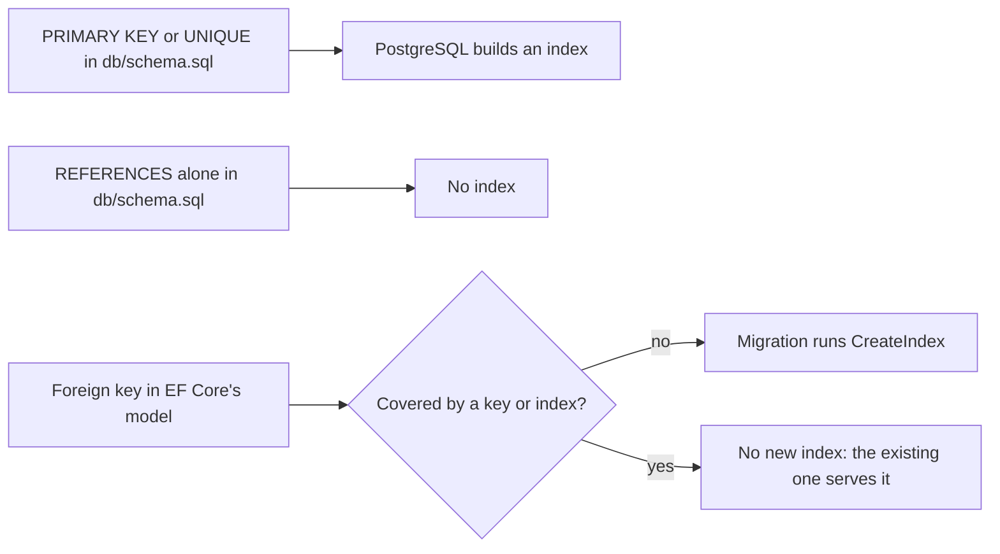

## Bạn cần biết trước

- [[backend.l2.indexes-and-plans]] — bạn đọc được một plan và thấy một bước đã tìm trong index hay đọc cả bảng.
- [[backend.l1.migrations]] — bạn biết `db/schema.sql` dựng các bảng của Đơn Hàng một lần, và mọi thay đổi schema từ đó về sau là một migration do `Migrate()` áp vào.
- [[backend.l1.efcore-n-plus-one]] — bạn đã gặp `.Include(o => o.Customer)`, thứ chỉ chạy được vì `Order.Customer` được map thành một quan hệ.

## Tình huống

Bạn đang thêm một trang liệt kê các khoản thanh toán của một đơn, nên truy vấn mới lọc `payments` theo `order_id`. Khi review, một đồng đội viết: "`order_id` là khóa ngoại, nên nó có index sẵn rồi." Một đồng đội khác không đồng ý: `db/schema.sql` chưa từng viết `CREATE INDEX`, nên trong Đơn Hàng chẳng có index nào ngoài khóa chính. Thế nhưng thư mục migration lại có một file tạo `IX_orders_customer_id`, cái tên không ai trong đội gõ ra. Cả hai nghe đều chắc chắn, và không thể cùng đúng. Khóa ngoại nào của Đơn Hàng có index, và cái gì đã tạo ra từng index đó?

## Khái niệm cốt lõi

- Index trên khóa ngoại — index có các cột chính là các cột tham chiếu, như `orders.customer_id`. Nhờ nó PostgreSQL tìm được các dòng trỏ tới một dòng cha mà không phải đọc cả bảng.
- Model của EF Core — những gì EF Core biết về các class nó map sang bảng, gọi là entity, cùng khóa và quan hệ của chúng. Model được dựng từ các class đó và từ `OnModelCreating` trong `DonHangDbContext`, class chứa phần map của Đơn Hàng, và migration được sinh ra từ model.
- Quy ước (convention) — một quy tắc EF Core tự áp lên model, không cần dòng cấu hình nào yêu cầu.
- Được bao (covered) — một khóa ngoại được bao khi đã có một key hoặc index bắt đầu bằng đúng các cột của khóa ngoại đó, nên thêm index nữa cũng chẳng được gì. Index được sắp theo cột đầu tiên trước, nên nó tìm được dòng theo cột đó. Vì sao các cột sau không tính theo cùng cách ấy là chủ đề của bài kế tiếp.

## Cơ chế hoạt động



Trong tình huống trên, index đến từ hai nơi, và không nơi nào theo kiểu "khóa ngoại nào cũng có một index".

Nơi thứ nhất là chính PostgreSQL. Khi một bảng khai báo `PRIMARY KEY` hoặc ràng buộc `UNIQUE`, tức quy tắc không cho hai dòng trùng một giá trị, PostgreSQL tạo một unique index, loại index từ chối giá trị trùng, để bảo đảm ràng buộc đó. Mệnh đề `REFERENCES` thì khác: PostgreSQL kiểm tra khóa ngoại, nhưng không tạo index trên các cột tham chiếu. Tạo index cho chúng là phần của bạn, vì không phải khóa ngoại nào cũng cần: index nào cũng làm mỗi lần ghi vào bảng của nó tốn thêm việc, và một index hiếm khi được dùng để tìm có thể không bù lại được chi phí đó.

Nơi thứ hai là EF Core. Theo quy ước, EF Core thêm vào model một index cho các cột của mỗi khóa ngoại mà nó biết. Khi bạn thêm một migration, EF Core so model với model trước đó và ghi một lời gọi `CreateIndex` cho index mới này. EF Core bỏ qua index khi khóa ngoại đã được bao, ví dụ khi khóa chính của bảng đã bắt đầu bằng cột của khóa ngoại.

Quy ước chỉ nhìn thấy model. Một khóa ngoại có trong database mà không có trong model của EF Core thì không được EF Core tạo index, và PostgreSQL cũng không tạo. Vì vậy code C# không liệt kê hết mọi index database đang có, và cũng không liệt kê hết mọi khóa ngoại.

## Trong hệ thống Đơn Hàng

Ba trong số các bảng của `db/schema.sql` có tham chiếu tới bảng khác:

```sql file=db/schema.sql tag=stage-1 lines=18-40
CREATE TABLE orders (
    id          integer GENERATED BY DEFAULT AS IDENTITY PRIMARY KEY,
    customer_id integer NOT NULL REFERENCES customers (id),
    placed_at   timestamptz NOT NULL,
    status      text NOT NULL
                CHECK (status IN ('new', 'paid', 'shipped', 'cancelled'))
);

CREATE TABLE order_items (
    order_id       integer NOT NULL REFERENCES orders (id),
    product_id     integer NOT NULL REFERENCES products (id),
    quantity       integer NOT NULL CHECK (quantity > 0),
    unit_price_vnd integer NOT NULL CHECK (unit_price_vnd > 0),
    PRIMARY KEY (order_id, product_id)
);

CREATE TABLE payments (
    id         integer GENERATED BY DEFAULT AS IDENTITY PRIMARY KEY,
    order_id   integer NOT NULL REFERENCES orders (id),
    paid_at    timestamptz NOT NULL,
    amount_vnd integer NOT NULL CHECK (amount_vnd > 0),
    method     text NOT NULL CHECK (method IN ('card', 'bank_transfer', 'cod'))
);
```

Chỉ từ file này, PostgreSQL tạo một index cho mỗi `PRIMARY KEY`, kể cả `(order_id, product_id)` của `order_items`, và một index cho `customers.email`, cột được khai báo `UNIQUE` ở phía trên đoạn trích. Các mệnh đề `REFERENCES` trên `orders.customer_id`, `order_items.order_id`, `order_items.product_id` và `payments.order_id` không tạo index nào. Vậy lúc `db/schema.sql` chạy xong, `orders.customer_id` không có index.

Ở stage-1, index của cột này đến từ một migration. `Order.Customer` là một navigation, tức một property giữ đối tượng liên quan. Khi nó được map bằng `HasOne(o => o.Customer)` trong `DonHangDbContext`, khóa ngoại đi vào model của EF Core. `HasOne` và `HasMany` là các lời gọi ở đó để báo cho EF Core biết hai entity liên quan với nhau qua một khóa ngoại. Migration `AddOrderCustomerNavigation` mà `migrations add` ghi ra sau đó có lời gọi này:

```csharp file=DonHang.Infrastructure/Migrations/20260924092625_AddOrderCustomerNavigation.cs tag=stage-1 lines=13-16
            migrationBuilder.CreateIndex(
                name: "IX_orders_customer_id",
                table: "orders",
                column: "customer_id");
```

Không ai viết `HasIndex` cho `CustomerId`. `HasIndex` duy nhất trong `DonHangDbContext` ở tag này là cái unique trên `Email`. Lời gọi `CreateIndex` ở trên chính là quy ước đang làm việc, và `IX_orders_customer_id` là cái tên EF Core đặt cho nó: `IX_`, tên bảng, rồi tên cột.

`order_items` cho thấy trường hợp bỏ qua. Trong `InitialCreate`, bảng `order_items` có khóa kết hợp `(order_id, product_id)` và một khóa ngoại từ `order_id` tới `orders`, nhưng không có `CreateIndex` nào cho `order_id` theo sau. Khóa đã bắt đầu bằng `order_id`, nên EF Core coi khóa ngoại đó là đã được bao. `InitialCreate` chưa từng chạy trên database của hệ thống ví dụ, vì `MigrationBaseline` chỉ đánh dấu là đã áp, nhưng file đó vẫn ghi lại model của EF Core lúc ấy chứa gì.

`payments.order_id` cho thấy lỗ hổng. Class `Payment` có property `OrderId`, nhưng không có navigation nào, cũng không có `HasOne` hay `HasMany` nào nối nó với `Order`. Với EF Core, đó chỉ là một cột số nguyên bình thường, không phải khóa ngoại, nên không migration nào tạo index cho nó. Khóa ngoại này chỉ nằm trong `db/schema.sql`, và truy vấn thanh toán trong tình huống bắt đầu mà không có index nào để dùng.

## Người mới hay nghĩ rằng…

- **"`orders.customer_id` đã có index từ stage-0, vì nó là khóa ngoại."** → Thực ra mệnh đề `REFERENCES` trong `db/schema.sql` chỉ tạo khóa ngoại, còn index đến ở stage-1 cùng migration `AddOrderCustomerNavigation`. Bạn sẽ nhận ra khi tìm chữ `INDEX` trong `db/schema.sql` mà không thấy gì, dù migration `AddOrderCustomerNavigation` có tạo `IX_orders_customer_id`.
- **"EF Core chỉ tạo những index tôi viết bằng `HasIndex`."** → Thực ra EF Core còn theo quy ước thêm một index cho mỗi khóa ngoại trong model. Bạn sẽ nhận ra khi `migrations add` cho một navigation mới ghi ra một `CreateIndex` mà không `HasIndex` nào yêu cầu, như trong `AddOrderCustomerNavigation`.
- **"`order_items` cần index riêng trên `order_id`, vì khóa ngoại nào cũng cần một index."** → Thực ra index của khóa chính trên `(order_id, product_id)` đã bắt đầu bằng `order_id`, nên EF Core coi khóa ngoại đó là đã được bao. Bạn sẽ nhận ra khi thấy `InitialCreate` khai báo khóa ngoại của `order_items` mà không có `CreateIndex` nào cho nó, và database chỉ liệt kê index của khóa cho bảng đó.

## Thử ngay (3 phút)

1. Từ thư mục gốc của dự án Đơn Hàng, khi hệ thống ví dụ đang chạy (`scripts/up.sh`), liệt kê index của hai bảng: `docker exec donhang-db psql -U donhang -d donhang -c "SELECT indexname, indexdef FROM pg_indexes WHERE tablename IN ('order_items', 'payments') ORDER BY indexname;"`. `pg_indexes` là một view, tức một truy vấn được lưu sẵn mà PostgreSQL cho bạn đọc như một bảng, mỗi index một dòng.
2. Với mỗi cột khóa ngoại trong hai bảng `order_items` và `payments` của `db/schema.sql`, xác định index nào trong danh sách bắt đầu bằng cột đó, nếu có.

Kết quả mong đợi: hai dòng. `order_items_pkey` là unique index trên `(order_id, product_id)`, còn `payments_pkey` là unique index trên `(id)`. Cả hai đều đến từ một `PRIMARY KEY`. `order_items.order_id` là cột đầu của index thứ nhất, `order_items.product_id` chỉ là cột thứ hai của nó, còn `payments.order_id` không là cột đầu của index nào, nên một truy vấn lọc `payments` theo `order_id` không có index nào để tìm.

## Liên hệ

- [[backend.l2.indexes-and-plans]] — bài cần trước: cách nhìn vào plan để biết một truy vấn có dùng index hay không.
- [[backend.l1.migrations]] — bài cần trước: lời gọi `CreateIndex` từ đâu ra và đi tới database bằng cách nào.
- [[backend.l1.efcore-n-plus-one]] — navigation `Order.Customer`, thứ mà khi được map đã kéo theo `IX_orders_customer_id`.
- [[backend.l2.composite-indexes]] — bài kế tiếp: vì sao cột đầu của index quyết định nó phục vụ được truy vấn nào, và index sẽ thay `IX_orders_customer_id`.

## Tóm tắt 5 dòng

1. PostgreSQL không bao giờ tự tạo index cho khóa ngoại, còn EF Core tạo index cho mỗi khóa ngoại trong model trừ khi đã có key hoặc index bao nó.
2. PostgreSQL tạo unique index cho mỗi `PRIMARY KEY` và `UNIQUE`, không tạo cho `REFERENCES`, nên `db/schema.sql` để `orders.customer_id` không có index.
3. Map `Order.Customer` đưa khóa ngoại vào model của EF Core, và migration của nó tạo `IX_orders_customer_id` theo quy ước.
4. EF Core bỏ qua index khi một key hoặc index đã bắt đầu bằng các cột của khóa ngoại, như khóa của `order_items`.
5. `payments.order_id` chỉ là khóa ngoại trong `db/schema.sql`, nên không migration nào tạo index cho nó. Code C# không liệt kê hết mọi index.
