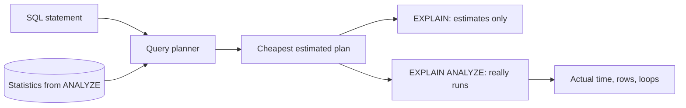

## Before you start

- [[foundation.l1.sql-index-intro]] — you read plans with `EXPLAIN (COSTS OFF)`: a `Seq Scan` reads every row, an `Index Scan` searches an index, and `ANALYZE` refreshes PostgreSQL's notes on a table.
- [[foundation.l1.sql-join]] — you know a query can pair the rows of two tables, which is why its plan can hold several steps working together.

## The situation

A teammate pastes a plan into the team chat. It is for the query behind one customer's order list, run on the large copy of the Đơn Hàng database with 200,000 orders. Unlike the plans you read with `COSTS OFF`, every line now carries numbers: `cost=39.92..1433.27 rows=2000`. "1433 — that is 1.4 seconds, we need another index," he writes. A second teammate answers that the query for customer 1 shows a `Seq Scan` even though an index exists, so something must be broken. Before anyone adds an index, you want to know: what do the numbers in a plan measure, and which of them were measured at all?

## Core concepts

- **query plan** — the tree of steps PostgreSQL settles on to answer one query; `EXPLAIN` prints it, one summary line per step, sometimes followed by indented lines with details of that step.
- **query planner** — the part of PostgreSQL that estimates the cost of the plans it could use for a query and picks the cheapest.
- Cost — the planner's estimate of the work a step will do, in its own units rather than in milliseconds.
- Statistics — PostgreSQL's notes on how many rows a table holds and how their values spread, written by `ANALYZE` and read by the planner.
- `EXPLAIN ANALYZE` — `EXPLAIN` that really runs the statement and prints, next to each estimate, what actually happened; this `ANALYZE` only measures the run and does not refresh the statistics, which only the `ANALYZE` command does.

## How it works



In the situation above, the statement is `SELECT id, status FROM orders WHERE customer_id = 7`. The query planner does not try each way of answering it; it estimates them. It reads the statistics on `orders`, predicts how many rows each step returns, prices each plan it considers, and keeps the cheapest.

`EXPLAIN` stops there and prints that plan. Each step shows `cost=start..total`: the estimated cost before the step returns its first row, and for all of its rows. Then `rows`, the rows it expects to return, and `width`, their expected average size in bytes. Cost is in the planner's own units, so 1433 is not 1.4 seconds; it only lets the planner compare one plan with another.

The plan is a tree. A step marked `->` passes its rows up to the less indented step above it, and each step's cost includes the cost of the steps under it. So the top line's figures cover the whole query.

`EXPLAIN ANALYZE` goes on to run the statement. Next to each estimate it adds `actual time` in milliseconds, again to the first row and to all rows, the `rows` the step really returned, and `loops`, how many times the step ran; when `loops` is more than 1, the time and rows are per run. Because the statement really runs, an `UPDATE` or `DELETE` under it changes data. If you run it inside a transaction and then roll back, nothing it changed stays.

Estimates are only as good as the statistics. `ANALYZE` writes them, and autovacuum, a process PostgreSQL runs in the background, analyzes a table again once enough of its rows have changed. Until then the planner plans for the table as it was.

## In the Đơn Hàng system

The first statements of `db/queries/explain-analyze.sql` ask the same question twice:

```sql file=db/queries/explain-analyze.sql tag=stage-2 lines=9-18
-- lesson: backend.l2.indexes-and-plans
-- EXPLAIN only plans the query. Each step: cost=<before the first row>..<for
-- all rows>, in the planner's own units, and the rows it expects.
EXPLAIN
SELECT id, status FROM orders WHERE customer_id = 7;

-- EXPLAIN ANALYZE really runs it, and adds what happened: time in
-- milliseconds, the rows each step really returned, and how many loops.
EXPLAIN ANALYZE
SELECT id, status FROM orders WHERE customer_id = 7;
```

The file runs on `donhang_perf`, a second database on the lab's PostgreSQL 17 server; the lab is the set of containers `scripts/up.sh` starts. It is built by applying the API's migrations to an empty database, then filled with 200,000 orders for 20 customers. Customer 1 owns 81% of them; each of the other 19 owns 2,000. `scripts/backend/explain-analyze.sh` builds `donhang_perf` if it does not exist yet, then hands the whole file to psql, PostgreSQL's command-line client, inside the lab, which sees the project folder as `/repo`:

```bash file=scripts/backend/explain-analyze.sh tag=stage-2 lines=13-17
# Unaligned: each plan line prints as it is, without a padded table around it.
psql --host db --username donhang --dbname donhang_perf \
     --no-psqlrc --echo-queries --set ON_ERROR_STOP=on \
     --pset format=unaligned --pset footer=off \
     --file /repo/db/queries/explain-analyze.sql
```

`--echo-queries` prints each statement above its plan. Inside a line, `...` replaces a timing, which changes on every run. On a line of its own, `...` marks output cut here:

```text output=true
...
EXPLAIN ANALYZE
SELECT id, status FROM orders WHERE customer_id = 7;
QUERY PLAN
Bitmap Heap Scan on orders  (cost=39.92..1433.27 rows=2000 width=10) (actual time=... rows=2000 loops=1)
  Recheck Cond: (customer_id = 7)
  Heap Blocks: exact=1308
  ->  Bitmap Index Scan on "IX_orders_customer_id_id"  (cost=0.00..39.42 rows=2000 width=0) (actual time=... rows=2000 loops=1)
        Index Cond: (customer_id = 7)
Planning Time: ... ms
Execution Time: ... ms
EXPLAIN
SELECT c.full_name, count(*) AS orders
FROM orders AS o
JOIN customers AS c ON c.id = o.customer_id
WHERE o.id <= 1000
GROUP BY c.full_name;
QUERY PLAN
HashAggregate  (cost=49.55..49.75 rows=20 width=18)
  Group Key: c.full_name
  ->  Hash Join  (cost=1.87..44.55 rows=1000 width=10)
        Hash Cond: (o.customer_id = c.id)
        ->  Index Scan using "PK_orders" on orders o  (cost=0.42..39.92 rows=1000 width=4)
              Index Cond: (id <= 1000)
        ->  Hash  (cost=1.20..1.20 rows=20 width=14)
              ->  Seq Scan on customers c  (cost=0.00..1.20 rows=20 width=14)
EXPLAIN
SELECT id, status FROM orders WHERE customer_id = 1;
QUERY PLAN
Seq Scan on orders  (cost=0.00..3808.00 rows=162000 width=10)
  Filter: (customer_id = 1)
...
INSERT INTO orders_copy SELECT * FROM orders WHERE customer_id = 8;
INSERT 0 2000
...
Seq Scan on orders_copy  (cost=0.00..74.31 rows=1 width=54) (actual time=... rows=2000 loops=1)
...
ANALYZE orders_copy;
ANALYZE
...
Seq Scan on orders_copy  (cost=0.00..79.00 rows=2000 width=54) (actual time=... rows=2000 loops=1)
...
cancelled_before
571
...
cancelled_after_rollback
571
```

The first plan is the `EXPLAIN ANALYZE` one; the plain `EXPLAIN` above it, cut here, printed the same steps without the `actual` figures, the `Heap Blocks` line and the two time lines. Two steps: `Bitmap Index Scan` finds where the matching rows are by searching `IX_orders_customer_id_id`, an index on `customer_id` and then `id`, so it can find rows by `customer_id`. `Bitmap Heap Scan` above it reads those rows from the table; heap here is PostgreSQL's name for a table's own storage, not the memory heap. Its total cost of 1433.27 includes the 39.42 of the step under it. It expected 2,000 rows and got 2,000. `Recheck Cond` and `Heap Blocks` are details this lesson leaves aside.

The join plan is a deeper tree. `Seq Scan on customers` feeds `Hash`, which builds a hash map of the 20 customers; that step and `Index Scan using "PK_orders"`, the primary key's index, feed `Hash Join`, which pairs each order with its customer; `HashAggregate` on top groups the pairs by name. Its `rows=20` is the estimate for the whole query.

For customer 1 the planner chose `Seq Scan` although the same index exists. It expects 162,000 of the 200,000 rows, and it priced every plan through the index higher than reading the whole table in order. Through the index, each matching row is looked up separately; in order, the table's storage is read once from start to end. When most rows match, the lookups cost more, so the sequential scan is the right plan here, not a sign of a missing index.

`orders_copy` is a temporary copy of customer 7's orders. After `ANALYZE` runs on it, the script adds customer 8's 2,000 orders. The next plan expects almost no rows for customer 8 (`rows=1`) and finds 2,000: the statistics still describe a table with no customer 8. After a second `ANALYZE`, the estimate is 2,000. Autovacuum never analyzes a temporary table, which is why the script runs `ANALYZE` itself.

Last, the script counts the cancelled orders in `orders_copy`, runs `EXPLAIN ANALYZE` on an `UPDATE` that cancels customer 8's orders between `BEGIN` and `ROLLBACK`, and counts again. The `UPDATE` really ran, but both counts are 571: the rollback undid it.

## Beginners often think…

- **"A cost of 1000 in the plan means the query takes 1000 milliseconds."** → Actually cost is in the planner's own units and exists only to compare plans; only the `actual time` figures of `EXPLAIN ANALYZE` are milliseconds. You notice this when you run `explain-analyze.sh` twice: every cost is the same to the last digit, while `Execution Time` changes from run to run.
- **"A sequential scan in a plan always means an index is missing."** → Actually the planner picks a `Seq Scan` when it is the cheapest estimate, as it is when most of a table's rows qualify. You notice this when customer 1's plan shows `Seq Scan on orders` while `IX_orders_customer_id_id` already covers `customer_id`: the index exists, and the planner chose not to use it.
- **"`EXPLAIN ANALYZE` only prints a plan, so it is safe to put in front of a `DELETE`."** → Actually it runs the statement and only discards the rows a query would return; every change the statement makes is real. You notice this when the rows you only meant to look at a plan for are gone, unless you ran it between `BEGIN` and `ROLLBACK`.

## Try it (3 minutes)

1. With the example system running (`scripts/up.sh`), run `scripts/backend/explain-analyze.sh` from the root folder of the example repository. The first run also builds `donhang_perf`, so it takes longer than the next ones.
2. In `db/queries/explain-analyze.sql`, change the `EXPLAIN` above the customer 1 query to `EXPLAIN ANALYZE`, run the script again, and compare that plan's estimated rows with its actual rows. Change the line back afterwards.

Expected result: the customer 1 plan is still `Seq Scan on orders  (cost=0.00..3808.00 rows=162000 width=10)`, now followed by `actual time=` figures with `rows=162000 loops=1`, a new line `Rows Removed by Filter: 38000` for the rows the step read and dropped, and the `Planning Time` and `Execution Time` lines. The estimate matched the actual rows, so the planner chose the sequential scan knowing how many rows qualify.

## Connections

- [[foundation.l1.sql-index-intro]] — prerequisite: the same plans with `COSTS OFF`; this lesson puts the numbers back.
- [[foundation.l1.sql-join]] — prerequisite: a join is the most common reason a plan grows from one step into a tree.
- [[foundation.l1.transaction-intro]] — the `BEGIN` and `ROLLBACK` that let you measure an `UPDATE` or `DELETE` without keeping its changes.
- [[backend.l2.composite-indexes]] — next: choosing an index for the queries Đơn Hàng really sends.
- [[backend.l2.efcore-generated-sql]] — where to get the SQL to put after `EXPLAIN` when EF Core writes it for you.

## Five-line summary

1. `EXPLAIN` prints the plan the query planner chose from estimates; `EXPLAIN ANALYZE` runs the statement and adds what really happened.
2. Each step's `cost=start..total` is in the planner's own units, not milliseconds, and `rows` is how many rows it expects.
3. A plan is a tree: each step takes rows from the more indented steps under it, and the top line covers the whole query.
4. Estimates come from statistics that `ANALYZE` writes; an estimate far from the actual rows can mean the statistics are out of date.
5. A sequential scan is right when most rows qualify, and `EXPLAIN ANALYZE` changes data unless its transaction is rolled back.
