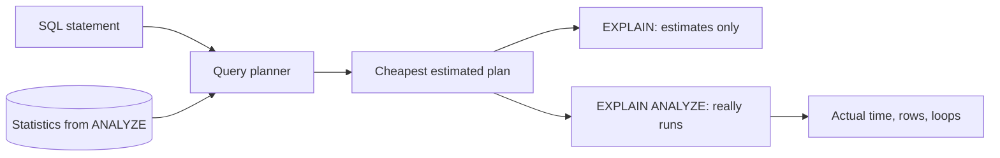

## Bạn cần biết trước

- [[foundation.l1.sql-index-intro]] — bạn đã đọc plan bằng `EXPLAIN (COSTS OFF)`: `Seq Scan` đọc mọi dòng, `Index Scan` tìm trong một index, còn `ANALYZE` làm mới ghi chú của PostgreSQL về một bảng.
- [[foundation.l1.sql-join]] — bạn biết một truy vấn có thể ghép dòng của hai bảng, và đó là lý do plan của nó có thể gồm nhiều bước phối hợp với nhau.

## Tình huống

Một đồng đội dán một plan vào kênh chat của đội. Đó là plan của truy vấn đứng sau danh sách đơn của một khách, chạy trên bản sao lớn của database Đơn Hàng với 200.000 đơn. Khác với các plan bạn đọc bằng `COSTS OFF`, giờ dòng nào cũng kèm số: `cost=39.92..1433.27 rows=2000`. "1433, tức là 1,4 giây, mình cần thêm một index," anh ấy viết. Một đồng đội khác đáp rằng truy vấn cho khách 1 ra `Seq Scan` dù index đã có, vậy chắc có gì hỏng. Trước khi ai đó thêm index, bạn muốn biết: các con số trong plan đo cái gì, và con số nào thật sự được đo?

## Khái niệm cốt lõi

- **query plan** (các bước PostgreSQL chọn để trả lời một truy vấn; EXPLAIN in các bước đó ra) — cây các bước PostgreSQL chốt để trả lời một truy vấn. `EXPLAIN` in nó ra, mỗi bước một dòng tóm tắt, đôi khi kèm vài dòng thụt vào ghi chi tiết của bước đó.
- **query planner** (phần của PostgreSQL ước lượng chi phí các cách chạy một truy vấn và chọn cách rẻ nhất) — phần của PostgreSQL ước lượng cost của các plan có thể dùng cho một truy vấn và chọn plan rẻ nhất.
- Cost — ước lượng của planner về khối lượng việc một bước sẽ làm, tính bằng đơn vị riêng của nó chứ không phải mili giây.
- Thống kê — ghi chú của PostgreSQL về số dòng một bảng đang chứa và cách giá trị của chúng phân bố, do `ANALYZE` ghi và planner đọc.
- `EXPLAIN ANALYZE` — `EXPLAIN` có chạy thật câu lệnh và in, cạnh mỗi ước lượng, điều đã thật sự xảy ra. Chữ `ANALYZE` ở đây chỉ đo lần chạy, không làm mới thống kê. Chỉ lệnh `ANALYZE` mới làm mới thống kê.

## Cơ chế hoạt động



Trong tình huống trên, câu lệnh là `SELECT id, status FROM orders WHERE customer_id = 7`. Query planner không thử từng cách trả lời, mà ước lượng chúng. Nó đọc thống kê của `orders`, đoán mỗi bước trả về bao nhiêu dòng, định giá từng plan nó cân nhắc, rồi giữ plan rẻ nhất.

`EXPLAIN` dừng ở đó và in plan ấy ra. Mỗi bước có `cost=start..total`: cost ước lượng trước khi bước trả dòng đầu tiên, và cho toàn bộ số dòng của nó. Tiếp theo là `rows`, số dòng bước đó dự kiến trả về, và `width`, kích thước trung bình dự kiến của mỗi dòng tính bằng byte. Cost tính bằng đơn vị riêng của planner, nên 1433 không phải 1,4 giây. Con số đó chỉ để planner so plan này với plan khác.

Plan là một cây. Bước có dấu `->` chuyển dòng của nó lên bước thụt vào ít hơn nằm ngay trên, và cost của mỗi bước đã gồm cost của các bước bên dưới. Vì vậy các con số ở dòng trên cùng là cho cả truy vấn.

`EXPLAIN ANALYZE` đi tiếp một bước: nó chạy câu lệnh. Cạnh mỗi ước lượng, nó thêm `actual time` tính bằng mili giây, cũng tới dòng đầu tiên và tới mọi dòng, số `rows` bước đó thật sự trả về, và `loops`, số lần bước đó chạy. Khi `loops` lớn hơn 1, thời gian và số dòng là của mỗi lần chạy. Vì câu lệnh chạy thật, một `UPDATE` hay `DELETE` đặt sau nó sẽ đổi dữ liệu. Nếu bạn chạy nó trong một giao dịch rồi rollback, không thay đổi nào được giữ lại.

Ước lượng chỉ tốt bằng thống kê. `ANALYZE` ghi thống kê, còn autovacuum, một tiến trình PostgreSQL chạy ngầm, sẽ analyze lại một bảng khi đủ nhiều dòng của nó đã đổi. Trước lúc đó, planner vẫn lập plan cho bảng như nó từng là.

## Trong hệ thống Đơn Hàng

Các câu lệnh đầu của `db/queries/explain-analyze.sql` hỏi cùng một câu hai lần:

```sql file=db/queries/explain-analyze.sql tag=stage-2 lines=9-18
-- lesson: backend.l2.indexes-and-plans
-- EXPLAIN only plans the query. Each step: cost=<before the first row>..<for
-- all rows>, in the planner's own units, and the rows it expects.
EXPLAIN
SELECT id, status FROM orders WHERE customer_id = 7;

-- EXPLAIN ANALYZE really runs it, and adds what happened: time in
-- milliseconds, the rows each step really returned, and how many loops.
EXPLAIN ANALYZE
SELECT id, status FROM orders WHERE customer_id = 7;
```

File này chạy trên `donhang_perf`, database thứ hai trên server PostgreSQL 17 của lab (lab là nhóm container mà `scripts/up.sh` khởi động). Nó được dựng bằng cách áp các migration của API lên một database trống, rồi đổ vào 200.000 đơn cho 20 khách. Khách 1 sở hữu 81% số đơn, mỗi khách trong 19 người còn lại có 2.000 đơn. `scripts/backend/explain-analyze.sh` dựng `donhang_perf` nếu nó chưa có, rồi đưa cả file cho psql, client dòng lệnh của PostgreSQL, chạy bên trong lab, nơi thư mục project hiện ra dưới tên `/repo`:

```bash file=scripts/backend/explain-analyze.sh tag=stage-2 lines=13-17
# Unaligned: each plan line prints as it is, without a padded table around it.
psql --host db --username donhang --dbname donhang_perf \
     --no-psqlrc --echo-queries --set ON_ERROR_STOP=on \
     --pset format=unaligned --pset footer=off \
     --file /repo/db/queries/explain-analyze.sql
```

`--echo-queries` in từng câu lệnh phía trên plan của nó. Trong một dòng, `...` thay cho một con số thời gian, vì nó đổi sau mỗi lần chạy. Khi đứng riêng một dòng, `...` đánh dấu phần output bị lược ở đây:

```text output=true
...
EXPLAIN ANALYZE
SELECT id, status FROM orders WHERE customer_id = 7;
QUERY PLAN
Bitmap Heap Scan on orders  (cost=39.92..1433.27 rows=2000 width=10) (actual time=... rows=2000 loops=1)
  Recheck Cond: (customer_id = 7)
  Heap Blocks: exact=1308
  ->  Bitmap Index Scan on "IX_orders_customer_id_id"  (cost=0.00..39.42 rows=2000 width=0) (actual time=... rows=2000 loops=1)
        Index Cond: (customer_id = 7)
Planning Time: ... ms
Execution Time: ... ms
EXPLAIN
SELECT c.full_name, count(*) AS orders
FROM orders AS o
JOIN customers AS c ON c.id = o.customer_id
WHERE o.id <= 1000
GROUP BY c.full_name;
QUERY PLAN
HashAggregate  (cost=49.55..49.75 rows=20 width=18)
  Group Key: c.full_name
  ->  Hash Join  (cost=1.87..44.55 rows=1000 width=10)
        Hash Cond: (o.customer_id = c.id)
        ->  Index Scan using "PK_orders" on orders o  (cost=0.42..39.92 rows=1000 width=4)
              Index Cond: (id <= 1000)
        ->  Hash  (cost=1.20..1.20 rows=20 width=14)
              ->  Seq Scan on customers c  (cost=0.00..1.20 rows=20 width=14)
EXPLAIN
SELECT id, status FROM orders WHERE customer_id = 1;
QUERY PLAN
Seq Scan on orders  (cost=0.00..3808.00 rows=162000 width=10)
  Filter: (customer_id = 1)
...
INSERT INTO orders_copy SELECT * FROM orders WHERE customer_id = 8;
INSERT 0 2000
...
Seq Scan on orders_copy  (cost=0.00..74.31 rows=1 width=54) (actual time=... rows=2000 loops=1)
...
ANALYZE orders_copy;
ANALYZE
...
Seq Scan on orders_copy  (cost=0.00..79.00 rows=2000 width=54) (actual time=... rows=2000 loops=1)
...
cancelled_before
571
...
cancelled_after_rollback
571
```

Plan đầu tiên là của `EXPLAIN ANALYZE`. `EXPLAIN` thường phía trên nó, đã lược ở đây, in ra đúng các bước đó nhưng không có các con số `actual`, dòng `Heap Blocks` và hai dòng thời gian. Plan có hai bước: `Bitmap Index Scan` tìm vị trí các dòng khớp bằng cách tra `IX_orders_customer_id_id`, một index trên `customer_id` rồi tới `id`, nên nó tìm được dòng theo `customer_id`. `Bitmap Heap Scan` phía trên đọc những dòng đó từ bảng. Heap ở đây là tên PostgreSQL gọi phần lưu trữ của chính bảng, không phải vùng nhớ heap. Tổng cost 1433.27 của nó đã gồm 39.42 của bước bên dưới. Nó dự kiến 2.000 dòng và nhận đúng 2.000. `Recheck Cond` và `Heap Blocks` là chi tiết bài này tạm bỏ qua.

Plan có JOIN là một cây sâu hơn. `Seq Scan on customers` đưa dòng cho `Hash`, bước dựng một hash map từ 20 khách. Bước đó cùng `Index Scan using "PK_orders"`, index của khóa chính, đưa dòng cho `Hash Join`, bước ghép mỗi đơn với khách của nó, và `HashAggregate` trên cùng gom các cặp theo tên. `rows=20` của nó là ước lượng cho cả truy vấn.

Với khách 1, planner chọn `Seq Scan` dù cùng index đó vẫn có. Nó dự kiến 162.000 trong 200.000 dòng, và định giá mọi plan đi qua index cao hơn đọc tuần tự cả bảng. Đi qua index, mỗi dòng khớp phải tra riêng một lần, còn đọc tuần tự thì phần lưu trữ của bảng được đọc một lượt từ đầu tới cuối. Khi phần lớn dòng đều khớp, các lần tra tốn hơn, nên sequential scan là plan đúng ở đây, không phải dấu hiệu thiếu index.

`orders_copy` là bản sao tạm các đơn của khách 7. Sau khi `ANALYZE` chạy trên nó, script thêm 2.000 đơn của khách 8. Plan kế tiếp dự kiến gần như không có dòng nào cho khách 8 (`rows=1`) và gặp 2.000 dòng: thống kê vẫn mô tả một bảng chưa có khách 8. Sau lần `ANALYZE` thứ hai, ước lượng thành 2.000. Autovacuum không bao giờ analyze bảng tạm, vì thế script tự chạy `ANALYZE`.

Cuối cùng, script đếm số đơn đã hủy trong `orders_copy`, chạy `EXPLAIN ANALYZE` cho một câu `UPDATE` hủy các đơn của khách 8 giữa `BEGIN` và `ROLLBACK`, rồi đếm lại. Câu `UPDATE` đã chạy thật, nhưng cả hai lần đếm đều là 571: rollback đã hoàn tác nó.

## Người mới hay nghĩ rằng…

- **"Cost 1000 trong plan nghĩa là truy vấn mất 1000 mili giây."** → Thực ra cost tính bằng đơn vị riêng của planner và chỉ dùng để so các plan. Chỉ những con số `actual time` của `EXPLAIN ANALYZE` mới là mili giây. Bạn sẽ nhận ra khi chạy `explain-analyze.sh` hai lần: mọi cost giống nhau tới chữ số cuối, còn `Execution Time` đổi sau mỗi lần chạy.
- **"Plan có sequential scan nghĩa là chắc chắn đang thiếu index."** → Thực ra planner chọn `Seq Scan` khi đó là ước lượng rẻ nhất, như khi phần lớn dòng của bảng đều thỏa điều kiện. Bạn sẽ nhận ra khi plan của khách 1 ra `Seq Scan on orders` trong lúc `IX_orders_customer_id_id` đã phủ `customer_id`: index có sẵn, và planner chọn không dùng nó.
- **"`EXPLAIN ANALYZE` chỉ in plan, nên đặt nó trước một câu `DELETE` là an toàn."** → Thực ra nó chạy câu lệnh và chỉ bỏ đi các dòng mà một truy vấn lẽ ra trả về, còn mọi thay đổi câu lệnh tạo ra đều là thật. Bạn sẽ nhận ra khi những dòng bạn chỉ định xem plan đã biến mất, trừ khi bạn chạy nó giữa `BEGIN` và `ROLLBACK`.

## Thử ngay (3 phút)

1. Khi hệ thống ví dụ đang chạy (`scripts/up.sh`), chạy `scripts/backend/explain-analyze.sh` từ thư mục gốc của repo ví dụ. Lần chạy đầu còn dựng `donhang_perf`, nên lâu hơn các lần sau.
2. Trong `db/queries/explain-analyze.sql`, đổi `EXPLAIN` phía trên truy vấn của khách 1 thành `EXPLAIN ANALYZE`, chạy lại script, rồi so số dòng ước lượng của plan đó với số dòng thực tế. Sau đó đổi dòng ấy về như cũ.

Kết quả mong đợi: plan của khách 1 vẫn là `Seq Scan on orders  (cost=0.00..3808.00 rows=162000 width=10)`, giờ kèm các con số `actual time=` với `rows=162000 loops=1`, một dòng mới `Rows Removed by Filter: 38000` cho các dòng bước đó đã đọc rồi loại, cùng hai dòng `Planning Time` và `Execution Time`. Ước lượng khớp số dòng thực tế, nên planner chọn sequential scan khi đã biết đúng có bao nhiêu dòng thỏa điều kiện.

## Liên hệ

- [[foundation.l1.sql-index-intro]] — điều kiện tiên quyết: cũng những plan ấy nhưng với `COSTS OFF`, bài này đưa các con số trở lại.
- [[foundation.l1.sql-join]] — điều kiện tiên quyết: JOIN là lý do phổ biến nhất khiến một plan từ một bước thành một cây.
- [[foundation.l1.transaction-intro]] — `BEGIN` và `ROLLBACK` cho phép bạn đo một `UPDATE` hay `DELETE` mà không giữ lại thay đổi của nó.
- [[backend.l2.composite-indexes]] — bài tiếp theo: chọn index cho những truy vấn Đơn Hàng thật sự gửi.
- [[backend.l2.efcore-generated-sql]] — nơi lấy câu SQL để đặt sau `EXPLAIN` khi EF Core viết nó thay bạn.

## Tóm tắt 5 dòng

1. `EXPLAIN` in plan mà query planner chọn từ các ước lượng, còn `EXPLAIN ANALYZE` chạy câu lệnh và thêm điều đã thật sự xảy ra.
2. `cost=start..total` của mỗi bước tính bằng đơn vị riêng của planner, không phải mili giây, còn `rows` là số dòng nó dự kiến.
3. Plan là một cây: mỗi bước nhận dòng từ các bước thụt vào sâu hơn bên dưới, và dòng trên cùng là cho cả truy vấn.
4. Ước lượng đến từ thống kê do `ANALYZE` ghi, và ước lượng lệch xa số dòng thực tế có thể là do thống kê đã cũ.
5. Sequential scan là đúng khi phần lớn dòng thỏa điều kiện, và `EXPLAIN ANALYZE` đổi dữ liệu trừ khi giao dịch của nó được rollback.
