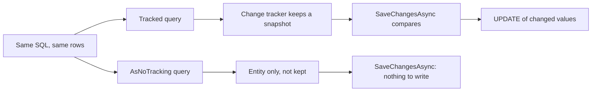

## Before you start

- [[backend.l1.saving-changes]] — you know nothing reaches the database until `SaveChangesAsync` runs, and that it writes the changes EF Core has noted since loading.
- [[backend.l2.efcore-generated-sql]] — you can read the SQL EF Core sends in the api's log, so you can check whether a change to a query changes that SQL.

## The situation

You review a pull request against `EfOrderRepository` at stage-2 and find two methods that look almost the same. `FindAsync` loads an order with its items. `FindForReadingAsync` does the same, with one extra call: `AsNoTracking()`. `GET /api/v1/orders/{id}` uses the second one. You open the api's log, as in the previous lesson, and the SQL for reading an order is a `SELECT` from `orders` joined to `order_items`, with nothing in it about tracking. If the SQL does not change, what does that one extra call change, and when would it be wrong to use it?

## Core concepts

- **change tracker** — the part of a `DbContext` that remembers the entities it has loaded, with a snapshot of each one's values, so that `SaveChangesAsync` can find what changed.
- Tracked entity — an entity the change tracker keeps; a query that returns entities tracks them by default.
- Snapshot — the copy of an entity's property values the change tracker takes when it starts tracking the entity.
- `AsNoTracking()` — a call on a query that makes it return entities the change tracker does not keep.

## How it works



In the situation above, both methods send the same SQL and get the same rows back. The difference starts after the rows arrive in the api.

With a tracked query, the change tracker keeps each entity it builds and takes a snapshot of its values before handing it to your code. When `SaveChangesAsync` runs, EF Core compares each tracked entity with its snapshot and writes an `UPDATE` only for the values that changed. That is how cancelling an order writes its new status without you naming the column anywhere.

That bookkeeping has a cost, and you pay it while the query loads, whether or not `SaveChangesAsync` ever runs. Taking the snapshots takes time, and keeping them takes memory.

`AsNoTracking()` skips all of that. The entities are built from the rows and handed to your code, and the change tracker never hears of them. For data you only read to build a response, that is work saved inside the api process. PostgreSQL does exactly the same work either way, because it receives the same SQL.

The price is the other branch of the diagram. An entity the change tracker does not know has no snapshot to compare with. If you change it and call `SaveChangesAsync`, there is nothing to write, and nothing is written.

## In the Đơn Hàng system

The two methods sit next to each other in `DonHang.Infrastructure/EfOrderRepository.cs`:

```csharp file=DonHang.Infrastructure/EfOrderRepository.cs tag=stage-2 lines=9-16
    // Tracked: cancelling and shipping load the order with this, change it,
    // and SaveChangesAsync writes what changed.
    public Task<Order?> FindAsync(int id) =>
        db.Orders.Include(o => o.Items).FirstOrDefaultAsync(o => o.Id == id);

    // lesson: backend.l2.no-tracking-queries
    public Task<Order?> FindForReadingAsync(int id) =>
        db.Orders.AsNoTracking().Include(o => o.Items).FirstOrDefaultAsync(o => o.Id == id);
```

`db` is the api's `DonHangDbContext`. The only difference between the two queries is `AsNoTracking()`. The comment says who needs the tracked one: the methods of `OrderService` that change an order, `CancelOrderAsync` and `ShipOrderAsync`, load it with `FindAsync`, call the order's method that changes its status, and then call `SaveChangesAsync`.

`GET /api/v1/orders/{id}` only reads, so its action calls `FindForReadingAsync` and turns the order into a response. Cancelling uses both kinds of query:

```csharp file=DonHang.Api/Controllers/OrdersController.cs tag=stage-2 lines=68-84
    // lesson: design.l2.domain-model
    // Whether this order may be cancelled is Order.Cancel()'s decision; a
    // refusal arrives here as OrderStatusException and leaves as a 409.
    // The same OrderOwner check as Get runs first, on an untracked copy.
    [Authorize]
    [HttpPatch("{id:int}/cancel")]
    public async Task<ActionResult<OrderDto>> Cancel(int id)
    {
        var existing = await repository.FindForReadingAsync(id);
        if (existing is null) return NotFound();

        var allowed = await authorization.AuthorizeAsync(User, existing, "OrderOwner");
        if (!allowed.Succeeded) return Forbid();

        var order = await orderService.CancelOrderAsync(id);
        return Ok(ToDto(order));
    }
```

`existing` is only read: the `OrderOwner` check looks at whose order it is, and the action never changes it. So it is loaded untracked. The order that really gets cancelled is the one `CancelOrderAsync` loads again with the tracked `FindAsync`. That second load costs one more query, and it is the one whose change `SaveChangesAsync` can see.

If someone "saved a query" by calling `existing.Cancel()` and then `SaveChangesAsync`, the request could answer `200` with a cancelled order in the response while the row in `orders` stays unchanged.

## Beginners often think…

- **"`AsNoTracking()` makes the database run the query faster."** → Actually PostgreSQL receives the same SQL and does the same work; what `AsNoTracking()` saves is the snapshot and bookkeeping inside the api. You notice this when the command log shows the same SQL with or without it.
- **"After `AsNoTracking()`, I can still change the order and `SaveChangesAsync` will save it."** → Actually the context never knew about that order, so there is nothing to compare and nothing to write. You notice this when the api answers as if the change happened, but the next `GET` still shows the old status.
- **"Tracking costs nothing when I never call `SaveChangesAsync`."** → Actually the snapshot is taken while the query loads, before your code sees the entity, so a read-only endpoint pays for it anyway. You notice this when an endpoint that returns many entities usually uses less time and memory after adding `AsNoTracking()`, with its SQL unchanged.

## Try it (3 minutes)

1. Open `DonHang.Api/Controllers/OrdersController.cs` and `DonHang.Domain/OrderService.cs` in the example repository.
2. For each of the actions `Get`, `Cancel` and `Ship`, note which order objects it loads, whether each one is loaded tracked or untracked, and which one, if any, `SaveChangesAsync` writes.

Expected result: `Get` loads one untracked order and saves nothing. `Cancel` loads an untracked copy for the `OrderOwner` check, then `CancelOrderAsync` loads a tracked one, cancels it and saves it. `Ship` loads only the tracked order inside `ShipOrderAsync`, ships it and saves it. Every order that is changed and saved was loaded by `FindAsync`.

## Connections

- [[backend.l1.saving-changes]] — prerequisite: `SaveChangesAsync` writes only what the change tracker noted; this lesson shows what happens when it noted nothing.
- [[backend.l2.efcore-generated-sql]] — prerequisite: the command log is how you confirm `AsNoTracking()` leaves the SQL as it was.
- [[backend.l2.projection-queries]] — next: reading only the columns a response needs, which also skips the change tracker.

## Five-line summary

1. Use `AsNoTracking()` for entities you only read, and a tracked query for entities you will change and save.
2. By default a query's entities are tracked: the change tracker keeps a snapshot so `SaveChangesAsync` writes only what changed.
3. `AsNoTracking()` sends the same SQL; it saves the snapshot work and memory inside the api, not work in PostgreSQL.
4. Changing an entity loaded with `AsNoTracking()` and calling `SaveChangesAsync` writes nothing, because the context never knew it.
5. At stage-2, `GET /api/v1/orders/{id}` reads untracked, while cancelling and shipping change an order loaded by the tracked `FindAsync`.
