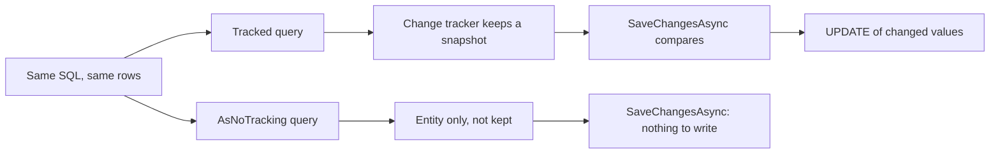

## Bạn cần biết trước

- [[backend.l1.saving-changes]] — bạn biết chưa có gì tới database cho tới khi `SaveChangesAsync` chạy, và nó ghi những thay đổi EF Core đã ghi nhận kể từ lúc nạp.
- [[backend.l2.efcore-generated-sql]] — bạn đọc được câu SQL mà EF Core gửi trong log của api, nên kiểm được một thay đổi ở truy vấn có làm đổi câu SQL đó hay không.

## Tình huống

Bạn review một pull request trên `EfOrderRepository` ở stage-2 và thấy hai method gần như giống nhau. `FindAsync` nạp một đơn kèm các dòng hàng của nó. `FindForReadingAsync` làm y như vậy, chỉ thêm một lời gọi: `AsNoTracking()`. `GET /api/v1/orders/{id}` dùng method thứ hai. Bạn mở log của api như ở bài trước, và câu SQL đọc một đơn là một `SELECT` từ `orders` JOIN với `order_items`, không có gì nói tới tracking. Nếu câu SQL không đổi, thì lời gọi thêm đó đổi cái gì, và khi nào dùng nó là sai?

## Khái niệm cốt lõi

- **change tracker** (phần của DbContext ghi nhớ các entity đã nạp để SaveChanges biết cái gì đã đổi) — phần của một `DbContext` ghi nhớ các entity nó đã nạp, kèm một snapshot giá trị của từng entity, để `SaveChangesAsync` tìm ra cái gì đã đổi.
- Entity được tracking — entity mà change tracker giữ lại. Truy vấn trả về entity thì mặc định tracking chúng.
- Snapshot — bản sao các giá trị thuộc tính của một entity mà change tracker chụp lại khi bắt đầu tracking entity đó.
- `AsNoTracking()` — lời gọi trên một truy vấn khiến nó trả về các entity mà change tracker không giữ.

## Cơ chế hoạt động



Trong tình huống trên, cả hai method gửi cùng câu SQL và nhận về cùng các dòng. Khác biệt chỉ bắt đầu sau khi các dòng về tới api.

Với truy vấn có tracking, change tracker giữ mỗi entity nó dựng ra và chụp snapshot giá trị của entity đó trước khi trao cho code của bạn. Khi `SaveChangesAsync` chạy, EF Core so từng entity đang tracking với snapshot của nó và chỉ viết `UPDATE` cho những giá trị đã đổi. Nhờ vậy, hủy một đơn sẽ ghi trạng thái mới mà bạn không cần nêu tên cột ở đâu cả.

Phần sổ sách đó có giá, và bạn trả nó ngay lúc truy vấn nạp dữ liệu, dù sau đó `SaveChangesAsync` có chạy hay không. Chụp snapshot tốn thời gian, còn giữ chúng thì tốn bộ nhớ.

`AsNoTracking()` bỏ qua toàn bộ phần đó. Các entity được dựng từ các dòng rồi trao cho code của bạn, và change tracker không hề biết tới chúng. Với dữ liệu bạn chỉ đọc để dựng response, đó là phần việc tiết kiệm được bên trong process của api. PostgreSQL vẫn làm đúng chừng ấy việc trong cả hai trường hợp, vì nó nhận cùng câu SQL.

Cái giá nằm ở nhánh còn lại của sơ đồ. Entity mà change tracker không biết thì không có snapshot để so. Nếu bạn đổi nó rồi gọi `SaveChangesAsync`, sẽ không có gì để ghi, và không có gì được ghi.

## Trong hệ thống Đơn Hàng

Hai method nằm cạnh nhau trong `DonHang.Infrastructure/EfOrderRepository.cs`:

```csharp file=DonHang.Infrastructure/EfOrderRepository.cs tag=stage-2 lines=9-16
    // Tracked: cancelling and shipping load the order with this, change it,
    // and SaveChangesAsync writes what changed.
    public Task<Order?> FindAsync(int id) =>
        db.Orders.Include(o => o.Items).FirstOrDefaultAsync(o => o.Id == id);

    // lesson: backend.l2.no-tracking-queries
    public Task<Order?> FindForReadingAsync(int id) =>
        db.Orders.AsNoTracking().Include(o => o.Items).FirstOrDefaultAsync(o => o.Id == id);
```

`db` là `DonHangDbContext` của api. Hai truy vấn chỉ khác nhau đúng ở `AsNoTracking()`. Comment cho biết ai cần bản có tracking: các method của `OrderService` làm đổi một đơn, tức `CancelOrderAsync` và `ShipOrderAsync`, nạp đơn bằng `FindAsync`, gọi method của đơn để đổi trạng thái, rồi gọi `SaveChangesAsync`.

`GET /api/v1/orders/{id}` chỉ đọc, nên action của nó gọi `FindForReadingAsync` rồi biến đơn thành response. Hủy đơn thì dùng cả hai kiểu truy vấn:

```csharp file=DonHang.Api/Controllers/OrdersController.cs tag=stage-2 lines=68-84
    // lesson: design.l2.domain-model
    // Whether this order may be cancelled is Order.Cancel()'s decision; a
    // refusal arrives here as OrderStatusException and leaves as a 409.
    // The same OrderOwner check as Get runs first, on an untracked copy.
    [Authorize]
    [HttpPatch("{id:int}/cancel")]
    public async Task<ActionResult<OrderDto>> Cancel(int id)
    {
        var existing = await repository.FindForReadingAsync(id);
        if (existing is null) return NotFound();

        var allowed = await authorization.AuthorizeAsync(User, existing, "OrderOwner");
        if (!allowed.Succeeded) return Forbid();

        var order = await orderService.CancelOrderAsync(id);
        return Ok(ToDto(order));
    }
```

`existing` chỉ được đọc: kiểm tra `OrderOwner` xem đơn này của ai, và action không hề đổi nó. Vì vậy nó được nạp không tracking. Đơn thật sự bị hủy là đơn mà `CancelOrderAsync` nạp lại bằng `FindAsync` có tracking. Lần nạp thứ hai tốn thêm một truy vấn, và đó là lần mà `SaveChangesAsync` thấy được thay đổi.

Nếu ai đó "tiết kiệm một truy vấn" bằng cách gọi `existing.Cancel()` rồi `SaveChangesAsync`, request có thể trả `200` với một đơn đã hủy trong response, trong khi dòng trong `orders` vẫn giữ nguyên.

## Người mới hay nghĩ rằng…

- **"`AsNoTracking()` làm database chạy truy vấn nhanh hơn."** → Thực ra PostgreSQL nhận cùng câu SQL và làm cùng một việc, còn thứ `AsNoTracking()` tiết kiệm là snapshot và phần sổ sách bên trong api. Bạn sẽ nhận ra khi log lệnh cho thấy cùng câu SQL dù có hay không có nó.
- **"Sau `AsNoTracking()`, tôi vẫn đổi được đơn và `SaveChangesAsync` sẽ lưu nó."** → Thực ra context chưa từng biết tới đơn đó, nên không có gì để so và không có gì để ghi. Bạn sẽ nhận ra khi api trả lời như thể thay đổi đã xảy ra, nhưng lần `GET` sau vẫn cho thấy trạng thái cũ.
- **"Tracking không tốn gì nếu tôi không bao giờ gọi `SaveChangesAsync`."** → Thực ra snapshot được chụp ngay lúc truy vấn nạp dữ liệu, trước khi code của bạn thấy entity, nên một endpoint chỉ đọc vẫn phải trả giá đó. Bạn sẽ nhận ra khi một endpoint trả về nhiều entity thường tốn ít thời gian và bộ nhớ hơn sau khi thêm `AsNoTracking()`, trong khi câu SQL không đổi.

## Thử ngay (3 phút)

1. Mở `DonHang.Api/Controllers/OrdersController.cs` và `DonHang.Domain/OrderService.cs` trong repo ví dụ.
2. Với từng action `Get`, `Cancel` và `Ship`, ghi lại nó nạp những đối tượng đơn nào, mỗi đối tượng được nạp có tracking hay không, và `SaveChangesAsync` ghi đối tượng nào, nếu có.

Kết quả mong đợi: `Get` nạp một đơn không tracking và không lưu gì. `Cancel` nạp một bản không tracking để kiểm tra `OrderOwner`, rồi `CancelOrderAsync` nạp một bản có tracking, hủy và lưu nó. `Ship` chỉ nạp đơn có tracking bên trong `ShipOrderAsync`, giao và lưu nó. Mọi đơn bị đổi và được lưu đều do `FindAsync` nạp.

## Liên hệ

- [[backend.l1.saving-changes]] — bài tiên quyết: `SaveChangesAsync` chỉ ghi những gì change tracker đã ghi nhận, còn bài này cho thấy chuyện gì xảy ra khi nó không ghi nhận gì.
- [[backend.l2.efcore-generated-sql]] — bài tiên quyết: log lệnh là cách bạn xác nhận `AsNoTracking()` để nguyên câu SQL.
- [[backend.l2.projection-queries]] — bài tiếp theo: chỉ đọc những cột mà response cần, cách này cũng bỏ qua change tracker.

## Tóm tắt 5 dòng

1. Dùng `AsNoTracking()` cho entity bạn chỉ đọc, và truy vấn có tracking cho entity bạn sẽ đổi rồi lưu.
2. Mặc định entity của một truy vấn được tracking: change tracker giữ một snapshot để `SaveChangesAsync` chỉ ghi phần đã đổi.
3. `AsNoTracking()` gửi cùng câu SQL, nó tiết kiệm công chụp snapshot và bộ nhớ trong api, không phải việc của PostgreSQL.
4. Đổi một entity nạp bằng `AsNoTracking()` rồi gọi `SaveChangesAsync` thì không ghi gì, vì context chưa từng biết nó.
5. Ở stage-2, `GET /api/v1/orders/{id}` đọc không tracking, còn hủy và giao đổi một đơn do `FindAsync` có tracking nạp.
