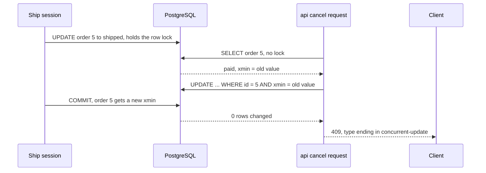

## Before you start

- [[backend.l2.transactions-in-practice]] — you know two requests can both read order 5 as `paid`, and under Read Committed the later `UPDATE` writes over the earlier one: a lost update.
- [[backend.l1.exception-handling-middleware]] — you know `ExceptionHandlingMiddleware` wraps the rest of the pipeline in one `try`, and its `catch` clauses run top to bottom.

## The situation

Order 5 is `paid` again. A staff member's ship is halfway through its transaction when the customer sends `PATCH /api/v1/orders/5/cancel`. The cancel request reads `paid`, and `Order.Cancel()` allows cancelling a paid order. In the last lesson's replay, this is where the cancel wrote over the ship. You could wrap every read and save in a Repeatable Read transaction and retry on `40001`, but that touches every method that changes an order. What if the save itself could tell that the order changed since it was read, and refuse, with no lock held while the request runs?

## Core concepts

- **optimistic concurrency** — a way of guarding writes where requests read without locking, and the save checks whether the row changed since it was read; the losing save fails instead of overwriting.
- **concurrency token** — a value that changes whenever the row changes, compared at save time to detect that someone else wrote the row since it was read.
- `xmin` — a system column every PostgreSQL row has; an `UPDATE` gives the row a new value in it, so Đơn Hàng uses it as the order's token.
- `DbUpdateConcurrencyException` — the exception `SaveChangesAsync` throws when an `UPDATE` guarded by a token matched no row.

## How it works



The diagram plays the staff member's ship as a `psql` session: one open connection from PostgreSQL's command-line client. In the situation above, the cancel request loads order 5 and its token together. EF Core keeps the `xmin` value it read as the token's original value, just as it keeps the order's other values.

At save time, EF Core adds that original value to the `WHERE` of its `UPDATE`: `WHERE id = 5 AND xmin = <old value>`. While the ship holds its row lock, this `UPDATE` waits, as in the last lesson. When the ship commits, the row has a new `xmin`. The waiting `UPDATE` checks its `WHERE` again on the newest row, finds that the token no longer matches, and changes nothing.

EF Core sees that the `UPDATE` changed 0 rows where it expected 1. `SaveChangesAsync` then throws `DbUpdateConcurrencyException`, and the transaction it opened for the save rolls back. The cancel's save would also have added a notification row, and that row is not written either. The ship stays. No request held a lock between its read and its save: that is what makes the approach optimistic. The middleware turns the exception into the `409` the client gets, shown in the next section.

The other way is to take the lock first. Inside one transaction under Read Committed, PostgreSQL's default, `SELECT ... FOR UPDATE` locks order 5 when the request reads it. A second request that tries to lock it waits, then gets the updated row, reads `shipped` and gets `409` with `already-shipped`.

When many writers compete for the same row, waiting in line can cost less than failing and reloading again and again. When conflicts are rare, the token adds little: one more condition in the `WHERE`, and the cost of a failure only when one happens.

## In the Đơn Hàng system

The token is one line in the mapping of `Order`, whose `Version` property is a `uint` with a private setter. The comment names the Npgsql provider, the package EF Core uses to talk to PostgreSQL:

```csharp file=DonHang.Infrastructure/DonHangDbContext.cs tag=stage-2 lines=61-65
            // lesson: backend.l2.optimistic-concurrency
            // IsRowVersion() on a uint makes the Npgsql provider map Version to
            // PostgreSQL's xmin column. EF Core then adds "AND xmin = <value it
            // read>" to the WHERE of every UPDATE of an order.
            e.Property(o => o.Version).IsRowVersion();
```

`IsRowVersion()` tells EF Core that the database changes this value on every update, and that it is a concurrency token. No column was added to `orders`. The migration `AddOrderVersionToken` only records the mapping; the Npgsql provider writes no SQL for it, because `xmin` is already there.

The exception then needs an answer the client can act on:

```csharp file=DonHang.Api/Middleware/ExceptionHandlingMiddleware.cs tag=stage-2 lines=42-51
        // lesson: backend.l2.optimistic-concurrency
        // The order's xmin changed between reading it and saving it, so EF Core's
        // UPDATE matched no row and wrote nothing. The client reloads and decides again.
        catch (DbUpdateConcurrencyException ex)
        {
            logger.LogWarning(ex, "an order changed while this request was changing it");
            var order = ex.Entries.Select(entry => entry.Entity).OfType<Order>().FirstOrDefault();
            await WriteProblemAsync(context, StatusCodes.Status409Conflict, "Order was changed by another request",
                "reload the order and try again", type: ProblemTypeBase + "concurrent-update", orderId: order?.Id);
        }
```

`ex.Entries` lists the entities whose save failed, so the middleware can put the order's id in the `orderId` extension. The `type` ends in `concurrent-update`, which tells the client this is not a status rule such as `already-shipped`, where the order's current status forbids the action: nothing is wrong with the request itself, but it was based on a status that is no longer true. The client reloads the order, shows the new status, and lets the person decide again.

## Beginners often think…

- **"Optimistic concurrency locks the order while someone is changing it."** → Actually nothing is locked between the read and the save; the check happens only in the `UPDATE`'s `WHERE`. You notice this when a second request reads the order at once, while the first is still working, and only its save fails.
- **"When `SaveChangesAsync` throws a concurrency exception, the fix is to call it again."** → Actually EF Core still holds the token's original value from the read, so the same `UPDATE ... AND xmin = <old value>` matches no row again. Forcing the save through, by copying the new `xmin` into that original value without reloading the status, would write over the other change: the lost update back. You notice this when a retry loop keeps failing, or when a "fixed" retry turns a shipped order into a cancelled one.
- **"A concurrency token needs a new column added to the `orders` table."** → Actually PostgreSQL already keeps `xmin` on every row, and `Order.Version` maps to it. You notice this when the `AddOrderVersionToken` migration runs and `orders` has the same columns as before.

## Try it (3 minutes)

1. With the example system running (`scripts/up.sh`), run `scripts/backend/concurrency-conflict.sh` from the root folder of the example repository. It ships order 5 in a `psql` session that holds the row for 2 seconds, and sends the cancel through the API meanwhile.
2. Read the API's answer and the last query, and compare them with how `lost-update.sh` ended.

Expected result: the cancel gets `-> 409` with a body whose `type` is `https://donhang.local/problems/concurrent-update` and `orderId` is `5`, the ship session shows `UPDATE 1` and `COMMIT`, and order 5 afterwards is `shipped`, not `cancelled`. The script sets order 5 back to `paid` when it ends.

## Connections

- [[backend.l2.transactions-in-practice]] — the problem this lesson fixes: the lost update of a read-then-write under Read Committed.
- [[backend.l2.skip-locked-claiming]] — the locking side: `FOR UPDATE` makes others wait, where a token makes the loser fail.
- [[backend.l2.problem-types]] — the same `409` with a different `type`, so the client can tell a stale read from a status rule.

## Five-line summary

1. With optimistic concurrency, requests read without locking and the save checks the row is unchanged, so the losing save fails instead of overwriting.
2. Đơn Hàng's concurrency token is PostgreSQL's `xmin`, mapped to `Order.Version` with `IsRowVersion()`; no column is added.
3. EF Core puts the token's original value in the `UPDATE`'s `WHERE`; 0 rows changed makes `SaveChangesAsync` throw `DbUpdateConcurrencyException`.
4. The middleware answers `409` with a `concurrent-update` type, and the client reloads before deciding again, never blindly retrying.
5. Locking first with `SELECT ... FOR UPDATE` makes the second request wait instead, which suits rows many writers compete for.
