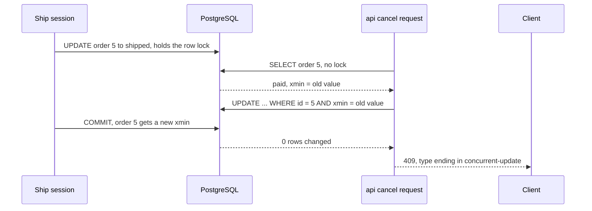

## Bạn cần biết trước

- [[backend.l2.transactions-in-practice]] — bạn biết hai request có thể cùng đọc đơn 5 thấy `paid`, và dưới Read Committed lệnh `UPDATE` đến sau sẽ ghi đè lên lệnh trước: một lost update.
- [[backend.l1.exception-handling-middleware]] — bạn biết `ExceptionHandlingMiddleware` bọc phần còn lại của pipeline trong một khối `try`, và các mệnh đề `catch` của nó chạy từ trên xuống dưới.

## Tình huống

Đơn 5 lại đang `paid`. Lệnh ship của một nhân viên đang chạy dở giao dịch thì khách gửi `PATCH /api/v1/orders/5/cancel`. Request hủy đọc thấy `paid`, và `Order.Cancel()` cho phép hủy một đơn đã thanh toán. Trong bản phát lại ở bài trước, đây chính là lúc lệnh hủy ghi đè lên lệnh ship. Bạn có thể bọc mọi bước đọc và bước lưu trong một giao dịch Repeatable Read rồi thử lại khi gặp `40001`, nhưng như vậy phải sửa mọi method có đổi đơn hàng. Giá như chính bước lưu tự nhận ra đơn đã bị đổi từ lúc đọc và từ chối ghi, mà không cần giữ khóa nào trong lúc request chạy thì sao?

## Khái niệm cốt lõi

- **optimistic concurrency** (Cho đọc không khóa, đến lúc lưu mới kiểm dòng có bị đổi từ khi đọc không, nếu có thì từ chối lưu) — kiểu bảo vệ thao tác ghi: request đọc mà không khóa, còn bước lưu kiểm xem dòng có bị đổi từ lúc đọc không. Lần lưu thua cuộc sẽ thất bại thay vì ghi đè.
- **concurrency token** (Giá trị được so lúc lưu để phát hiện dòng đã bị đổi từ khi đọc) — một giá trị đổi mỗi khi dòng đổi, được so sánh lúc lưu để phát hiện đã có người khác ghi vào dòng từ lúc đọc.
- `xmin` — một cột hệ thống mà dòng nào trong PostgreSQL cũng có. Mỗi lệnh `UPDATE` cho dòng một giá trị mới ở cột này, nên Đơn Hàng dùng nó làm token của đơn hàng.
- `DbUpdateConcurrencyException` — exception mà `SaveChangesAsync` ném ra khi một lệnh `UPDATE` có điều kiện token không khớp dòng nào.

## Cơ chế hoạt động



Sơ đồ đóng vai lệnh ship của nhân viên bằng một session `psql`: một kết nối đang mở từ client dòng lệnh của PostgreSQL. Trong tình huống trên, request hủy nạp đơn 5 cùng với token của nó. EF Core giữ giá trị `xmin` đã đọc làm giá trị gốc của token, y như cách nó giữ các giá trị khác của đơn.

Lúc lưu, EF Core thêm giá trị gốc đó vào `WHERE` của lệnh `UPDATE`: `WHERE id = 5 AND xmin = <old value>`. Trong lúc ship còn giữ khóa dòng, lệnh `UPDATE` này phải chờ, giống bài trước. Khi ship commit, dòng đã có `xmin` mới. Lệnh `UPDATE` đang chờ kiểm lại `WHERE` trên phiên bản mới nhất của dòng, thấy token không còn khớp, và không đổi gì cả.

EF Core thấy lệnh `UPDATE` đổi 0 dòng trong khi nó chờ đợi 1. Lúc đó `SaveChangesAsync` ném `DbUpdateConcurrencyException`, và giao dịch nó mở cho bước lưu bị rollback. Bước lưu của lệnh hủy lẽ ra còn thêm một dòng notification, và dòng đó cũng không được ghi. Lệnh ship được giữ nguyên. Không request nào giữ khóa giữa bước đọc và bước lưu của nó: đó là lý do cách này được gọi là optimistic. Middleware biến exception thành `409` gửi cho client, như bạn sẽ thấy ở phần sau.

Cách còn lại là khóa trước. Trong một giao dịch chạy dưới Read Committed, mức mặc định của PostgreSQL, `SELECT ... FOR UPDATE` khóa đơn 5 ngay lúc request đọc nó. Request thứ hai muốn khóa đơn đó phải chờ, rồi nhận phiên bản đã cập nhật của dòng, đọc thấy `shipped` và nhận `409` với `already-shipped`.

Khi nhiều bên cùng tranh ghi một dòng, xếp hàng chờ có thể rẻ hơn là thất bại rồi tải lại hết lần này tới lần khác. Khi xung đột hiếm, token tốn rất ít: thêm một điều kiện trong `WHERE`, và chỉ phải trả giá cho một lần thất bại khi xung đột thật sự xảy ra.

## Trong hệ thống Đơn Hàng

Token chỉ là một dòng trong phần map của `Order`, class có property `Version` kiểu `uint` với setter private. Comment nhắc tới provider Npgsql, gói mà EF Core dùng để làm việc với PostgreSQL:

```csharp file=DonHang.Infrastructure/DonHangDbContext.cs tag=stage-2 lines=61-65
            // lesson: backend.l2.optimistic-concurrency
            // IsRowVersion() on a uint makes the Npgsql provider map Version to
            // PostgreSQL's xmin column. EF Core then adds "AND xmin = <value it
            // read>" to the WHERE of every UPDATE of an order.
            e.Property(o => o.Version).IsRowVersion();
```

`IsRowVersion()` báo cho EF Core biết database tự đổi giá trị này mỗi lần cập nhật, và đây là một concurrency token. Bảng `orders` không có thêm cột nào. Migration `AddOrderVersionToken` chỉ ghi lại cách map, còn provider Npgsql không sinh câu SQL nào cho nó, vì `xmin` đã có sẵn.

Exception khi đó cần một câu trả lời mà client dựa vào để hành động:

```csharp file=DonHang.Api/Middleware/ExceptionHandlingMiddleware.cs tag=stage-2 lines=42-51
        // lesson: backend.l2.optimistic-concurrency
        // The order's xmin changed between reading it and saving it, so EF Core's
        // UPDATE matched no row and wrote nothing. The client reloads and decides again.
        catch (DbUpdateConcurrencyException ex)
        {
            logger.LogWarning(ex, "an order changed while this request was changing it");
            var order = ex.Entries.Select(entry => entry.Entity).OfType<Order>().FirstOrDefault();
            await WriteProblemAsync(context, StatusCodes.Status409Conflict, "Order was changed by another request",
                "reload the order and try again", type: ProblemTypeBase + "concurrent-update", orderId: order?.Id);
        }
```

`ex.Entries` liệt kê các entity lưu thất bại, nên middleware lấy được id của đơn để đặt vào extension `orderId`. `type` kết thúc bằng `concurrent-update`, cho client biết đây không phải một quy tắc trạng thái như `already-shipped`, nơi chính trạng thái hiện tại của đơn cấm thao tác đó. Bản thân request không sai gì, chỉ là nó dựa trên một trạng thái không còn đúng. Client tải lại đơn, hiện trạng thái mới, và để người dùng quyết định lại.

## Người mới hay nghĩ rằng…

- **"Optimistic concurrency khóa đơn hàng trong lúc có người đang sửa nó."** → Thực ra không có gì bị khóa giữa bước đọc và bước lưu, việc kiểm chỉ nằm trong `WHERE` của lệnh `UPDATE`. Bạn sẽ nhận ra khi một request thứ hai đọc được đơn ngay lập tức trong lúc request đầu vẫn đang chạy, và chỉ bước lưu của nó thất bại.
- **"Khi `SaveChangesAsync` ném exception về ghi đồng thời, cách sửa là gọi lại nó."** → Thực ra EF Core vẫn giữ giá trị gốc của token từ lần đọc, nên cùng lệnh `UPDATE ... AND xmin = <old value>` lại không khớp dòng nào. Còn nếu ép cho lưu được, bằng cách chép `xmin` mới vào giá trị gốc đó mà không tải lại trạng thái, thì nó sẽ ghi đè lên thay đổi kia: lost update quay trở lại. Bạn sẽ nhận ra khi một vòng lặp thử lại cứ thất bại mãi, hoặc khi một lần thử lại "đã sửa" biến một đơn đã ship thành đơn bị hủy.
- **"Concurrency token cần thêm một cột mới vào bảng `orders`."** → Thực ra PostgreSQL vốn đã giữ `xmin` trên mọi dòng, và `Order.Version` được map vào đó. Bạn sẽ nhận ra khi migration `AddOrderVersionToken` chạy xong mà `orders` vẫn đúng những cột như trước.

## Thử ngay (3 phút)

1. Khi hệ thống ví dụ đang chạy (`scripts/up.sh`), chạy `scripts/backend/concurrency-conflict.sh` từ thư mục gốc của repo ví dụ. Script ship đơn 5 trong một session `psql` giữ dòng đó 2 giây, và trong lúc ấy gửi lệnh hủy qua API.
2. Đọc câu trả lời của API và truy vấn cuối cùng, rồi so với cách `lost-update.sh` kết thúc.

Kết quả mong đợi: lệnh hủy nhận `-> 409` với body có `type` là `https://donhang.local/problems/concurrent-update` và `orderId` là `5`, session ship hiện `UPDATE 1` và `COMMIT`, và sau đó đơn 5 là `shipped`, không phải `cancelled`. Script đặt đơn 5 về lại `paid` khi chạy xong.

## Liên hệ

- [[backend.l2.transactions-in-practice]] — vấn đề mà bài này sửa: lost update của kiểu đọc-rồi-ghi dưới Read Committed.
- [[backend.l2.skip-locked-claiming]] — phía dùng khóa: `FOR UPDATE` bắt bên khác chờ, còn token làm bên thua thất bại.
- [[backend.l2.problem-types]] — cùng `409` nhưng khác `type`, để client phân biệt một lần đọc đã cũ với một quy tắc trạng thái.

## Tóm tắt 5 dòng

1. Với optimistic concurrency, request đọc không khóa và bước lưu kiểm dòng chưa bị đổi, nên lần lưu thua cuộc thất bại thay vì ghi đè.
2. Concurrency token của Đơn Hàng là `xmin` của PostgreSQL, map vào `Order.Version` bằng `IsRowVersion()`, không thêm cột nào.
3. EF Core đưa giá trị gốc của token vào `WHERE` của `UPDATE`, đổi 0 dòng thì `SaveChangesAsync` ném `DbUpdateConcurrencyException`.
4. Middleware trả `409` với type `concurrent-update`, và client tải lại đơn trước khi quyết định lại, không bao giờ thử lại mù quáng.
5. Khóa trước bằng `SELECT ... FOR UPDATE` khiến request thứ hai phải chờ, hợp với những dòng có nhiều bên cùng tranh ghi.
