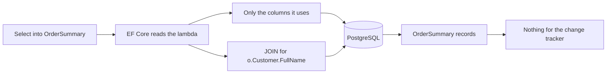

## Before you start

- [[backend.l2.no-tracking-queries]] — you know tracked entities cost a snapshot each, and that an entity the change tracker does not keep cannot be saved.
- [[backend.l1.efcore-n-plus-one]] — you know `Include(o => o.Customer)` loads each order's customer in the same query, through a JOIN.
- [[backend.l1.dtos-and-serialization]] — you know a response should carry only the fields the client needs, in a type shaped for that.

## The situation

The order list in the app shows three things per order: its id, its status and the customer's name. At stage-1, `ListByCustomerAsync` loaded the customer's orders with `Include(o => o.Customer)`, so every order came back as a whole `Order` with a whole `Customer` attached: every mapped column of both, including `email` and `password_hash`, a column stage-2 no longer has. At stage-2 the command log for the same list shows a `SELECT` of three columns and still a JOIN to `customers`, yet the method no longer calls `Include`. How does EF Core know which columns to fetch, and where does that JOIN come from?

## Core concepts

- **projection** — a query that returns only chosen values, shaped into a type of your own, instead of whole entities.
- `Select` — the LINQ method that says, for each row, what the query should return; inside an EF Core query, EF Core reads it to decide what to put in the SQL.
- `OrderSummary` — the record `DonHang.Domain` defines for one line of the order list: `Id`, `Status` and `CustomerName`.
- Navigation — a property such as `Order.Customer` that points from one entity to a related one; EF Core knows which foreign key it follows.

## How it works



In the situation above, the `Select` builds a new `OrderSummary` from `o.Id`, `o.Status` and `o.Customer!.FullName`. Nothing is sent to PostgreSQL until `ToListAsync()` runs the query. EF Core does not load each order and then run the lambda on it. It reads the lambda as part of the query, like the `Where` that filters the orders, and writes SQL that fetches exactly the values the lambda uses; only then does it build one `OrderSummary` from each row that comes back. Columns the lambda never mentions, such as `placed_at` or `email`, stay in PostgreSQL.

`o.Customer!.FullName` follows a navigation. EF Core knows `Order.Customer` is reached through `orders.customer_id`, so it adds the JOIN to `customers` itself and selects only `full_name` from it. `Include` is for loading a whole related entity next to a whole entity; a projection that names the related value it needs does not use it.

What comes back is a list of `OrderSummary` records, not entities. The change tracker only tracks entities, so a query whose results contain none tracks nothing and takes no snapshots, without any `AsNoTracking()`.

The same fact sets the limit. An `OrderSummary` is not an entity the context knows, and its properties cannot be set after it is built. You cannot change one and save it back. A projection fits reading for a response; to change an order, Đơn Hàng still loads the tracked entity, as cancelling and shipping do with `FindAsync`.

## In the Đơn Hàng system

At stage-2 the method keeps its name and returns `OrderSummary` instead of `Order`:

```csharp file=DonHang.Infrastructure/EfOrderRepository.cs tag=stage-2 lines=18-29
    // lesson: backend.l2.cursor-pagination
    // lesson: backend.l2.projection-queries
    // One customer's orders after the cursor, in id order, one page at a time.
    // The Select puts only three columns in the SQL; reading o.Customer inside
    // it makes EF Core write the JOIN, so no Include is needed.
    public Task<List<OrderSummary>> ListByCustomerAsync(int customerId, int afterId, int limit) =>
        db.Orders
            .Where(o => o.CustomerId == customerId && o.Id > afterId)
            .OrderBy(o => o.Id)
            .Take(limit)
            .Select(o => new OrderSummary(o.Id, o.Status, o.Customer!.FullName))
            .ToListAsync();
```

`OrderSummary` is declared in `DonHang.Domain/OrderSummary.cs` as `public sealed record OrderSummary(int Id, string Status, string CustomerName);`. It lives in `DonHang.Domain`, not beside the api's DTOs, so the repository can return it without depending on `DonHang.Api`. The controller then copies each one into the `OrderSummaryDto` it sends as JSON.

`scripts/backend/efcore-sql.sh`, the script from the lesson on EF Core's logged SQL, requests one page as customer 3 and prints the command EF Core logged for it:

```bash file=scripts/backend/efcore-sql.sh tag=stage-2 lines=11-12
echo "GET /api/v1/orders?after=5&limit=20 as customer 3:"
curl -sS "$base/orders?after=5&limit=20" -H "Authorization: Bearer $token"
```

The duration, masked as `...`, changes on every run:

```text output=true
GET /api/v1/orders?after=5&limit=20 as customer 3:
[{"id":6,"status":"new","customerName":"Lê Quốc Dũng"},{"id":7,"status":"shipped","customerName":"Lê Quốc Dũng"}]

what EF Core logged for it:
Information: Microsoft.EntityFrameworkCore.Database.Command[20101]
Executed DbCommand (...ms) [Parameters=[@customerId='?' (DbType = Int32), @afterId='?' (DbType = Int32), @p='?' (DbType = Int32)], CommandType='Text', CommandTimeout='30']
SELECT o0.id, o0.status, c.full_name
FROM (
    SELECT o.id, o.customer_id, o.status
    FROM orders AS o
    WHERE o.customer_id = @customerId AND o.id > @afterId
    ORDER BY o.id
    LIMIT @p
) AS o0
INNER JOIN customers AS c ON o0.customer_id = c.id
ORDER BY o0.id
```

The inner query picks the page of orders first, with the `WHERE`, `ORDER BY` and `LIMIT` that come from `Where`, `OrderBy` and `Take`; the outer `SELECT` then joins `customers` to just those rows. It returns three columns: `id`, `status` and `full_name`, one per `OrderSummary` value. The inner query also reads `customer_id`, only because the JOIN needs it. `INNER JOIN customers` is there because the lambda reads `o.Customer!.FullName`, not because of any `Include`. Nothing from `customers` except `full_name` leaves PostgreSQL.

## Beginners often think…

- **"`Include` is the only way to read data from a related table."** → Actually reading a navigation's property inside `Select` makes EF Core write the JOIN itself. You notice this when the logged SQL above joins `customers` while `ListByCustomerAsync` has no `Include`.
- **"EF Core only fetches the columns my code later reads from the entity."** → Actually a query that returns entities fetches every mapped column, whatever your code reads afterwards; a `Select` inside the query is what narrows the SQL to the values you name. You notice this when the stage-1 list, which read three values, still loaded every column of `orders` and `customers`.
- **"A query that returns records still fills the change tracker, so I also need `AsNoTracking()`."** → Actually the change tracker only tracks entities, and `OrderSummary` is not one. You notice this when `ListByCustomerAsync` works without `AsNoTracking()`, and nothing it returns can be saved back.

## Try it (3 minutes)

1. With the example system running (`scripts/up.sh`), run `scripts/backend/efcore-sql.sh` from the root folder of the example repository.
2. In the logged SQL, list the columns of the outer `SELECT`, then compare them with the three values in `ListByCustomerAsync`'s `Select` and with the properties of `Customer` in `DonHang.Domain/Entities.cs`.

Expected result: the outer `SELECT` has exactly `o0.id`, `o0.status` and `c.full_name`, one per `OrderSummary` value. None of `Email`, `City` or `IdentitySubject` appears anywhere in the SQL, and `c.id` appears only in the JOIN condition, although the query joins `customers`.

## Connections

- [[backend.l2.no-tracking-queries]] — prerequisite: a projection skips the change tracker too, without `AsNoTracking()`, because it returns no entities.
- [[backend.l1.efcore-n-plus-one]] — prerequisite: the same list, one query instead of N+1; a projection keeps it one query while fetching less.
- [[backend.l1.dtos-and-serialization]] — the same idea one layer down: the DTO trims what leaves the api, the projection trims what leaves PostgreSQL.
- [[backend.l2.efcore-generated-sql]] — how to read the logged SQL this lesson checks.

## Five-line summary

1. A projection with `Select` makes EF Core fetch only the values a response needs, instead of whole entities.
2. At stage-1 `Include(o => o.Customer)` loaded every mapped column of both entities; at stage-2 the SQL selects three.
3. Reading `o.Customer!.FullName` inside `Select` makes EF Core write the JOIN itself, so no `Include` is needed.
4. A projection whose results hold no entities is not tracked, so it skips the change tracker without `AsNoTracking()`.
5. Projected records cannot be changed and saved back; use them for reading a response, and tracked entities for changes.
