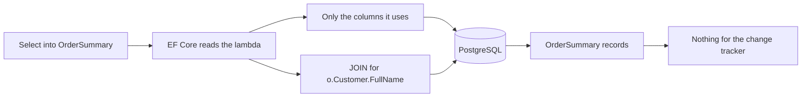

## Bạn cần biết trước

- [[backend.l2.no-tracking-queries]] — bạn biết mỗi entity được tracking tốn một snapshot, và entity mà change tracker không giữ thì không lưu được.
- [[backend.l1.efcore-n-plus-one]] — bạn biết `Include(o => o.Customer)` nạp khách của từng đơn trong cùng truy vấn, qua một JOIN.
- [[backend.l1.dtos-and-serialization]] — bạn biết response chỉ nên mang những trường client cần, trong một kiểu được dựng riêng cho việc đó.

## Tình huống

Danh sách đơn trong app hiện ba thứ cho mỗi đơn: mã đơn, trạng thái và tên khách. Ở stage-1, `ListByCustomerAsync` nạp các đơn của khách bằng `Include(o => o.Customer)`, nên mỗi đơn trả về là cả một `Order` gắn kèm cả một `Customer`: mọi cột được map của cả hai, gồm `email` và `password_hash`, một cột mà stage-2 không còn. Ở stage-2, log lệnh của cùng danh sách đó cho thấy một `SELECT` ba cột và vẫn có JOIN sang `customers`, dù method không còn gọi `Include`. Làm sao EF Core biết phải lấy những cột nào, và JOIN đó từ đâu ra?

## Khái niệm cốt lõi

- **projection** (truy vấn chỉ lấy các trường được chọn, đổ vào một kiểu mới, thay vì cả entity) — truy vấn chỉ trả về những giá trị được chọn, đổ vào một kiểu của riêng bạn, thay vì cả entity.
- `Select` — method LINQ nói rằng, với mỗi dòng, truy vấn cần trả về gì. Trong một truy vấn EF Core, EF Core đọc nó để quyết định đưa gì vào câu SQL.
- `OrderSummary` — record mà `DonHang.Domain` định nghĩa cho một dòng của danh sách đơn: `Id`, `Status` và `CustomerName`.
- Navigation — một thuộc tính như `Order.Customer`, trỏ từ một entity sang một entity liên quan. EF Core biết nó đi theo foreign key nào.

## Cơ chế hoạt động



Trong tình huống trên, `Select` dựng một `OrderSummary` mới từ `o.Id`, `o.Status` và `o.Customer!.FullName`. Chưa có gì được gửi tới PostgreSQL cho tới khi `ToListAsync()` chạy truy vấn. EF Core không nạp từng đơn rồi mới chạy lambda trên đơn đó. Nó đọc lambda như một phần của truy vấn, giống `Where` dùng để lọc đơn, và viết câu SQL lấy đúng những giá trị mà lambda dùng. Chỉ sau đó nó mới dựng một `OrderSummary` từ mỗi dòng trả về. Những cột lambda không nhắc tới, như `placed_at` hay `email`, ở lại trong PostgreSQL.

`o.Customer!.FullName` đi theo một navigation. EF Core biết `Order.Customer` đi qua `orders.customer_id`, nên nó tự thêm JOIN sang `customers` và chỉ chọn `full_name` từ bảng đó. `Include` dùng để nạp cả một entity liên quan bên cạnh cả một entity. Một projection đã nêu đúng giá trị liên quan nó cần thì không dùng tới `Include`.

Thứ trả về là một danh sách record `OrderSummary`, không phải entity. Change tracker chỉ tracking entity, nên một truy vấn có kết quả không chứa entity nào thì không tracking gì và không chụp snapshot nào, mà không cần `AsNoTracking()`.

Cũng chính điều đó đặt ra giới hạn. `OrderSummary` không phải entity mà context biết, và các thuộc tính của nó không đặt lại được sau khi dựng. Bạn không thể đổi một record rồi lưu ngược về. Projection hợp với việc đọc để dựng response. Còn để đổi một đơn, Đơn Hàng vẫn nạp entity có tracking, như hủy đơn và giao hàng làm với `FindAsync`.

## Trong hệ thống Đơn Hàng

Ở stage-2, method giữ nguyên tên và trả về `OrderSummary` thay cho `Order`:

```csharp file=DonHang.Infrastructure/EfOrderRepository.cs tag=stage-2 lines=18-29
    // lesson: backend.l2.cursor-pagination
    // lesson: backend.l2.projection-queries
    // One customer's orders after the cursor, in id order, one page at a time.
    // The Select puts only three columns in the SQL; reading o.Customer inside
    // it makes EF Core write the JOIN, so no Include is needed.
    public Task<List<OrderSummary>> ListByCustomerAsync(int customerId, int afterId, int limit) =>
        db.Orders
            .Where(o => o.CustomerId == customerId && o.Id > afterId)
            .OrderBy(o => o.Id)
            .Take(limit)
            .Select(o => new OrderSummary(o.Id, o.Status, o.Customer!.FullName))
            .ToListAsync();
```

`OrderSummary` được khai báo trong `DonHang.Domain/OrderSummary.cs` là `public sealed record OrderSummary(int Id, string Status, string CustomerName);`. Nó nằm trong `DonHang.Domain` chứ không cạnh các DTO của api, để repository trả nó về mà không phụ thuộc `DonHang.Api`. Sau đó controller chép từng record sang `OrderSummaryDto` mà nó gửi đi dưới dạng JSON.

`scripts/backend/efcore-sql.sh`, script của bài về SQL mà EF Core log, xin một trang đơn với tư cách khách 3 rồi in lệnh EF Core đã log cho trang đó:

```bash file=scripts/backend/efcore-sql.sh tag=stage-2 lines=11-12
echo "GET /api/v1/orders?after=5&limit=20 as customer 3:"
curl -sS "$base/orders?after=5&limit=20" -H "Authorization: Bearer $token"
```

Thời lượng, bị che bằng `...`, đổi sau mỗi lần chạy:

```text output=true
GET /api/v1/orders?after=5&limit=20 as customer 3:
[{"id":6,"status":"new","customerName":"Lê Quốc Dũng"},{"id":7,"status":"shipped","customerName":"Lê Quốc Dũng"}]

what EF Core logged for it:
Information: Microsoft.EntityFrameworkCore.Database.Command[20101]
Executed DbCommand (...ms) [Parameters=[@customerId='?' (DbType = Int32), @afterId='?' (DbType = Int32), @p='?' (DbType = Int32)], CommandType='Text', CommandTimeout='30']
SELECT o0.id, o0.status, c.full_name
FROM (
    SELECT o.id, o.customer_id, o.status
    FROM orders AS o
    WHERE o.customer_id = @customerId AND o.id > @afterId
    ORDER BY o.id
    LIMIT @p
) AS o0
INNER JOIN customers AS c ON o0.customer_id = c.id
ORDER BY o0.id
```

Truy vấn con chọn trang đơn trước, với `WHERE`, `ORDER BY` và `LIMIT` đến từ `Where`, `OrderBy` và `Take`. Sau đó `SELECT` bên ngoài mới JOIN `customers` vào đúng các dòng đó. Nó trả về ba cột: `id`, `status` và `full_name`, mỗi giá trị của `OrderSummary` một cột. Truy vấn con đọc thêm `customer_id` chỉ vì JOIN cần cột này. `INNER JOIN customers` có mặt vì lambda đọc `o.Customer!.FullName`, không phải vì `Include` nào. Ngoài `full_name`, không gì từ `customers` rời khỏi PostgreSQL.

## Người mới hay nghĩ rằng…

- **"`Include` là cách duy nhất để đọc dữ liệu từ bảng liên quan."** → Thực ra đọc một thuộc tính của navigation bên trong `Select` khiến EF Core tự viết JOIN. Bạn sẽ nhận ra khi câu SQL trong log ở trên JOIN `customers` trong khi `ListByCustomerAsync` không có `Include`.
- **"EF Core chỉ lấy những cột mà code của tôi đọc từ entity sau đó."** → Thực ra một truy vấn trả về entity lấy mọi cột được map, bất kể sau đó code đọc gì. `Select` bên trong truy vấn mới là thứ thu hẹp câu SQL về đúng các giá trị bạn nêu. Bạn sẽ nhận ra khi danh sách ở stage-1, dù chỉ đọc ba giá trị, vẫn nạp mọi cột của `orders` và `customers`.
- **"Truy vấn trả về record vẫn đổ vào change tracker, nên tôi vẫn cần `AsNoTracking()`."** → Thực ra change tracker chỉ tracking entity, mà `OrderSummary` không phải entity. Bạn sẽ nhận ra khi `ListByCustomerAsync` chạy tốt mà không có `AsNoTracking()`, và không thứ gì nó trả về lưu ngược lại được.

## Thử ngay (3 phút)

1. Khi hệ thống ví dụ đang chạy (`scripts/up.sh`), chạy `scripts/backend/efcore-sql.sh` từ thư mục gốc của repo ví dụ.
2. Trong câu SQL của log, liệt kê các cột của `SELECT` bên ngoài, rồi so chúng với ba giá trị trong `Select` của `ListByCustomerAsync` và với các thuộc tính của `Customer` trong `DonHang.Domain/Entities.cs`.

Kết quả mong đợi: `SELECT` bên ngoài có đúng `o0.id`, `o0.status` và `c.full_name`, mỗi giá trị của `OrderSummary` một cột. Không cột nào trong `Email`, `City` hay `IdentitySubject` xuất hiện trong câu SQL, còn `c.id` chỉ có mặt trong điều kiện JOIN, dù truy vấn có JOIN `customers`.

## Liên hệ

- [[backend.l2.no-tracking-queries]] — bài tiên quyết: projection cũng bỏ qua change tracker, không cần `AsNoTracking()`, vì nó không trả về entity nào.
- [[backend.l1.efcore-n-plus-one]] — bài tiên quyết: cùng danh sách đó, một truy vấn thay vì N+1. Projection giữ nguyên một truy vấn mà lấy ít dữ liệu hơn.
- [[backend.l1.dtos-and-serialization]] — cùng ý tưởng ở tầng dưới: DTO cắt bớt thứ rời khỏi api, projection cắt bớt thứ rời khỏi PostgreSQL.
- [[backend.l2.efcore-generated-sql]] — cách đọc câu SQL trong log mà bài này kiểm tra.

## Tóm tắt 5 dòng

1. Projection bằng `Select` khiến EF Core chỉ lấy những giá trị response cần, thay vì cả entity.
2. Ở stage-1, `Include(o => o.Customer)` nạp mọi cột được map của cả hai entity, còn ở stage-2 câu SQL chỉ chọn ba cột.
3. Đọc `o.Customer!.FullName` bên trong `Select` khiến EF Core tự viết JOIN, nên không cần `Include`.
4. Projection có kết quả không chứa entity thì không được tracking, nên bỏ qua change tracker mà không cần `AsNoTracking()`.
5. Record từ projection không đổi rồi lưu ngược được, hãy dùng chúng để đọc cho response, và dùng entity có tracking khi cần đổi.
