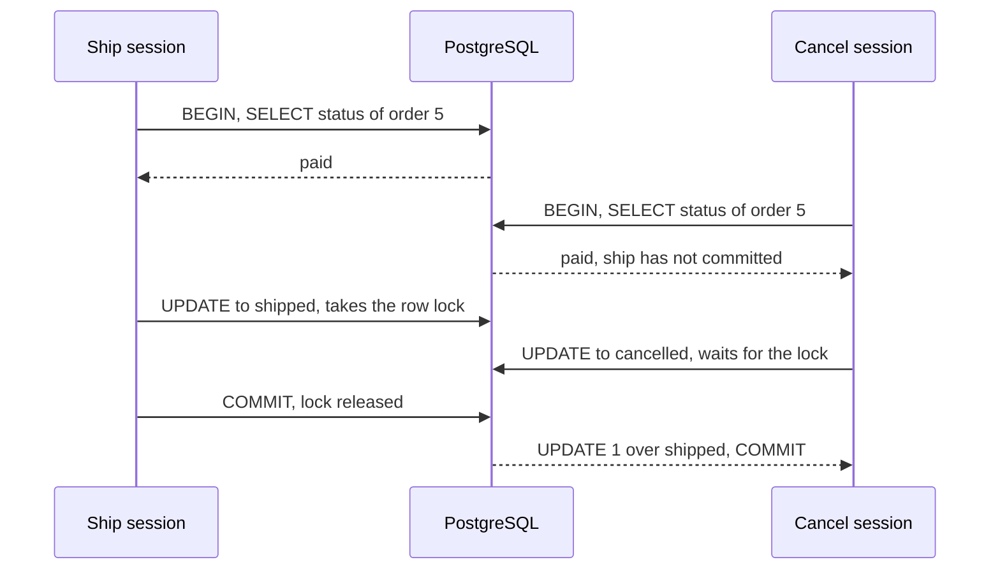

## Before you start

- [[foundation.l1.transaction-intro]] — you know `BEGIN` opens a transaction and `COMMIT` keeps its changes and shows them to others.
- [[backend.l1.saving-changes]] — you know `SaveChangesAsync` sends every staged change in one transaction.
- [[backend.l2.role-based-access]] — you know only a token with the `staff` role gets through the ship endpoint.
- [[backend.l2.problem-types]] — you know cancelling a shipped order answers `409` with a `type` ending in `already-shipped`.

## The situation

Order 5 is `paid`. A staff member ships it, and in the same second its customer cancels it. Both requests run the same steps: load the order, let `Ship()` or `Cancel()` check its status, save. The script `scripts/backend/lost-update.sh` replays the reads and writes the two requests would send if nothing guarded the row.

In the script the ship commits first. The cancel then succeeds too, and order 5 ends up `cancelled`. Had the cancel arrived a second later, it would have got `409` with `already-shipped`. Each replayed request ran inside a transaction, so why did both read `paid`, and why did the second write wipe out the first?

## Core concepts

- **isolation level** — the setting that decides what a transaction sees of the changes other transactions make while it runs.
- Read Committed — PostgreSQL's default isolation level: each statement sees only the rows committed before that statement began.
- **lost update** — two transactions read the same value and both write, so the later write silently erases the earlier one.
- Repeatable Read — a stricter level: every statement in the transaction sees the database as it was at the transaction's first query.
- Serialization error — the error with code (SQLSTATE) `40001` that PostgreSQL raises instead of letting a Repeatable Read transaction write over a newer change.

## How it works



The script plays each request as a database session: one open connection to PostgreSQL that sends SQL. In the situation above, both sessions run under Read Committed. Each `SELECT` sees what was committed when that `SELECT` began. Both ran before the ship committed, so both saw `paid`, and two requests doing the same would both pass their status checks.

The ship's `UPDATE` takes a row lock on order 5. The cancel's `UPDATE` must wait for that lock. When the ship commits, the cancel's `UPDATE` goes ahead on the newest version of the row. In the script, its `WHERE` only names `id = 5`, which still matches, so it writes `cancelled` over `shipped`. That is a lost update.

Neither transaction failed: each was all or nothing, and still one change vanished. A transaction makes its own writes whole; the isolation level decides what it sees of everyone else's.

Unlike the script's sessions, the real requests do not even read inside the save's transaction. `FindAsync` runs as its own statement first. `SaveChangesAsync` later starts its own transaction under Read Committed, because the code asks for no other level. A stricter level on the save alone would not cover the read. To give both one level, one way is for the code to call `BeginTransactionAsync` on the `Database` property of the DbContext the repository wraps, passing the level, before the read, and commit after the save.

Under Repeatable Read, the read and the write share one view of the database. When the cancel's `UPDATE` finds a row that changed after that view was taken, PostgreSQL refuses it with a serialization error. The order stays `shipped`. The application must catch that error and run the whole transaction again; this time the read sees `shipped`, and `Cancel()` refuses.

## In the Đơn Hàng system

The two methods in `OrderService` at stage-2 read, check in C#, then save:

```csharp file=DonHang.Domain/OrderService.cs tag=stage-2 lines=40-61
    public async Task<Order> CancelOrderAsync(int orderId)
    {
        var order = await repository.FindAsync(orderId)
            ?? throw new KeyNotFoundException($"order {orderId} not found");

        order.Cancel();
        notifier.Send(order, "order cancelled");
        await repository.SaveChangesAsync();
        return order;
    }

    // lesson: design.l2.status-changes-through-methods
    public async Task<Order> ShipOrderAsync(int orderId)
    {
        var order = await repository.FindAsync(orderId)
            ?? throw new KeyNotFoundException($"order {orderId} not found");

        order.Ship();
        notifier.Send(order, "order shipped");
        await repository.SaveChangesAsync();
        return order;
    }
```

Look at the gap between `FindAsync` and `SaveChangesAsync`. `Cancel()` and `Ship()` check the status that `FindAsync` read, and nothing re-reads it before the save. Re-reading just before the save would not close the gap: the other request can still commit between the re-read and the write.

At stage-2 the real endpoints do not lose this update: `Order` carries a guard, the subject of the next lesson, that makes the second save fail. The scripts leave that guard out. They use two plain `psql` sessions (`psql` is PostgreSQL's command-line client), so you see what PostgreSQL alone does with this sequence:

```bash file=scripts/backend/lost-update.sh tag=stage-2 lines=20-41
# lesson: backend.l2.transactions-in-practice
# Each session reads, waits, then writes — like a request that loads the
# order, checks its status in C#, and saves. `\! sleep` pauses between steps.
session > "$ship" 2>&1 <<'SQL' &
BEGIN;
SHOW transaction_isolation;
SELECT status FROM orders WHERE id = 5;
\! sleep 1
UPDATE orders SET status = 'shipped' WHERE id = 5;
\! sleep 2
COMMIT;
SQL
sleep 0.5
session > "$cancel" 2>&1 <<'SQL'
BEGIN;
SHOW transaction_isolation;
SELECT status FROM orders WHERE id = 5;
\! sleep 1
\echo '-- this UPDATE waits for the row lock the ship session holds'
UPDATE orders SET status = 'cancelled' WHERE id = 5;
COMMIT;
SQL
```

```text output=true
== ship session (started first)
...
 paid
...
UPDATE orders SET status = 'shipped' WHERE id = 5;
UPDATE 1
COMMIT;
COMMIT
== cancel session (started 0.5 s later)
...
 paid
(1 row)

-- this UPDATE waits for the row lock the ship session holds
UPDATE orders SET status = 'cancelled' WHERE id = 5;
UPDATE 1
COMMIT;
COMMIT
== order 5 afterwards
...
  5 | cancelled
(1 row)
```

The ship session runs in the background, and the cancel session starts half a second later. `SHOW transaction_isolation` prints `read committed` in both. Both sessions read `paid`, both updates report `UPDATE 1` (one row changed), and order 5 ends `cancelled`. The script sets order 5 back to `paid` when it ends.

## Beginners often think…

- **"Because `SaveChangesAsync` uses a transaction, two requests cannot overwrite each other's change."** → Actually a transaction makes one save all or nothing; it does not stop a second transaction from writing the same row after the first commits. You notice this when `lost-update.sh` ends with order 5 `cancelled` although both sessions committed.
- **"Under PostgreSQL's default isolation level, a transaction sees the database as it was when the transaction began."** → Actually, under Read Committed, each statement sees what was committed before that statement began, so two reads in one transaction can differ. You notice this when the same `SELECT`, run twice inside one `BEGIN` block, returns two different statuses because another session committed a change to that row between them.
- **"Raising the isolation level fixes concurrent writes without changing any other code."** → Actually the read must move into the same transaction as the save, and the serialization error must be caught and the whole transaction run again. You notice this when a save with a stricter level still loses an update, or when requests fail with `40001` that nothing handles.

## Try it (3 minutes)

1. With the example system running (`scripts/up.sh`), predict how order 5 ends when the cancel session uses Repeatable Read, then run `scripts/backend/repeatable-read-conflict.sh` from the root folder of the example repository.
2. Read the cancel session's lines after its `UPDATE`, and the last query.

Expected result: the cancel session shows `repeatable read`, reads `paid`, then its `UPDATE` prints `ERROR:  could not serialize access due to concurrent update` and `SQLSTATE: 40001`, and order 5 afterwards is `shipped`. The script sets order 5 back to `paid` when it ends.

## Connections

- [[foundation.l1.transaction-intro]] — prerequisite: the all-or-nothing block that, on its own, does not stop a lost update.
- [[backend.l2.skip-locked-claiming]] — the same row lock: there it keeps two senders apart, here it only makes the second `UPDATE` wait.
- [[backend.l2.optimistic-concurrency]] — the fix Đơn Hàng uses for this problem: the second save fails instead of overwriting.

## Five-line summary

1. A transaction makes its own writes all or nothing, but its isolation level decides what it sees of other transactions' changes.
2. Under Read Committed, PostgreSQL's default, each statement sees rows committed before it began, so two requests can both read `paid`.
3. The second `UPDATE` waits for the first one's row lock, then writes over its committed change: a lost update.
4. `FindAsync` and `SaveChangesAsync` run in separate transactions unless `Database.BeginTransactionAsync` wraps both.
5. Under Repeatable Read the second write fails with `40001`, which the application must catch and retry.
