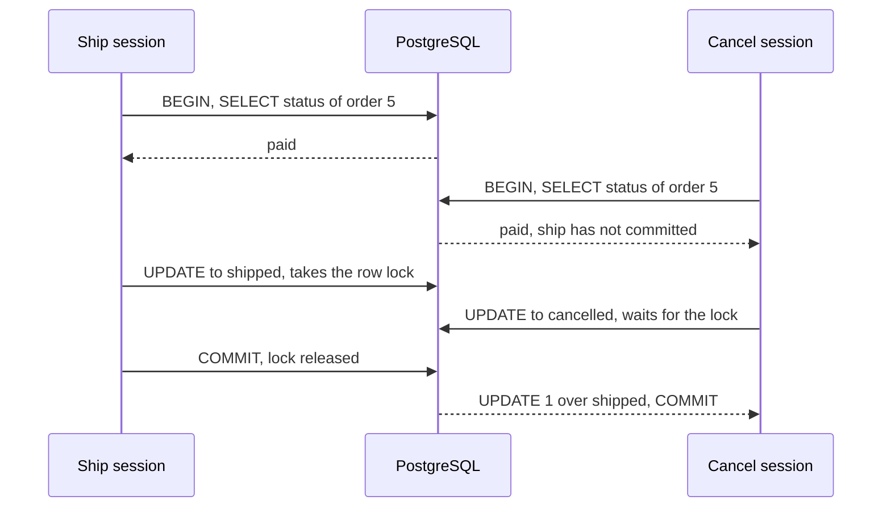

## Bạn cần biết trước

- [[foundation.l1.transaction-intro]] — bạn biết `BEGIN` mở một giao dịch, còn `COMMIT` giữ lại các thay đổi của nó và cho người khác thấy chúng.
- [[backend.l1.saving-changes]] — bạn biết `SaveChangesAsync` gửi mọi thay đổi đang chờ trong một giao dịch.
- [[backend.l2.role-based-access]] — bạn biết chỉ token có role `staff` mới qua được endpoint ship.
- [[backend.l2.problem-types]] — bạn biết hủy một đơn đã ship sẽ nhận `409` với `type` kết thúc bằng `already-shipped`.

## Tình huống

Đơn 5 đang `paid`. Một nhân viên ship đơn này, và ngay trong giây đó khách của đơn bấm hủy. Hai request chạy cùng các bước: nạp đơn, để `Ship()` hoặc `Cancel()` kiểm trạng thái, rồi lưu. Script `scripts/backend/lost-update.sh` phát lại đúng những lệnh đọc và ghi mà hai request sẽ gửi nếu không có gì bảo vệ dòng đó.

Trong script, ship commit trước. Lệnh hủy sau đó cũng thành công, và đơn 5 kết thúc ở `cancelled`. Giá như lệnh hủy đến trễ một giây, nó đã nhận `409` với `already-shipped`. Mỗi request được phát lại đều chạy trong một giao dịch, vậy vì sao cả hai đều đọc thấy `paid`, và vì sao lần ghi thứ hai xóa mất lần ghi đầu?

## Khái niệm cốt lõi

- **isolation level** (thiết lập quyết định một giao dịch thấy gì từ thay đổi của các giao dịch khác khi nó đang chạy) — thiết lập quyết định một giao dịch thấy được gì từ những thay đổi mà các giao dịch khác làm trong lúc nó đang chạy.
- Read Committed — isolation level mặc định của PostgreSQL: mỗi câu lệnh chỉ thấy những dòng đã commit trước khi chính câu lệnh đó bắt đầu.
- **lost update** (hai giao dịch cùng đọc một giá trị rồi cùng ghi, lần ghi sau lặng lẽ xóa mất lần ghi trước) — hai giao dịch cùng đọc một giá trị rồi cùng ghi, nên lần ghi sau lặng lẽ xóa mất lần ghi trước.
- Repeatable Read — một mức chặt hơn: mọi câu lệnh trong giao dịch thấy database như lúc truy vấn đầu tiên của giao dịch chạy.
- Lỗi serialization — lỗi có mã (SQLSTATE) `40001` mà PostgreSQL trả về thay vì để một giao dịch Repeatable Read ghi đè lên một thay đổi mới hơn.

## Cơ chế hoạt động



Script đóng vai mỗi request bằng một database session: một kết nối đang mở tới PostgreSQL để gửi SQL. Trong tình huống trên, cả hai session chạy dưới Read Committed. Mỗi `SELECT` thấy những gì đã commit lúc chính `SELECT` đó bắt đầu. Cả hai đều chạy trước khi ship commit, nên cả hai thấy `paid`, và hai request làm y như vậy sẽ đều qua được bước kiểm trạng thái.

`UPDATE` của ship lấy khóa dòng trên đơn 5. `UPDATE` của lệnh hủy phải chờ khóa đó. Khi ship commit, `UPDATE` của lệnh hủy chạy tiếp trên phiên bản mới nhất của dòng. Trong script, `WHERE` của nó chỉ nêu `id = 5`, vẫn khớp, nên nó ghi `cancelled` đè lên `shipped`. Đó là một lost update.

Không giao dịch nào thất bại: giao dịch nào cũng trọn vẹn, vậy mà một thay đổi vẫn biến mất. Giao dịch giữ trọn các lần ghi của chính nó, còn isolation level quyết định nó thấy gì từ thay đổi của những bên khác.

Khác với các session trong script, request thật thậm chí không đọc bên trong giao dịch của bước lưu. `FindAsync` chạy trước, như một câu lệnh riêng. Sau đó `SaveChangesAsync` mới mở giao dịch của riêng nó dưới Read Committed, vì code không yêu cầu mức nào khác. Đặt mức chặt hơn cho riêng bước lưu thì không bao được bước đọc. Muốn cả hai chung một mức, một lựa chọn là cho code gọi `BeginTransactionAsync` trên thuộc tính `Database` của DbContext mà repository bọc, truyền mức vào, trước bước đọc, rồi commit sau bước lưu.

Dưới Repeatable Read, bước đọc và bước ghi dùng chung một cái nhìn về database. Khi `UPDATE` của lệnh hủy gặp một dòng đã đổi sau thời điểm lấy cái nhìn đó, PostgreSQL từ chối nó bằng lỗi serialization. Đơn vẫn ở `shipped`. Ứng dụng phải bắt lỗi đó và chạy lại cả giao dịch. Lần này bước đọc thấy `shipped`, và `Cancel()` từ chối.

## Trong hệ thống Đơn Hàng

Hai method trong `OrderService` ở stage-2 đều đọc, kiểm trong C#, rồi lưu:

```csharp file=DonHang.Domain/OrderService.cs tag=stage-2 lines=40-61
    public async Task<Order> CancelOrderAsync(int orderId)
    {
        var order = await repository.FindAsync(orderId)
            ?? throw new KeyNotFoundException($"order {orderId} not found");

        order.Cancel();
        notifier.Send(order, "order cancelled");
        await repository.SaveChangesAsync();
        return order;
    }

    // lesson: design.l2.status-changes-through-methods
    public async Task<Order> ShipOrderAsync(int orderId)
    {
        var order = await repository.FindAsync(orderId)
            ?? throw new KeyNotFoundException($"order {orderId} not found");

        order.Ship();
        notifier.Send(order, "order shipped");
        await repository.SaveChangesAsync();
        return order;
    }
```

Hãy nhìn vào khoảng hở giữa `FindAsync` và `SaveChangesAsync`. `Cancel()` và `Ship()` kiểm trạng thái mà `FindAsync` đã đọc, và không có gì đọc lại nó trước khi lưu. Đọc lại ngay trước khi lưu cũng không bịt được khoảng hở: request kia vẫn có thể commit giữa lần đọc lại và lần ghi.

Ở stage-2, các endpoint thật không mất lần cập nhật này: `Order` có một cơ chế bảo vệ, chủ đề của bài kế tiếp, khiến lần lưu thứ hai thất bại. Các script bỏ cơ chế đó ra. Chúng dùng hai session `psql` thường (`psql` là client dòng lệnh của PostgreSQL), để bạn thấy riêng PostgreSQL xử lý chuỗi lệnh này ra sao:

```bash file=scripts/backend/lost-update.sh tag=stage-2 lines=20-41
# lesson: backend.l2.transactions-in-practice
# Each session reads, waits, then writes — like a request that loads the
# order, checks its status in C#, and saves. `\! sleep` pauses between steps.
session > "$ship" 2>&1 <<'SQL' &
BEGIN;
SHOW transaction_isolation;
SELECT status FROM orders WHERE id = 5;
\! sleep 1
UPDATE orders SET status = 'shipped' WHERE id = 5;
\! sleep 2
COMMIT;
SQL
sleep 0.5
session > "$cancel" 2>&1 <<'SQL'
BEGIN;
SHOW transaction_isolation;
SELECT status FROM orders WHERE id = 5;
\! sleep 1
\echo '-- this UPDATE waits for the row lock the ship session holds'
UPDATE orders SET status = 'cancelled' WHERE id = 5;
COMMIT;
SQL
```

```text output=true
== ship session (started first)
...
 paid
...
UPDATE orders SET status = 'shipped' WHERE id = 5;
UPDATE 1
COMMIT;
COMMIT
== cancel session (started 0.5 s later)
...
 paid
(1 row)

-- this UPDATE waits for the row lock the ship session holds
UPDATE orders SET status = 'cancelled' WHERE id = 5;
UPDATE 1
COMMIT;
COMMIT
== order 5 afterwards
...
  5 | cancelled
(1 row)
```

Session ship chạy nền, còn session hủy bắt đầu sau nửa giây. `SHOW transaction_isolation` in `read committed` ở cả hai. Cả hai session đều đọc thấy `paid`, cả hai lệnh cập nhật đều báo `UPDATE 1` (một dòng đã đổi), và đơn 5 kết thúc ở `cancelled`. Script đặt đơn 5 về lại `paid` khi chạy xong.

## Người mới hay nghĩ rằng…

- **"Vì `SaveChangesAsync` dùng giao dịch, hai request không thể ghi đè thay đổi của nhau."** → Thực ra giao dịch chỉ làm cho một lần lưu thành trọn vẹn hoặc không có gì, nó không ngăn một giao dịch thứ hai ghi vào cùng dòng sau khi giao dịch đầu commit. Bạn sẽ nhận ra khi `lost-update.sh` kết thúc với đơn 5 ở `cancelled` dù cả hai session đều đã commit.
- **"Dưới isolation level mặc định của PostgreSQL, giao dịch thấy database như lúc giao dịch bắt đầu."** → Thực ra, dưới Read Committed, mỗi câu lệnh thấy những gì đã commit trước khi chính câu lệnh đó bắt đầu, nên hai lần đọc trong cùng một giao dịch có thể khác nhau. Bạn sẽ nhận ra khi cùng một `SELECT`, chạy hai lần trong một khối `BEGIN`, trả về hai trạng thái khác nhau vì một session khác đã commit thay đổi trên dòng đó giữa hai lần chạy.
- **"Nâng isolation level là sửa được chuyện ghi đồng thời mà không cần đổi code nào khác."** → Thực ra bước đọc phải chuyển vào cùng giao dịch với bước lưu, còn lỗi serialization phải được bắt và cả giao dịch phải chạy lại. Bạn sẽ nhận ra khi một lần lưu với mức chặt hơn vẫn làm mất cập nhật, hoặc khi request thất bại với `40001` mà không chỗ nào xử lý.

## Thử ngay (3 phút)

1. Khi hệ thống ví dụ đang chạy (`scripts/up.sh`), hãy đoán trước đơn 5 sẽ kết thúc ra sao khi session hủy dùng Repeatable Read, rồi chạy `scripts/backend/repeatable-read-conflict.sh` từ thư mục gốc của repo ví dụ.
2. Đọc các dòng của session hủy sau lệnh `UPDATE` của nó, và truy vấn cuối cùng.

Kết quả mong đợi: session hủy hiện `repeatable read`, đọc thấy `paid`, rồi `UPDATE` của nó in `ERROR:  could not serialize access due to concurrent update` và `SQLSTATE: 40001`, và sau đó đơn 5 là `shipped`. Script đặt đơn 5 về lại `paid` khi chạy xong.

## Liên hệ

- [[foundation.l1.transaction-intro]] — bài tiên quyết: khối lệnh trọn vẹn hoặc không có gì, tự nó không ngăn được lost update.
- [[backend.l2.skip-locked-claiming]] — cùng một khóa dòng: ở bài đó nó tách hai bộ gửi ra, ở đây nó chỉ bắt `UPDATE` thứ hai phải chờ.
- [[backend.l2.optimistic-concurrency]] — cách Đơn Hàng sửa đúng vấn đề này: lần lưu thứ hai thất bại thay vì ghi đè.

## Tóm tắt 5 dòng

1. Giao dịch giữ trọn các lần ghi của chính nó, còn isolation level quyết định nó thấy gì từ thay đổi của giao dịch khác.
2. Dưới Read Committed, mức mặc định của PostgreSQL, mỗi câu lệnh thấy dòng đã commit trước khi nó bắt đầu, nên hai request đều đọc thấy `paid`.
3. `UPDATE` thứ hai chờ khóa dòng của `UPDATE` đầu, rồi ghi đè lên thay đổi đã commit: một lost update.
4. `FindAsync` và `SaveChangesAsync` chạy trong hai giao dịch riêng, trừ khi `Database.BeginTransactionAsync` bọc cả hai.
5. Dưới Repeatable Read, lần ghi thứ hai thất bại với `40001`, và ứng dụng phải bắt lỗi đó rồi chạy lại.
