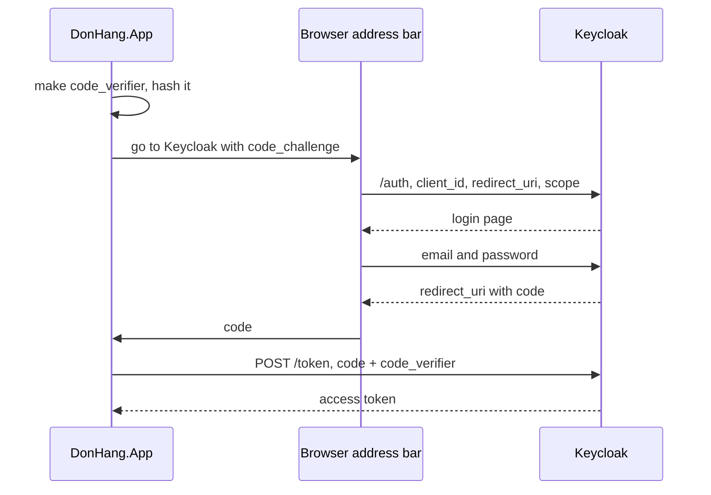

## Before you start

- [[backend.l2.oauth2-roles]] — you know that Keycloak, the authorization server, gives `DonHang.App` an access token after you type your password on Keycloak's page. This lesson shows the exact steps of that hand-over.

## The situation

`DonHang.App` at stage-2 runs in your browser, and every visitor's browser downloads all of its code. After you sign in at Keycloak, the browser comes back to the app at an address on port 8081. Anything placed in that address shows in the address bar and can end up in the browser's history. The app also has no password of its own to prove to Keycloak that it is the real `donhang-app`: whatever it holds, every visitor can read. So how does Keycloak get an access token to the right app, through a browser, without the token appearing in the address bar?

## Core concepts

- **authorization code flow** — the OAuth 2.0 way of getting a token in two trips: the browser brings back a short-lived code, and the app then trades that code for tokens in a direct request.
- authorization code — the short-lived, single-use value Keycloak puts into the address it sends the browser back to; it is not a token and does not open the API.
- redirect URI — the address of the app that Keycloak sends the browser back to, with a redirect: a response telling the browser to open another address, which the browser then follows; for `donhang-app` it is the app's `/auth/callback` page.
- client secret — a password a client uses to prove to the authorization server who it is; `donhang-app` has none, because its code is public.
- **PKCE** — a check that whoever exchanges an authorization code also holds a random secret, the `code_verifier`, that the app created at the start of the flow.
- **scope (OAuth)** — a name the client asks for when it starts the flow, limiting what the tokens may be used for; `DonHang.App` asks for `openid`, a scope the next lesson explains.

## How it works



In the situation above, the app first creates a random string, the `code_verifier`, and keeps it to itself. It hashes it with SHA-256, a standard one-way hash, and puts only the hash, the `code_challenge`, into the address it sends the browser to.

That address is Keycloak's authorization endpoint (`/auth`). It also carries the app's `client_id`, its `redirect_uri` and the scopes it asks for. You sign in on Keycloak's page, and Keycloak sends the browser back to the redirect URI with a code in the address. Keycloak redirects only to redirect URIs registered for the client, so the code never goes to a site `donhang-app` did not register.

The code is not the token. The app sends it in a direct `POST` to Keycloak's token endpoint (`/token`), together with the `code_verifier`. The tokens come back in the body of that response, which never enters the address bar or the history.

Keycloak hashes the `code_verifier` it receives and compares the result with the `code_challenge` from the first step. Only if they match does it issue tokens.

The code, though, sits in the address bar and the history on its way back, where other people or programs on the machine may see it. Someone who copies it there has the code but not the verifier, because the verifier never left the app. They may also see the `code_challenge` in the first address, but a hash cannot be turned back into the verifier, so the code alone is useless.

A client secret would not help here. Any secret compiled into the app is downloaded by every visitor, so it proves nothing. PKCE replaces it with a new secret for each sign-in.

## In the Đơn Hàng system

`keycloak/donhang-realm.json` registers `donhang-app` as a public client, one with no client secret. Its `redirectUris` list holds a single address, the app's `/auth/callback` page on port 8081, and its attribute `pkce.code.challenge.method` is `S256`, so every sign-in must use PKCE with SHA-256.

`scripts/backend/oauth-code-flow.sh` plays both parts, the browser's and the app's, with `curl`, a command-line program that sends HTTP requests and prints the answers. This is the browser's part, with the PKCE values made first:

```bash file=scripts/backend/oauth-code-flow.sh tag=stage-2 lines=10-32
# lesson: backend.l2.authorization-code-flow
# PKCE: the app keeps a random code_verifier to itself and puts only its
# SHA-256 hash, the code_challenge, into the browser's address bar.
new_verifier() { openssl rand -hex 32; }
challenge_of() {
  printf %s "$1" | openssl dgst -sha256 -binary | openssl base64 -A | tr '+/' '-_' | tr -d '='
}

# The browser's part: open Keycloak's authorization endpoint, fill in the
# customer's email and password on Keycloak's login form, then stop at the
# redirect back to the app instead of following it. Prints that redirect.
log_in() {
  local jar form
  jar=$(mktemp)
  form=$(curl -sS -c "$jar" -b "$jar" -G "$keycloak/auth" \
      -d client_id=donhang-app -d response_type=code -d scope=openid \
      --data-urlencode "redirect_uri=$redirect_uri" \
      -d "code_challenge=$1" -d code_challenge_method=S256 \
    | sed -nE 's/.*id="kc-form-login".* action="([^"]*)".*/\1/p' | sed 's/&amp;/\&/g')
  curl -sS -c "$jar" -b "$jar" -o /dev/null -w '%{redirect_url}' \
    --data-urlencode username=anh.tran@example.com -d password=donhang-dev-password "$form"
  rm -f "$jar"
}
```

`challenge_of` is the hash: SHA-256, then turned into letters, digits, `-` and `_`, characters that can sit in an address.

`log_in` first fetches Keycloak's login page with every parameter named above, and `sed` pulls out the address the login form submits to. `response_type=code` asks for a code, not a token. The last `curl` submits the form and prints where Keycloak redirects, without following it. `$keycloak` and `$redirect_uri` are set at the top of the script.

Now the app's part, where `grant_type=authorization_code` tells Keycloak which flow the exchange belongs to, and what the whole script prints:

```bash file=scripts/backend/oauth-code-flow.sh tag=stage-2 lines=35-42
# lesson: backend.l2.authorization-code-flow
# The app's part: a direct POST to the token endpoint with the code and the
# verifier. Keycloak hashes the verifier and compares it with the challenge.
exchange() {
  curl -sS "$keycloak/token" \
    -d grant_type=authorization_code -d client_id=donhang-app \
    --data-urlencode "redirect_uri=$redirect_uri" -d "code=$1" -d "code_verifier=$2"
}
```

```text output=true
== 1. the browser logs in at Keycloak and is sent back with a code
redirected to: http://localhost:8081/auth/callback?session_state=...&iss=http%3A%2F%2Flocalhost%3A8180%2Frealms%2Fdonhang&code=...

== 2. the app exchanges that code and its code_verifier for tokens
{
  "token_type": "Bearer",
  "expires_in": 300,
  "scope": "email openid profile",
  "access_token": "eyJhbGciOiJSUzI1NiIs..."
}

== 3. a code stolen on its way back, exchanged without the app's verifier
{"error":"invalid_grant","error_description":"PKCE verification failed: Code mismatch"}

== 4. an authorization request with no code_challenge
redirected to: http://localhost:8081/auth/callback?error=invalid_request&error_description=Missing+parameter%3A+code_challenge_method&iss=http%3A%2F%2Flocalhost%3A8180%2Frealms%2Fdonhang

== 5. an authorization request with a redirect_uri donhang-app never registered
Keycloak shows an error page instead of redirecting: Invalid parameter: redirect_uri
  -> 400
```

Step 1 shows the code in the redirect address; ignore `session_state` and `iss`, only `code` matters here. Step 2 shows the token only in the response to the `POST`. The script cuts the access token to its first 20 characters; the recorded output above also replaces the code and `session_state` with `...`, because they change on every run. Your own run prints the full code.

`scope` lists more than `openid`: Keycloak adds the default client scopes that `donhang-realm.json` links to `donhang-app`, and `email` and `profile` are the ones that show up here. Step 3 is a second sign-in whose code is exchanged with a different verifier, as a thief would have to, and Keycloak refuses it. Steps 4 and 5 show Keycloak refusing a request without PKCE and a redirect URI nobody registered.

## Beginners often think…

- **"The authorization code in the redirect URL is the access token."** → Actually the code is only a single-use ticket that the app must trade, with its verifier, for tokens. It opens nothing at the API. You notice this when step 1 of the script shows the code in the address, and a token appears only in step 2's response.
- **"PKCE encrypts the tokens so nobody else can read them."** → Actually PKCE hides nothing: it does not encrypt, that is, scramble data so only a key holder can read it, and the tokens travel as readable JSON exactly as before. It only proves that whoever exchanges the code started the sign-in. You notice this when the token response in step 2 is plain JSON, and a wrong verifier in step 3 changes whether a token is issued at all.
- **"A client secret compiled into the app's code is safe, because users do not read compiled code."** → Actually the browser downloads the app's code to every visitor, and anything in it can be read from there. You notice this when `donhang-app` is registered as a public client with no secret: Keycloak relies on PKCE instead.

## Try it (3 minutes)

1. With the example system running (`scripts/up.sh`), run `scripts/backend/oauth-code-flow.sh`. It runs inside the example system's lab container, so it needs nothing else installed on your machine.
2. Compare step 1 with step 2: where does the code appear, and where does the token appear? Then read step 3.

Expected result: step 1 prints a redirect address ending in `code=` and a long random value, step 2 prints `"token_type": "Bearer"` with a shortened `access_token`, and step 3 prints `PKCE verification failed: Code mismatch`.

## Connections

- [[backend.l2.oauth2-roles]] — this lesson opens the arrow from Keycloak to the app in that lesson's diagram.
- [[backend.l2.openid-connect-id-token]] — what the `openid` scope adds to the token response.
- [[frontend.l1.logging-in-from-the-app]] — the stage-1 login it replaces: there the app sent the password, here it sends only a code and a verifier.

## Five-line summary

1. The authorization code flow gets tokens in two trips: a code through the browser, then tokens through a direct `POST`.
2. The browser comes back to a registered redirect URI with a short-lived code, which is not a token.
3. The app trades the code at the token endpoint, so the token never appears in the address bar.
4. A browser app cannot keep a client secret, so PKCE sends a hash of a random verifier first and the verifier itself later.
5. Keycloak issues tokens only if the verifier matches the hash, so a stolen code is useless without it.
