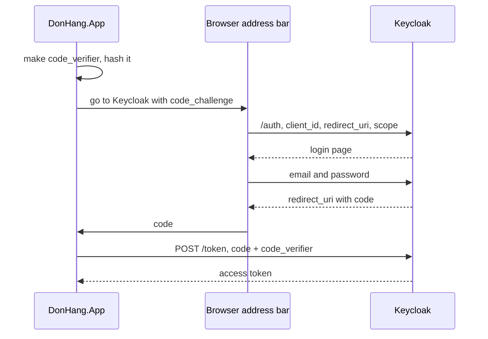

## Bạn cần biết trước

- [[backend.l2.oauth2-roles]] — bạn biết Keycloak, authorization server, đưa cho `DonHang.App` một access token sau khi bạn gõ mật khẩu trên trang của Keycloak. Bài này chỉ ra từng bước của lần trao token đó.

## Tình huống

Ở stage-2, `DonHang.App` chạy trong trình duyệt, và trình duyệt của mọi người truy cập đều tải toàn bộ code của nó về. Đăng nhập ở Keycloak xong, trình duyệt quay về ứng dụng ở một địa chỉ trên cổng 8081. Thứ gì nằm trong địa chỉ đó cũng hiện trên thanh địa chỉ và có thể lưu lại trong lịch sử trình duyệt. Ứng dụng cũng không có mật khẩu riêng nào để chứng minh với Keycloak rằng nó đúng là `donhang-app`: nó giữ gì thì mọi người truy cập đều đọc được. Vậy Keycloak đưa access token tới đúng ứng dụng, qua trình duyệt, mà token không hiện trên thanh địa chỉ bằng cách nào?

## Khái niệm cốt lõi

- **authorization code flow** (luồng OAuth: trình duyệt nhận một code ngắn hạn, rồi ứng dụng đổi code đó lấy token) — cách của OAuth 2.0 để lấy token qua hai chặng: trình duyệt mang về một code sống ngắn, rồi ứng dụng đổi code đó lấy token bằng một request trực tiếp.
- authorization code — giá trị sống ngắn, chỉ dùng một lần, mà Keycloak đặt vào địa chỉ nó đưa trình duyệt quay về. Nó không phải token và không mở được gì ở API.
- redirect URI — địa chỉ của ứng dụng mà Keycloak đưa trình duyệt quay về, bằng một redirect: response bảo trình duyệt mở một địa chỉ khác, và trình duyệt làm theo. Với `donhang-app`, đó là trang `/auth/callback` của ứng dụng.
- client secret — mật khẩu client dùng để chứng minh với authorization server nó là ai. `donhang-app` không có, vì code của nó là công khai.
- **PKCE** (cơ chế buộc ai đổi authorization code phải nộp chuỗi bí mật mà ứng dụng tạo lúc bắt đầu luồng) — bước kiểm rằng ai đổi authorization code cũng phải giữ một bí mật ngẫu nhiên, `code_verifier`, do ứng dụng tạo lúc bắt đầu luồng.
- **scope (OAuth)** (tên client xin khi bắt đầu luồng OAuth, giới hạn những gì token được dùng để làm) — cái tên client nêu ra lúc mở đầu luồng để khoanh vùng việc token được phép làm. `DonHang.App` xin `openid`, một scope mà bài kế tiếp sẽ giải thích.

## Cơ chế hoạt động



Trong tình huống trên, trước hết ứng dụng tạo một chuỗi ngẫu nhiên, `code_verifier`, và giữ riêng cho mình. Nó hash chuỗi đó bằng SHA-256, một hàm hash một chiều chuẩn, rồi chỉ đặt kết quả hash, `code_challenge`, vào địa chỉ nó chuyển trình duyệt tới.

Địa chỉ đó là authorization endpoint của Keycloak (`/auth`). Nó còn mang `client_id` của ứng dụng, `redirect_uri` và các scope ứng dụng xin. Bạn đăng nhập trên trang của Keycloak, và Keycloak đưa trình duyệt về redirect URI kèm một code trong địa chỉ. Keycloak chỉ redirect tới redirect URI đã đăng ký cho client, nên code không bao giờ tới một trang mà `donhang-app` chưa đăng ký.

Code không phải token. Ứng dụng gửi nó trong một `POST` trực tiếp tới token endpoint của Keycloak (`/token`), kèm `code_verifier`. Token quay về trong body của response đó, thứ không bao giờ lên thanh địa chỉ hay vào lịch sử.

Keycloak hash `code_verifier` nó nhận được rồi so kết quả với `code_challenge` từ bước đầu. Chỉ khi khớp nó mới cấp token.

Tuy vậy, trên đường quay về, code nằm trên thanh địa chỉ và trong lịch sử, nơi người khác hoặc chương trình khác trên máy có thể thấy. Ai chép được nó ở đó thì có code nhưng không có verifier, vì verifier chưa từng rời ứng dụng. Họ cũng có thể thấy `code_challenge` trong địa chỉ đầu tiên, nhưng hash không thể biến ngược thành verifier, nên riêng code thì vô dụng.

Client secret không giúp được gì ở đây. Secret nào biên dịch vào ứng dụng cũng được mọi người truy cập tải về, nên chẳng chứng minh được gì. PKCE thay nó bằng một bí mật mới cho mỗi lần đăng nhập.

## Trong hệ thống Đơn Hàng

`keycloak/donhang-realm.json` đăng ký `donhang-app` là public client, tức client không có client secret. Danh sách `redirectUris` của nó chỉ có một địa chỉ, trang `/auth/callback` của ứng dụng trên cổng 8081, và attribute `pkce.code.challenge.method` của nó là `S256`, nên lần đăng nhập nào cũng phải dùng PKCE với SHA-256.

`scripts/backend/oauth-code-flow.sh` đóng cả hai vai, trình duyệt và ứng dụng, bằng `curl`, một chương trình dòng lệnh gửi HTTP request rồi in câu trả lời. Đây là phần của trình duyệt, với các giá trị PKCE được tạo trước:

```bash file=scripts/backend/oauth-code-flow.sh tag=stage-2 lines=10-32
# lesson: backend.l2.authorization-code-flow
# PKCE: the app keeps a random code_verifier to itself and puts only its
# SHA-256 hash, the code_challenge, into the browser's address bar.
new_verifier() { openssl rand -hex 32; }
challenge_of() {
  printf %s "$1" | openssl dgst -sha256 -binary | openssl base64 -A | tr '+/' '-_' | tr -d '='
}

# The browser's part: open Keycloak's authorization endpoint, fill in the
# customer's email and password on Keycloak's login form, then stop at the
# redirect back to the app instead of following it. Prints that redirect.
log_in() {
  local jar form
  jar=$(mktemp)
  form=$(curl -sS -c "$jar" -b "$jar" -G "$keycloak/auth" \
      -d client_id=donhang-app -d response_type=code -d scope=openid \
      --data-urlencode "redirect_uri=$redirect_uri" \
      -d "code_challenge=$1" -d code_challenge_method=S256 \
    | sed -nE 's/.*id="kc-form-login".* action="([^"]*)".*/\1/p' | sed 's/&amp;/\&/g')
  curl -sS -c "$jar" -b "$jar" -o /dev/null -w '%{redirect_url}' \
    --data-urlencode username=anh.tran@example.com -d password=donhang-dev-password "$form"
  rm -f "$jar"
}
```

`challenge_of` là phần hash: SHA-256, rồi đổi thành chữ cái, chữ số, `-` và `_`, những ký tự nằm được trong một địa chỉ.

`log_in` trước hết lấy trang đăng nhập của Keycloak với mọi tham số kể trên, và `sed` rút ra địa chỉ mà form đăng nhập gửi tới. `response_type=code` xin một code, không phải token. Lệnh `curl` cuối gửi form rồi in ra nơi Keycloak redirect tới, mà không đi theo. `$keycloak` và `$redirect_uri` được đặt ở đầu script.

Giờ tới phần của ứng dụng, trong đó `grant_type=authorization_code` cho Keycloak biết lần đổi này thuộc luồng nào, và những gì cả script in ra:

```bash file=scripts/backend/oauth-code-flow.sh tag=stage-2 lines=35-42
# lesson: backend.l2.authorization-code-flow
# The app's part: a direct POST to the token endpoint with the code and the
# verifier. Keycloak hashes the verifier and compares it with the challenge.
exchange() {
  curl -sS "$keycloak/token" \
    -d grant_type=authorization_code -d client_id=donhang-app \
    --data-urlencode "redirect_uri=$redirect_uri" -d "code=$1" -d "code_verifier=$2"
}
```

```text output=true
== 1. the browser logs in at Keycloak and is sent back with a code
redirected to: http://localhost:8081/auth/callback?session_state=...&iss=http%3A%2F%2Flocalhost%3A8180%2Frealms%2Fdonhang&code=...

== 2. the app exchanges that code and its code_verifier for tokens
{
  "token_type": "Bearer",
  "expires_in": 300,
  "scope": "email openid profile",
  "access_token": "eyJhbGciOiJSUzI1NiIs..."
}

== 3. a code stolen on its way back, exchanged without the app's verifier
{"error":"invalid_grant","error_description":"PKCE verification failed: Code mismatch"}

== 4. an authorization request with no code_challenge
redirected to: http://localhost:8081/auth/callback?error=invalid_request&error_description=Missing+parameter%3A+code_challenge_method&iss=http%3A%2F%2Flocalhost%3A8180%2Frealms%2Fdonhang

== 5. an authorization request with a redirect_uri donhang-app never registered
Keycloak shows an error page instead of redirecting: Invalid parameter: redirect_uri
  -> 400
```

Bước 1 cho thấy code trong địa chỉ redirect. Bỏ qua `session_state` và `iss`, ở đây chỉ `code` là đáng kể. Bước 2 cho thấy token chỉ nằm trong response của `POST`. Script cắt access token còn 20 ký tự đầu. Output ghi lại ở trên còn thay code và `session_state` bằng `...`, vì chúng đổi sau mỗi lần chạy. Khi bạn tự chạy, code được in đầy đủ.

`scope` liệt kê nhiều hơn `openid`: Keycloak thêm các default client scope mà `donhang-realm.json` gắn cho `donhang-app`, và `email`, `profile` là hai cái hiện ra ở đây. Bước 3 là một lần đăng nhập thứ hai, code của nó được đổi với một verifier khác, đúng như kẻ trộm buộc phải làm, và Keycloak từ chối. Bước 4 và 5 cho thấy Keycloak từ chối request thiếu PKCE và redirect URI chưa ai đăng ký.

## Người mới hay nghĩ rằng…

- **"Authorization code trong URL redirect chính là access token."** → Thực ra code chỉ là một vé dùng một lần mà ứng dụng phải đổi, kèm verifier, để lấy token. Nó không mở được gì ở API. Bạn sẽ nhận ra khi bước 1 của script cho thấy code trong địa chỉ, còn token chỉ xuất hiện trong response ở bước 2.
- **"PKCE mã hóa token để không ai khác đọc được."** → Thực ra PKCE không giấu gì cả: nó không mã hóa, tức không xáo trộn dữ liệu để chỉ người giữ khóa đọc được, và token vẫn đi dưới dạng JSON đọc được y như trước. Nó chỉ chứng minh rằng ai đổi code cũng chính là ai đã bắt đầu đăng nhập. Bạn sẽ nhận ra khi response chứa token ở bước 2 là JSON thường, còn một verifier sai ở bước 3 quyết định token có được cấp hay không.
- **"Client secret biên dịch vào code ứng dụng thì an toàn, vì người dùng không đọc code đã biên dịch."** → Thực ra trình duyệt tải code ứng dụng về cho mọi người truy cập, và thứ gì trong đó cũng đọc được từ đó. Bạn sẽ nhận ra khi thấy `donhang-app` được đăng ký là public client không có secret: Keycloak dựa vào PKCE thay thế.

## Thử ngay (3 phút)

1. Khi hệ thống ví dụ đang chạy (`scripts/up.sh`), chạy `scripts/backend/oauth-code-flow.sh`. Script chạy bên trong lab container của hệ thống ví dụ, nên máy bạn không cần cài thêm gì.
2. So bước 1 với bước 2: code xuất hiện ở đâu, token xuất hiện ở đâu? Rồi đọc bước 3.

Kết quả mong đợi: bước 1 in một địa chỉ redirect kết thúc bằng `code=` và một giá trị ngẫu nhiên dài, bước 2 in `"token_type": "Bearer"` kèm `access_token` đã bị cắt ngắn, và bước 3 in `PKCE verification failed: Code mismatch`.

## Liên hệ

- [[backend.l2.oauth2-roles]] — bài này mở mũi tên từ Keycloak tới ứng dụng trong sơ đồ của bài đó.
- [[backend.l2.openid-connect-id-token]] — scope `openid` thêm gì vào response chứa token.
- [[frontend.l1.logging-in-from-the-app]] — cách đăng nhập của stage-1 mà luồng này thay thế: ở đó ứng dụng gửi mật khẩu, ở đây nó chỉ gửi một code và một verifier.

## Tóm tắt 5 dòng

1. Authorization code flow lấy token qua hai chặng: một code đi qua trình duyệt, rồi token đi qua một `POST` trực tiếp.
2. Trình duyệt quay về một redirect URI đã đăng ký với một code sống ngắn, và code đó không phải token.
3. Ứng dụng đổi code ở token endpoint, nên token không bao giờ hiện trên thanh địa chỉ.
4. Ứng dụng chạy trong trình duyệt không giữ được client secret, nên PKCE gửi hash của một verifier ngẫu nhiên trước và chính verifier sau.
5. Keycloak chỉ cấp token khi verifier khớp với hash, nên code bị đánh cắp mà thiếu verifier thì vô dụng.
