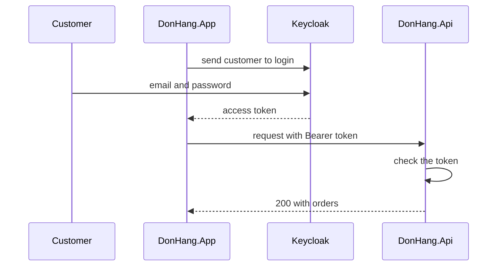

## Before you start

- [[backend.l1.issuing-a-jwt]] — you know how the stage-1 API signed a JWT for a customer who logged in. At stage-2 the API stops doing that, and this lesson explains who does it instead.
- [[backend.l1.hashing-passwords]] — you know the stage-1 API kept a password hash for each customer and checked the typed password against it. That job moves out of the API too.

## The situation

At stage-1, the login form of `DonHang.App` sent your email and password to `POST /api/v1/auth/login`, and the API compared them with its stored hash. So both the app and the API saw your password.

Now you start stage-2 with `scripts/up.sh`, open the app in your browser and choose to sign in. The browser leaves the app for a Keycloak login page at `localhost:8180`, port 8180 on your own machine, which asks for your email and password. After you sign in you are back in the app, and your orders load. The API's login endpoint is gone. How can the app read and place orders for you when neither it nor the API ever saw your password?

## Core concepts

- **OAuth 2.0** — a standard that lets an app get a token to call an API for a user, so the app does not need to hold that user's password; it names four roles that take part.
- resource owner — the person whose data is protected and who agrees to let an app use it; in Đơn Hàng, the customer.
- client — in OAuth, a narrower meaning than any program sending a request: the app that wants to call the API for the resource owner; in Đơn Hàng, `DonHang.App`, registered in Keycloak as `donhang-app`.
- **authorization server** — the server that checks who the user is (in Đơn Hàng, with their password) and then gives the client a token; in Đơn Hàng, Keycloak.
- **resource server** — the server that holds the protected data and serves it only to requests that carry a valid token; in Đơn Hàng, `DonHang.Api`.
- **access token** — the token the authorization server gives the client, which the client sends with each request to the resource server.

## How it works



In the situation above, you are the resource owner: the orders are yours. `DonHang.App` is the client, the program acting for you. Keycloak is the authorization server, and `DonHang.Api` is the resource server that holds the orders.

The app does not ask for your password. It sends your browser to Keycloak, and you type the password into Keycloak's own page. Keycloak checks it against the accounts it keeps, then hands the app an access token. The exact steps of that hand-over, and why the token never passes through the address bar, are the next lesson.

The app now does what it did at stage-1 with the token from the login endpoint: it puts the access token in the `Authorization` header of each request, written as the word `Bearer`, a space, then the token. For the app, only the place the token comes from has changed.

The API has lost two jobs and kept one. It no longer checks passwords, because it no longer has them, and it no longer signs tokens, because Keycloak does. It still checks the token on every request to an endpoint marked `[Authorize]`, the attribute that lets only callers with a valid token in. A request without a valid token still gets `401`, exactly as at stage-1.

The gain is that the password lives in one place. The app and the API could be buggy, logged or copied without that password ever being in their memory, their logs or their database.

## In the Đơn Hàng system

Keycloak runs as one more container, declared in `docker-compose.yml`. The comment line right after `# lesson:` states its role:

```yaml file=docker-compose.yml tag=stage-2 lines=188-196
  # lesson: backend.l2.oauth2-roles
  # The authorization server: customers and staff type their passwords here,
  # never into DonHang.App or DonHang.Api. start-dev keeps its data inside the
  # container and imports the realm file below the first time it starts.
  keycloak:
    image: quay.io/keycloak/keycloak:26.7.4
    container_name: donhang-keycloak
    hostname: keycloak
    command: ["start-dev", "--import-realm"]
```

The realm file is `keycloak/donhang-realm.json`; a realm is Keycloak's name for one separate set of accounts and registered clients, and Đơn Hàng has one. Keycloak gives tokens only to clients it knows, so the file registers the client `donhang-app`. It also lists the accounts that can sign in, each with the same fake development password. Those accounts, with their passwords, now live in Keycloak. The `customers` table lost its `password_hash` column at stage-2, through a migration.

On the API side, `Program.cs` still calls `AddJwtBearer`, as at stage-1, but it no longer holds a signing key. It points at Keycloak instead:

```csharp file=DonHang.Api/Program.cs tag=stage-2 lines=34-45
// lesson: backend.l2.oauth2-roles
// lesson: backend.l2.openid-connect-id-token
// lesson: backend.l2.validating-provider-tokens
// Keycloak issues the tokens; the api only checks them. AddJwtBearer reads
// Keycloak's metadata and public keys once, then checks each token's
// signature, issuer, audience and expiry itself, without calling Keycloak.
var authority = builder.Configuration["Keycloak:Authority"]
    ?? throw new InvalidOperationException("Keycloak:Authority is not set");
builder.Services.AddAuthentication(JwtBearerDefaults.AuthenticationScheme)
    .AddJwtBearer(options =>
    {
        options.Authority = authority;
```

Read the first sentence of the comment: Keycloak issues the tokens, and the API only checks them. `Authority` is the address of the Đơn Hàng realm in Keycloak, read from configuration; the API refuses to start without it. Leave the rest of the comment for later: it is how the API checks a signature it could not create, which a later lesson in this module explains. `AuthController`, `JwtTokenService` and `PasswordHasher` from stage-1 are gone from the repository.

## Beginners often think…

- **"With OAuth, DonHang.App still takes my password; it just forwards it to Keycloak for me."** → Actually the app never shows a password field at all. It sends the browser to Keycloak, and you type the password on Keycloak's page, so the app only ever receives a token. You notice this when you sign in: the address bar leaves the app and shows `localhost:8180` until you are sent back.
- **"Once Keycloak handles login, the API does not need to check anything about the token it receives."** → Actually anyone can send the API a request with any string in the `Authorization` header. Keycloak is not in that request, so the API is the only one who can refuse a forged or expired token. You notice this when a request without a token, or with a broken one, gets `401` from the API.

## Try it (3 minutes)

1. With the example system running (`scripts/up.sh`), run `scripts/backend/auth-and-orders.sh`. It signs in as customer 1 at Keycloak, places an order with the token it got, reads it back, and then sends the same `POST` without a token. The script plays the customer: it sends the fake development password to Keycloak's login page, as your browser would, and never to the API.
2. Look at which program received the password: the line `sign in as customer 1, at Keycloak` is the only step that uses it. Every call to the API that needs a signed-in customer carries only the token.

Expected result: a line `got a token: eyJhbGciOiJSUzI1NiIs...`, then two lines showing the new order with `"customerId":1`, one after placing it and one after reading it back, and a last line that reads `401`.

## Connections

- [[backend.l1.issuing-a-jwt]] — the stage-1 job this lesson takes away from the API: signing tokens now belongs to the authorization server.
- [[backend.l1.hashing-passwords]] — the password hashes the API no longer keeps, because Keycloak holds the accounts.
- [[frontend.l1.logging-in-from-the-app]] — the same header one layer over: the app still sends `Authorization: Bearer`, only the token's source changed.
- [[backend.l2.authorization-code-flow]] — the next step: exactly how the app obtains the access token from Keycloak.
- [[backend.l2.validating-provider-tokens]] — how the resource server checks a token that someone else signed.

## Five-line summary

1. With OAuth 2.0 the app gets an access token to call the API for you, and never sees your password.
2. In Đơn Hàng, the customer is the resource owner, `DonHang.App` the client, Keycloak the authorization server, `DonHang.Api` the resource server.
3. You type your password only on Keycloak's login page; the app and the API never receive it.
4. The app sends the access token in `Authorization: Bearer`, the same header it used for the stage-1 token.
5. The API no longer signs tokens or checks passwords, but it still checks every token it receives.
