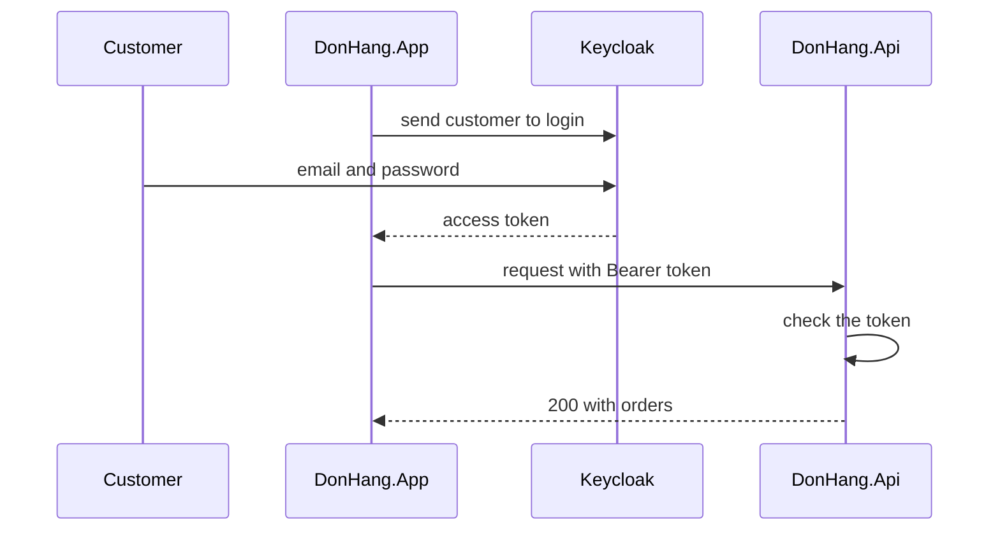

## Bạn cần biết trước

- [[backend.l1.issuing-a-jwt]] — bạn biết API ở stage-1 ký JWT cho khách vừa đăng nhập ra sao. Từ stage-2 API thôi làm việc đó, và bài này giải thích ai làm thay.
- [[backend.l1.hashing-passwords]] — bạn biết API ở stage-1 giữ password hash của từng khách và kiểm mật khẩu khách gõ với hash đó. Việc này cũng rời khỏi API.

## Tình huống

Ở stage-1, form đăng nhập của `DonHang.App` gửi email và mật khẩu tới `POST /api/v1/auth/login`, rồi API so chúng với hash đã lưu. Tức là cả ứng dụng lẫn API đều thấy mật khẩu của bạn.

Giờ bạn chạy stage-2 bằng `scripts/up.sh`, mở ứng dụng trong trình duyệt và chọn đăng nhập. Trình duyệt rời ứng dụng, sang một trang đăng nhập của Keycloak ở `localhost:8180`, tức cổng 8180 trên chính máy bạn, và trang đó hỏi email cùng mật khẩu. Đăng nhập xong, bạn quay lại ứng dụng và danh sách đơn hiện ra. Endpoint đăng nhập của API không còn nữa. Vậy làm sao ứng dụng đọc và đặt đơn thay bạn được, khi cả nó lẫn API chưa từng thấy mật khẩu?

## Khái niệm cốt lõi

- **OAuth 2.0** (chuẩn để một ứng dụng nhận token gọi API thay người dùng mà không cầm mật khẩu của họ) — chuẩn cho phép ứng dụng lấy token để gọi API thay một người dùng, nhờ vậy ứng dụng không cần giữ mật khẩu của người đó. Chuẩn này đặt tên cho bốn vai trò tham gia.
- resource owner — người có dữ liệu cần bảo vệ và là người đồng ý cho một ứng dụng dùng dữ liệu đó. Ở Đơn Hàng, đó là khách hàng.
- client — trong OAuth, nghĩa hẹp hơn "bất kỳ chương trình nào gửi request": đó là ứng dụng muốn gọi API thay resource owner. Ở Đơn Hàng, đó là `DonHang.App`, được đăng ký trong Keycloak với tên `donhang-app`.
- **authorization server** (server xác thực người dùng rồi cấp access token cho client, ở Đơn Hàng là Keycloak) — server kiểm người dùng là ai (ở Đơn Hàng là bằng mật khẩu) rồi đưa token cho client. Ở Đơn Hàng, đó là Keycloak.
- **resource server** (server giữ dữ liệu cần bảo vệ và nhận request kèm access token, ở Đơn Hàng là DonHang.Api) — server giữ dữ liệu cần bảo vệ và chỉ trả dữ liệu đó cho request có token hợp lệ. Ở Đơn Hàng, đó là `DonHang.Api`.
- **access token** (token authorization server cấp để client gửi kèm mỗi request tới API) — token mà authorization server đưa cho client, và client gửi nó kèm mỗi request tới resource server.

## Cơ chế hoạt động



Trong tình huống trên, bạn là resource owner: các đơn hàng là của bạn. `DonHang.App` là client, chương trình hành động thay bạn. Keycloak là authorization server, còn `DonHang.Api` là resource server giữ các đơn hàng.

Ứng dụng không hỏi mật khẩu của bạn. Nó chuyển trình duyệt sang Keycloak, và bạn gõ mật khẩu vào trang của chính Keycloak. Keycloak kiểm mật khẩu với các tài khoản nó giữ, rồi đưa cho ứng dụng một access token. Các bước cụ thể của lần trao token này, và vì sao token không bao giờ đi qua thanh địa chỉ, là nội dung bài kế tiếp.

Giờ ứng dụng làm đúng như ở stage-1 với token lấy từ endpoint đăng nhập: nó đặt access token vào header `Authorization` của mỗi request, viết là chữ `Bearer`, một dấu cách, rồi tới token. Với ứng dụng, chỉ nơi cấp token là thay đổi.

API mất hai việc và giữ lại một. Nó thôi kiểm mật khẩu, vì nó không còn giữ mật khẩu, và thôi ký token, vì Keycloak đã làm. Nó vẫn kiểm token ở mọi request tới endpoint có đánh dấu `[Authorize]`, attribute chỉ cho người gọi có token hợp lệ đi qua. Request không có token hợp lệ vẫn nhận `401`, y như ở stage-1.

Cái được là mật khẩu chỉ nằm ở một chỗ. Ứng dụng và API có bị lỗi, bị ghi log hay bị sao chép thì mật khẩu cũng chưa từng nằm trong bộ nhớ, log hay database của chúng.

## Trong hệ thống Đơn Hàng

Keycloak chạy như thêm một container nữa, khai báo trong `docker-compose.yml`. Dòng comment ngay sau `# lesson:` nói rõ vai trò của nó:

```yaml file=docker-compose.yml tag=stage-2 lines=188-196
  # lesson: backend.l2.oauth2-roles
  # The authorization server: customers and staff type their passwords here,
  # never into DonHang.App or DonHang.Api. start-dev keeps its data inside the
  # container and imports the realm file below the first time it starts.
  keycloak:
    image: quay.io/keycloak/keycloak:26.7.4
    container_name: donhang-keycloak
    hostname: keycloak
    command: ["start-dev", "--import-realm"]
```

File realm là `keycloak/donhang-realm.json`. Realm là cách Keycloak gọi một bộ tài khoản và client đã đăng ký tách riêng, và Đơn Hàng có một realm. Keycloak chỉ cấp token cho client nó biết, nên file này đăng ký client `donhang-app`. File cũng liệt kê các tài khoản được đăng nhập, tất cả dùng chung một mật khẩu giả cho môi trường phát triển. Các tài khoản đó, cùng mật khẩu của chúng, giờ nằm trong Keycloak. Bảng `customers` đã mất cột `password_hash` ở stage-2, qua một migration.

Phía API, `Program.cs` vẫn gọi `AddJwtBearer` như ở stage-1, nhưng không còn giữ khóa ký nào. Thay vào đó, nó trỏ tới Keycloak:

```csharp file=DonHang.Api/Program.cs tag=stage-2 lines=34-45
// lesson: backend.l2.oauth2-roles
// lesson: backend.l2.openid-connect-id-token
// lesson: backend.l2.validating-provider-tokens
// Keycloak issues the tokens; the api only checks them. AddJwtBearer reads
// Keycloak's metadata and public keys once, then checks each token's
// signature, issuer, audience and expiry itself, without calling Keycloak.
var authority = builder.Configuration["Keycloak:Authority"]
    ?? throw new InvalidOperationException("Keycloak:Authority is not set");
builder.Services.AddAuthentication(JwtBearerDefaults.AuthenticationScheme)
    .AddJwtBearer(options =>
    {
        options.Authority = authority;
```

Đọc câu đầu của comment: Keycloak cấp token, còn API chỉ kiểm. `Authority` là địa chỉ của realm Đơn Hàng trong Keycloak, đọc từ cấu hình, và API không chịu khởi động nếu thiếu nó. Phần còn lại của comment để sau: đó là cách API kiểm một chữ ký mà nó không tự tạo được, và một bài sau trong module này sẽ giải thích. `AuthController`, `JwtTokenService` và `PasswordHasher` của stage-1 đã bị xóa khỏi repository.

## Người mới hay nghĩ rằng…

- **"Dùng OAuth thì DonHang.App vẫn lấy mật khẩu của tôi, chỉ là chuyển tiếp giúp tôi sang Keycloak."** → Thực ra ứng dụng không hề có ô nhập mật khẩu. Nó chuyển trình duyệt sang Keycloak, bạn gõ mật khẩu trên trang của Keycloak, nên thứ duy nhất ứng dụng nhận được là token. Bạn sẽ nhận ra khi đăng nhập: thanh địa chỉ rời ứng dụng và hiện `localhost:8180` cho tới khi bạn được đưa về.
- **"Keycloak đã lo đăng nhập thì API không cần kiểm gì ở token nó nhận."** → Thực ra ai cũng có thể gửi tới API một request với chuỗi bất kỳ trong header `Authorization`. Keycloak không có mặt trong request đó, nên API là bên duy nhất từ chối được token giả hoặc hết hạn. Bạn sẽ nhận ra khi request không có token, hoặc có token hỏng, nhận `401` từ API.

## Thử ngay (3 phút)

1. Khi hệ thống ví dụ đang chạy (`scripts/up.sh`), chạy `scripts/backend/auth-and-orders.sh`. Script đăng nhập ở Keycloak với vai khách 1, đặt một đơn bằng token vừa nhận, đọc lại đơn đó, rồi gửi lại đúng `POST` ấy mà không kèm token. Script đóng vai khách hàng: nó gửi mật khẩu giả cho môi trường phát triển tới trang đăng nhập của Keycloak, giống trình duyệt của bạn, và không bao giờ gửi tới API.
2. Xem chương trình nào nhận mật khẩu: dòng `sign in as customer 1, at Keycloak` là bước duy nhất dùng tới nó. Mọi lời gọi API cần khách đã đăng nhập chỉ mang token.

Kết quả mong đợi: một dòng `got a token: eyJhbGciOiJSUzI1NiIs...`, rồi hai dòng hiện đơn mới với `"customerId":1`, một dòng sau khi đặt và một dòng sau khi đọc lại, và dòng cuối là `401`.

## Liên hệ

- [[backend.l1.issuing-a-jwt]] — việc của stage-1 mà bài này lấy khỏi API: ký token giờ thuộc về authorization server.
- [[backend.l1.hashing-passwords]] — những password hash mà API không còn giữ, vì Keycloak giữ các tài khoản.
- [[frontend.l1.logging-in-from-the-app]] — cùng header đó ở tầng bên cạnh: ứng dụng vẫn gửi `Authorization: Bearer`, chỉ nguồn của token thay đổi.
- [[backend.l2.authorization-code-flow]] — bước tiếp theo: ứng dụng lấy access token từ Keycloak cụ thể ra sao.
- [[backend.l2.validating-provider-tokens]] — resource server kiểm một token do bên khác ký như thế nào.

## Tóm tắt 5 dòng

1. Với OAuth 2.0, ứng dụng nhận access token để gọi API thay bạn và không bao giờ thấy mật khẩu của bạn.
2. Ở Đơn Hàng, khách là resource owner, `DonHang.App` là client, Keycloak là authorization server, `DonHang.Api` là resource server.
3. Bạn chỉ gõ mật khẩu trên trang đăng nhập của Keycloak; ứng dụng và API không bao giờ nhận được nó.
4. Ứng dụng gửi access token trong `Authorization: Bearer`, đúng header nó đã dùng cho token ở stage-1.
5. API thôi ký token và thôi kiểm mật khẩu, nhưng vẫn kiểm mọi token nó nhận.
