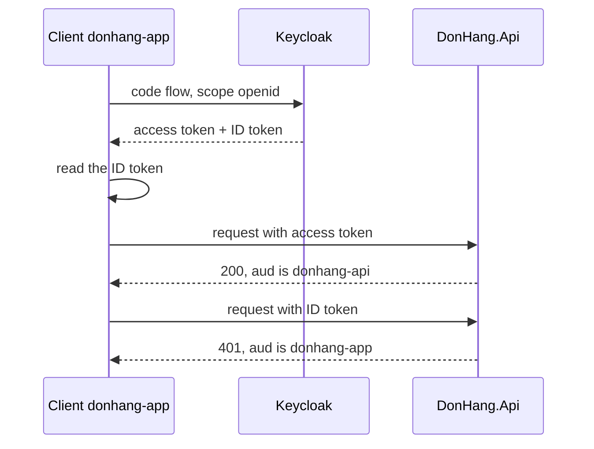

## Before you start

- [[backend.l2.authorization-code-flow]] — you know how `DonHang.App` trades a code for tokens at Keycloak's token endpoint, and that it asks for the `openid` scope. This lesson shows what that scope adds.

## The situation

You want `DonHang.App` to greet the customer by name right after sign-in. At stage-2 the app keeps only the access token from Keycloak's answer. That token is a JWT, so you could decode it and read a name from it. But it was issued for `DonHang.Api`, not for the app: the app's job is to carry it, and nothing promises the app what it contains. Plain OAuth 2.0 gives the app nothing else about the person who just signed in. What does Keycloak give the app that is meant for the app to read?

## Core concepts

- **OpenID Connect (OIDC)** — a layer on top of OAuth 2.0 that also tells the app who logged in; the app turns it on by asking for the `openid` scope.
- **ID token** — a JWT that Keycloak returns alongside the access token when the app asked for `openid`, addressed to the app and saying which user just logged in.
- `aud` claim — the audience of a token, the one it is addressed to; a server that checks `aud` accepts only tokens addressed to itself.
- `sub` claim — the subject, Keycloak's own id for the user; it is the same in both tokens of one sign-in.

## How it works



In the situation above, OAuth 2.0 gave the app an access token meant for the API. OAuth 2.0 describes the access token as usually opaque to the client: something it passes on to the API, not something it is meant to read. It does not define any way for the client to learn who logged in.

OpenID Connect adds that way on top of the same flow; only the scope list changes. When the first trip of the flow, where the browser goes to Keycloak, includes `openid`, Keycloak's token response carries one more field, `id_token`, next to `access_token`.

The ID token is a JWT like the access token, but it is addressed differently. Its `aud` claim holds the app's `client_id`, the id the app is registered under in the realm, `donhang-app`, so it is for the app. Its `sub` claim is Keycloak's id for the user. In this realm it also carries the user's name and email address, because `donhang-app` has the `profile` and `email` scopes on by default. The ID token is for the app to read; it is not meant to be sent to the API. At stage-2 `DonHang.App` keeps only the access token, so the script below shows both tokens instead.

The access token has `donhang-api` in its `aud` claim. `DonHang.Api` is configured to accept only that audience. If an ID token arrives in the `Authorization` header, the API sees `donhang-app` in `aud` and answers `401`. Both tokens are JWTs signed by the same Keycloak realm, so the audience check is what tells them apart here.

So one sign-in with `openid` gives the app both an ID token and an access token: the first tells it who logged in, the second lets it call the API for that person.

## In the Đơn Hàng system

`scripts/backend/oidc-tokens.sh` signs in twice as customer 1, first with the scopes `profile email` and then with `openid profile email`, and prints the field names of each token response. `$tokens` holds Keycloak's answer to the second sign-in, the one with `openid`. The script then reads the claims of both tokens and sends each one to the API:

```bash file=scripts/backend/oidc-tokens.sh tag=stage-2 lines=17-31
# lesson: backend.l2.openid-connect-id-token
# The ID token is addressed to the app (aud = its client_id) and says who
# logged in; the access token is addressed to the api (aud = donhang-api).
id_token=$(jq -r .id_token <<<"$tokens")
access_token=$(jq -r .access_token <<<"$tokens")
echo "== ID token, the claims the app reads:"
jwt_claims "$id_token" | jq '{iss, aud, sub, typ, name, email}'
echo "== access token, the claims the api reads:"
jwt_claims "$access_token" | jq '{iss, aud, sub, typ, azp, roles}'
echo

echo "== GET /api/v1/orders/1 with the ID token:"
curl -sS -o /dev/null -w '  -> %{http_code}\n' "$base/orders/1" -H "Authorization: Bearer $id_token"
echo "== GET /api/v1/orders/1 with the access token:"
curl -sS -o /dev/null -w '  -> %{http_code}\n' "$base/orders/1" -H "Authorization: Bearer $access_token"
```

```text output=true
== fields of Keycloak's token response, scope "profile email" (plain OAuth 2.0):
["access_token","expires_in","not-before-policy","refresh_expires_in","refresh_token","scope","session_state","token_type"]
== the same, scope "openid profile email" (OpenID Connect):
["access_token","expires_in","id_token","not-before-policy","refresh_expires_in","refresh_token","scope","session_state","token_type"]

== ID token, the claims the app reads:
{
  "iss": "http://localhost:8180/realms/donhang",
  "aud": "donhang-app",
  "sub": "92f6ba26-729c-4d61-854b-c04c9f2db11a",
  "typ": "ID",
  "name": "Minh Anh Trần",
  "email": "anh.tran@example.com"
}
== access token, the claims the api reads:
{
  "iss": "http://localhost:8180/realms/donhang",
  "aud": "donhang-api",
  "sub": "92f6ba26-729c-4d61-854b-c04c9f2db11a",
  "typ": "Bearer",
  "azp": "donhang-app",
  "roles": [
    "customer"
  ]
}

== GET /api/v1/orders/1 with the ID token:
  -> 401
== GET /api/v1/orders/1 with the access token:
  -> 200
```

`jwt_claims` decodes the middle part of a JWT, the payload that holds its claims, and `jq` picks fields out of JSON: here it takes each token out of the response and chooses which claims to print. Compare the two field lists first: `id_token` appears only in the second. Then compare `aud` in the two tokens: `donhang-app` for the ID token, `donhang-api` for the access token, with the same `iss` and `sub`. The script prints `name` and `email` only from the ID token, the token meant for the app; the access token carries them too in this realm, but they are there for the API. The other fields, and claims such as `typ` and `azp`, belong to later lessons; this API tells the tokens apart by `aud`. The last two lines show the API refusing the ID token and accepting the access token for the same request.

The accepted audience is set by one line in `Program.cs`:

```csharp file=DonHang.Api/Program.cs tag=stage-2 lines=48-50
        // Access tokens for this api carry "donhang-api" in `aud`; an ID token
        // carries the app's client id there instead, so it is rejected.
        options.Audience = "donhang-api";
```

`Audience` tells `AddJwtBearer`, the token check set up in `Program.cs`, which `aud` value to accept. The realm is set up to put `donhang-api` only into access tokens, never into ID tokens.

## Beginners often think…

- **"OAuth 2.0 and OpenID Connect are two competing ways to do the same thing."** → Actually OpenID Connect is built on OAuth 2.0: the same code flow, the same token endpoint, plus the `openid` scope and an ID token. You notice this when `oidc-tokens.sh` signs in twice through the same flow, and the only difference is the scope and one extra field.
- **"The ID token and the access token are interchangeable, since both are JWTs."** → Actually they are addressed to different receivers: the ID token to the app, the access token to the API. An API that checks the audience refuses the wrong one. You notice this when the same `GET /api/v1/orders/1` answers `401` with the ID token and `200` with the access token.

## Try it (3 minutes)

1. With the example system running (`scripts/up.sh`), run `scripts/backend/oidc-tokens.sh`.
2. Find the `aud` line in each of the two decoded tokens, then read the two status codes at the end.

Expected result: the second field list contains `"id_token"` and the first does not, the ID token shows `"aud": "donhang-app"`, the access token shows `"aud": "donhang-api"`, and the requests end with `-> 401` for the ID token and `-> 200` for the access token.

## Connections

- [[backend.l2.authorization-code-flow]] — the flow OpenID Connect runs on; asking for `openid` there is what adds the ID token.
- [[backend.l1.issuing-a-jwt]] — the same three-part JWT; here Keycloak signs two of them, each with its own audience.
- [[backend.l2.validating-provider-tokens]] — the next step: how the API checks the signature of a token it did not sign.

## Five-line summary

1. OpenID Connect adds an ID token to OAuth 2.0 so the app learns, in a token meant for it, who logged in.
2. OAuth 2.0 alone gives the app an access token meant for the API and no defined way to learn the user.
3. Asking for the `openid` scope makes Keycloak return an `id_token` next to the `access_token`.
4. The ID token has the app's `client_id` in `aud` and Keycloak's user id in `sub`; it is for the app, not the API.
5. The access token has `donhang-api` in `aud`, so the API, which checks the audience, rejects an ID token with `401`.
