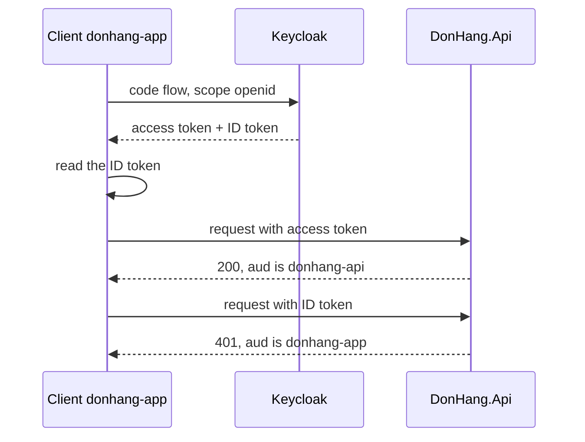

## Bạn cần biết trước

- [[backend.l2.authorization-code-flow]] — bạn biết `DonHang.App` đổi code lấy token ở token endpoint của Keycloak ra sao, và biết nó xin scope `openid`. Bài này chỉ ra scope đó thêm được gì.

## Tình huống

Bạn muốn `DonHang.App` chào khách bằng tên ngay sau khi đăng nhập. Ở stage-2, ứng dụng chỉ giữ access token trong câu trả lời của Keycloak. Token đó là JWT, nên bạn có thể giải mã nó và đọc ra một cái tên. Nhưng nó được cấp cho `DonHang.Api`, không phải cho ứng dụng: việc của ứng dụng là mang nó đi, và không có gì hứa với ứng dụng về nội dung bên trong. OAuth 2.0 thuần không cho ứng dụng thêm gì về người vừa đăng nhập. Vậy Keycloak đưa cho ứng dụng thứ gì dành riêng để ứng dụng đọc?

## Khái niệm cốt lõi

- **OpenID Connect (OIDC)** (lớp trên OAuth 2.0 cho ứng dụng biết ai đã đăng nhập, bằng ID token) — một lớp nằm trên OAuth 2.0, cho ứng dụng biết thêm ai đã đăng nhập. Ứng dụng bật nó bằng cách xin scope `openid`.
- **ID token** (JWT gửi cho ứng dụng, không phải API, cho biết người dùng nào vừa đăng nhập) — một JWT mà Keycloak trả kèm access token khi ứng dụng đã xin `openid`, gửi cho ứng dụng và nói người dùng nào vừa đăng nhập.
- claim `aud` — audience của token, tức bên mà token được gửi tới. Server có kiểm `aud` chỉ nhận token gửi cho chính nó.
- claim `sub` — subject, id riêng của Keycloak cho người dùng. Nó giống nhau trong cả hai token của cùng một lần đăng nhập.

## Cơ chế hoạt động



Trong tình huống trên, OAuth 2.0 cho ứng dụng một access token dành cho API. OAuth 2.0 mô tả access token là thứ thường mờ đục với client: client chuyển nó tới API, chứ không phải thứ để client đọc. OAuth 2.0 không định nghĩa cách nào để client biết ai đã đăng nhập.

OpenID Connect thêm cách đó lên trên cùng một luồng, chỉ danh sách scope thay đổi. Khi chặng đầu của luồng, lúc trình duyệt đi tới Keycloak, có `openid`, response chứa token của Keycloak có thêm một trường, `id_token`, bên cạnh `access_token`.

ID token là JWT giống access token, nhưng được gửi cho bên khác. Claim `aud` của nó chứa `client_id` của ứng dụng, tức id mà ứng dụng đăng ký trong realm, `donhang-app`, nên nó dành cho ứng dụng. Claim `sub` của nó là id của Keycloak cho người dùng. Trong realm này, nó còn mang tên và email của người dùng, vì `donhang-app` bật sẵn scope `profile` và `email`. ID token là để ứng dụng đọc, không phải để gửi tới API. Ở stage-2, `DonHang.App` chỉ giữ access token, nên script bên dưới cho bạn xem cả hai token thay cho ứng dụng.

Access token có `donhang-api` trong claim `aud`. `DonHang.Api` được cấu hình chỉ nhận audience đó. Nếu một ID token tới trong header `Authorization`, API thấy `donhang-app` trong `aud` và trả `401`. Cả hai token đều là JWT do cùng một realm Keycloak ký, nên bước kiểm audience chính là thứ phân biệt chúng ở đây.

Vậy một lần đăng nhập có `openid` cho ứng dụng cả ID token lẫn access token: cái đầu cho nó biết ai đã đăng nhập, cái sau cho nó gọi API thay người đó.

## Trong hệ thống Đơn Hàng

`scripts/backend/oidc-tokens.sh` đăng nhập hai lần với vai khách 1, lần đầu với scope `profile email`, lần sau với `openid profile email`, và in tên các trường của từng response chứa token. `$tokens` giữ câu trả lời của Keycloak cho lần đăng nhập thứ hai, lần có `openid`. Sau đó script đọc claim của cả hai token và gửi từng token tới API:

```bash file=scripts/backend/oidc-tokens.sh tag=stage-2 lines=17-31
# lesson: backend.l2.openid-connect-id-token
# The ID token is addressed to the app (aud = its client_id) and says who
# logged in; the access token is addressed to the api (aud = donhang-api).
id_token=$(jq -r .id_token <<<"$tokens")
access_token=$(jq -r .access_token <<<"$tokens")
echo "== ID token, the claims the app reads:"
jwt_claims "$id_token" | jq '{iss, aud, sub, typ, name, email}'
echo "== access token, the claims the api reads:"
jwt_claims "$access_token" | jq '{iss, aud, sub, typ, azp, roles}'
echo

echo "== GET /api/v1/orders/1 with the ID token:"
curl -sS -o /dev/null -w '  -> %{http_code}\n' "$base/orders/1" -H "Authorization: Bearer $id_token"
echo "== GET /api/v1/orders/1 with the access token:"
curl -sS -o /dev/null -w '  -> %{http_code}\n' "$base/orders/1" -H "Authorization: Bearer $access_token"
```

```text output=true
== fields of Keycloak's token response, scope "profile email" (plain OAuth 2.0):
["access_token","expires_in","not-before-policy","refresh_expires_in","refresh_token","scope","session_state","token_type"]
== the same, scope "openid profile email" (OpenID Connect):
["access_token","expires_in","id_token","not-before-policy","refresh_expires_in","refresh_token","scope","session_state","token_type"]

== ID token, the claims the app reads:
{
  "iss": "http://localhost:8180/realms/donhang",
  "aud": "donhang-app",
  "sub": "92f6ba26-729c-4d61-854b-c04c9f2db11a",
  "typ": "ID",
  "name": "Minh Anh Trần",
  "email": "anh.tran@example.com"
}
== access token, the claims the api reads:
{
  "iss": "http://localhost:8180/realms/donhang",
  "aud": "donhang-api",
  "sub": "92f6ba26-729c-4d61-854b-c04c9f2db11a",
  "typ": "Bearer",
  "azp": "donhang-app",
  "roles": [
    "customer"
  ]
}

== GET /api/v1/orders/1 with the ID token:
  -> 401
== GET /api/v1/orders/1 with the access token:
  -> 200
```

`jwt_claims` giải mã phần giữa của JWT, tức payload chứa các claim, còn `jq` chọn trường ra khỏi JSON: ở đây nó lấy từng token ra khỏi response và chọn claim nào để in. Trước hết, so hai danh sách trường: `id_token` chỉ có trong danh sách thứ hai. Rồi so `aud` của hai token: `donhang-app` cho ID token, `donhang-api` cho access token, còn `iss` và `sub` giống nhau. Script chỉ in `name` và `email` từ ID token, token dành cho ứng dụng; trong realm này access token cũng mang hai claim đó, nhưng chúng ở đó cho API. Các trường khác, và những claim như `typ`, `azp`, thuộc về các bài sau; API này phân biệt hai token bằng `aud`. Hai dòng cuối cho thấy API từ chối ID token và nhận access token cho cùng một request.

Audience được nhận do một dòng trong `Program.cs` quyết định:

```csharp file=DonHang.Api/Program.cs tag=stage-2 lines=48-50
        // Access tokens for this api carry "donhang-api" in `aud`; an ID token
        // carries the app's client id there instead, so it is rejected.
        options.Audience = "donhang-api";
```

`Audience` cho `AddJwtBearer`, bước kiểm token được thiết lập trong `Program.cs`, biết giá trị `aud` nào được nhận. Realm được thiết lập để chỉ đặt `donhang-api` vào access token, không bao giờ vào ID token.

## Người mới hay nghĩ rằng…

- **"OAuth 2.0 và OpenID Connect là hai cách cạnh tranh nhau để làm cùng một việc."** → Thực ra OpenID Connect xây trên OAuth 2.0: cùng code flow, cùng token endpoint, thêm scope `openid` và một ID token. Bạn sẽ nhận ra khi `oidc-tokens.sh` đăng nhập hai lần qua cùng một luồng, và khác biệt duy nhất là scope cùng một trường thêm vào.
- **"ID token và access token dùng thay nhau được, vì cả hai đều là JWT."** → Thực ra chúng gửi cho hai bên nhận khác nhau: ID token cho ứng dụng, access token cho API. API có kiểm audience sẽ từ chối token sai. Bạn sẽ nhận ra khi cùng một `GET /api/v1/orders/1` trả `401` với ID token và `200` với access token.

## Thử ngay (3 phút)

1. Khi hệ thống ví dụ đang chạy (`scripts/up.sh`), chạy `scripts/backend/oidc-tokens.sh`.
2. Tìm dòng `aud` trong mỗi token đã giải mã, rồi đọc hai status code ở cuối.

Kết quả mong đợi: danh sách trường thứ hai có `"id_token"` còn danh sách đầu thì không, ID token hiện `"aud": "donhang-app"`, access token hiện `"aud": "donhang-api"`, và hai request kết thúc bằng `-> 401` cho ID token, `-> 200` cho access token.

## Liên hệ

- [[backend.l2.authorization-code-flow]] — luồng mà OpenID Connect chạy trên đó; xin `openid` ở luồng đó là thứ thêm ID token vào.
- [[backend.l1.issuing-a-jwt]] — cùng kiểu JWT ba phần; ở đây Keycloak ký hai JWT, mỗi cái có audience riêng.
- [[backend.l2.validating-provider-tokens]] — bước tiếp theo: API kiểm chữ ký của một token mà nó không ký bằng cách nào.

## Tóm tắt 5 dòng

1. OpenID Connect thêm ID token vào OAuth 2.0 để ứng dụng biết ai đã đăng nhập, qua một token dành cho chính nó.
2. Chỉ với OAuth 2.0, ứng dụng nhận access token dành cho API và không có cách định sẵn nào để biết người dùng.
3. Xin scope `openid` khiến Keycloak trả `id_token` bên cạnh `access_token`.
4. ID token có `client_id` của ứng dụng trong `aud` và id người dùng của Keycloak trong `sub`; nó dành cho ứng dụng, không cho API.
5. Access token có `donhang-api` trong `aud`, nên API, vốn kiểm audience, từ chối ID token bằng `401`.
