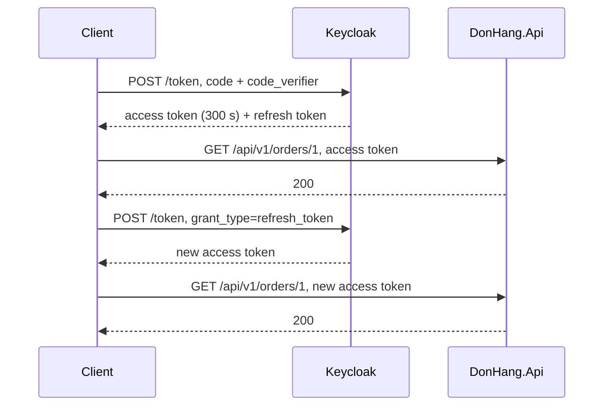

## Before you start

- [[backend.l2.validating-provider-tokens]] — you know `DonHang.Api` checks each access token by itself, with Keycloak's public key and the token's `exp`, without calling Keycloak. This lesson looks at the price of that.
- [[backend.l2.authorization-code-flow]] — you know a client trades a code and its verifier for tokens with a `POST` to Keycloak's token endpoint. Here the same endpoint hands out a new access token without a new login.

## The situation

A customer signs in to Đơn Hàng and places an order. Somewhere a copy of their access token leaks, for example into a log file that recorded request headers. `DonHang.Api` checks tokens by itself and never asks Keycloak, so it accepts that copy until the token expires, even if the customer logs out at Keycloak a minute later. If the token lasted a week, the copy would open the customer's orders for a week. If it lasted five minutes, the customer would have to sign in again every five minutes. How can an access token expire in minutes while the customer stays signed in for hours?

## Core concepts

- realm — Keycloak's space for one system's users, clients and settings; Đơn Hàng's realm is `donhang`, loaded from `keycloak/donhang-realm.json`.
- token lifetime — the seconds between a token's `iat`, the claim holding the time it was issued, and its `exp`; the realm sets it.
- **refresh token** — a token the client sends only to the authorization server, to get a new access token without the customer logging in again.
- Keycloak session — the record Keycloak keeps of one sign-in; each refresh token belongs to one session and stops working when the session ends.
- `grant_type=refresh_token` — the value that tells Keycloak's token endpoint the request carries a refresh token instead of an authorization code.

## How it works



In the situation above, the realm limits the damage by time. Keycloak writes an `exp` 300 seconds after `iat` into every access token. After `exp`, plus a leeway for clocks that differ (five minutes by default; `Program.cs` does not change it), the API rejects the token with `401`. A leaked access token is therefore useful for minutes, not days, whether anyone logs out or not.

Read the diagram top to bottom. The sign-in's `POST` returns the access token and, with it, a refresh token. The client calls the API with the access token and gets `200`. When the access token runs out, the client posts the refresh token with `grant_type=refresh_token` and its `client_id`, the name it is registered under at Keycloak, here `donhang-app`. Keycloak answers with a new access token, again good for 300 seconds, and the next call gets `200`. The customer types nothing.

The client sends the refresh token nowhere except Keycloak: to the token endpoint to renew, and to the logout endpoint to end the session. Keycloak renews only while the refresh token's session is active. Logging out ends the session, and every refresh token of it stops working. An access token already issued still passes the API's checks until it expires, because the API never asks Keycloak. So after a logout a stolen access token works only for the few minutes it has left, and nobody can get a new one with that session's refresh tokens. The script in the next section shows that logout.

## In the Đơn Hàng system

The lifetimes are set in the realm file Keycloak imports:

```json file=keycloak/donhang-realm.json tag=stage-2 lines=5-7
  "accessTokenLifespan": 300,
  "ssoSessionIdleTimeout": 1800,
  "ssoSessionMaxLifespan": 36000,
```

`accessTokenLifespan` is the access token's lifetime in seconds. The other two bound the Keycloak session, and with it every refresh token: the session ends after about 1,800 seconds (Keycloak adds a two-minute margin) in which the client neither signs in nor renews, and at the latest 36,000 seconds, ten hours, after the login. Each renewal restarts the 1,800-second count.

`DonHang.App` at stage-2 keeps only the access token and never renews it. Once the API starts answering `401`, a few minutes after the token's `exp`, the customer has to sign in again through Keycloak's page. While the Keycloak session lasts, Keycloak recognises the customer and skips the password, but the trip through the browser still happens, and a refresh token would spare it. The script `refresh-token.sh` plays the part of a client that does renew:

```bash file=scripts/backend/refresh-token.sh tag=stage-2 lines=26-48
# lesson: backend.l2.refresh-tokens
# The app, not the customer, asks for a new access token: the refresh token
# goes to Keycloak's token endpoint, never to the api.
echo "== renew: grant_type=refresh_token"
renewed=$(curl -sS "$keycloak/token" \
  -d grant_type=refresh_token -d client_id=donhang-app -d "refresh_token=$refresh_token")
new_access_token=$(jq -r .access_token <<<"$renewed")
if [ "$new_access_token" != "$access_token" ]; then different=yes; else different=no; fi
echo "a new access token, different from the first: $different"
call_api "$new_access_token"
echo

# lesson: backend.l2.refresh-tokens
# Logging out ends the session at Keycloak, and every refresh token of it.
echo "== log out at Keycloak"
curl -sS -o /dev/null -w '  -> %{http_code}\n' "$keycloak/logout" \
  -d client_id=donhang-app -d "refresh_token=$(jq -r .refresh_token <<<"$renewed")"
echo "== renew again after logging out"
curl -sS "$keycloak/token" \
  -d grant_type=refresh_token -d client_id=donhang-app -d "refresh_token=$refresh_token"
echo
echo "== the access token from before the logout, at the api (it has not reached its exp)"
call_api "$new_access_token"
```

```text output=true
== log in as customer 1
{
  "expires_in": 300,
  "refresh_expires_in": 1800
}
access token: exp - iat = 300 seconds

== GET /api/v1/orders/1 with the access token, then with the refresh token
  -> 200
  -> 401

== renew: grant_type=refresh_token
a new access token, different from the first: yes
  -> 200

== log out at Keycloak
  -> 204
== renew again after logging out
{"error":"invalid_grant","error_description":"Session not active"}
== the access token from before the logout, at the api (it has not reached its exp)
  -> 200
```

Earlier lines of the script sign in as customer 1, set `$access_token` and `$refresh_token`, then call the API once with each token. `$keycloak` is the realm's address for these requests, and `call_api` prints the status code of `GET /api/v1/orders/1`. `curl … -d name=value` sends a `POST` with those fields, and `jq -r .access_token` reads one field from the JSON Keycloak returns.

Now read the output from the top. `expires_in` matches `accessTokenLifespan`. The refresh token sent to the API gets `401`: its `aud` names the realm, not `donhang-api`, the value the API expects, and Keycloak signs it with a key that is not among the public keys the API downloads. The renewal needs no password, only `client_id` and the refresh token, and it also returns a second refresh token of the same session, which the logout sends to name the session. The logout answers `204`, and renewing with the first refresh token then fails with `invalid_grant`. The last line is the point of this lesson: the access token issued before the logout still gets `200`.

## Beginners often think…

- **"Logging out deletes the token, so it stops working straight away."** → Actually logging out ends the session at Keycloak, so its refresh tokens stop working, but an access token already issued is a signed value the API checks by itself, and it passes until it expires. You notice this at the end of the script's output: after the logout's `204`, the earlier access token still gets `200`.
- **"A refresh token is just a longer-lived access token that the API also accepts."** → Actually it is meant for one reader, Keycloak, and it fails the API's audience and signature checks. You notice this in the script's second call: the refresh token at `/api/v1/orders/1` gets `401`.
- **"Access tokens that last for days are fine as long as every request uses HTTPS."** → Actually HTTPS (HTTP over TLS) protects the token only while it travels; a copy taken from a log, a browser or a bug report stays valid for its whole lifetime, and no logout can recall it. With a token that lasts days, you notice this when a token pasted into a bug report still opens the API hours later.

## Try it (3 minutes)

1. With the example system running (`scripts/up.sh`), run `scripts/backend/refresh-token.sh`.
2. Compare the two numbers in the first JSON block with the realm file above, then read the last status code.

Expected result: `expires_in` is `300`, the same as `accessTokenLifespan`, and `refresh_expires_in` is `1800`, the same as `ssoSessionIdleTimeout`. The renewal after the logout prints `invalid_grant`, and the last line is `-> 200`: the access token outlived the logout.

## Connections

- [[backend.l1.sessions-vs-tokens]] — the problem named there: ending a token early needs something stored after all; here Keycloak's session is that store, and it reaches refresh tokens only.
- [[backend.l2.validating-provider-tokens]] — the cause of this lesson: checking tokens locally is why the API cannot recall one.
- [[backend.l2.authorization-code-flow]] — the same token endpoint, with a refresh token in place of a code and its verifier.
- [[backend.l2.role-based-access]] — the next step puts what a caller may do into the access token, so a permission removed at Keycloak keeps working at the API until that token expires.

## Five-line summary

1. Because the API cannot recall an access token, the token lasts only minutes, and a refresh token gets new ones without a new login.
2. The Đơn Hàng realm gives access tokens 300 seconds, and Keycloak returns a refresh token alongside the access token.
3. A client posts the refresh token with `grant_type=refresh_token` to Keycloak's token endpoint and gets a new access token.
4. The refresh token goes only to Keycloak; the API answers `401` to it.
5. Logging out at Keycloak ends the session and its refresh tokens, while issued access tokens work until they expire.
