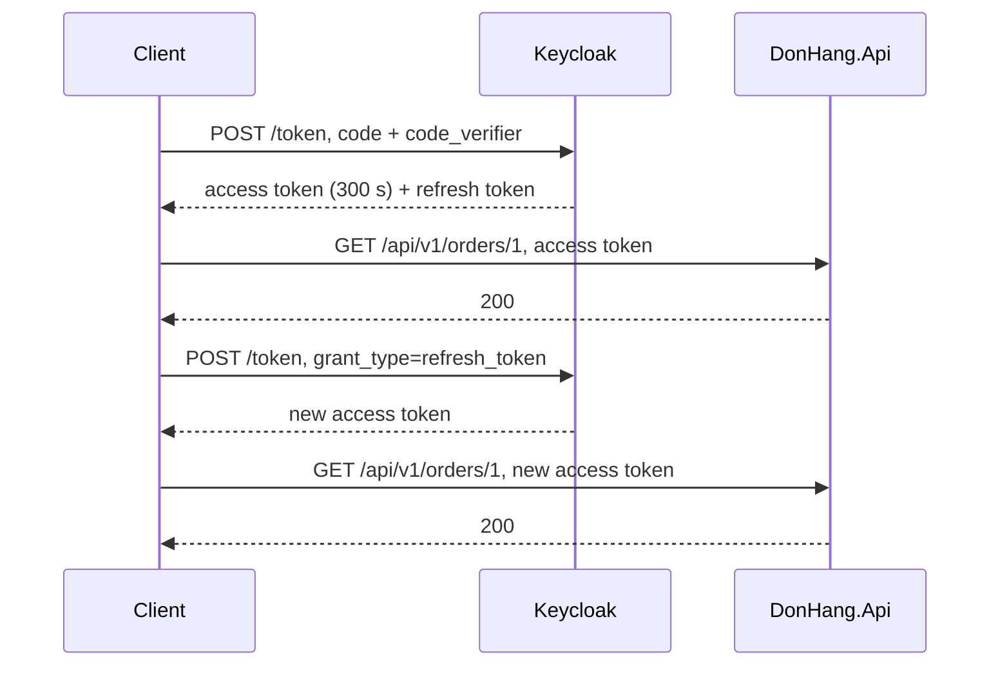

## Bạn cần biết trước

- [[backend.l2.validating-provider-tokens]] — bạn biết `DonHang.Api` tự kiểm từng access token bằng public key của Keycloak và `exp` của token, không gọi Keycloak. Bài này xem cái giá của cách làm đó.
- [[backend.l2.authorization-code-flow]] — bạn biết client đổi code và verifier lấy token bằng một `POST` tới token endpoint của Keycloak. Ở đây cũng endpoint đó trao access token mới mà không cần đăng nhập lại.

## Tình huống

Một khách đăng nhập vào Đơn Hàng và đặt một đơn. Ở đâu đó, một bản sao access token của họ bị lộ, chẳng hạn lọt vào một file log có ghi header của request. `DonHang.Api` tự kiểm token và không bao giờ hỏi Keycloak, nên nó nhận bản sao đó cho tới khi token hết hạn, kể cả khi một phút sau khách đã đăng xuất ở Keycloak. Nếu token sống một tuần, bản sao mở được đơn hàng của khách trong một tuần. Nếu token chỉ sống năm phút, cứ năm phút khách lại phải đăng nhập lại. Làm sao để access token hết hạn sau vài phút mà khách vẫn đăng nhập được hàng giờ?

## Khái niệm cốt lõi

- realm — không gian riêng trong Keycloak chứa người dùng, client và cấu hình của một hệ thống. Realm của Đơn Hàng là `donhang`, nạp từ `keycloak/donhang-realm.json`.
- thời hạn token — số giây giữa `iat` của token, tức claim ghi thời điểm cấp token, và `exp` của nó. Realm quy định con số này.
- **refresh token** (token client gửi riêng cho authorization server để lấy access token mới mà không đăng nhập lại) — token mà client chỉ gửi cho authorization server, để lấy access token mới mà khách không phải đăng nhập lại.
- session của Keycloak — bản ghi Keycloak giữ cho một lần đăng nhập. Mỗi refresh token thuộc về một session và hết tác dụng khi session đó kết thúc.
- `grant_type=refresh_token` — giá trị báo cho token endpoint của Keycloak biết request mang refresh token chứ không phải authorization code.

## Cơ chế hoạt động



Trong tình huống trên, realm giới hạn thiệt hại bằng thời gian. Keycloak ghi vào mỗi access token một `exp` cách `iat` 300 giây. Qua `exp`, cộng thêm một khoảng dư cho các đồng hồ lệch nhau (mặc định năm phút, `Program.cs` không đổi con số này), API từ chối token bằng `401`. Vì vậy một access token bị lộ chỉ dùng được vài phút chứ không phải vài ngày, dù có ai đăng xuất hay không.

Đọc sơ đồ từ trên xuống. `POST` lúc đăng nhập trả về access token, kèm theo một refresh token. Client gọi API bằng access token và nhận `200`. Khi access token hết hạn, client gửi refresh token kèm `grant_type=refresh_token` và `client_id` của mình, tức tên client đã đăng ký ở Keycloak, ở đây là `donhang-app`. Keycloak trả về access token mới, lại dùng được 300 giây, và lời gọi kế tiếp nhận `200`. Khách không phải gõ gì.

Client không gửi refresh token đi đâu ngoài Keycloak: tới token endpoint để làm mới, và tới logout endpoint để kết thúc session. Keycloak chỉ làm mới khi session của refresh token còn hoạt động. Đăng xuất kết thúc session, và mọi refresh token của nó hết tác dụng. Access token đã cấp thì vẫn qua được các bước kiểm của API cho tới khi hết hạn, vì API không bao giờ hỏi Keycloak. Nên sau khi đăng xuất, một access token bị đánh cắp chỉ còn dùng được vài phút còn lại, và không ai lấy được token mới bằng các refresh token của session đó. Script ở mục kế tiếp cho thấy lần đăng xuất này.

## Trong hệ thống Đơn Hàng

Các thời hạn nằm trong file realm mà Keycloak nạp vào:

```json file=keycloak/donhang-realm.json tag=stage-2 lines=5-7
  "accessTokenLifespan": 300,
  "ssoSessionIdleTimeout": 1800,
  "ssoSessionMaxLifespan": 36000,
```

`accessTokenLifespan` là thời hạn của access token, tính bằng giây. Hai khóa còn lại giới hạn session của Keycloak, và kéo theo mọi refresh token của nó: session kết thúc sau khoảng 1.800 giây (Keycloak cộng thêm hai phút dư) mà client không đăng nhập cũng không làm mới, và chậm nhất 36.000 giây, tức mười giờ, sau lần đăng nhập. Mỗi lần làm mới lại đếm lại 1.800 giây từ đầu.

`DonHang.App` ở stage-2 chỉ giữ access token và không bao giờ làm mới nó. Khi API bắt đầu trả `401`, vài phút sau `exp` của token, khách phải đăng nhập lại qua trang của Keycloak. Trong lúc session của Keycloak còn, Keycloak nhận ra khách và bỏ qua bước nhập mật khẩu, nhưng chuyến đi qua trình duyệt vẫn diễn ra, và refresh token sẽ giúp tránh chuyến đi đó. Script `refresh-token.sh` đóng vai một client có làm mới:

```bash file=scripts/backend/refresh-token.sh tag=stage-2 lines=26-48
# lesson: backend.l2.refresh-tokens
# The app, not the customer, asks for a new access token: the refresh token
# goes to Keycloak's token endpoint, never to the api.
echo "== renew: grant_type=refresh_token"
renewed=$(curl -sS "$keycloak/token" \
  -d grant_type=refresh_token -d client_id=donhang-app -d "refresh_token=$refresh_token")
new_access_token=$(jq -r .access_token <<<"$renewed")
if [ "$new_access_token" != "$access_token" ]; then different=yes; else different=no; fi
echo "a new access token, different from the first: $different"
call_api "$new_access_token"
echo

# lesson: backend.l2.refresh-tokens
# Logging out ends the session at Keycloak, and every refresh token of it.
echo "== log out at Keycloak"
curl -sS -o /dev/null -w '  -> %{http_code}\n' "$keycloak/logout" \
  -d client_id=donhang-app -d "refresh_token=$(jq -r .refresh_token <<<"$renewed")"
echo "== renew again after logging out"
curl -sS "$keycloak/token" \
  -d grant_type=refresh_token -d client_id=donhang-app -d "refresh_token=$refresh_token"
echo
echo "== the access token from before the logout, at the api (it has not reached its exp)"
call_api "$new_access_token"
```

```text output=true
== log in as customer 1
{
  "expires_in": 300,
  "refresh_expires_in": 1800
}
access token: exp - iat = 300 seconds

== GET /api/v1/orders/1 with the access token, then with the refresh token
  -> 200
  -> 401

== renew: grant_type=refresh_token
a new access token, different from the first: yes
  -> 200

== log out at Keycloak
  -> 204
== renew again after logging out
{"error":"invalid_grant","error_description":"Session not active"}
== the access token from before the logout, at the api (it has not reached its exp)
  -> 200
```

Các dòng phía trên của script đăng nhập bằng khách 1, gán `$access_token` và `$refresh_token`, rồi gọi API một lần với mỗi token. `$keycloak` là địa chỉ của realm cho các request này, còn `call_api` in status code của `GET /api/v1/orders/1`. `curl … -d name=value` gửi một `POST` với các trường đó, và `jq -r .access_token` đọc một trường trong JSON mà Keycloak trả về.

Giờ đọc output từ trên xuống. `expires_in` khớp với `accessTokenLifespan`. Refresh token gửi tới API nhận `401`: `aud` của nó ghi realm chứ không phải `donhang-api`, giá trị mà API chờ, và Keycloak ký nó bằng một key không nằm trong các public key API tải về. Lần làm mới không cần mật khẩu, chỉ cần `client_id` và refresh token, và nó còn trả về một refresh token thứ hai của cùng session, cái mà lệnh đăng xuất gửi đi để chỉ ra session cần kết thúc. Lệnh đăng xuất trả `204`, và sau đó làm mới bằng refresh token đầu tiên thất bại với `invalid_grant`. Dòng cuối là điểm chính của bài: access token cấp trước lúc đăng xuất vẫn nhận `200`.

## Người mới hay nghĩ rằng…

- **"Đăng xuất là xóa token, nên token hết tác dụng ngay lập tức."** → Thực ra đăng xuất kết thúc session ở Keycloak, nên các refresh token của nó hết tác dụng, còn access token đã cấp là một giá trị đã ký mà API tự kiểm, và nó vẫn qua cho tới khi hết hạn. Bạn sẽ nhận ra khi đọc cuối output của script: sau `204` của lần đăng xuất, access token trước đó vẫn nhận `200`.
- **"Refresh token chỉ là một access token sống lâu hơn, API cũng nhận luôn."** → Thực ra nó chỉ dành cho một nơi đọc là Keycloak, và nó trượt bước kiểm audience lẫn chữ ký của API. Bạn sẽ nhận ra ở lời gọi thứ hai của script: refresh token gửi tới `/api/v1/orders/1` nhận `401`.
- **"Access token sống nhiều ngày cũng không sao, miễn mọi request đều dùng HTTPS."** → Thực ra HTTPS (HTTP qua TLS) chỉ bảo vệ token lúc nó đang di chuyển. Một bản sao lấy từ log, từ trình duyệt hay từ một bug report vẫn hợp lệ suốt thời hạn của nó, và không lần đăng xuất nào thu hồi được. Với token sống nhiều ngày, bạn sẽ nhận ra khi một token bị dán vào bug report vẫn mở được API nhiều giờ sau.

## Thử ngay (3 phút)

1. Khi hệ thống ví dụ đang chạy (`scripts/up.sh`), chạy `scripts/backend/refresh-token.sh`.
2. So hai con số trong khối JSON đầu tiên với file realm ở trên, rồi đọc status code cuối cùng.

Kết quả mong đợi: `expires_in` là `300`, bằng `accessTokenLifespan`, và `refresh_expires_in` là `1800`, bằng `ssoSessionIdleTimeout`. Lần làm mới sau khi đăng xuất in ra `invalid_grant`, và dòng cuối là `-> 200`: access token sống lâu hơn lần đăng xuất.

## Liên hệ

- [[backend.l1.sessions-vs-tokens]] — vấn đề đã nêu ở đó: muốn kết thúc token sớm thì rốt cuộc vẫn phải lưu một thứ gì đó. Ở đây session của Keycloak là thứ được lưu, và nó chỉ với tới refresh token.
- [[backend.l2.validating-provider-tokens]] — nguyên nhân của bài này: kiểm token ngay tại chỗ là lý do API không thu hồi được token.
- [[backend.l2.authorization-code-flow]] — cùng token endpoint, với refresh token thay cho code và verifier của nó.
- [[backend.l2.role-based-access]] — bước tiếp theo đưa quyền của người gọi vào access token, nên một quyền bị gỡ ở Keycloak vẫn còn tác dụng ở API cho tới khi token đó hết hạn.

## Tóm tắt 5 dòng

1. Vì API không thu hồi được access token, token chỉ sống vài phút, và refresh token lấy token mới mà không cần đăng nhập lại.
2. Realm của Đơn Hàng cho access token 300 giây, và Keycloak trả kèm một refresh token cùng access token.
3. Client gửi refresh token kèm `grant_type=refresh_token` tới token endpoint của Keycloak và nhận access token mới.
4. Refresh token chỉ đi tới Keycloak, API trả `401` cho nó.
5. Đăng xuất ở Keycloak kết thúc session và các refresh token của nó, còn access token đã cấp vẫn dùng được tới khi hết hạn.
