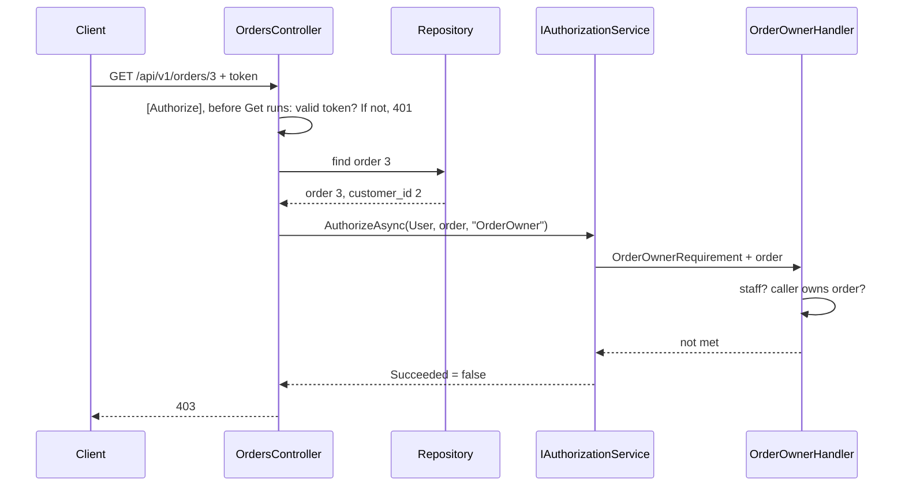

## Before you start

- [[backend.l2.role-based-access]] — you know the `roles` claim and the `StaffOnly` policy: a role decides for a whole group at once. This lesson meets a rule that no group can express.

## The situation

At stage-1, customer 1 could read order 3, which belongs to customer 2, and got `200`. Stage-2 must close that gap, and the previous lesson's tool looks like the answer. But customer 1 and customer 2 both have exactly the same role, `customer`. A policy that demands `customer` lets both of them read order 3, and a policy that demands `staff` locks both of them out of their own orders. Nothing in the two tokens says which orders each customer owns. What can the API look at that tells customer 1 and customer 2 apart for order 3?

## Core concepts

- attribute — in access control, a fact about the caller, the resource or the request, such as the caller's customer id or an order's `customer_id`; not the C# `[...]` kind.
- **ABAC (attribute-based access control)** — deciding what a caller may do from attributes of the caller, of the resource and of the request, instead of from roles alone.
- requirement and handler — a requirement is what a policy asks for, such as `OrderOwnerRequirement`; a handler is the class that decides whether a caller meets it, such as `OrderOwnerHandler`.
- `IAuthorizationService` — the ASP.NET Core interface an endpoint calls to run a policy against a resource it has already loaded.

## How it works



In the situation above, the answer is not in the token alone. Customer 1's token says who is calling, and order 3's row says who owns it, in `customer_id`. Only the two together decide. Đơn Hàng's rule combines them: the caller owns the order, or the caller has the `staff` role. A rule built from facts like these is ABAC. The staff part still uses a role, which is one fact among several.

This rule needs order 3 itself, so it cannot run before order 3 is loaded. The C# `[Authorize]` attribute is checked before the endpoint's code runs, when the order has not been read yet. So `OrdersController` first reads the order, answering `404` if it does not exist. Then it passes the order to `IAuthorizationService.AuthorizeAsync` together with the caller, `User`, and the policy name `OrderOwner`.

`AuthorizeAsync` looks up the `OrderOwner` policy, finds its one requirement, and runs `OrderOwnerHandler`, which `Program.cs` registered for it. The handler receives the caller and the order. If the caller has the `staff` role, the requirement is met. Otherwise the handler reads `sub`, the claim that holds the caller's Keycloak user id; each customer row stores that id, so the handler finds the caller's row by it and compares the row's id with the order's `customer_id`. If neither check succeeds, the result fails and the endpoint answers `403`, which is exactly what happens for customer 1 and order 3.

## In the Đơn Hàng system

The handler holds the whole rule:

```csharp file=DonHang.Api/Authorization/OrderOwnerHandler.cs tag=stage-2 lines=13-35
// lesson: backend.l2.resource-based-authorization
// Every customer has the same role, so a role cannot say whose order this is.
// The rule needs the order itself: its owner, or anyone with the staff role.
public sealed class OrderOwnerHandler(ICustomerRepository customers)
    : AuthorizationHandler<OrderOwnerRequirement, Order>
{
    protected override async Task HandleRequirementAsync(
        AuthorizationHandlerContext context, OrderOwnerRequirement requirement, Order order)
    {
        if (context.User.IsInRole("staff"))
        {
            context.Succeed(requirement);
            return;
        }

        var subject = context.User.FindFirstValue("sub");
        var caller = subject is null ? null : await customers.FindByIdentitySubjectAsync(subject);
        if (caller is not null && caller.Id == order.CustomerId)
        {
            context.Succeed(requirement);
        }
    }
}
```

`AuthorizationHandler<OrderOwnerRequirement, Order>` says this handler decides `OrderOwnerRequirement` for an `Order`, so the method receives the order as a parameter. `IsInRole("staff")` reads the `roles` claim, thanks to the `RoleClaimType` setting from the previous lesson. `context.Succeed(requirement)` marks the requirement as met. The method never calls anything to refuse: if it returns without `Succeed`, the requirement stays unmet and the check fails. `Program.cs` registers the policy with this requirement and registers the handler.

The endpoint runs the check after loading the order:

```csharp file=DonHang.Api/Controllers/OrdersController.cs tag=stage-2 lines=52-66
    // lesson: backend.l2.resource-based-authorization
    // Who may read an order depends on the order, so the check runs after
    // loading it: its owner or staff get it, another customer gets 403.
    [Authorize]
    [HttpGet("{id:int}")]
    public async Task<ActionResult<OrderDto>> Get(int id)
    {
        var order = await repository.FindForReadingAsync(id);
        if (order is null) return NotFound();

        var allowed = await authorization.AuthorizeAsync(User, order, "OrderOwner");
        if (!allowed.Succeeded) return Forbid();

        return Ok(ToDto(order));
    }
```

Two layers work here. `[Authorize]` still turns away a caller with no valid token, with `401`, before the order is read. Then `AuthorizeAsync` asks the ownership question with the loaded order, and `Forbid()` becomes `403`. The cancel endpoint, `PATCH /api/v1/orders/{id}/cancel`, repeats the same three steps before it cancels anything, so another customer cannot cancel your order either. At stage-1, `Get` had neither layer.

## Beginners often think…

- **"Giving each customer their own role is a fine way to control who reads which order."** → Actually a role per customer only renames the customer id, and each new sign-up would need a new role, plus a way to connect every order to the right role. The order already stores its owner in `customer_id`, so comparing that with the caller needs no new role when a customer signs up, and it reads the owner from the order itself on every request. You notice this when the list of roles in Keycloak starts growing with every new customer.
- **"An `[Authorize]` attribute with a role can also check who owns the order."** → Actually the attribute is checked before the endpoint loads the order, and it takes only names, such as a policy or roles, never an order. You notice this when you try to write the check as an attribute: there is nowhere to put order 3 or its `customer_id`.

## Try it (3 minutes)

1. With the example system running (`scripts/up.sh`), run `scripts/backend/order-owner.sh`. It prints who owns orders 1 and 3 and their status. Then, as customer 1, it reads order 1, reads order 3 and cancels order 3; it reads order 3 as staff and once with no token, and finally prints order 3 again.
2. Compare the status code after each `->` with the owner of the order in that request.

Expected result: customer 1 reading order 1 gets `200`; reading order 3 gets `403`, and so does cancelling it. Staff reading order 3 gets `200`, and nobody signed in gets `401`. The last table still shows order 3 with the status it had in the first table, `paid`, so the refused cancel changed nothing.

## Connections

- [[backend.l1.protecting-an-endpoint]] — the fix for the problem left open there: customer 1 read order 3 with `200`; here the same request gets `403`.
- [[backend.l2.role-based-access]] — the same idea one step further: a role is one attribute, and this rule adds the order's owner.
- [[backend.l2.validating-provider-tokens]] — where `sub` became Keycloak's user id, which the handler turns into a customer row.

## Five-line summary

1. When access depends on the data, such as an order's `customer_id`, the check must look at that data, not only at roles.
2. ABAC decides from attributes of the caller, the resource and the request; Đơn Hàng's rule is "owner of the order, or staff".
3. The order must be loaded first, so the endpoint calls `IAuthorizationService.AuthorizeAsync` with it instead of relying on an attribute.
4. `OrderOwnerHandler` meets the requirement for staff or for the customer whose id matches the order's `CustomerId`, and otherwise leaves it unmet.
5. At stage-2, reading or cancelling another customer's order answers `403`, closing the gap left open at stage-1.
