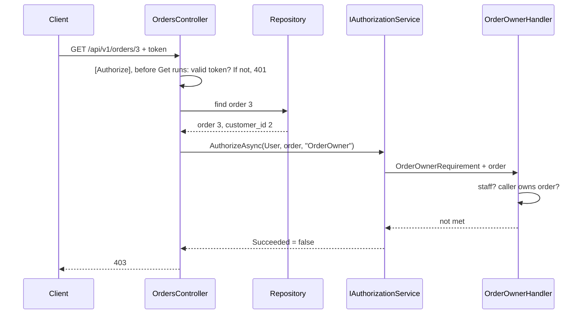

## Bạn cần biết trước

- [[backend.l2.role-based-access]] — bạn biết claim `roles` và policy `StaffOnly`: một role quyết định cho cả một nhóm cùng lúc. Bài này gặp một quy tắc mà không nhóm nào diễn đạt được.

## Tình huống

Ở stage-1, khách hàng 1 đọc được đơn 3, đơn của khách hàng 2, và nhận `200`. Stage-2 phải bịt lỗ hổng đó, và công cụ của bài trước trông như lời giải. Nhưng khách hàng 1 và khách hàng 2 có đúng cùng một role, `customer`. Policy đòi `customer` thì cả hai đều đọc được đơn 3, còn policy đòi `staff` thì cả hai bị khóa khỏi chính đơn của mình. Trong hai token không có gì cho biết mỗi khách sở hữu những đơn nào. Vậy API có thể nhìn vào đâu để phân biệt khách hàng 1 với khách hàng 2 đối với đơn 3?

## Khái niệm cốt lõi

- thuộc tính — trong kiểm soát truy cập, đây là một dữ kiện về người gọi, về resource hoặc về request, như id khách hàng của người gọi hay `customer_id` của một đơn. Không phải loại attribute `[...]` của C#.
- **ABAC (attribute-based access control)** (phân quyền dựa trên thuộc tính của người gọi, của tài nguyên và của request, như ai sở hữu đơn) — quyết định người gọi được làm gì dựa trên thuộc tính của người gọi, của resource và của request, thay vì chỉ dựa trên role.
- requirement và handler — requirement là thứ một policy đòi hỏi, như `OrderOwnerRequirement`. Handler là class quyết định người gọi có đáp ứng nó hay không, như `OrderOwnerHandler`.
- `IAuthorizationService` — interface của ASP.NET Core mà endpoint gọi để chạy một policy trên một resource nó đã đọc sẵn.

## Cơ chế hoạt động



Trong tình huống trên, câu trả lời không nằm riêng trong token. Token của khách hàng 1 cho biết ai đang gọi, còn dòng của đơn 3 cho biết ai sở hữu nó, trong `customer_id`. Phải có cả hai mới quyết được. Quy tắc của Đơn Hàng kết hợp chúng: người gọi sở hữu đơn, hoặc người gọi có role `staff`. Quy tắc dựng từ những dữ kiện như vậy là ABAC. Phần staff vẫn dùng role, và role chỉ là một dữ kiện trong số nhiều dữ kiện.

Quy tắc này cần chính đơn 3, nên không thể chạy trước khi đơn 3 được đọc. Attribute `[Authorize]` của C# được kiểm trước khi code của endpoint chạy, lúc đơn còn chưa được đọc. Vì thế `OrdersController` đọc đơn trước, trả `404` nếu đơn không tồn tại. Sau đó nó đưa đơn vào `IAuthorizationService.AuthorizeAsync`, cùng với người gọi, `User`, và tên policy `OrderOwner`.

`AuthorizeAsync` tìm policy `OrderOwner`, lấy requirement duy nhất của nó, rồi chạy `OrderOwnerHandler`, handler mà `Program.cs` đã đăng ký cho requirement đó. Handler nhận người gọi và đơn. Nếu người gọi có role `staff`, requirement đạt. Nếu không, handler đọc `sub`, claim chứa id người dùng Keycloak của người gọi. Mỗi dòng khách hàng lưu id đó, nên handler tìm dòng của người gọi theo nó rồi so id của dòng với `customer_id` của đơn. Không bước kiểm nào thành công thì kết quả thất bại và endpoint trả `403`, đúng như chuyện xảy ra với khách hàng 1 và đơn 3.

## Trong hệ thống Đơn Hàng

Handler chứa toàn bộ quy tắc:

```csharp file=DonHang.Api/Authorization/OrderOwnerHandler.cs tag=stage-2 lines=13-35
// lesson: backend.l2.resource-based-authorization
// Every customer has the same role, so a role cannot say whose order this is.
// The rule needs the order itself: its owner, or anyone with the staff role.
public sealed class OrderOwnerHandler(ICustomerRepository customers)
    : AuthorizationHandler<OrderOwnerRequirement, Order>
{
    protected override async Task HandleRequirementAsync(
        AuthorizationHandlerContext context, OrderOwnerRequirement requirement, Order order)
    {
        if (context.User.IsInRole("staff"))
        {
            context.Succeed(requirement);
            return;
        }

        var subject = context.User.FindFirstValue("sub");
        var caller = subject is null ? null : await customers.FindByIdentitySubjectAsync(subject);
        if (caller is not null && caller.Id == order.CustomerId)
        {
            context.Succeed(requirement);
        }
    }
}
```

`AuthorizationHandler<OrderOwnerRequirement, Order>` nói rằng handler này quyết `OrderOwnerRequirement` cho một `Order`, nên method nhận đơn qua tham số. `IsInRole("staff")` đọc claim `roles`, nhờ thiết lập `RoleClaimType` ở bài trước. `context.Succeed(requirement)` đánh dấu requirement đã đạt. Method không bao giờ gọi gì để từ chối: nếu nó kết thúc mà không gọi `Succeed`, requirement vẫn chưa đạt và bước kiểm thất bại. `Program.cs` đăng ký policy với requirement này và đăng ký handler.

Endpoint chạy bước kiểm sau khi đọc đơn:

```csharp file=DonHang.Api/Controllers/OrdersController.cs tag=stage-2 lines=52-66
    // lesson: backend.l2.resource-based-authorization
    // Who may read an order depends on the order, so the check runs after
    // loading it: its owner or staff get it, another customer gets 403.
    [Authorize]
    [HttpGet("{id:int}")]
    public async Task<ActionResult<OrderDto>> Get(int id)
    {
        var order = await repository.FindForReadingAsync(id);
        if (order is null) return NotFound();

        var allowed = await authorization.AuthorizeAsync(User, order, "OrderOwner");
        if (!allowed.Succeeded) return Forbid();

        return Ok(ToDto(order));
    }
```

Ở đây có hai lớp. `[Authorize]` vẫn chặn người gọi không có token hợp lệ, bằng `401`, trước khi đơn được đọc. Sau đó `AuthorizeAsync` hỏi câu hỏi sở hữu với đơn đã đọc, và `Forbid()` thành `403`. Endpoint hủy đơn, `PATCH /api/v1/orders/{id}/cancel`, lặp lại đúng ba bước đó trước khi hủy bất cứ thứ gì, nên khách khác cũng không hủy được đơn của bạn. Ở stage-1, `Get` không có lớp nào trong hai lớp này.

## Người mới hay nghĩ rằng…

- **"Cho mỗi khách một role riêng là cách ổn để kiểm soát ai đọc đơn nào."** → Thực ra role riêng cho từng khách chỉ đổi tên id khách hàng, mỗi lần có người đăng ký lại cần một role mới, cộng thêm cách nối từng đơn với đúng role. Đơn đã lưu chủ của nó trong `customer_id`, nên so giá trị đó với người gọi thì không cần role mới khi có khách đăng ký, và chủ đơn được đọc từ chính đơn ở mỗi request. Bạn sẽ nhận ra khi danh sách role trong Keycloak cứ dài thêm theo từng khách mới.
- **"Attribute `[Authorize]` kèm role cũng kiểm được ai sở hữu đơn."** → Thực ra attribute được kiểm trước khi endpoint đọc đơn, và nó chỉ nhận tên, như tên policy hay role, không bao giờ nhận một đơn. Bạn sẽ nhận ra khi thử viết bước kiểm thành attribute: không có chỗ nào để đặt đơn 3 hay `customer_id` của nó.

## Thử ngay (3 phút)

1. Khi hệ thống ví dụ đang chạy (`scripts/up.sh`), chạy `scripts/backend/order-owner.sh`. Script in ra ai sở hữu đơn 1 và đơn 3 cùng trạng thái của chúng. Sau đó, với tư cách khách hàng 1, nó đọc đơn 1, đọc đơn 3 và hủy đơn 3. Nó đọc đơn 3 với tư cách nhân viên và một lần không có token, cuối cùng in lại đơn 3.
2. So status code sau mỗi `->` với chủ của đơn trong request đó.

Kết quả mong đợi: khách hàng 1 đọc đơn 1 nhận `200`, đọc đơn 3 nhận `403`, hủy đơn 3 cũng vậy. Nhân viên đọc đơn 3 nhận `200`, còn người chưa đăng nhập nhận `401`. Bảng cuối vẫn cho thấy đơn 3 ở trạng thái như trong bảng đầu, `paid`, nên lần hủy bị từ chối không đổi gì cả.

## Liên hệ

- [[backend.l1.protecting-an-endpoint]] — cách vá lỗ hổng còn bỏ ngỏ ở đó: khách hàng 1 từng đọc đơn 3 với `200`, ở đây cùng request đó nhận `403`.
- [[backend.l2.role-based-access]] — cùng ý tưởng, đi thêm một bước: role là một thuộc tính, và quy tắc này thêm chủ của đơn.
- [[backend.l2.validating-provider-tokens]] — nơi `sub` trở thành id người dùng của Keycloak, thứ handler đổi thành một dòng khách hàng.

## Tóm tắt 5 dòng

1. Khi quyền truy cập phụ thuộc vào dữ liệu, như `customer_id` của đơn, bước kiểm phải nhìn vào dữ liệu đó chứ không chỉ nhìn role.
2. ABAC quyết định dựa trên thuộc tính của người gọi, của resource và của request. Quy tắc của Đơn Hàng là "chủ của đơn, hoặc staff".
3. Phải đọc đơn trước, nên endpoint gọi `IAuthorizationService.AuthorizeAsync` kèm đơn thay vì dựa vào attribute.
4. `OrderOwnerHandler` cho requirement đạt với staff hoặc với khách có id khớp `CustomerId` của đơn, ngoài ra để nó chưa đạt.
5. Ở stage-2, đọc hay hủy đơn của khách khác đều nhận `403`, bịt lỗ hổng còn bỏ ngỏ ở stage-1.
