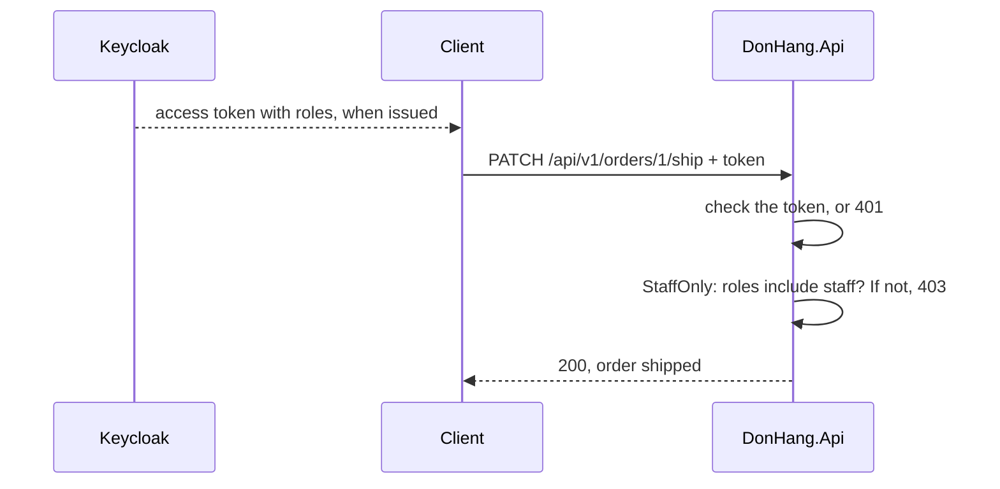

## Before you start

- [[backend.l2.validating-provider-tokens]] — you know the API checks each Keycloak access token by itself and then trusts the claims inside it. This lesson reads one more of those claims.
- [[backend.l1.protecting-an-endpoint]] — you know `401` means the caller is unknown and `403` means the caller is known but refused. Here a whole group of known callers is refused.

## The situation

Stage-2 adds a new action: marking a paid order as shipped, with `PATCH /api/v1/orders/{id}/ship`. Only the warehouse staff should do this, because a customer who could ship their own order would see "shipped" while the parcel still sits on a shelf. Every customer and the staff account now sign in at Keycloak, and all of them send valid tokens. `[Authorize]` alone lets any of them in. An ownership check does not help either: customer 1 owns order 1 and still must not ship it. How does the API tell a staff member's token from a customer's, and refuse the customer?

## Core concepts

- role — a name for a job, such as `customer` or `staff`, that an administrator gives to users in Keycloak.
- **RBAC (role-based access control)** — deciding what a caller may do from the roles given to it, instead of granting permissions user by user.
- `roles` claim — a claim is a named value inside a token, like `sub`; the `roles` claim is the list of the caller's roles that Keycloak writes into each access token for Đơn Hàng.
- policy — a named rule in ASP.NET Core that an endpoint can require; `StaffOnly` is a policy that demands the `staff` role.

## How it works



In the situation above, the realm, Đơn Hàng's set of users and settings in Keycloak, defines two roles, `customer` and `staff`. The five customers have `customer`; the staff account has `staff`. Nobody lists who may ship which order. The rule is "staff may ship", and giving someone the `staff` role is all it takes to include them. That is RBAC.

Each time Keycloak issues an access token, it looks up the user's roles and writes them into the token as the `roles` claim. The API never asks Keycloak about roles. It reads them from the token it has just checked, in the same way it reads `sub`.

A request to the ship endpoint then meets two questions, in order. First: is there a valid token? With no token, or a bad one, the answer is `401`. Second: does the `StaffOnly` policy pass, that is, does `roles` contain `staff`? A customer's token is valid, so the caller is known, but its `roles` holds only `customer`, so the answer is `403`. The staff token passes both, and the endpoint runs.

Because the roles travel inside the token, they are a copy taken when the token was issued. If an administrator removes someone's `staff` role in Keycloak, the token that person already holds still says `staff`. The API sees the change only in the next access token that person's app obtains. In this realm access tokens are issued for 300 seconds, so the delay is minutes, not days.

## In the Đơn Hàng system

Two lines in `Program.cs` connect the claim to ASP.NET Core, and one policy uses it:

```csharp file=DonHang.Api/Program.cs tag=stage-2 lines=52-66
        // Keep claim names as Keycloak wrote them ("sub", "roles"), and read
        // the caller's roles from the flat "roles" claim the realm adds.
        options.MapInboundClaims = false;
        options.TokenValidationParameters.RoleClaimType = "roles";
    });

// lesson: backend.l2.role-based-access
// lesson: backend.l2.resource-based-authorization
// Neither policy names an authentication scheme: they ask about the caller,
// not about how the caller signed in.
builder.Services.AddAuthorization(options =>
{
    options.AddPolicy("StaffOnly", policy => policy.RequireRole("staff"));
    options.AddPolicy("OrderOwner", policy => policy.AddRequirements(new OrderOwnerRequirement()));
});
```

`MapInboundClaims = false` keeps each claim under the name Keycloak gave it; without it, ASP.NET Core renames some claims, such as `sub`, to longer names. `RoleClaimType = "roles"` then tells ASP.NET Core which claim holds the caller's roles. `RequireRole("staff")` passes only when that list contains `staff`.

The second policy, `OrderOwner`, belongs to the next lesson. The comment about an authentication scheme, the way a caller signs in, only says that neither policy cares how the caller signed in.

Where do the roles come from? The realm file, `keycloak/donhang-realm.json`, gives each user a role. It also adds a mapper, a Keycloak setting that copies user data into a token claim, to the `donhang-app` client, so the user's roles land in `roles` in the access token.

The endpoint asks for the policy by name:

```csharp file=DonHang.Api/Controllers/OrdersController.cs tag=stage-2 lines=86-97
    // lesson: design.l2.status-changes-through-methods
    // lesson: backend.l2.role-based-access
    // The endpoint decides who may ship: the StaffOnly policy lets in only a
    // token whose roles include "staff" (403 for a customer, 401 with no
    // token). Order.Ship() decides whether this order can be shipped.
    [Authorize(Policy = "StaffOnly")]
    [HttpPatch("{id:int}/ship")]
    public async Task<ActionResult<OrderDto>> Ship(int id)
    {
        var order = await orderService.ShipOrderAsync(id);
        return Ok(ToDto(order));
    }
```

`[Authorize(Policy = "StaffOnly")]` does the work of both questions from the diagram: a missing token gets `401` and a customer's token gets `403`, before `Ship` runs. The method body contains no role check at all. The check sits on the API's endpoint, so it holds whatever app or script sends the request. Whether this particular order can be shipped is a different question, answered by `Order.Ship()` inside `ShipOrderAsync`.

## Beginners often think…

- **"OAuth scopes and roles are the same thing, so the app can ask for the staff role as a scope."** → Actually a scope is requested for the app when the flow starts, and Keycloak may add default ones, while a role is given to the user by an administrator; the app cannot ask its way into one. In Đơn Hàng, roles reach the token through the client's mapper, whatever scopes are requested. You notice this in the output of `scripts/backend/oauth-code-flow.sh` from the code-flow lesson: the app asks only for `openid`, the token response lists `"scope": "email openid profile"`, with no role in it, yet the access token still carries `roles`.
- **"Removing someone's role in Keycloak blocks them from the API immediately."** → Actually the API reads roles only from the token, so a token issued before the change keeps its old roles until it expires. You notice this when a staff member whose role was just removed can still ship an order for a few minutes, then gets `403` once their app holds a new token.

## Try it (3 minutes)

1. With the example system running (`scripts/up.sh`), run `scripts/backend/staff-only.sh`. It resets order 1 to `paid`, signs in as customer 1 and as the staff account, and sends the same ship request with no token, as customer 1, and as staff.
2. Read the two `roles` lines at the top, then the status code after each `->`.

Expected result: customer 1's token shows `["customer"]` and the staff token shows `["staff"]`. The request with no token gets `401`, the one as customer 1 gets `403` even though customer 1 owns order 1, and the one as staff gets `200` with `"status":"shipped"`.

## Connections

- [[backend.l1.protecting-an-endpoint]] — the same `401` and `403`, now decided by a role for a whole group instead of by one order's owner.
- [[backend.l2.validating-provider-tokens]] — prerequisite: the role is trusted only because the token carrying it passed those checks.
- [[backend.l2.refresh-tokens]] — how an app obtains the next access token, which is when a changed role finally arrives.
- [[backend.l2.resource-based-authorization]] — the next step: rules a role cannot express, such as "only the owner of this order".

## Five-line summary

1. RBAC decides what a caller may do from its roles, such as `staff`, instead of listing permissions user by user.
2. Keycloak writes the user's roles into the access token's `roles` claim; `RoleClaimType = "roles"` makes ASP.NET Core read them.
3. The `StaffOnly` policy requires the `staff` role, and `[Authorize(Policy = "StaffOnly")]` puts it on the ship endpoint.
4. No token gets `401`; a customer's valid token gets `403`; only a token whose roles include `staff` gets through.
5. Roles are copied into the token when Keycloak issues it, so a change in Keycloak reaches the API only with the next access token.
