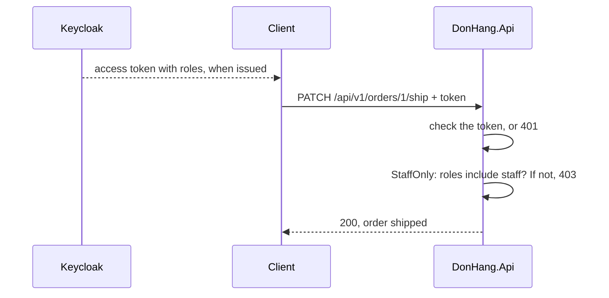

## Bạn cần biết trước

- [[backend.l2.validating-provider-tokens]] — bạn biết API tự kiểm từng access token của Keycloak rồi mới tin các claim bên trong. Bài này đọc thêm một claim nữa trong số đó.
- [[backend.l1.protecting-an-endpoint]] — bạn biết `401` nghĩa là chưa biết người gọi là ai, còn `403` nghĩa là đã biết nhưng vẫn từ chối. Ở đây cả một nhóm người gọi đã biết bị từ chối.

## Tình huống

Stage-2 thêm một thao tác mới: đánh dấu một đơn đã thanh toán là đã giao, bằng `PATCH /api/v1/orders/{id}/ship`. Chỉ nhân viên kho được làm điều này, vì nếu khách tự giao được đơn của mình, họ sẽ thấy "đã giao" trong khi kiện hàng vẫn nằm trên kệ. Giờ mọi khách hàng và tài khoản nhân viên đều đăng nhập ở Keycloak, và ai cũng gửi token hợp lệ. Chỉ có `[Authorize]` thì ai trong số họ cũng qua được. Kiểm tra sở hữu cũng không giúp gì: khách hàng 1 sở hữu đơn 1 nhưng vẫn không được giao nó. Vậy API phân biệt token của nhân viên với token của khách, và từ chối khách, bằng cách nào?

## Khái niệm cốt lõi

- role — tên của một vai trò công việc, như `customer` hay `staff`, do quản trị viên gán cho người dùng trong Keycloak.
- **RBAC (role-based access control)** (phân quyền theo role được gán cho người dùng, thay vì cấp quyền cho từng người) — quyết định người gọi được làm gì dựa trên các role đã gán cho họ, thay vì cấp quyền cho từng người một.
- claim `roles` — claim là một giá trị có tên nằm trong token, như `sub`. Claim `roles` là danh sách role của người gọi mà Keycloak ghi vào mỗi access token cấp cho Đơn Hàng.
- policy — một quy tắc có tên trong ASP.NET Core mà endpoint có thể yêu cầu. `StaffOnly` là policy đòi role `staff`.

## Cơ chế hoạt động



Trong tình huống trên, realm, tức tập người dùng và cấu hình của Đơn Hàng trong Keycloak, định nghĩa hai role là `customer` và `staff`. Năm khách hàng có `customer`, tài khoản nhân viên có `staff`. Không ai liệt kê ai được giao đơn nào. Quy tắc chỉ là "staff được giao đơn", và muốn thêm ai vào thì chỉ cần gán role `staff` cho người đó. Đó là RBAC.

Mỗi lần Keycloak cấp access token, nó tra các role của người dùng rồi ghi vào token thành claim `roles`. API không bao giờ hỏi Keycloak về role. Nó đọc role từ token vừa kiểm xong, giống hệt cách nó đọc `sub`.

Sau đó, request tới endpoint giao đơn phải qua hai câu hỏi, theo thứ tự. Thứ nhất: có token hợp lệ không? Không có token, hoặc token hỏng, thì câu trả lời là `401`. Thứ hai: policy `StaffOnly` có qua không, tức `roles` có chứa `staff` không? Token của khách hợp lệ nên API biết người gọi là ai, nhưng `roles` của nó chỉ có `customer`, nên câu trả lời là `403`. Token của nhân viên qua cả hai, và endpoint chạy.

Vì role đi bên trong token, chúng là bản sao chụp lại lúc token được cấp. Nếu quản trị viên gỡ role `staff` của ai đó trong Keycloak, token người đó đang giữ vẫn ghi `staff`. API chỉ thấy thay đổi ở access token kế tiếp mà app của người đó lấy về. Trong realm này, access token được cấp cho 300 giây, nên độ trễ tính bằng phút, không phải bằng ngày.

## Trong hệ thống Đơn Hàng

Hai dòng trong `Program.cs` nối claim với ASP.NET Core, và một policy dùng đến nó:

```csharp file=DonHang.Api/Program.cs tag=stage-2 lines=52-66
        // Keep claim names as Keycloak wrote them ("sub", "roles"), and read
        // the caller's roles from the flat "roles" claim the realm adds.
        options.MapInboundClaims = false;
        options.TokenValidationParameters.RoleClaimType = "roles";
    });

// lesson: backend.l2.role-based-access
// lesson: backend.l2.resource-based-authorization
// Neither policy names an authentication scheme: they ask about the caller,
// not about how the caller signed in.
builder.Services.AddAuthorization(options =>
{
    options.AddPolicy("StaffOnly", policy => policy.RequireRole("staff"));
    options.AddPolicy("OrderOwner", policy => policy.AddRequirements(new OrderOwnerRequirement()));
});
```

`MapInboundClaims = false` giữ mỗi claim đúng cái tên Keycloak đặt cho nó. Nếu không có dòng này, ASP.NET Core đổi tên một số claim, như `sub`, thành tên dài hơn. Tiếp theo, `RoleClaimType = "roles"` cho ASP.NET Core biết claim nào chứa role của người gọi. `RequireRole("staff")` chỉ qua khi danh sách đó có `staff`.

Policy thứ hai, `OrderOwner`, thuộc về bài sau. Comment nhắc tới authentication scheme, tức cách người gọi đăng nhập, chỉ nói rằng không policy nào quan tâm người gọi đã đăng nhập theo cách nào.

Role từ đâu ra? File realm, `keycloak/donhang-realm.json`, gán cho mỗi người dùng một role. File này còn thêm một mapper, tức một thiết lập của Keycloak chép dữ liệu người dùng vào một claim của token, cho client `donhang-app`, nhờ đó role của người dùng nằm trong `roles` của access token.

Endpoint gọi policy theo tên:

```csharp file=DonHang.Api/Controllers/OrdersController.cs tag=stage-2 lines=86-97
    // lesson: design.l2.status-changes-through-methods
    // lesson: backend.l2.role-based-access
    // The endpoint decides who may ship: the StaffOnly policy lets in only a
    // token whose roles include "staff" (403 for a customer, 401 with no
    // token). Order.Ship() decides whether this order can be shipped.
    [Authorize(Policy = "StaffOnly")]
    [HttpPatch("{id:int}/ship")]
    public async Task<ActionResult<OrderDto>> Ship(int id)
    {
        var order = await orderService.ShipOrderAsync(id);
        return Ok(ToDto(order));
    }
```

`[Authorize(Policy = "StaffOnly")]` lo cả hai câu hỏi trong sơ đồ: thiếu token thì `401`, token của khách thì `403`, trước khi `Ship` chạy. Thân method không kiểm role gì cả. Bước kiểm nằm ở endpoint của API, nên app hay script nào gửi request thì nó vẫn có hiệu lực. Đơn cụ thể này có giao được hay không là một câu hỏi khác, do `Order.Ship()` bên trong `ShipOrderAsync` trả lời.

## Người mới hay nghĩ rằng…

- **"Scope của OAuth và role là một, nên app có thể xin role staff dưới dạng scope."** → Thực ra scope được xin cho app lúc bắt đầu luồng, và Keycloak có thể tự thêm scope mặc định, còn role do quản trị viên gán cho người dùng, app không thể xin mà có được. Ở Đơn Hàng, role vào token qua mapper của client, bất kể xin scope nào. Bạn sẽ nhận ra khi xem output của `scripts/backend/oauth-code-flow.sh` ở bài về code flow: app chỉ xin `openid`, token response ghi `"scope": "email openid profile"`, không có role nào, vậy mà access token vẫn mang `roles`.
- **"Gỡ role của ai đó trong Keycloak là họ bị chặn khỏi API ngay lập tức."** → Thực ra API chỉ đọc role từ token, nên token cấp trước lúc thay đổi vẫn giữ role cũ cho tới khi hết hạn. Bạn sẽ nhận ra khi một nhân viên vừa bị gỡ role vẫn giao được đơn thêm vài phút, rồi mới nhận `403` khi app của họ đã cầm token mới.

## Thử ngay (3 phút)

1. Khi hệ thống ví dụ đang chạy (`scripts/up.sh`), chạy `scripts/backend/staff-only.sh`. Script đặt lại đơn 1 về `paid`, đăng nhập bằng khách hàng 1 và bằng tài khoản nhân viên, rồi gửi cùng một request giao đơn khi không có token, với tư cách khách hàng 1, và với tư cách nhân viên.
2. Đọc hai dòng `roles` ở đầu, rồi status code sau mỗi `->`.

Kết quả mong đợi: token của khách hàng 1 hiện `["customer"]` và token của nhân viên hiện `["staff"]`. Request không có token nhận `401`, request của khách hàng 1 nhận `403` dù khách hàng 1 sở hữu đơn 1, còn request của nhân viên nhận `200` với `"status":"shipped"`.

## Liên hệ

- [[backend.l1.protecting-an-endpoint]] — vẫn `401` và `403` đó, nhưng giờ quyết định theo role cho cả một nhóm thay vì theo chủ của một đơn.
- [[backend.l2.validating-provider-tokens]] — kiến thức nền: role đáng tin chỉ vì token mang nó đã qua các bước kiểm đó.
- [[backend.l2.refresh-tokens]] — cách app lấy access token kế tiếp, cũng là lúc role đã đổi mới thật sự tới nơi.
- [[backend.l2.resource-based-authorization]] — bước tiếp theo: những quy tắc role không diễn đạt được, như "chỉ chủ của đơn này".

## Tóm tắt 5 dòng

1. RBAC quyết định người gọi được làm gì dựa trên role của họ, như `staff`, thay vì liệt kê quyền cho từng người.
2. Keycloak ghi role của người dùng vào claim `roles` của access token, và `RoleClaimType = "roles"` khiến ASP.NET Core đọc chúng.
3. Policy `StaffOnly` đòi role `staff`, và `[Authorize(Policy = "StaffOnly")]` gắn nó lên endpoint giao đơn.
4. Không có token thì `401`, token hợp lệ của khách thì `403`, chỉ token có role `staff` mới qua được.
5. Role được chép vào token lúc Keycloak cấp nó, nên thay đổi trong Keycloak chỉ tới API cùng access token kế tiếp.
