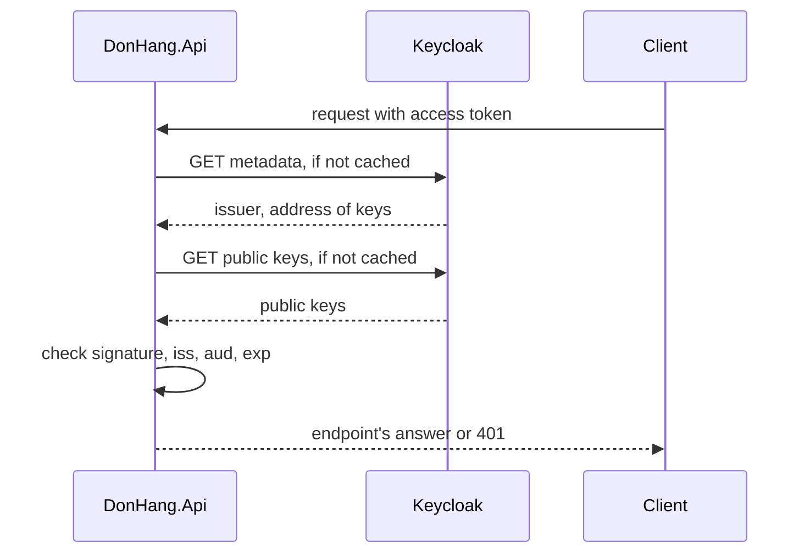

## Before you start

- [[backend.l2.openid-connect-id-token]] — you know the access token Keycloak issues carries `donhang-api` in `aud` and Keycloak's id for the user in `sub`. This lesson shows how the API trusts such a token.
- [[backend.l1.validating-a-jwt]] — you know `UseAuthentication` checks a bearer token's signature, issuer, audience and expiry on each request. Here the same checks run, but the signature comes from someone else.

## The situation

At stage-1, `DonHang.Api` signed its tokens with a secret key from its configuration and checked them with the same key. At stage-2 Keycloak signs them. One idea is to copy Keycloak's signing secret into the API's configuration. Then anyone who can read that configuration, or any bug that leaks it, could make a valid token for any customer or for a staff member. Another idea is to ask Keycloak about every token, which adds a call to every request and makes every signed-in request fail while Keycloak is down. How can the API check a signature it cannot make, without asking Keycloak each time?

## Core concepts

- shared key — the stage-1 arrangement: one secret signs with HMAC and the same secret checks, so whatever can check a token can also create one.
- private key — one half of a key pair, two keys created together so that a signature made with one can be checked only with the other; the private key makes signatures, and Keycloak never gives it out.
- **public key** — the shareable half of a key pair: it checks signatures made by the matching private key but cannot make one.
- metadata document — a JSON document Keycloak publishes for each realm, naming the realm's issuer and the address of its public keys.

## How it works



In the situation above, Keycloak signs each access token with its private key. The matching public key is published for anyone to download. A signature made with the private key checks out against the public key. Changing even one claim makes the check fail, just as with the stage-1 key. The difference is that the public key cannot make a new signature, so the API can hold it without being able to create tokens.

The API learns where to find the keys from the realm's metadata document. `AddJwtBearer` downloads that document and the public keys it points to, and keeps them in memory; it fetches them again only now and then, never for each request. It checks each request by itself: the signature against the public key, `iss` against the issuer in the document, `aud` against `donhang-api`, and `exp` against the clock. A request that passes all four checks goes on to the endpoint; if any check fails on an endpoint that needs a signed-in caller, the API answers `401`.

Only `sub` needs one more step. It is Keycloak's id for the user, a long string such as `92f6ba26-729c-4d61-854b-c04c9f2db11a`, not a number from `customers.id`. At stage-1 the API read `sub` as a customer number. At stage-2 each customer row stores its Keycloak id in a new column, `identity_subject`, and the API looks the customer up by it. A caller with no such row, such as the staff account, passes the four checks but then gets `403` from this lookup when it tries to place an order.

## In the Đơn Hàng system

`Program.cs` configures the check with the realm's address and nothing secret:

```csharp file=DonHang.Api/Program.cs tag=stage-2 lines=37-51
// Keycloak issues the tokens; the api only checks them. AddJwtBearer reads
// Keycloak's metadata and public keys once, then checks each token's
// signature, issuer, audience and expiry itself, without calling Keycloak.
var authority = builder.Configuration["Keycloak:Authority"]
    ?? throw new InvalidOperationException("Keycloak:Authority is not set");
builder.Services.AddAuthentication(JwtBearerDefaults.AuthenticationScheme)
    .AddJwtBearer(options =>
    {
        options.Authority = authority;
        options.MetadataAddress = builder.Configuration["Keycloak:MetadataAddress"]
            ?? $"{authority}/.well-known/openid-configuration";
        // Access tokens for this api carry "donhang-api" in `aud`; an ID token
        // carries the app's client id there instead, so it is rejected.
        options.Audience = "donhang-api";
        options.RequireHttpsMetadata = false; // the lab reaches Keycloak over plain HTTP
```

`Authority` is the realm's address, `localhost:8180` followed by `/realms/donhang`, the same value tokens carry in `iss`. `MetadataAddress` is where the metadata document is downloaded from. Without it, the address is `Authority` plus `/.well-known/openid-configuration`.

In the lab, the file that starts the lab's containers, `docker-compose.yml`, sets `MetadataAddress` to `keycloak:8080` instead, because inside the API's container `localhost` is the API itself. The document fetched this way still names the `localhost:8180` realm as the issuer, so the `iss` check matches. On the lab's Docker network the API reaches Keycloak by the name it has on that network, `keycloak`, on port 8080; 8180 is the port your browser uses from outside. `RequireHttpsMetadata = false` is there only because the lab talks to Keycloak over plain HTTP. There is no signing key anywhere in this configuration.

The customer lookup is in `OrdersController`:

```csharp file=DonHang.Api/Controllers/OrdersController.cs tag=stage-2 lines=117-124
    // lesson: backend.l2.validating-provider-tokens
    // `sub` is Keycloak's id for the caller, not a customers.id, so it is
    // looked up in customers.identity_subject instead of parsed as a number.
    private async Task<Customer?> CurrentCustomerAsync()
    {
        var subject = User.FindFirstValue("sub");
        return subject is null ? null : await customers.FindByIdentitySubjectAsync(subject);
    }
```

`User` holds the claims of the token that just passed the checks. `FindByIdentitySubjectAsync` finds the row whose `identity_subject` equals `sub`, or `null`. A migration added that column, with a unique index, and filled it for the five customers the lab database starts with. `POST /api/v1/orders` answers `403` when this method returns `null`.

## Beginners often think…

- **"The API has to ask Keycloak on every request whether the token is still valid."** → Actually the API downloads the metadata and public keys ahead of time, keeps them in memory, and checks every token itself, in its own process. You notice this in `Program.cs`: it tells the API only where to download the keys, not a call to make for each token.
- **"If anyone can download the public key, anyone can sign tokens with it."** → Actually the public key can only check signatures; making one needs the private key, which never leaves Keycloak. You notice this when you open the realm's public keys in a browser: anyone can read them, yet the API still refuses a token whose claims someone edited.

## Try it (3 minutes)

1. With the example system running (`scripts/up.sh`), open `localhost:8180/realms/donhang/.well-known/openid-configuration` in your browser. This is the metadata document.
2. Find `issuer` and `jwks_uri`, then open the address in `jwks_uri`. It lists the realm's public keys.

Expected result: `issuer` is the same realm address the tokens carry in `iss`, and the keys page shows a `keys` list in which one key has `"use": "sig"` and `"alg": "RS256"`; that is the public key the API uses to check signatures. RS256 is the name of a key-pair signing method, used here instead of stage-1's HMAC-SHA256.

## Connections

- [[backend.l1.validating-a-jwt]] — the same four checks, with the shared key swapped for Keycloak's public key.
- [[backend.l1.issuing-a-jwt]] — the opposite side: there the API made signatures; here it only checks them.
- [[backend.l2.refresh-tokens]] — the price of checking tokens locally: the API keeps accepting a token until it expires, so access tokens are kept short-lived.
- [[backend.l2.role-based-access]] — the next use of the checked token: the `roles` claim decides what a caller may do.

## Five-line summary

1. The API checks Keycloak's tokens with Keycloak's public key, which can check a signature but never make one.
2. At stage-1 one shared key signed and checked, so anything able to check a token could also forge one.
3. `AddJwtBearer` downloads the realm's metadata document and public keys from `Authority` or `MetadataAddress` and keeps them in memory.
4. Then it checks signature, `iss`, `aud` and `exp` on every request itself, without calling Keycloak.
5. `sub` is Keycloak's user id, so the API finds the customer through `customers.identity_subject`, not by reading a number.
