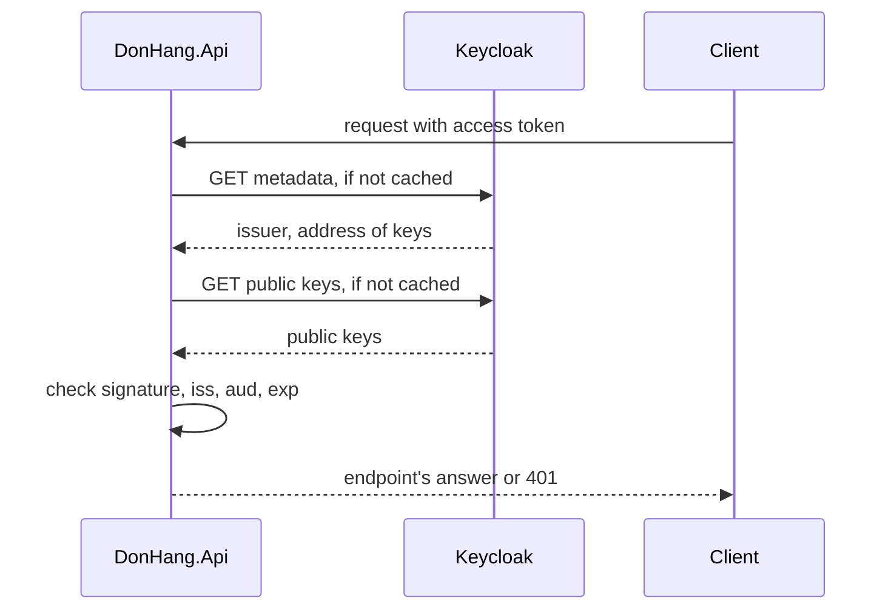

## Bạn cần biết trước

- [[backend.l2.openid-connect-id-token]] — bạn biết access token do Keycloak cấp mang `donhang-api` trong `aud` và id của Keycloak cho người dùng trong `sub`. Bài này chỉ ra API tin một token như vậy bằng cách nào.
- [[backend.l1.validating-a-jwt]] — bạn biết `UseAuthentication` kiểm chữ ký, issuer, audience và thời hạn của bearer token ở mỗi request. Ở đây vẫn là các bước kiểm đó, nhưng chữ ký do bên khác tạo.

## Tình huống

Ở stage-1, `DonHang.Api` ký token bằng một khóa bí mật trong cấu hình của nó và kiểm token bằng chính khóa đó. Ở stage-2, Keycloak ký token. Có người đề xuất chép khóa ký bí mật của Keycloak vào cấu hình của API. Khi đó ai đọc được cấu hình ấy, hay lỗi nào làm lộ nó, đều tạo được token hợp lệ cho bất kỳ khách nào hoặc cho một nhân viên. Cách khác là hỏi Keycloak về mọi token, nghĩa là thêm một lời gọi vào mỗi request và khiến mọi request đã đăng nhập thất bại khi Keycloak sập. Vậy API kiểm một chữ ký mà nó không tạo được, mà không phải hỏi Keycloak mỗi lần, bằng cách nào?

## Khái niệm cốt lõi

- khóa dùng chung — cách làm ở stage-1: một bí mật vừa ký bằng HMAC vừa kiểm, nên thứ gì kiểm được token cũng tạo được token.
- private key — một nửa của một cặp khóa, tức hai khóa được tạo cùng nhau sao cho chữ ký tạo bằng khóa này chỉ kiểm được bằng khóa kia. Private key tạo chữ ký, và Keycloak không bao giờ đưa nó ra ngoài.
- **public key** (nửa công khai của một cặp khóa: kiểm được chữ ký do private key tương ứng tạo, nhưng không tạo được chữ ký) — nửa có thể chia sẻ của một cặp khóa: nó kiểm được chữ ký do private key tương ứng tạo, nhưng không tự tạo được chữ ký nào.
- metadata document — tài liệu JSON mà Keycloak công bố cho mỗi realm, ghi issuer của realm và địa chỉ các public key của nó.

## Cơ chế hoạt động



Trong tình huống trên, Keycloak ký mỗi access token bằng private key của nó. Public key tương ứng được công bố cho ai cũng tải được. Chữ ký tạo bằng private key sẽ khớp khi kiểm bằng public key. Chỉ cần sửa một claim là bước kiểm thất bại, y như với khóa ở stage-1. Khác biệt là public key không tạo được chữ ký mới, nên API giữ nó mà vẫn không thể tạo token.

API biết tìm key ở đâu nhờ metadata document của realm. `AddJwtBearer` tải document đó cùng các public key mà nó trỏ tới, rồi giữ chúng trong bộ nhớ; thỉnh thoảng nó mới tải lại, không bao giờ tải cho từng request. Nó tự kiểm mỗi request: chữ ký với public key, `iss` với issuer trong document, `aud` với `donhang-api`, và `exp` với đồng hồ. Request qua được cả bốn bước kiểm thì đi tiếp tới endpoint; nếu một bước thất bại ở endpoint cần người gọi đã đăng nhập, API trả `401`.

Riêng `sub` cần thêm một bước. Nó là id của Keycloak cho người dùng, một chuỗi dài như `92f6ba26-729c-4d61-854b-c04c9f2db11a`, không phải số trong `customers.id`. Ở stage-1, API đọc `sub` thành số khách hàng. Ở stage-2, mỗi dòng khách hàng lưu id Keycloak của mình trong một cột mới, `identity_subject`, và API tìm khách theo cột đó. Người gọi không có dòng như vậy, ví dụ tài khoản nhân viên, qua được bốn bước kiểm nhưng sau đó nhận `403` từ bước tìm này khi định đặt đơn.

## Trong hệ thống Đơn Hàng

`Program.cs` cấu hình bước kiểm bằng địa chỉ của realm và không có gì bí mật:

```csharp file=DonHang.Api/Program.cs tag=stage-2 lines=37-51
// Keycloak issues the tokens; the api only checks them. AddJwtBearer reads
// Keycloak's metadata and public keys once, then checks each token's
// signature, issuer, audience and expiry itself, without calling Keycloak.
var authority = builder.Configuration["Keycloak:Authority"]
    ?? throw new InvalidOperationException("Keycloak:Authority is not set");
builder.Services.AddAuthentication(JwtBearerDefaults.AuthenticationScheme)
    .AddJwtBearer(options =>
    {
        options.Authority = authority;
        options.MetadataAddress = builder.Configuration["Keycloak:MetadataAddress"]
            ?? $"{authority}/.well-known/openid-configuration";
        // Access tokens for this api carry "donhang-api" in `aud`; an ID token
        // carries the app's client id there instead, so it is rejected.
        options.Audience = "donhang-api";
        options.RequireHttpsMetadata = false; // the lab reaches Keycloak over plain HTTP
```

`Authority` là địa chỉ của realm, `localhost:8180` nối với `/realms/donhang`, cũng là giá trị token mang trong `iss`. `MetadataAddress` là nơi tải metadata document. Nếu không đặt, địa chỉ đó là `Authority` cộng `/.well-known/openid-configuration`.

Trong lab, file khởi động các container của lab, `docker-compose.yml`, đặt `MetadataAddress` thành `keycloak:8080`, vì bên trong container của API thì `localhost` là chính API. Document tải theo đường này vẫn ghi realm ở `localhost:8180` là issuer, nên bước kiểm `iss` vẫn khớp. Trên Docker network của lab, API gọi Keycloak bằng cái tên nó có trên mạng đó, `keycloak`, ở cổng 8080; còn 8180 là cổng trình duyệt của bạn dùng từ bên ngoài. `RequireHttpsMetadata = false` có mặt chỉ vì lab nói chuyện với Keycloak qua HTTP thường. Cấu hình này không có khóa ký nào cả.

Bước tìm khách nằm trong `OrdersController`:

```csharp file=DonHang.Api/Controllers/OrdersController.cs tag=stage-2 lines=117-124
    // lesson: backend.l2.validating-provider-tokens
    // `sub` is Keycloak's id for the caller, not a customers.id, so it is
    // looked up in customers.identity_subject instead of parsed as a number.
    private async Task<Customer?> CurrentCustomerAsync()
    {
        var subject = User.FindFirstValue("sub");
        return subject is null ? null : await customers.FindByIdentitySubjectAsync(subject);
    }
```

`User` giữ các claim của token vừa qua được các bước kiểm. `FindByIdentitySubjectAsync` tìm dòng có `identity_subject` bằng `sub`, hoặc trả `null`. Một migration đã thêm cột đó, kèm unique index, và điền giá trị cho năm khách có sẵn khi database của lab khởi tạo. `POST /api/v1/orders` trả `403` khi hàm này trả `null`.

## Người mới hay nghĩ rằng…

- **"API phải hỏi Keycloak ở mỗi request xem token còn hợp lệ không."** → Thực ra API tải metadata và public key từ trước, giữ chúng trong bộ nhớ, rồi tự kiểm mọi token ngay trong process của nó. Bạn sẽ nhận ra khi đọc `Program.cs`: nó chỉ cho API biết tải key ở đâu, chứ không có lời gọi nào cho từng token.
- **"Ai tải được public key thì cũng ký được token bằng nó."** → Thực ra public key chỉ kiểm được chữ ký; muốn tạo chữ ký phải có private key, thứ không bao giờ rời Keycloak. Bạn sẽ nhận ra khi mở trang public key của realm trong trình duyệt: ai cũng đọc được, vậy mà API vẫn từ chối token bị ai đó sửa claim.

## Thử ngay (3 phút)

1. Khi hệ thống ví dụ đang chạy (`scripts/up.sh`), mở `localhost:8180/realms/donhang/.well-known/openid-configuration` trong trình duyệt. Đây là metadata document.
2. Tìm `issuer` và `jwks_uri`, rồi mở địa chỉ trong `jwks_uri`. Trang đó liệt kê các public key của realm.

Kết quả mong đợi: `issuer` là đúng địa chỉ realm mà token mang trong `iss`, và trang key hiện danh sách `keys`, trong đó có một key với `"use": "sig"` và `"alg": "RS256"`; đó là public key API dùng để kiểm chữ ký. RS256 là tên một phương pháp ký dùng cặp khóa, được dùng ở đây thay cho HMAC-SHA256 của stage-1.

## Liên hệ

- [[backend.l1.validating-a-jwt]] — vẫn bốn bước kiểm đó, chỉ đổi khóa dùng chung thành public key của Keycloak.
- [[backend.l1.issuing-a-jwt]] — phía ngược lại: ở đó API tạo chữ ký, ở đây nó chỉ kiểm.
- [[backend.l2.refresh-tokens]] — cái giá của việc kiểm token tại chỗ: API vẫn nhận một token cho tới khi nó hết hạn, nên access token được giữ ở thời hạn ngắn.
- [[backend.l2.role-based-access]] — công dụng tiếp theo của token đã kiểm: claim `roles` quyết định người gọi được làm gì.

## Tóm tắt 5 dòng

1. API kiểm token của Keycloak bằng public key của Keycloak, thứ kiểm được chữ ký nhưng không bao giờ tạo được.
2. Ở stage-1, một khóa dùng chung vừa ký vừa kiểm, nên thứ gì kiểm được token cũng giả mạo được token.
3. `AddJwtBearer` tải metadata document và public key của realm từ `Authority` hoặc `MetadataAddress` rồi giữ trong bộ nhớ.
4. Sau đó nó tự kiểm chữ ký, `iss`, `aud` và `exp` ở mọi request, không gọi Keycloak.
5. `sub` là id người dùng của Keycloak, nên API tìm khách qua `customers.identity_subject`, không đọc nó thành số.
