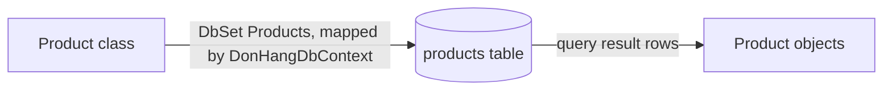

## Before you start

- [[backend.l1.get-and-status-codes]] — you know `ProductsController.Get(int id)` calls `db.Products.FindAsync(id)` and gets back one row's worth of data; this lesson is about the piece that turns that row into the `Product` object `Get` actually works with.
- [[foundation.l1.tables-keys-relations]] — you know the `products` table's shape: a primary key `id`, plus `name` and `price_vnd`.

## The situation

A teammate asks: `ProductsController.Get(int id)` calls `db.Products.FindAsync(id)` and gets back a `Product` object, `product`, which it then reads `Id`, `Name`, and `PriceVnd` from. But nowhere in that method does anything open a connection, write SQL, or parse the rows a query hands back. Where does `product` come from, and how does it end up matching the `products` table's columns — `price_vnd`, not `PriceVnd` — when nothing in the `Product` class itself says anything about a database at all?

## Core concepts

- **ORM (object-relational mapper)** — a library mapping classes in code to database tables, so most queries don't need hand-written SQL.
- `DbContext` — a class standing between your code and the database; asking it for data returns C# objects, not the rows a query hands back.
- `DbSet<T>` — the type of a property on the `DbContext` that stands for one table as a queryable collection of `T` objects; `DbSet<Product>` stands for the whole `products` table.
- column mapping — by default, EF Core — the ORM this project uses — expects a table column with the exact same name as the C# property; when the names differ (`PriceVnd` in C#, `price_vnd` in the database), the mapping has to say so explicitly.

## How it works



A `DbContext` is the object standing between your code and the database: you ask its `DbSet<Product>` for data, and it comes back as `Product` objects, already built — no row, no column, no SQL visible to the code that asked. That's the "O/R" in object-relational mapper: an object on one side, a relational table on the other, and the `DbContext` doing the translation between them. The diagram's first arrow is that translation itself — this project's own `DbContext`, `DonHangDbContext`, binds the `Product` class to the `products` table, once, ahead of any one query; the second arrow is what one query's rows come back as, every time it runs.

The translation needs to know two things for every property: which table, and which column. By default, EF Core assumes a column exists with the exact same name as the property — a `Product.Name` property expects a `Name` column. The Đơn Hàng database doesn't use that casing: its columns are snake_case (`price_vnd`), while `Product`'s properties are PascalCase (`PriceVnd`), the normal casing for a C# property. Nothing about the framework auto-translates one casing into the other; wherever a name doesn't match by default, the mapping has to name the real column explicitly.

A schema is the tables and columns the database already has. In Đơn Hàng the tables were created before this C# code, so the mapping does not invent a schema — it is written against one that already exists: `Product` describes what a `products` row already looks like, not what the table should look like, one column at a time. That is what the title means: the class is written to fit the table, never the other way around.

## In the Đơn Hàng system

`Product`, in `DonHang.Domain/Entities.cs`, is a plain class:

```csharp file=DonHang.Domain/Entities.cs tag=stage-1 lines=17-22
public sealed class Product
{
    public int Id { get; set; }
    public required string Name { get; set; }
    public int PriceVnd { get; set; }
}
```

Three properties, no attributes, no base class, nothing in the class itself pointing at a database — it's just a shape. `DonHangDbContext`, this project's own class built on EF Core's `DbContext`, is what connects that shape to the real `products` table. It declares one `DbSet<T>` property per table; the one for `Product` is `public DbSet<Product> Products => Set<Product>();`, where `Set<Product>()` is how the `DbContext` gives back the `DbSet<Product>` for that table. `Products => Set<Product>()` is what `Get(int id)`, from `get-and-status-codes`, reaches through when it calls `db.Products.FindAsync(id)` — `db` being a `DonHangDbContext` that ASP.NET Core hands to `ProductsController` when the request is served (how that handing-over is wired up is not this lesson's subject). That call is what turns one row into the `Product` object named `product`.

The column mapping lives elsewhere, in `OnModelCreating` — a method on `DonHangDbContext` that EF Core calls when it builds the mapping, handing it a `modelBuilder` to describe each class with. `modelBuilder.Entity<Product>(e => …)` opens the description of `Product` specifically, and gives the code inside the block a parameter, `e`: the first line calls `ToTable` on it to name the table, and each line after it calls `Property`, one per property:

```csharp file=DonHang.Infrastructure/DonHangDbContext.cs tag=stage-1 lines=30-36
        modelBuilder.Entity<Product>(e =>
        {
            e.ToTable("products");
            e.Property(p => p.Id).HasColumnName("id");
            e.Property(p => p.Name).HasColumnName("name");
            e.Property(p => p.PriceVnd).HasColumnName("price_vnd");
        });
```

`ToTable("products")` says which table `Product` maps to; each `Property(p => p.X)` names which property of `Product` that line configures, and the `HasColumnName(...)` chained onto it says which column that property reads and writes. Against this PostgreSQL database, case counts as a difference, the same way `PriceVnd` and `price_vnd` do: `Id` is not the same string as `id`, nor `Name` the same as `name`. So `HasColumnName` is required for all three properties — none of them is relying on a name matching by accident. `PriceVnd` is just the one where the break is easiest to see: left unconfigured, EF Core would ask PostgreSQL for a column literally named `PriceVnd`, and the query would fail at runtime — PostgreSQL answers with an error saying the column `PriceVnd` does not exist — because the table only has `price_vnd`.

## Beginners often think…

- **"EF Core automatically figures out that `PriceVnd` in C# means the same thing as `price_vnd` in the database."** → Actually EF Core's default expects an exact name match; `PriceVnd` and `price_vnd` are different strings, and nothing built into the framework relates PascalCase to snake_case on its own. `OnModelCreating`'s `HasColumnName("price_vnd")` is what makes the connection, explicitly, one property at a time.
- **"A `DbSet<Product>` is just a `List<Product>` that EF Core has already filled with every row."** → Actually a `DbSet<Product>` doesn't hold any `Product` objects until something asks it a question — `Get(int id)`'s `FindAsync(id)` call is what makes EF Core actually read one row from PostgreSQL and hand back a `Product` built from it. A `List<Product>` already holds its items; a `DbSet<Product>` is a standing question you can ask about a table, holding nothing until it is asked.

## Try it (3 minutes)

1. From the Đơn Hàng project's root folder, with the example system running (`scripts/up.sh`), run `curl -s http://localhost:8080/api/v1/products/1`.
2. Compare the response's field names, `Product`'s property names, and the column names in `OnModelCreating` — which spelling belongs to which step?

Expected result: the response reads `{"id":1,"name":"Bàn phím cơ","priceVnd":1250000}` (camelCase, from serialization, per `dtos-and-serialization`); the database column behind it is `price_vnd`, and the C# property mapped to that column is `PriceVnd`. Three different spellings for the same value, at three different steps — and the one the client sees, `priceVnd`, is never the database's own.

<details><summary>Suggested answer</summary>

`price_vnd` (the column) is mapped to `PriceVnd` (the `Product` property) by `HasColumnName("price_vnd")` in `OnModelCreating`; `ProductsController` reads `product.PriceVnd` into a `ProductDto`, and `PriceVnd` is then serialized to `priceVnd` (the JSON field) because ASP.NET Core writes response fields in camelCase by default. The database's name never reaches the response directly — it passes through the mapping first.

</details>

## Connections

- [[backend.l1.get-and-status-codes]] — `ProductsController.Get(int id)`, the code that turns one `products` row into the JSON object this lesson traces back to its table.
- [[backend.l1.dtos-and-serialization]] — the second name change, `PriceVnd` to `priceVnd`, that happens after this lesson's mapping already ran.
- [[backend.l1.efcore-relationships-and-keys]] — the next piece of `OnModelCreating`, for tables related to each other instead of standing alone.

## Five-line summary

1. A `DbContext` maps C# classes to database tables; asking a `DbSet<T>` for data returns objects, not rows.
2. `DbSet<Product>` on `DonHangDbContext` represents the whole `products` table as a queryable collection of `Product` objects.
3. By default, EF Core expects a column with the exact same name as the property; a mismatch needs explicit configuration.
4. `OnModelCreating`'s `HasColumnName("price_vnd")` is what connects `Product.PriceVnd` to the real `price_vnd` column.
5. In Đơn Hàng, the mapping targets a schema that already exists — `Product`'s shape follows `products`, not the other way around.
