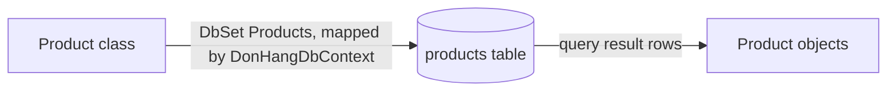

## Bạn cần biết trước

- [[backend.l1.get-and-status-codes]] — bạn đã biết `ProductsController.Get(int id)` gọi `db.Products.FindAsync(id)` và nhận về dữ liệu của một dòng; bài này nói về phần biến dòng đó thành object `Product` mà `Get` thực sự làm việc cùng.
- [[foundation.l1.tables-keys-relations]] — bạn đã biết hình dạng bảng `products`: một khóa chính `id`, cộng `name` và `price_vnd`.

## Tình huống

Một đồng nghiệp hỏi: `ProductsController.Get(int id)` gọi `db.Products.FindAsync(id)` và nhận về một object `Product`, `product`, rồi đọc `Id`, `Name`, và `PriceVnd` từ đó. Nhưng không đâu trong method đó mở kết nối, viết SQL, hay phân tích những dòng dữ liệu một truy vấn trả về. `product` từ đâu ra, và làm sao nó khớp được với các cột của bảng `products` — `price_vnd`, không phải `PriceVnd` — khi bản thân class `Product` không hề nói gì về database cả?

## Khái niệm cốt lõi

- **ORM (object-relational mapper)** — một thư viện ánh xạ class trong code sang bảng database, để hầu hết truy vấn không cần viết SQL tay.
- `DbContext` — một class đứng giữa code của bạn và database; hỏi nó xin dữ liệu trả về object C#, không phải những dòng một truy vấn trả về.
- `DbSet<T>` — kiểu của một property trên `DbContext` đại diện cho một bảng, dưới dạng một collection có thể truy vấn gồm các object `T`; `DbSet<Product>` đại diện cho toàn bộ bảng `products`.
- ánh xạ cột — mặc định, EF Core — ORM mà dự án này dùng — kỳ vọng một cột database có tên chính xác trùng với property C#; khi tên khác nhau (`PriceVnd` trong C#, `price_vnd` trong database), mapping phải nói rõ điều đó.

## Cơ chế hoạt động



Một `DbContext` là object đứng giữa code của bạn và database: bạn hỏi `DbSet<Product>` của nó xin dữ liệu, và nó trả về dưới dạng object `Product`, đã dựng sẵn — không dòng, không cột, không SQL nào lộ ra cho code đã hỏi. Đó là chữ "O/R" trong object-relational mapper: một object ở một phía, một bảng quan hệ ở phía kia, và `DbContext` làm công việc chuyển đổi giữa hai bên. Mũi tên đầu của diagram chính là việc chuyển đổi đó — `DbContext` riêng của dự án này, `DonHangDbContext`, gắn class `Product` với bảng `products`, một lần, trước bất kỳ truy vấn nào; mũi tên thứ hai là những gì các dòng của một truy vấn trở thành, mỗi lần nó chạy.

Việc chuyển đổi cần biết hai thứ cho mỗi property: bảng nào, và cột nào. Mặc định, EF Core giả định có một cột tồn tại với tên chính xác trùng property — một property `Product.Name` kỳ vọng một cột `Name`. Database Đơn Hàng không dùng cách viết hoa đó: cột của nó là snake_case (`price_vnd`), trong khi property của `Product` là PascalCase (`PriceVnd`), cách viết hoa bình thường cho một property C#. Không gì trong framework tự động dịch cách viết hoa này sang cách kia; hễ tên không khớp theo mặc định, mapping phải tường minh nêu tên cột thật.

Một schema là các bảng và cột database đã có sẵn. Trong Đơn Hàng, các bảng được tạo trước đoạn code C# này, nên mapping không bịa ra một schema — nó được viết dựa theo một schema đã tồn tại sẵn: `Product` mô tả một dòng `products` đã trông như thế nào, không phải bảng nên trông như thế nào, từng cột một. Đó là điều tiêu đề bài muốn nói: class được viết để khớp với bảng, không bao giờ ngược lại.

## Trong hệ thống Đơn Hàng

`Product`, trong `DonHang.Domain/Entities.cs`, là một class thuần:

```csharp file=DonHang.Domain/Entities.cs tag=stage-1 lines=17-22
public sealed class Product
{
    public int Id { get; set; }
    public required string Name { get; set; }
    public int PriceVnd { get; set; }
}
```

Ba property, không attribute, không base class, không gì trong bản thân class trỏ tới database — nó chỉ là một hình dạng. `DonHangDbContext`, class riêng của dự án này xây trên `DbContext` của EF Core, là thứ nối hình dạng đó với bảng `products` thật. Nó khai báo một property `DbSet<T>` cho mỗi bảng; cái cho `Product` là `public DbSet<Product> Products => Set<Product>();`, trong đó `Set<Product>()` là cách `DbContext` trả lại `DbSet<Product>` cho bảng đó. `Products => Set<Product>()` là thứ `Get(int id)`, từ bài `get-and-status-codes`, chạm tới khi nó gọi `db.Products.FindAsync(id)` — `db` là một `DonHangDbContext` mà ASP.NET Core trao cho `ProductsController` khi request được phục vụ (việc trao đó được nối dây thế nào không phải chủ đề bài này). Lệnh gọi đó là thứ biến một dòng dữ liệu thành object `Product` tên `product`.

Việc ánh xạ cột nằm ở chỗ khác, trong `OnModelCreating` — một method trên `DonHangDbContext` mà EF Core gọi khi nó dựng mapping, trao cho nó một `modelBuilder` để mô tả từng class. `modelBuilder.Entity<Product>(e => …)` mở phần mô tả riêng cho `Product`, và trao cho code bên trong khối một tham số, `e`: dòng đầu gọi `ToTable` trên nó để đặt tên bảng, và mỗi dòng sau đó gọi `Property`, mỗi property một dòng:

```csharp file=DonHang.Infrastructure/DonHangDbContext.cs tag=stage-1 lines=30-36
        modelBuilder.Entity<Product>(e =>
        {
            e.ToTable("products");
            e.Property(p => p.Id).HasColumnName("id");
            e.Property(p => p.Name).HasColumnName("name");
            e.Property(p => p.PriceVnd).HasColumnName("price_vnd");
        });
```

`ToTable("products")` nói `Product` map tới bảng nào; mỗi `Property(p => p.X)` nêu tên property nào của `Product` mà dòng đó cấu hình, và `HasColumnName(...)` nối theo sau nói rõ property đó đọc và ghi vào cột nào. Với database PostgreSQL này, chữ hoa/thường tính là một khác biệt, giống hệt cách `PriceVnd` và `price_vnd` khác nhau: `Id` không phải cùng chuỗi với `id`, `Name` cũng không giống `name`. Vậy nên `HasColumnName` là bắt buộc cho cả ba property — không property nào dựa vào việc tên tình cờ khớp nhau. `PriceVnd` chỉ là cái dễ thấy sự đổ vỡ nhất: nếu không cấu hình, EF Core sẽ hỏi PostgreSQL một cột tên đúng là `PriceVnd`, và truy vấn sẽ lỗi ngay lúc chạy — PostgreSQL trả lời bằng một lỗi nói cột `PriceVnd` không tồn tại — vì bảng chỉ có `price_vnd`.

## Người mới hay nghĩ rằng…

- **"EF Core tự động hiểu rằng `PriceVnd` trong C# nghĩa là cùng một thứ với `price_vnd` trong database."** → Thực ra mặc định của EF Core kỳ vọng khớp tên chính xác; `PriceVnd` và `price_vnd` là hai chuỗi khác nhau, và không gì có sẵn trong framework liên hệ PascalCase với snake_case. `HasColumnName("price_vnd")` trong `OnModelCreating` là thứ tường minh tạo ra mối liên hệ đó, từng property một.
- **"`DbSet<Product>` chỉ là một `List<Product>` mà EF Core đã nạp sẵn mọi dòng."** → Thực ra `DbSet<Product>` không giữ object `Product` nào cho tới khi có gì đó hỏi nó một câu hỏi — lệnh gọi `FindAsync(id)` của `Get(int id)` là thứ khiến EF Core thực sự đọc một dòng từ PostgreSQL và trả về một `Product` dựng từ đó. Một `List<Product>` đã giữ sẵn các phần tử của nó; một `DbSet<Product>` là một câu hỏi thường trực bạn có thể đặt cho một bảng, không giữ gì cho tới khi được hỏi.

## Thử ngay (3 phút)

1. Từ thư mục gốc của dự án Đơn Hàng, với hệ thống ví dụ đang chạy (`scripts/up.sh`), chạy `curl -s http://localhost:8080/api/v1/products/1`.
2. So sánh tên trường trong response, tên property của `Product`, và tên cột trong `OnModelCreating` — cách viết nào thuộc về bước nào?

Kết quả mong đợi: response đọc `{"id":1,"name":"Bàn phím cơ","priceVnd":1250000}` (camelCase, từ serialization, theo bài `dtos-and-serialization`); cột database đứng sau nó là `price_vnd`, và property C# map tới cột đó là `PriceVnd`. Ba cách viết khác nhau cho cùng một giá trị, ở ba bước khác nhau — và cái client thấy, `priceVnd`, không bao giờ là của riêng database.

<details><summary>Gợi ý đáp án</summary>

`price_vnd` (cột) được map tới `PriceVnd` (property của `Product`) bởi `HasColumnName("price_vnd")` trong `OnModelCreating`; `ProductsController` đọc `product.PriceVnd` vào một `ProductDto`, rồi `PriceVnd` được serialize thành `priceVnd` (trường JSON) vì ASP.NET Core mặc định viết trường response theo camelCase. Tên của database không bao giờ tới thẳng response — nó đi qua mapping trước.

</details>

## Liên hệ

- [[backend.l1.get-and-status-codes]] — `ProductsController.Get(int id)`, đoạn code biến một dòng `products` thành object JSON mà bài này lần ngược về bảng của nó.
- [[backend.l1.dtos-and-serialization]] — lần đổi tên thứ hai, `PriceVnd` thành `priceVnd`, xảy ra sau khi mapping của bài này đã chạy xong.
- [[backend.l1.efcore-relationships-and-keys]] — phần tiếp theo của `OnModelCreating`, cho các bảng có quan hệ với nhau thay vì đứng riêng lẻ.

## Tóm tắt 5 dòng

1. Một `DbContext` ánh xạ class C# sang bảng database; hỏi một `DbSet<T>` xin dữ liệu trả về object, không phải dòng.
2. `DbSet<Product>` trên `DonHangDbContext` đại diện cho toàn bộ bảng `products`, dưới dạng một collection có thể truy vấn gồm các object `Product`.
3. Mặc định, EF Core kỳ vọng một cột có tên chính xác trùng property; lệch tên cần cấu hình tường minh.
4. `HasColumnName("price_vnd")` trong `OnModelCreating` là thứ nối `Product.PriceVnd` với cột `price_vnd` thật.
5. Trong Đơn Hàng, mapping nhắm tới một schema đã tồn tại sẵn — hình dạng của `Product` đi theo `products`, không phải ngược lại.
