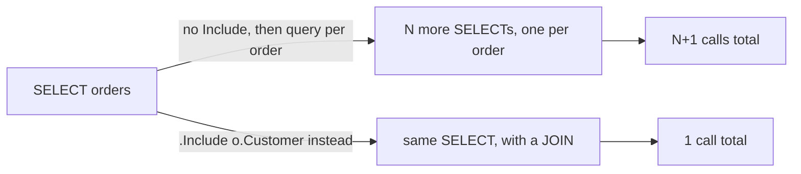

## Before you start

- [[backend.l1.querying-with-linq]] — you know a LINQ query is how `EfOrderRepository` asks PostgreSQL for rows, and that it only runs when something asks it for results.
- [[backend.l1.saving-changes]] — you know a change tracker keeps entities in memory.

## The situation

A teammate is about to write a method that fetches a customer's orders, each one together with its customer's name. Before reaching for `.Include(o => o.Customer)`, they try the version that reads more obviously — fetch the orders, then loop over them and run a query for each order's customer (`db.Customers.FirstOrDefaultAsync(c => c.Id == o.CustomerId)`). With PostgreSQL's query logging turned on, one customer with 7 orders produces 8 `SELECT` statements this way: one for the orders, then one more per order for its customer — even repeats of the same customer send a fresh query each time. The code that actually shipped, using `.Include`, sends exactly one. Why does the loop cost so much more than `.Include`?

## Core concepts

- **N+1 (query problem)** — a performance bug: looping over `N` rows and querying separately for each one costs `N+1` database calls, one for the rows and one more per row, instead of one call that returns everything together.
- **eager loading** — fetching related data in the same query as the rows that need it, instead of a separate query for it later.
- `.Include(...)` — the EF Core method you chain onto a LINQ query to ask for eager loading; EF Core folds the related table into the same SQL statement as a JOIN.

## How it works



The N+1 shape starts innocently: a query fetches a list of rows — here, one customer's orders — and that's one call. Then, for each row in that list, a second query fetches the one related row it needs — here, that order's customer. One call per order, on top of the first one, is where the name comes from: `N` orders mean `N` extra calls, plus the original one, `N+1` in total. Nothing about this is a bug in any single line; each query, on its own, does exactly what it's written to do. The cost comes from writing that second query inside a loop instead of asking for the related rows up front — each one of those calls is its own round trip to PostgreSQL, network time the single-query version never pays.

`.Include(...)` sidesteps the loop entirely. Instead of a separate query per row, it tells EF Core to fetch the related table in the *same* query as the rows themselves, joining the two server-side and returning one combined result set. Whether the order list has one row or a thousand, that query count stays exactly one — the joined query returns wider rows (the customer's columns repeat on every order row), but PostgreSQL still only gets asked once.

The gap between the two grows with the data, not with the code: for a customer with one order, the loop version costs two calls against `.Include`'s one — barely worth noticing. For the seven-order customer above, it's eight against one. Neither version's source code changes as more orders are added; only the loop version's call count does.

## In the Đơn Hàng system

`EfOrderRepository`'s two query methods both already use eager loading — this is what the code that shipped looks like, not the loop version described above:

```csharp file=DonHang.Infrastructure/EfOrderRepository.cs tag=stage-1 lines=9-14
    public Task<Order?> FindAsync(int id) =>
        db.Orders.Include(o => o.Items).FirstOrDefaultAsync(o => o.Id == id);

    // lesson: backend.l1.efcore-n-plus-one
    public Task<List<Order>> ListByCustomerAsync(int customerId) =>
        db.Orders.Where(o => o.CustomerId == customerId).Include(o => o.Customer).OrderBy(o => o.Id).ToListAsync();
```

`FindAsync` eager-loads `Items` the same way `ListByCustomerAsync` eager-loads `Customer`: EF Core puts both tables in one statement by default, and this project keeps it that way, so one `.Include(...)` call means one JOIN, one query, regardless of how many `OrderItem` rows an order has. Neither method loops over anything to fetch related data — the JOIN does that work inside the single query PostgreSQL runs.

`OrdersController.List()`, behind `GET /api/v1/orders`, is why `Customer` has to already be loaded before the loop that builds the response. What matters for that is the call to `ListByCustomerAsync`, then the `.Select(...)` that reads `Customer` off what it returned; `[Authorize]` and the `customerId` line above them are just routing and identity, and don't change how many queries run.

```csharp file=DonHang.Api/Controllers/OrdersController.cs tag=stage-1 lines=48-56
    // lesson: backend.l1.efcore-n-plus-one
    [Authorize]
    [HttpGet]
    public async Task<ActionResult<List<OrderSummaryDto>>> List()
    {
        var customerId = int.Parse(User.FindFirstValue(JwtRegisteredClaimNames.Sub)!);
        var orders = await repository.ListByCustomerAsync(customerId);
        return Ok(orders.Select(o => new OrderSummaryDto(o.Id, o.Status, o.Customer!.FullName)).ToList());
    }
```

`orders.Select(o => ... o.Customer!.FullName ...)` reads `Customer` once per order, inside a `.Select(...)` — a loop of its own. That read only works cheaply because `ListByCustomerAsync` already eager-loaded every order's `Customer` in the one query it ran; reading `o.Customer!.FullName` here doesn't ask PostgreSQL for anything, it reads a property that's already sitting in memory.

## Beginners often think…

- **"Accessing `order.Customer` inside a loop is always fast, since the data is already on the `order` object."** → Actually that's only true because `ListByCustomerAsync` eager-loaded `Customer` before the loop in `List()` ever ran. The belief is wrong about the reason, not about the speed — reading `order.Customer` from memory really is cheap. Nothing in this project fills `order.Customer` in by itself when you read it, so a different method that returned orders without `.Include(o => o.Customer)` would leave `order.Customer` `null`, unless an earlier query in the same request had already loaded that customer into the change tracker — a separate case from this lesson's loop example above, which always asks for a fresh row. The real risk isn't reading `.Customer` in a loop — it's a query method written to fetch each row's related data with a separate query, before any loop over the results even starts.
- **"N+1 only matters at a scale this course's example database will never reach."** → Actually the extra cost starts at the second row: three calls instead of one for a customer with just two orders. You notice this because the loop version's query count grows by one for every order added, while the eager-loaded version's count never changes from one.

## Try it (3 minutes)

1. From the Đơn Hàng project's root folder, with the example system running (`scripts/up.sh`), turn on PostgreSQL's query log: `docker exec donhang-db psql -U donhang -d donhang -c "ALTER SYSTEM SET log_statement = 'all';" -c "SELECT pg_reload_conf();"`.
2. Run step 1 of `creating-a-resource`'s Try it to log in as `anh.tran@example.com` (`donhang-dev-password`) and copy the token. Then call: `curl -sS http://localhost:8080/api/v1/orders -H "Authorization: Bearer <token>"` (replace `<token>` with the value you copied).
3. Check the log: `docker logs donhang-db --since 1m | grep -iA 2 "execute <unnamed>: SELECT"` — `-A 2` also prints each match's next two lines, since the table name comes right after `SELECT`, not on the same line. The login logs a `SELECT` of its own too; the statement that belongs to this call is the one whose next lines read `FROM orders AS o` — you should see exactly one match with that shape.
4. Turn logging back off: `docker exec donhang-db psql -U donhang -d donhang -c "ALTER SYSTEM SET log_statement = 'none';" -c "SELECT pg_reload_conf();"`.

Expected result: exactly one `SELECT` from `orders` in the log, no matter how many orders come back — `ListByCustomerAsync`'s single `.Include(o => o.Customer)` joins the customer in server-side, so the response's entry count changes the number of rows that one statement returns, not the number of statements.

<details><summary>Suggested answer</summary>

`.Include(o => o.Customer)` is written once, in the query itself, not once per order — so the number of orders a customer has never changes how many times it runs; the log shows exactly one `SELECT`. A version that queried each order's customer inside a loop would show one more `SELECT` per order in that same log.

</details>

## Connections

- [[backend.l1.querying-with-linq]] — `.Include(...)` folding a JOIN into one SQL statement, the mechanism this lesson relies on to avoid a query per row.
- [[backend.l1.saving-changes]] — the write side's one-call-does-everything shape; `SaveChangesAsync` batches staged changes the same way `.Include` batches related rows, both trading a loop of separate calls for one combined one.

## Five-line summary

1. N+1 queries once for a list of rows, then once more per row for that row's related data — `N` rows cost `N+1` calls.
2. `.Include(...)` avoids the loop by joining the related rows into the same query, so the count stays one no matter how many rows come back.
3. `EfOrderRepository.FindAsync` and `ListByCustomerAsync` both already eager-load — `Items` and `Customer` — with one `.Include(...)` each.
4. `OrdersController.List()` reads `order.Customer!.FullName` in a loop safely only because `Customer` was already eager-loaded first.
5. The gap between one query and N+1 grows with the row count, not the code — the query method's source stays fixed.
