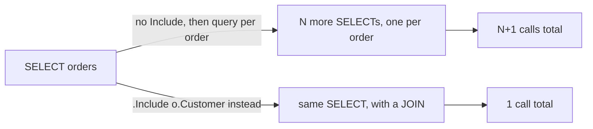

## Bạn cần biết trước

- [[backend.l1.querying-with-linq]] — bạn biết truy vấn LINQ là cách `EfOrderRepository` hỏi PostgreSQL xin dòng dữ liệu, và nó chỉ chạy khi có gì đó hỏi xin kết quả.
- [[backend.l1.saving-changes]] — bạn biết change tracker giữ các entity trong bộ nhớ.

## Tình huống

Một đồng nghiệp sắp viết một method lấy các order của một customer, mỗi order kèm tên customer của nó. Trước khi dùng `.Include(o => o.Customer)`, họ thử phiên bản đọc có vẻ hiển nhiên hơn — lấy các order, rồi lặp qua chúng và chạy một truy vấn cho customer của từng order (`db.Customers.FirstOrDefaultAsync(c => c.Id == o.CustomerId)`). Với query logging của PostgreSQL bật lên, một customer có 7 order tạo ra 8 câu `SELECT` theo cách này: một cho các order, rồi thêm một cho customer của mỗi order — kể cả khi lặp lại cùng một customer, mỗi lần vẫn gửi một truy vấn mới. Code đã shipped, dùng `.Include`, chỉ gửi đúng một. Vì sao phiên bản vòng lặp tốn nhiều hơn `.Include` đến vậy?

## Khái niệm cốt lõi

- **N+1 (query problem)** — lỗi hiệu năng: lặp qua `N` dòng và truy vấn riêng cho từng dòng tốn `N+1` lượt gọi database, một cho các dòng và thêm một cho mỗi dòng, thay vì một lượt gọi trả về mọi thứ cùng nhau.
- **eager loading** — nạp sẵn dữ liệu liên quan trong cùng truy vấn với các dòng cần nó, thay vì một truy vấn riêng sau đó.
- `.Include(...)` — method của EF Core bạn nối vào một truy vấn LINQ để xin eager loading; EF Core gộp bảng liên quan vào cùng câu SQL dưới dạng một JOIN.

## Cơ chế hoạt động



Hình dạng N+1 bắt đầu rất vô hại: một truy vấn lấy về một danh sách dòng — ở đây là các order của một customer — và đó là một lượt gọi. Rồi, với mỗi dòng trong danh sách đó, một truy vấn thứ hai lấy đúng một dòng liên quan nó cần — ở đây là customer của order đó. Một lượt gọi cho mỗi order, cộng thêm vào lượt gọi đầu tiên, chính là nguồn gốc cái tên: `N` order nghĩa là `N` lượt gọi thêm, cộng lượt gọi gốc, tổng cộng `N+1`. Không dòng nào trong số này là bug cả; mỗi truy vấn, tự nó, làm đúng điều nó được viết ra để làm. Chi phí đến từ việc viết truy vấn thứ hai đó bên trong một vòng lặp, thay vì xin sẵn các dòng liên quan ngay từ đầu — mỗi lượt gọi đó là một round trip riêng tới PostgreSQL, thời gian mạng mà phiên bản một-truy-vấn không bao giờ phải trả.

`.Include(...)` né hẳn vòng lặp. Thay vì một truy vấn riêng cho mỗi dòng, nó báo cho EF Core lấy bảng liên quan trong *cùng* truy vấn với các dòng chính, join hai bảng ngay phía server và trả về một tập kết quả gộp. Dù danh sách order có một dòng hay một nghìn dòng, số lượng truy vấn vẫn giữ nguyên đúng một — truy vấn đã join trả về các dòng rộng hơn (cột của customer lặp lại trên mỗi dòng order), nhưng PostgreSQL vẫn chỉ bị hỏi đúng một lần.

Khoảng cách giữa hai phiên bản tăng theo dữ liệu, không phải theo code: với một customer có một order, phiên bản vòng lặp tốn hai lượt gọi so với một của `.Include` — gần như không đáng để ý. Với customer bảy order ở trên, đó là tám so với một. Code nguồn của cả hai phiên bản không đổi khi có thêm order; chỉ số lượt gọi của phiên bản vòng lặp là tăng.

## Trong hệ thống Đơn Hàng

Hai method truy vấn của `EfOrderRepository` đều đã dùng eager loading — đây là code đã shipped, không phải phiên bản vòng lặp mô tả ở trên:

```csharp file=DonHang.Infrastructure/EfOrderRepository.cs tag=stage-1 lines=9-14
    public Task<Order?> FindAsync(int id) =>
        db.Orders.Include(o => o.Items).FirstOrDefaultAsync(o => o.Id == id);

    // lesson: backend.l1.efcore-n-plus-one
    public Task<List<Order>> ListByCustomerAsync(int customerId) =>
        db.Orders.Where(o => o.CustomerId == customerId).Include(o => o.Customer).OrderBy(o => o.Id).ToListAsync();
```

`FindAsync` eager-load `Items` giống hệt cách `ListByCustomerAsync` eager-load `Customer`: EF Core gộp cả hai bảng vào một câu lệnh theo mặc định, và project này giữ nguyên mặc định đó, nên một lệnh gọi `.Include(...)` nghĩa là một JOIN, một truy vấn, bất kể order có bao nhiêu dòng `OrderItem`. Không method nào lặp để lấy dữ liệu liên quan — JOIN làm việc đó bên trong truy vấn duy nhất mà PostgreSQL chạy.

`OrdersController.List()`, đứng sau `GET /api/v1/orders`, là lý do `Customer` phải được nạp sẵn trước khi vòng lặp dựng response chạy. Điều quan trọng ở đây là lệnh gọi `ListByCustomerAsync`, rồi tới `.Select(...)` đọc `Customer` từ kết quả đó; `[Authorize]` và dòng `customerId` phía trên chỉ là kiểm soát truy cập và định danh, không đổi số truy vấn chạy.

```csharp file=DonHang.Api/Controllers/OrdersController.cs tag=stage-1 lines=48-56
    // lesson: backend.l1.efcore-n-plus-one
    [Authorize]
    [HttpGet]
    public async Task<ActionResult<List<OrderSummaryDto>>> List()
    {
        var customerId = int.Parse(User.FindFirstValue(JwtRegisteredClaimNames.Sub)!);
        var orders = await repository.ListByCustomerAsync(customerId);
        return Ok(orders.Select(o => new OrderSummaryDto(o.Id, o.Status, o.Customer!.FullName)).ToList());
    }
```

`orders.Select(o => ... o.Customer!.FullName ...)` đọc `Customer` một lần cho mỗi order, bên trong một `.Select(...)` — một vòng lặp của riêng nó. Lượt đọc đó chỉ rẻ vì `ListByCustomerAsync` đã eager-load `Customer` của mọi order ngay trong truy vấn duy nhất nó chạy; đọc `o.Customer!.FullName` ở đây không hỏi PostgreSQL điều gì cả, nó chỉ đọc một property đã nằm sẵn trong bộ nhớ.

## Người mới hay nghĩ rằng…

- **"Đọc `order.Customer` bên trong vòng lặp luôn nhanh, vì dữ liệu đã có sẵn trên object `order`."** → Thực ra điều đó chỉ đúng vì `ListByCustomerAsync` đã eager-load `Customer` trước khi vòng lặp trong `List()` chạy. Niềm tin này sai ở lý do, không phải ở tốc độ — đọc `order.Customer` từ bộ nhớ đúng là rẻ thật. Không gì trong project này tự lấy dữ liệu cho `order.Customer` khi bạn đọc nó, nên một method khác trả về order mà không dùng `.Include(o => o.Customer)` sẽ để `order.Customer` là `null`, trừ khi một truy vấn trước đó trong cùng request đã nạp sẵn customer đó vào change tracker — một trường hợp khác với ví dụ vòng lặp ở trên của bài này, vốn luôn xin một dòng mới. Rủi ro thật không phải là đọc `.Customer` trong vòng lặp — mà là một method truy vấn được viết để lấy dữ liệu liên quan của từng dòng bằng một truy vấn riêng, trước khi vòng lặp trên kết quả đó kịp bắt đầu.
- **"N+1 chỉ đáng lo ở quy mô mà database ví dụ của khóa học này sẽ không bao giờ chạm tới."** → Thực ra chi phí thêm bắt đầu ngay từ dòng thứ hai: ba lượt gọi thay vì một cho một customer chỉ có hai order. Bạn nhận ra điều này vì số truy vấn của phiên bản vòng lặp tăng thêm một cho mỗi order được thêm vào, còn số truy vấn của phiên bản eager-load không bao giờ đổi khỏi một.

## Thử ngay (3 phút)

1. Từ thư mục gốc của dự án Đơn Hàng, với hệ thống ví dụ đang chạy (`scripts/up.sh`), bật query log của PostgreSQL: `docker exec donhang-db psql -U donhang -d donhang -c "ALTER SYSTEM SET log_statement = 'all';" -c "SELECT pg_reload_conf();"`.
2. Chạy bước 1 của phần Thử ngay ở bài `creating-a-resource` để đăng nhập với `anh.tran@example.com` (`donhang-dev-password`) và copy token. Sau đó gọi: `curl -sS http://localhost:8080/api/v1/orders -H "Authorization: Bearer <token>"` (thay `<token>` bằng giá trị bạn vừa copy).
3. Xem log: `docker logs donhang-db --since 1m | grep -iA 2 "execute <unnamed>: SELECT"` — `-A 2` in thêm hai dòng sau mỗi match, vì tên bảng nằm ngay dòng sau `SELECT`, không cùng dòng. Lượt đăng nhập cũng ghi log một `SELECT` riêng; câu lệnh thuộc về lượt gọi này là câu có hai dòng sau đọc `FROM orders AS o` — bạn sẽ thấy đúng một match có hình dạng đó.
4. Tắt log lại: `docker exec donhang-db psql -U donhang -d donhang -c "ALTER SYSTEM SET log_statement = 'none';" -c "SELECT pg_reload_conf();"`.

Kết quả mong đợi: đúng một `SELECT` từ `orders` trong log, bất kể có bao nhiêu order trả về — `.Include(o => o.Customer)` duy nhất của `ListByCustomerAsync` join customer ngay phía server, nên số entry trong response chỉ đổi số dòng mà câu lệnh đó trả về, không đổi số câu lệnh.

<details><summary>Gợi ý đáp án</summary>

`.Include(o => o.Customer)` chỉ được viết một lần, ngay trong truy vấn, không phải một lần cho mỗi order — nên số order một customer có không bao giờ đổi số lần nó chạy; log chỉ hiện đúng một `SELECT`. Một phiên bản truy vấn customer của từng order bên trong vòng lặp sẽ hiện thêm một `SELECT` cho mỗi order trong cùng log đó.

</details>

## Liên hệ

- [[backend.l1.querying-with-linq]] — `.Include(...)` gộp một JOIN vào một câu SQL duy nhất, cơ chế bài này dựa vào để tránh một truy vấn cho mỗi dòng.
- [[backend.l1.saving-changes]] — hình dạng "một lượt gọi làm hết" của phía ghi; `SaveChangesAsync` gộp các thay đổi đã staged giống cách `.Include` gộp các dòng liên quan, cả hai đều đổi một vòng lặp lượt gọi riêng lẻ lấy một lượt gọi gộp.
- [[backend.l1.creating-a-resource]] — lệnh đăng nhập mà phần Thử ngay của bài này dùng lại để lấy token.

## Tóm tắt 5 dòng

1. N+1 truy vấn một lần cho danh sách dòng, rồi thêm một lần cho mỗi dòng để lấy dữ liệu liên quan của nó — `N` dòng tốn `N+1` lượt gọi.
2. `.Include(...)` tránh vòng lặp bằng cách join các dòng liên quan vào cùng truy vấn, nên số lượt gọi giữ nguyên một dù có bao nhiêu dòng trả về.
3. `EfOrderRepository.FindAsync` và `ListByCustomerAsync` đều đã eager-load — `Items` và `Customer` — mỗi cái với một `.Include(...)`.
4. `OrdersController.List()` đọc `order.Customer!.FullName` trong vòng lặp an toàn chỉ vì `Customer` đã được eager-load từ trước.
5. Khoảng cách giữa một truy vấn và N+1 tăng theo số dòng, không theo code — code nguồn của method truy vấn không đổi.
