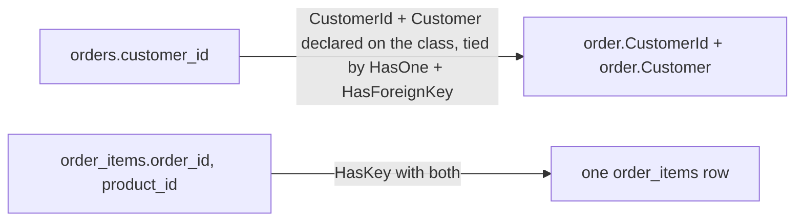

## Before you start

- [[backend.l1.efcore-mapping]] — you know `OnModelCreating` maps one class to one table with `modelBuilder.Entity<T>(e => { ... })`, `e.ToTable(...)`, and `e.Property(...).HasColumnName(...)`, column by column. This lesson is about the calls in that same method for tables that relate to each other.

## The situation

A teammate wants to print each order together with its customer's name, and writes `order.Customer.FullName` — `Customer` is another class in `Entities.cs`, with `FullName` among its properties, and this line works with no JOIN written by hand anywhere in that code. `Customer` isn't a column `orders` has; the only column is `customer_id`. They also notice `OrderItem`, unlike every other class in `Entities.cs`, has no `Id` property at all, and ask how EF Core can find or save one `order_items` row without one. Where does `order.Customer` come from, and what actually identifies a single row of `order_items`?

## Core concepts

- navigation property — a plain C# property, like `order.Customer`, layered over a foreign key property such as `Order.CustomerId` (itself mapped to the `orders.customer_id` column); it follows the relationship directly, so code reads the related object without writing a JOIN by hand.
- **composite key** — a primary key made of more than one column; no single property alone identifies a row, only the two (or more) together do.
- `HasForeignKey` / `HasKey` — the `OnModelCreating` calls that state a relationship's foreign key, or a composite key, explicitly, next to the column mappings from the last lesson. `HasKey` is required here: `order_items` has no single `Id` column, so EF Core has to be told which properties identify a row.

## How it works



A navigation property doesn't replace the foreign key column — it sits alongside it. `Order` still has `CustomerId`, an `int`, exactly like `orders.customer_id`; `Customer`, the navigation property, is a second, separate property that gives code the related `Customer` object itself, once EF Core has it — in the code that serves `GET /api/v1/orders`, it is there, as Try it below shows. When and how EF Core puts it there is [[backend.l1.efcore-n-plus-one]]'s subject; this lesson only accounts for the property existing and being configured. Writing `order.Customer.FullName` reads that second property; nothing about it removes or changes `order.CustomerId`.

Configuring a navigation property looks like configuring a column, but describes a relationship instead of one value: `HasOne(o => o.Customer)` says which navigation property is involved, and `HasForeignKey(o => o.CustomerId)` says which property is the foreign key — the same `CustomerId` already mapped to the `customer_id` column by `HasColumnName`. The same shape works the other way round, for a collection instead of one object: `HasMany(o => o.Items)` and `HasForeignKey(i => i.OrderId)` describe `Order.Items`, the list of an order's `OrderItem` rows, tied to it through `OrderId`.

A composite key changes what "one row" means to look up. Every other table in this system has a single `Id` column, so one value finds one row. `order_items` doesn't have that column at all — its rows are identified by the pair `(order_id, product_id)` together, because that pair is exactly what `order_items` declares as its primary key: one order never lists the same product twice. `HasKey` takes both properties at once to say so.

## In the Đơn Hàng system

`Order` and `OrderItem`, in `DonHang.Domain/Entities.cs`, show both sides of this:

```csharp file=DonHang.Domain/Entities.cs tag=stage-1 lines=25-43
public sealed class Order
{
    public int Id { get; set; }
    public int CustomerId { get; set; }
    public DateTimeOffset PlacedAt { get; set; }
    public required string Status { get; set; }
    public List<OrderItem> Items { get; set; } = [];

    // lesson: backend.l1.efcore-n-plus-one
    public Customer? Customer { get; set; }
}

public sealed class OrderItem
{
    public int OrderId { get; set; }
    public int ProductId { get; set; }
    public int Quantity { get; set; }
    public int UnitPriceVnd { get; set; }
}
```

The `// lesson:` comment is a bookmark for a later lesson and can be ignored here. `Order` has both `CustomerId` (the foreign key property) and `Customer` (the navigation property, declared `Customer?` because the object isn't always present on an `Order` sitting in memory) — plus `Items`, a second navigation property, this time a list, for every `OrderItem` that belongs to this order. That `?` says nothing about the column: `customer_id` is a non-nullable `int` in the database, so every order still has exactly one customer there. `OrderItem` itself has no `Id`: just `OrderId`, `ProductId`, and the two data columns, `Quantity` and `UnitPriceVnd`.

`OnModelCreating` configures both relationships and the composite key:

```csharp file=DonHang.Infrastructure/DonHangDbContext.cs tag=stage-1 lines=38-57
        modelBuilder.Entity<Order>(e =>
        {
            e.ToTable("orders");
            e.Property(o => o.Id).HasColumnName("id");
            e.Property(o => o.CustomerId).HasColumnName("customer_id");
            e.Property(o => o.PlacedAt).HasColumnName("placed_at");
            e.Property(o => o.Status).HasColumnName("status");
            e.HasMany(o => o.Items).WithOne().HasForeignKey(i => i.OrderId);
            e.HasOne(o => o.Customer).WithMany().HasForeignKey(o => o.CustomerId);
        });

        modelBuilder.Entity<OrderItem>(e =>
        {
            e.ToTable("order_items");
            e.HasKey(i => new { i.OrderId, i.ProductId });
            e.Property(i => i.OrderId).HasColumnName("order_id");
            e.Property(i => i.ProductId).HasColumnName("product_id");
            e.Property(i => i.Quantity).HasColumnName("quantity");
            e.Property(i => i.UnitPriceVnd).HasColumnName("unit_price_vnd");
        });
```

`WithOne(...)`/`WithMany(...)` name the navigation property on the *other* side of the relationship, the same way `HasOne`/`HasMany` name it on this side — the word follows how many there are on that other side, one `Order` per `OrderItem` but many orders per `Customer`, even when the parentheses stay empty. Empty parentheses mean there is no navigation property there at all; if `Customer` instead had a `List<Order> Orders` property, that line would read `WithMany(c => c.Orders)` instead of `WithMany()`.

`e.HasMany(o => o.Items).WithOne().HasForeignKey(i => i.OrderId)` names `Items` as the navigation property and `OrderId` as the foreign-key property on the other side — the same `OrderId` that the `OrderItem` block below maps to the `order_id` column; `WithOne()` is left empty because `OrderItem` has no property pointing back to its `Order` — this relationship only reads in one direction. `e.HasOne(o => o.Customer).WithMany().HasForeignKey(o => o.CustomerId)` does the same for the single-object side: `Customer` is the navigation property, `CustomerId` is the foreign-key property, and `WithMany()` is empty for the same reason — `Customer` has no list of its own orders.

`e.HasKey(i => new { i.OrderId, i.ProductId })` is `OrderItem`'s composite key: passing both properties together, inside `new { ... }`, is what tells EF Core neither one alone identifies a row. From then on, every time EF Core has to find or save one `order_items` row, it uses both values together — one of them alone is never enough.

## Beginners often think…

- **"Every table EF Core maps needs a single column called `Id`, or EF Core can't work with it."** → Actually `order_items` has no `Id` at all; `HasKey(i => new { i.OrderId, i.ProductId })` tells EF Core to use the pair instead. Nothing about EF Core requires a single-column key named `Id` — that's just what every other table in this system happens to use.
- **"Once a foreign key column exists, `order.Customer` works immediately, without EF Core needing any extra configuration."** → Actually `orders.customer_id` existing in the database doesn't create `Order.Customer` — the C# property has to exist on the class; in this codebase the `HasOne(o => o.Customer).WithMany().HasForeignKey(o => o.CustomerId)` line states that relationship explicitly, next to the column mappings — every relationship in Đơn Hàng is configured this way.

## Try it (3 minutes)

1. From the Đơn Hàng project's root folder, with the example system running (`scripts/up.sh`), send `{"email": "anh.tran@example.com", "password": "donhang-dev-password"}` to `POST /api/v1/auth/login` — that account is already in the example data. Take the `token` field from the response body, and send it in the header `Authorization: Bearer <value>` when you call `GET /api/v1/orders` — `Bearer` is typed literally, only `<value>` is replaced.
2. In the response, find `customerName`. In `Entities.cs`, find the only property on `Order` that could supply it.

Expected result: the response carries a `customerName` field even though `orders` has only a `customer_id` column, and no request you made ever supplied that name.

<details><summary>Suggested answer</summary>

The only property on `Order` that could supply `customerName` is `Customer`, the navigation property — `orders` itself has no name to give. `customerName` reaches the response through `order.Customer.FullName`, reading that navigation property the same way `order.CustomerId` reads a plain column, with no JOIN written by hand anywhere in the code that serves `GET /api/v1/orders`. How `order.Customer` gets its value in the first place is not this lesson's subject — that's [[backend.l1.efcore-n-plus-one]].

</details>

## Connections

- [[backend.l1.efcore-mapping]] — the same `OnModelCreating` method, one lesson earlier, for a table that has no relationships to configure.
- [[foundation.l1.tables-keys-relations]] — the `orders.customer_id` foreign key and the `order_items` composite key, first named in SQL, now named in C#.
- [[backend.l1.efcore-n-plus-one]] — what happens to query counts when a navigation property is read inside a loop.

## Five-line summary

1. A foreign key column can become a navigation property in C# — `order.Customer` — without removing the plain `CustomerId` column property.
2. `HasOne`/`HasMany` names the navigation property; `HasForeignKey` names the foreign-key property, already tied to its column by `HasColumnName`.
3. `WithOne()`/`WithMany()` left empty means the relationship has no navigation pointing back the other way.
4. A composite key is a primary key made of more than one column; `order_items` has no `Id`, only `(order_id, product_id)` together.
5. `HasKey(i => new { i.OrderId, i.ProductId })` is how a composite key is configured — passing every key property at once.
