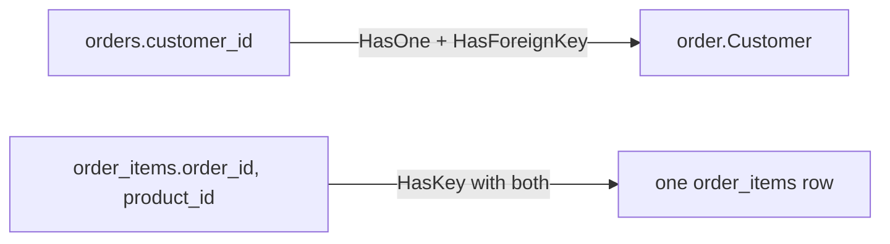

## Before you start

- [[backend.l1.efcore-mapping]] — you know `OnModelCreating` maps one class to one table, column by column, with `Property(...).HasColumnName(...)`. This lesson is about the calls in that same method for tables that relate to each other.

## The situation

A teammate wants to print each order together with its customer's name, and writes `order.Customer.FullName` — it works, with no JOIN written anywhere in that code, and no second call to the database that they can find. `Customer` isn't a column `orders` has; the only column is `customer_id`. They also notice `OrderItem`, unlike every other class in this codebase, has no `Id` property at all, and ask how EF Core can find or save one `order_items` row without one. Where does `order.Customer` come from, and what actually identifies a single row of `order_items`?

## Core concepts

- foreign key → navigation property — a foreign key column like `orders.customer_id` can become a plain C# property, `order.Customer`, that follows the relationship directly; code reads the related object without writing a JOIN by hand.
- **composite key** — a primary key made of more than one column; no single property alone identifies a row, only the two (or more) together do.
- `HasForeignKey` / `HasKey` — the `OnModelCreating` calls that configure a relationship's foreign key, or a composite key, the same way `HasColumnName` configures a column name: explicitly, because the default doesn't cover this shape.

## How it works



A navigation property doesn't replace the foreign key column — it sits alongside it. `Order` still has `CustomerId`, an `int`, exactly like `orders.customer_id`; `Customer`, the navigation property, is a second, separate property that gives code the related `Customer` object itself, once EF Core has it. Writing `order.Customer.FullName` reads that second property; nothing about it removes or changes `order.CustomerId`.

Configuring a navigation property looks like configuring a column, but describes a relationship instead of one value: `HasOne(o => o.Customer)` says which navigation property is involved, and `HasForeignKey(o => o.CustomerId)` says which column backs it. The same shape works the other way round, for a collection instead of one object: `HasMany(o => o.Items)` and `HasForeignKey(i => i.OrderId)` describe `Order.Items`, the list of an order's `OrderItem` rows, backed by `order_items.order_id`.

A composite key changes what "one row" means to look up. Every other table in this system has a single `Id` column, so one value finds one row. `order_items` doesn't have that column at all — its rows are identified by the pair `(order_id, product_id)` together, because one order can have many items and one product can appear in many orders, and only that combination is ever unique. `HasKey` takes both properties at once to say so.

## In the Đơn Hàng system

`Order` and `OrderItem`, in `DonHang.Domain/Entities.cs`, show both sides of this:

```csharp file=DonHang.Domain/Entities.cs tag=stage-1 lines=25-43
public sealed class Order
{
    public int Id { get; set; }
    public int CustomerId { get; set; }
    public DateTimeOffset PlacedAt { get; set; }
    public required string Status { get; set; }
    public List<OrderItem> Items { get; set; } = [];

    // lesson: backend.l1.efcore-n-plus-one
    public Customer? Customer { get; set; }
}

public sealed class OrderItem
{
    public int OrderId { get; set; }
    public int ProductId { get; set; }
    public int Quantity { get; set; }
    public int UnitPriceVnd { get; set; }
}
```

The `// lesson:` comment is a bookmark for a later lesson and can be ignored here. `Order` has both `CustomerId` (the foreign key column) and `Customer` (the navigation property, nullable because nothing forces EF Core to have loaded it) — plus `Items`, a second navigation property, this time a list, for every `OrderItem` that belongs to this order. `OrderItem` itself has no `Id`: just `OrderId`, `ProductId`, and the two data columns, `Quantity` and `UnitPriceVnd`.

`OnModelCreating` configures both relationships and the composite key:

```csharp file=DonHang.Infrastructure/DonHangDbContext.cs tag=stage-1 lines=38-57
        modelBuilder.Entity<Order>(e =>
        {
            e.ToTable("orders");
            e.Property(o => o.Id).HasColumnName("id");
            e.Property(o => o.CustomerId).HasColumnName("customer_id");
            e.Property(o => o.PlacedAt).HasColumnName("placed_at");
            e.Property(o => o.Status).HasColumnName("status");
            e.HasMany(o => o.Items).WithOne().HasForeignKey(i => i.OrderId);
            e.HasOne(o => o.Customer).WithMany().HasForeignKey(o => o.CustomerId);
        });

        modelBuilder.Entity<OrderItem>(e =>
        {
            e.ToTable("order_items");
            e.HasKey(i => new { i.OrderId, i.ProductId });
            e.Property(i => i.OrderId).HasColumnName("order_id");
            e.Property(i => i.ProductId).HasColumnName("product_id");
            e.Property(i => i.Quantity).HasColumnName("quantity");
            e.Property(i => i.UnitPriceVnd).HasColumnName("unit_price_vnd");
        });
```

`e.HasMany(o => o.Items).WithOne().HasForeignKey(i => i.OrderId)` names `Items` as the navigation property and `order_items.order_id` as the column that backs it; `WithOne()` is left empty because `OrderItem` has no property pointing back to its `Order` — this relationship only reads in one direction. `e.HasOne(o => o.Customer).WithMany().HasForeignKey(o => o.CustomerId)` does the same for the single-object side: `Customer` is the navigation property, `customer_id` is the column, and `WithMany()` is empty for the same reason — `Customer` has no list of its own orders. `e.HasKey(i => new { i.OrderId, i.ProductId })` is `OrderItem`'s composite key: passing both properties together, inside `new { ... }`, is what tells EF Core neither one alone identifies a row.

## Beginners often think…

- **"Every table EF Core maps needs a single column called `Id`, or EF Core can't work with it."** → Actually `order_items` has no `Id` at all; `HasKey(i => new { i.OrderId, i.ProductId })` tells EF Core to use the pair instead. Nothing about EF Core requires a single-column key named `Id` — that's just what every other table in this system happens to use.
- **"Once a foreign key column exists, `order.Customer` works immediately, without EF Core needing any extra configuration."** → Actually `orders.customer_id` existing in the database doesn't create `Order.Customer` — the C# property has to exist on the class, and `HasOne(o => o.Customer).WithMany().HasForeignKey(o => o.CustomerId)` in `OnModelCreating` is what connects that property to the column.

## Try it (3 minutes)

1. From the Đơn Hàng project's root folder, with the example system running (`scripts/up.sh`), sign in and read back one of your own orders the same way `creating-a-resource` and `rest-for-writes` did (`POST /api/v1/auth/login`, then `GET /api/v1/orders`).
2. Look at one entry in the response and count how many separate values it took to build — `id`, `status`, `customerName` — against how many lines of code you've seen so far that mention a `Customer` at all.

Expected result: each entry's `customerName` comes from the signed-in customer's own row, reached through `order.Customer`, the navigation property — not from any field the client sent, and not from a second request the client had to make.

<details><summary>Suggested answer</summary>

Nothing about how `order.Customer` actually gets fetched is this lesson's subject — that's the next lesson. What this lesson accounts for is the property itself: `customerName` reaches the response through `order.Customer.FullName`, reading a navigation property the same way `order.CustomerId` reads a plain column, with no JOIN written by hand anywhere in `OrdersController` or `EfOrderRepository`.

</details>

## Connections

- [[backend.l1.efcore-mapping]] — the same `OnModelCreating` method, one lesson earlier, for a table that has no relationships to configure.
- [[foundation.l1.tables-keys-relations]] — the `orders.customer_id` foreign key and the `order_items` composite key, first named in SQL, now named in C#.
- [[backend.l1.efcore-n-plus-one]] — what happens to query counts when a navigation property is read inside a loop.

## Five-line summary

1. A foreign key column can become a navigation property in C# — `order.Customer` — without removing the plain `CustomerId` column property.
2. `HasOne`/`HasMany` names the navigation property; `HasForeignKey` names the column that backs it.
3. `WithOne()`/`WithMany()` left empty means the relationship has no navigation pointing back the other way.
4. A composite key is a primary key made of more than one column; `order_items` has no `Id`, only `(order_id, product_id)` together.
5. `HasKey(i => new { i.OrderId, i.ProductId })` is how a composite key is configured — passing every key property at once.
