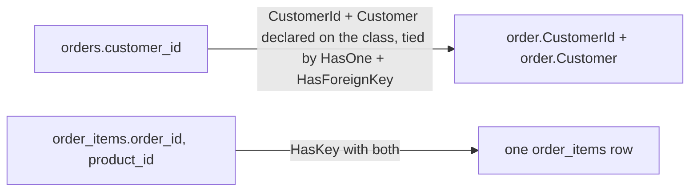

## Bạn cần biết trước

- [[backend.l1.efcore-mapping]] — bạn đã biết `OnModelCreating` map một class sang một bảng bằng `modelBuilder.Entity<T>(e => { ... })`, `e.ToTable(...)`, và `e.Property(...).HasColumnName(...)`, từng cột một. Bài này nói về các lệnh gọi trong cùng method đó, cho những bảng có quan hệ với nhau.

## Tình huống

Một đồng nghiệp muốn in mỗi order kèm tên customer, và viết `order.Customer.FullName` — `Customer` là một class khác trong `Entities.cs`, có `FullName` trong số các property của nó, và dòng này chạy được mà không viết JOIN tay ở đâu trong code đó cả. `Customer` không phải cột `orders` có; cột duy nhất là `customer_id`. Họ cũng để ý `OrderItem`, khác mọi class khác trong `Entities.cs`, hoàn toàn không có property `Id`, và hỏi làm sao EF Core tìm hoặc lưu được một dòng `order_items` mà không cần nó. `order.Customer` từ đâu ra, và điều gì thực sự định danh một dòng `order_items`?

## Khái niệm cốt lõi

- navigation property — một property C# thuần, như `order.Customer`, xây trên một property khóa ngoại như `Order.CustomerId` (chính nó đã được map tới cột `orders.customer_id`); nó theo thẳng mối quan hệ, nên code đọc object liên quan mà không cần viết JOIN tay.
- **khóa kết hợp** (composite key) — một khóa chính gồm nhiều hơn một cột; không property nào một mình định danh được một dòng, chỉ hai (hoặc nhiều hơn) cùng nhau mới làm được.
- `HasForeignKey` / `HasKey` — các lệnh gọi trong `OnModelCreating` nêu tường minh khóa ngoại của một mối quan hệ, hoặc một khóa kết hợp, ngay cạnh các mapping cột từ bài trước. `HasKey` là lệnh bắt buộc ở đây: `order_items` không có cột `Id` đơn lẻ nào, nên phải nói cho EF Core biết property nào định danh một dòng.

## Cơ chế hoạt động



Một navigation property không thay thế cột khóa ngoại — nó tồn tại song song. `Order` vẫn có `CustomerId`, một `int`, y hệt `orders.customer_id`; `Customer`, navigation property, là một property thứ hai, riêng biệt, đưa cho code chính object `Customer` liên quan, một khi EF Core đã có nó — trong code phục vụ `GET /api/v1/orders`, nó có sẵn ở đó, như phần Thử ngay bên dưới sẽ cho thấy. Khi nào và bằng cách nào EF Core đưa nó vào đó là chủ đề của [[backend.l1.efcore-n-plus-one]]; bài này chỉ nói về việc property đó tồn tại và được cấu hình. Viết `order.Customer.FullName` là đọc property thứ hai đó; không gì trong việc này xóa hay đổi `order.CustomerId`.

Cấu hình một navigation property trông giống cấu hình một cột, nhưng mô tả một mối quan hệ thay vì một giá trị: `HasOne(o => o.Customer)` nói navigation property nào đang được nhắc tới, và `HasForeignKey(o => o.CustomerId)` nói property nào là khóa ngoại — chính `CustomerId` đã được map tới cột `customer_id` bằng `HasColumnName`. Cách làm này cũng dùng được theo chiều ngược lại, cho một collection thay vì một object: `HasMany(o => o.Items)` và `HasForeignKey(i => i.OrderId)` mô tả `Order.Items`, danh sách các dòng `OrderItem` của một order, gắn với nó qua `OrderId`.

Một khóa kết hợp đổi ý nghĩa của "một dòng" khi tra cứu. Mọi bảng khác trong hệ thống này có một cột `Id` đơn lẻ, nên một giá trị tìm ra một dòng. `order_items` hoàn toàn không có cột đó — các dòng của nó được định danh bởi cặp `(order_id, product_id)` cùng nhau, vì chính cặp đó là điều `order_items` khai báo làm khóa chính: một order không bao giờ liệt kê cùng một sản phẩm hai lần. `HasKey` nhận cả hai property cùng lúc để nói điều đó.

## Trong hệ thống Đơn Hàng

`Order` và `OrderItem`, trong `DonHang.Domain/Entities.cs`, cho thấy cả hai mặt của việc này:

```csharp file=DonHang.Domain/Entities.cs tag=stage-1 lines=25-43
public sealed class Order
{
    public int Id { get; set; }
    public int CustomerId { get; set; }
    public DateTimeOffset PlacedAt { get; set; }
    public required string Status { get; set; }
    public List<OrderItem> Items { get; set; } = [];

    // lesson: backend.l1.efcore-n-plus-one
    public Customer? Customer { get; set; }
}

public sealed class OrderItem
{
    public int OrderId { get; set; }
    public int ProductId { get; set; }
    public int Quantity { get; set; }
    public int UnitPriceVnd { get; set; }
}
```

Comment `// lesson:` là dấu đánh dấu cho một bài sau và có thể bỏ qua ở đây. `Order` có cả `CustomerId` (property khóa ngoại) và `Customer` (navigation property, khai báo `Customer?` vì object đó không phải lúc nào cũng có mặt trên một `Order` đang nằm trong bộ nhớ) — cộng thêm `Items`, một navigation property thứ hai, lần này là một list, cho mọi `OrderItem` thuộc order này. Dấu `?` đó không nói gì về cột: `customer_id` là một `int` không nullable trong database, nên mọi order vẫn luôn có đúng một customer ở đó. Bản thân `OrderItem` không có `Id`: chỉ có `OrderId`, `ProductId`, và hai cột dữ liệu, `Quantity` và `UnitPriceVnd`.

`OnModelCreating` cấu hình cả hai mối quan hệ lẫn khóa kết hợp:

```csharp file=DonHang.Infrastructure/DonHangDbContext.cs tag=stage-1 lines=38-57
        modelBuilder.Entity<Order>(e =>
        {
            e.ToTable("orders");
            e.Property(o => o.Id).HasColumnName("id");
            e.Property(o => o.CustomerId).HasColumnName("customer_id");
            e.Property(o => o.PlacedAt).HasColumnName("placed_at");
            e.Property(o => o.Status).HasColumnName("status");
            e.HasMany(o => o.Items).WithOne().HasForeignKey(i => i.OrderId);
            e.HasOne(o => o.Customer).WithMany().HasForeignKey(o => o.CustomerId);
        });

        modelBuilder.Entity<OrderItem>(e =>
        {
            e.ToTable("order_items");
            e.HasKey(i => new { i.OrderId, i.ProductId });
            e.Property(i => i.OrderId).HasColumnName("order_id");
            e.Property(i => i.ProductId).HasColumnName("product_id");
            e.Property(i => i.Quantity).HasColumnName("quantity");
            e.Property(i => i.UnitPriceVnd).HasColumnName("unit_price_vnd");
        });
```

`WithOne(...)`/`WithMany(...)` nêu tên navigation property ở phía *kia* của mối quan hệ, cùng cách `HasOne`/`HasMany` nêu tên nó ở phía này — từ nào được dùng phụ thuộc vào số lượng ở phía kia, một `Order` cho mỗi `OrderItem` nhưng nhiều order cho mỗi `Customer`, ngay cả khi ngoặc đơn để trống. Ngoặc đơn để trống nghĩa là không có navigation property nào ở đó cả; nếu `Customer` có thêm property `List<Order> Orders`, dòng đó sẽ là `WithMany(c => c.Orders)` thay vì `WithMany()`.

`e.HasMany(o => o.Items).WithOne().HasForeignKey(i => i.OrderId)` nêu tên `Items` là navigation property và `OrderId` là property khóa ngoại ở phía kia — chính `OrderId` mà khối `OrderItem` bên dưới map tới cột `order_id`; `WithOne()` để trống vì `OrderItem` không có property nào trỏ ngược về `Order` của nó — mối quan hệ này chỉ đọc được theo một chiều. `e.HasOne(o => o.Customer).WithMany().HasForeignKey(o => o.CustomerId)` làm điều tương tự cho phía một-object: `Customer` là navigation property, `CustomerId` là property khóa ngoại, và `WithMany()` để trống vì cùng lý do — `Customer` không có danh sách các order của mình.

`e.HasKey(i => new { i.OrderId, i.ProductId })` là khóa kết hợp của `OrderItem`: truyền cả hai property cùng lúc, bên trong `new { ... }`, là điều báo cho EF Core biết không property nào một mình định danh được một dòng. Từ đó về sau, mỗi khi EF Core cần tìm hoặc lưu một dòng `order_items`, nó dùng cả hai giá trị cùng nhau — chỉ một trong hai không bao giờ là đủ.

## Người mới hay nghĩ rằng…

- **"Bảng nào EF Core map cũng cần một cột `Id` đơn lẻ, không thì EF Core không làm việc được với nó."** → Thực ra `order_items` hoàn toàn không có `Id`; `HasKey(i => new { i.OrderId, i.ProductId })` báo cho EF Core dùng cặp đó thay thế. Không gì trong EF Core đòi hỏi một khóa một cột tên `Id` — đó chỉ là điều mọi bảng khác trong hệ thống này tình cờ dùng.
- **"Một khi cột khóa ngoại đã tồn tại, `order.Customer` chạy được ngay, không cần EF Core cấu hình gì thêm."** → Thực ra `orders.customer_id` tồn tại trong database không tự tạo ra `Order.Customer` — property C# đó phải tồn tại trên class; trong codebase này, dòng `HasOne(o => o.Customer).WithMany().HasForeignKey(o => o.CustomerId)` nêu tường minh mối quan hệ đó, ngay cạnh các mapping cột — mọi mối quan hệ trong Đơn Hàng đều được cấu hình theo cách này.

## Thử ngay (3 phút)

1. Từ thư mục gốc của dự án Đơn Hàng, với hệ thống ví dụ đang chạy (`scripts/up.sh`), gửi `{"email": "anh.tran@example.com", "password": "donhang-dev-password"}` tới `POST /api/v1/auth/login` — tài khoản đó đã có sẵn trong dữ liệu ví dụ. Lấy trường `token` từ response body, và gửi nó trong header `Authorization: Bearer <value>` khi gọi `GET /api/v1/orders` — `Bearer` được gõ nguyên văn, chỉ `<value>` là được thay thế.
2. Trong response, tìm `customerName`. Trong `Entities.cs`, tìm property duy nhất trên `Order` có thể cung cấp nó.

Kết quả mong đợi: response mang một trường `customerName` dù `orders` chỉ có cột `customer_id`, và không request nào bạn gửi từng cung cấp cái tên đó.

<details><summary>Gợi ý đáp án</summary>

Property duy nhất trên `Order` có thể cung cấp `customerName` là `Customer`, navigation property — bản thân `orders` không có tên nào để cho. `customerName` tới được response qua `order.Customer.FullName`, đọc navigation property đó theo đúng cách `order.CustomerId` đọc một cột thuần, không JOIN nào viết tay ở bất kỳ đâu trong code phục vụ `GET /api/v1/orders`. `order.Customer` lấy giá trị của nó bằng cách nào ngay từ đầu không phải chủ đề của bài này — đó là [[backend.l1.efcore-n-plus-one]].

</details>

## Liên hệ

- [[backend.l1.efcore-mapping]] — cùng method `OnModelCreating`, một bài trước đó, cho một bảng không có mối quan hệ nào cần cấu hình.
- [[foundation.l1.tables-keys-relations]] — khóa ngoại `orders.customer_id` và khóa kết hợp `order_items`, lần đầu được đặt tên trong SQL, giờ được đặt tên trong C#.
- [[backend.l1.efcore-n-plus-one]] — điều gì xảy ra với số lượng truy vấn khi một navigation property được đọc bên trong một vòng lặp.

## Tóm tắt 5 dòng

1. Một cột khóa ngoại có thể trở thành navigation property trong C# — `order.Customer` — mà không xóa property cột `CustomerId` thuần.
2. `HasOne`/`HasMany` nêu tên navigation property; `HasForeignKey` nêu tên property khóa ngoại, vốn đã được gắn với cột của nó bằng `HasColumnName`.
3. `WithOne()`/`WithMany()` để trống nghĩa là mối quan hệ không có navigation trỏ ngược lại phía kia.
4. Một khóa kết hợp là khóa chính gồm nhiều hơn một cột; `order_items` không có `Id`, chỉ có `(order_id, product_id)` cùng nhau.
5. `HasKey(i => new { i.OrderId, i.ProductId })` là cách một khóa kết hợp được cấu hình — truyền mọi property khóa cùng một lúc.
