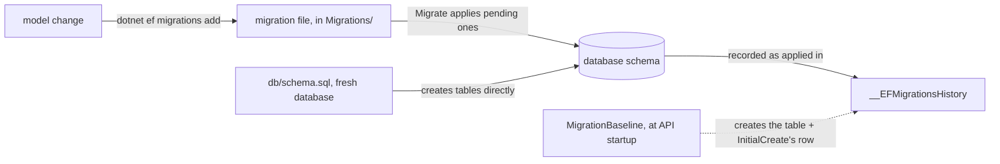

## Before you start

- [[backend.l1.efcore-relationships-and-keys]] — you know `OnModelCreating`, a method on `DonHangDbContext` — the `context` object this lesson's code calls — maps classes to tables, columns, and relationships. This lesson is about how that mapping actually reaches a real database.

## The situation

A teammate reads `Program.cs` and finds `MigrationBaseline.ApplyIfNeeded(context)` called right before `context.Database.Migrate()`, every time the API starts. They already know `db/schema.sql` creates `customers`, `orders`, and every other table the application stores rows in, the moment a fresh database is set up, before `DonHang.Api` ever runs. So why does `Migrate()` need to run at all on a database that already has its tables, and what exactly is `MigrationBaseline` guarding against?

## Core concepts

- **migration** — a versioned, code-tracked description of one schema change: a change to the tables and columns themselves rather than to the data in them. A migration can also carry SQL that fills in rows, as one in this lesson does. EF Core generates the file by comparing the current model — the classes plus the `OnModelCreating` mapping from the last lesson — against a snapshot of that model as it was at the last migration, and records which migrations have run in a table, `__EFMigrationsHistory` by default, that it keeps inside the target database.
- `dotnet ef migrations add <Name>` / `dotnet ef database update` — the two commands: the first writes a new migration file from whatever changed in the model since the last one; the second applies every migration a target database hasn't recorded yet.
- `Database.Migrate()` — the same "apply what's pending" step as `dotnet ef database update`, called from code instead of a terminal; Đơn Hàng runs it once, every time the API process starts.

## How it works



A migration is a C# class EF Core generates for you rather than one you write from scratch — you can still edit it afterwards, as a later, hand-written backfill (an `UPDATE` filling a new column on rows that already exist) shows in the next section. `dotnet ef migrations add <Name>` compares the current model against a snapshot of the model as it was at the last migration, and writes the difference as `Up`/`Down` methods in a file under `Migrations/`. `dotnet ef database update` — or, at runtime, `Database.Migrate()` — then applies every migration a database hasn't seen yet, and records each one it runs in a table EF Core keeps inside that same database, `__EFMigrationsHistory` by default.

In Đơn Hàng, `db/schema.sql` already builds every table the instant a fresh database is set up, before `Migrate()` ever runs. If `Migrate()` found no record of any migration having run, it would try to run the first migration, `InitialCreate`, whose `Up` creates every table, against tables that already exist, and fail. `MigrationBaseline.ApplyIfNeeded` checks for exactly that case — no history table yet, but `customers` already there — and, instead of letting `InitialCreate` run, creates `__EFMigrationsHistory` itself and inserts one row recording `InitialCreate` as already applied. That step — the dashed arrow in the diagram — happens at most once per database, unlike the others, which repeat on every schema change. From then on, `Migrate()` only ever applies whatever comes after `InitialCreate`.

Because a migration is a file checked into source control, like `AddPasswordHashToCustomers.cs`, a schema change can go through the same code review as any other file there — a reviewer can read the exact `AddColumn`/`Sql` calls a migration will run before it ever reaches a database, instead of trusting a manual `ALTER TABLE` was correct.

## In the Đơn Hàng system

`MigrationBaseline.ApplyIfNeeded`, in `DonHang.Infrastructure/MigrationBaseline.cs`, is the check described above. It borrows the database connection the `context` already has, opens it, and runs three plain SQL commands on it. `ExecuteScalar` runs a query and hands back the first value in its result; `ExecuteNonQuery` runs SQL whose result is not read back. Each `to_regclass` query below returns the table's name when the table exists, and `null` — `DBNull` in C# — when it does not, so `is DBNull` reads as "that table isn't there yet". The second check only returns early on a database where `customers` is also missing — one set up some other way than `db/schema.sql` — in which case `ApplyIfNeeded` does nothing and lets `Migrate()` run `InitialCreate` normally, the way it would on any brand-new database:

```csharp file=DonHang.Infrastructure/MigrationBaseline.cs tag=stage-1 lines=16-40
    public static void ApplyIfNeeded(DonHangDbContext context)
    {
        var connection = context.Database.GetDbConnection();
        connection.Open();
        try
        {
            using var historyCheck = connection.CreateCommand();
            historyCheck.CommandText = """SELECT to_regclass('public."__EFMigrationsHistory"')::text""";
            if (historyCheck.ExecuteScalar() is not DBNull) return; // migrations already tracked

            using var tablesCheck = connection.CreateCommand();
            tablesCheck.CommandText = "SELECT to_regclass('public.customers')::text";
            if (tablesCheck.ExecuteScalar() is DBNull) return; // fresh DB: Migrate() creates everything

            using var baseline = connection.CreateCommand();
            baseline.CommandText = $"""
                CREATE TABLE "__EFMigrationsHistory" (
                    "MigrationId" character varying(150) NOT NULL,
                    "ProductVersion" character varying(32) NOT NULL,
                    CONSTRAINT "PK___EFMigrationsHistory" PRIMARY KEY ("MigrationId")
                );
                INSERT INTO "__EFMigrationsHistory" ("MigrationId", "ProductVersion")
                VALUES ('{InitialCreateMigrationId}', '10.0.4');
                """;
            baseline.ExecuteNonQuery();
```

The row it inserts is just the `InitialCreate` file's id (a constant at the top of the same file, `InitialCreateMigrationId`) and the EF Core version — the two columns the history table has; the lines cut from this excerpt only close the connection afterward. `Program.cs` calls this method, then `Migrate()`, once at startup: `MigrationBaseline.ApplyIfNeeded(context); context.Database.Migrate();`. `ApplyIfNeeded` never runs a migration itself — `Migrate()` still does that.

A real migration looks nothing like that check. `AddPasswordHashToCustomers`, one migration later, adds one column and backfills it:

```csharp file=DonHang.Infrastructure/Migrations/20260923154700_AddPasswordHashToCustomers.cs tag=stage-1 lines=11-35
        protected override void Up(MigrationBuilder migrationBuilder)
        {
            migrationBuilder.AddColumn<string>(
                name: "password_hash",
                table: "customers",
                type: "text",
                nullable: true);

            // lesson: backend.l1.hashing-passwords
            // The 5 seeded customers (db/seed.sql) predate this column. Every
            // one gets the same obviously-fake dev password so the login
            // lesson has someone to sign in as: "donhang-dev-password".
            migrationBuilder.Sql(
                "UPDATE customers SET password_hash = " +
                "'100000.O2f9fsgGbhEWCCvJt94ESw==.lGj6tWAPiYl3FebBpbmiwRu8dlVIlOM3rDaGDfs+KNw=' " +
                "WHERE id IN (1, 2, 3, 4, 5);");
        }

        /// <inheritdoc />
        protected override void Down(MigrationBuilder migrationBuilder)
        {
            migrationBuilder.DropColumn(
                name: "password_hash",
                table: "customers");
        }
```

`Up` is what `Migrate()` runs going forward; `Down` is what would undo it. Neither method is written by hand from scratch — `dotnet ef migrations add AddPasswordHashToCustomers` generated the `AddColumn`/`DropColumn` pair from the model change alone; the `migrationBuilder.Sql(...)` backfill is the one part a person added afterward, to give the five example customers `db/seed.sql` inserts a password to sign in with. The exact value written is a stored form of that password — a later lesson covers how; here only the `AddColumn` + `Sql` pair matters.

## Beginners often think…

- **"A migration is a backup of the database, not something that changes its structure."** → Actually a migration changes structure directly — `AddColumn`, `CreateTable`, `DropColumn` calls that alter the schema; it has nothing to do with backing up or restoring data. You notice this when someone expects a migration to protect against data loss, and it turns out to be the very thing that changes the shape data is stored in.
- **"Since the database already has the right tables, this API doesn't need any migrations at all."** → Actually every schema change since `db/schema.sql` built the tables' starting shape — like the `password_hash` column in `AddPasswordHashToCustomers` — has come from a migration, not another edit to `schema.sql`. You notice this when a table is missing a column that a newer migration would have added.

## Try it (3 minutes)

1. From the Đơn Hàng project's root folder, with the example system running (`scripts/up.sh`), run `docker exec donhang-db psql -U donhang -d donhang -c 'select "MigrationId" from "__EFMigrationsHistory" order by "MigrationId";'` — this runs one SQL query against the example system's database and prints the rows it returns. `donhang-db` is the name the example system's database runs under once it is up; if the command errors, the system probably isn't running yet.
2. Compare the three rows against the `.cs` migration file names under `DonHang.Infrastructure/Migrations/` (ignore the `.Designer.cs` files next to them; `DonHangDbContextModelSnapshot.cs` is the snapshot of the model that `migrations add` compares against, rewritten by EF Core each time a migration is added — not a migration itself, so it has no row here either).

Expected result: the three `MigrationId` values match the three migration file names exactly, minus the `.cs` extension, `InitialCreate` first — each `MigrationId` starts with the date and time the migration was generated, so ordering by it is the order they were added — even though `InitialCreate`'s own `CREATE TABLE` calls never actually ran; `db/schema.sql` built those tables, and `MigrationBaseline` only recorded `InitialCreate` as applied.

<details><summary>Suggested answer</summary>

`select "MigrationId" from "__EFMigrationsHistory"` returns `20260923154631_InitialCreate`, `20260923154700_AddPasswordHashToCustomers`, and `20260924092625_AddOrderCustomerNavigation`, in that order — one row per migration `.cs` file, each of which also has a matching `.Designer.cs`. The first row exists only because `MigrationBaseline.ApplyIfNeeded` inserted it; every row after it was written there by `Migrate()` actually running that migration's `Up`.

</details>

## Connections

- [[backend.l1.efcore-relationships-and-keys]] — the same `OnModelCreating` method a migration's `Up` is generated to match.
- [[backend.l1.querying-with-linq]] — the next lesson, once the schema a migration built is what a query actually runs against.

## Five-line summary

1. A migration is a versioned, code-tracked file describing one schema change, generated by comparing the current model against the last one.
2. `dotnet ef migrations add <Name>` writes a migration file; `dotnet ef database update`, or `Database.Migrate()` at runtime, applies every migration not yet recorded.
3. EF Core tracks which migrations ran in a table it keeps inside the target database itself, `__EFMigrationsHistory` by default.
4. `db/schema.sql` builds Đơn Hàng's tables directly, once; `MigrationBaseline` marks `InitialCreate` as already applied so `Migrate()` doesn't try to recreate them.
5. Because a migration is a file checked into source control, a schema change can go through the same code review as any other file there.
