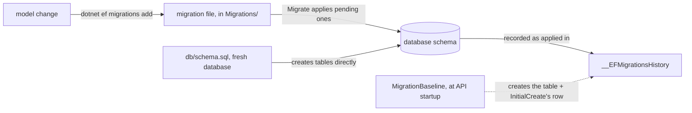

## Bạn cần biết trước

- [[backend.l1.efcore-relationships-and-keys]] — bạn đã biết `OnModelCreating`, một method trên `DonHangDbContext` — object `context` mà code trong bài này gọi — map class sang bảng, cột, và quan hệ. Bài này nói về việc mapping đó thực sự chạm tới một database thật như thế nào.

## Tình huống

Một đồng nghiệp đọc `Program.cs` và thấy `MigrationBaseline.ApplyIfNeeded(context)` được gọi ngay trước `context.Database.Migrate()`, mỗi lần API khởi động. Họ đã biết `db/schema.sql` tạo `customers`, `orders`, và mọi bảng khác mà ứng dụng lưu dữ liệu vào, ngay khi một database mới được thiết lập, trước khi `DonHang.Api` chạy. Vậy tại sao `Migrate()` vẫn cần chạy, trên một database đã có sẵn các bảng của nó, và `MigrationBaseline` đang canh chừng điều gì?

## Khái niệm cốt lõi

- **migration** — một mô tả có phiên bản, được lưu trong code, cho một thay đổi schema: một thay đổi cho chính các bảng và cột, không phải cho dữ liệu trong đó. Một migration cũng có thể mang theo SQL để điền dữ liệu vào các dòng, như một migration trong bài này làm. EF Core sinh ra file này bằng cách so model hiện tại — các class cộng với mapping `OnModelCreating` từ bài trước — với bản chụp của model đó tại lần migration trước, và ghi lại migration nào đã chạy trong một bảng, `__EFMigrationsHistory` theo mặc định, mà nó giữ ngay bên trong database đích.
- `dotnet ef migrations add <Name>` / `dotnet ef database update` — hai lệnh: lệnh đầu viết một file migration mới từ những gì đã đổi trong model kể từ lần trước; lệnh sau áp dụng mọi migration mà một database đích chưa ghi nhận.
- `Database.Migrate()` — bước "áp dụng những gì còn chờ" giống hệt `dotnet ef database update`, chỉ khác là gọi từ code thay vì từ terminal; Đơn Hàng chạy nó một lần, mỗi khi tiến trình API khởi động.

## Cơ chế hoạt động



Một migration là một class C# do EF Core sinh ra cho bạn, chứ không phải thứ bạn viết từ đầu — bạn vẫn có thể sửa thêm nó sau đó, như một đoạn backfill viết tay (một `UPDATE` điền vào một cột mới trên các dòng đã có sẵn) cho thấy ở phần sau. `dotnet ef migrations add <Name>` so model hiện tại với bản chụp của model đó tại lần migration trước, và ghi phần khác biệt thành các method `Up`/`Down` trong một file dưới `Migrations/`. `dotnet ef database update` — hoặc, lúc chạy thật, `Database.Migrate()` — rồi áp dụng mọi migration mà một database chưa từng thấy, và ghi lại mỗi migration nó chạy vào một bảng EF Core giữ ngay trong chính database đó, `__EFMigrationsHistory` theo mặc định.

Trong Đơn Hàng, `db/schema.sql` đã dựng mọi bảng ngay khi một database mới được thiết lập, trước khi `Migrate()` chạy. Nếu `Migrate()` không thấy bản ghi nào về việc migration đã chạy, nó sẽ thử chạy migration đầu tiên, `InitialCreate`, mà `Up` của nó tạo mọi bảng, lên những bảng đã tồn tại sẵn, và thất bại. `MigrationBaseline.ApplyIfNeeded` kiểm tra đúng trường hợp đó — chưa có bảng lịch sử, nhưng `customers` đã có sẵn — và, thay vì để `InitialCreate` chạy, tự tạo `__EFMigrationsHistory` rồi chèn một dòng ghi nhận `InitialCreate` đã được áp dụng. Bước đó — mũi tên đứt nét trong diagram — chỉ xảy ra nhiều nhất một lần cho mỗi database, khác với các bước còn lại, lặp lại ở mỗi thay đổi schema. Từ đó về sau, `Migrate()` chỉ áp dụng những gì đứng sau `InitialCreate`.

Vì một migration là một file được đưa vào quản lý mã nguồn, như `AddPasswordHashToCustomers.cs`, một thay đổi schema có thể đi qua cùng quy trình code review như bất kỳ file nào khác ở đó — một reviewer đọc được chính xác các lệnh `AddColumn`/`Sql` mà một migration sẽ chạy trước khi nó chạm tới một database, thay vì phải tin rằng một `ALTER TABLE` chạy tay là đúng.

## Trong hệ thống Đơn Hàng

`MigrationBaseline.ApplyIfNeeded`, trong `DonHang.Infrastructure/MigrationBaseline.cs`, chính là kiểm tra được mô tả ở trên. Nó mượn kết nối database mà `context` đã có sẵn, mở nó, rồi chạy ba lệnh SQL thuần trên đó. `ExecuteScalar` chạy một truy vấn và trả về giá trị đầu tiên trong kết quả; `ExecuteNonQuery` chạy SQL mà kết quả của nó không được đọc lại. Mỗi truy vấn `to_regclass` dưới đây trả về tên của bảng khi bảng đó tồn tại, và `null` — `DBNull` trong C# — khi nó không tồn tại, nên `is DBNull` đọc là "bảng đó chưa có ở đây". Điều kiện kiểm tra thứ hai chỉ return sớm trên một database mà `customers` cũng chưa có — một database được thiết lập theo cách khác ngoài `db/schema.sql` — trường hợp đó `ApplyIfNeeded` không làm gì cả và để `Migrate()` chạy `InitialCreate` bình thường, giống như trên bất kỳ database hoàn toàn mới nào:

```csharp file=DonHang.Infrastructure/MigrationBaseline.cs tag=stage-1 lines=16-40
    public static void ApplyIfNeeded(DonHangDbContext context)
    {
        var connection = context.Database.GetDbConnection();
        connection.Open();
        try
        {
            using var historyCheck = connection.CreateCommand();
            historyCheck.CommandText = """SELECT to_regclass('public."__EFMigrationsHistory"')::text""";
            if (historyCheck.ExecuteScalar() is not DBNull) return; // migrations already tracked

            using var tablesCheck = connection.CreateCommand();
            tablesCheck.CommandText = "SELECT to_regclass('public.customers')::text";
            if (tablesCheck.ExecuteScalar() is DBNull) return; // fresh DB: Migrate() creates everything

            using var baseline = connection.CreateCommand();
            baseline.CommandText = $"""
                CREATE TABLE "__EFMigrationsHistory" (
                    "MigrationId" character varying(150) NOT NULL,
                    "ProductVersion" character varying(32) NOT NULL,
                    CONSTRAINT "PK___EFMigrationsHistory" PRIMARY KEY ("MigrationId")
                );
                INSERT INTO "__EFMigrationsHistory" ("MigrationId", "ProductVersion")
                VALUES ('{InitialCreateMigrationId}', '10.0.4');
                """;
            baseline.ExecuteNonQuery();
```

Dòng nó chèn vào chỉ là id của file `InitialCreate` (một hằng số ở đầu chính file này, `InitialCreateMigrationId`) và phiên bản EF Core — đúng hai cột mà bảng lịch sử có; những dòng bị cắt khỏi đoạn trích này chỉ đóng kết nối lại. `Program.cs` gọi method này, rồi `Migrate()`, một lần lúc khởi động: `MigrationBaseline.ApplyIfNeeded(context); context.Database.Migrate();`. `ApplyIfNeeded` không bao giờ tự chạy migration nào — `Migrate()` vẫn là thứ làm việc đó.

Một migration thật trông không hề giống kiểm tra đó. `AddPasswordHashToCustomers`, một migration sau đó, thêm một cột và backfill nó:

```csharp file=DonHang.Infrastructure/Migrations/20260923154700_AddPasswordHashToCustomers.cs tag=stage-1 lines=11-35
        protected override void Up(MigrationBuilder migrationBuilder)
        {
            migrationBuilder.AddColumn<string>(
                name: "password_hash",
                table: "customers",
                type: "text",
                nullable: true);

            // lesson: backend.l1.hashing-passwords
            // The 5 seeded customers (db/seed.sql) predate this column. Every
            // one gets the same obviously-fake dev password so the login
            // lesson has someone to sign in as: "donhang-dev-password".
            migrationBuilder.Sql(
                "UPDATE customers SET password_hash = " +
                "'100000.O2f9fsgGbhEWCCvJt94ESw==.lGj6tWAPiYl3FebBpbmiwRu8dlVIlOM3rDaGDfs+KNw=' " +
                "WHERE id IN (1, 2, 3, 4, 5);");
        }

        /// <inheritdoc />
        protected override void Down(MigrationBuilder migrationBuilder)
        {
            migrationBuilder.DropColumn(
                name: "password_hash",
                table: "customers");
        }
```

`Up` là thứ `Migrate()` chạy về sau; `Down` là thứ sẽ hoàn tác nó. Không method nào được viết tay từ đầu — `dotnet ef migrations add AddPasswordHashToCustomers` đã sinh ra cặp `AddColumn`/`DropColumn` chỉ từ thay đổi của model; đoạn backfill `migrationBuilder.Sql(...)` là phần duy nhất một người thêm vào sau đó, để cho năm customer ví dụ mà `db/seed.sql` chèn vào có một mật khẩu để đăng nhập. Giá trị chính xác được ghi vào là dạng lưu trữ của mật khẩu đó — một bài sau nói rõ cách — ở đây chỉ cặp `AddColumn` + `Sql` là quan trọng.

## Người mới hay nghĩ rằng…

- **"Một migration là một bản sao lưu của database, không phải thứ thay đổi cấu trúc của nó."** → Thực ra một migration thay đổi cấu trúc trực tiếp — các lệnh gọi `AddColumn`, `CreateTable`, `DropColumn` làm thay đổi schema; nó không liên quan gì đến việc sao lưu hay khôi phục dữ liệu. Bạn sẽ nhận ra điều này khi ai đó kỳ vọng một migration bảo vệ khỏi mất dữ liệu, và hóa ra nó chính là thứ thay đổi hình dạng dữ liệu được lưu trữ.
- **"Vì database đã có sẵn đúng các bảng, API này không cần migration nào cả."** → Thực ra mọi thay đổi schema kể từ khi `db/schema.sql` dựng hình dạng khởi đầu của các bảng — như cột `password_hash` trong `AddPasswordHashToCustomers` — đều đến từ một migration, không phải sửa thêm `schema.sql`. Bạn sẽ nhận ra điều này khi một bảng thiếu một cột mà một migration mới hơn lẽ ra đã thêm vào.

## Thử ngay (3 phút)

1. Từ thư mục gốc của dự án Đơn Hàng, với hệ thống ví dụ đang chạy (`scripts/up.sh`), chạy `docker exec donhang-db psql -U donhang -d donhang -c 'select "MigrationId" from "__EFMigrationsHistory" order by "MigrationId";'` — lệnh này chạy một truy vấn SQL lên database của hệ thống ví dụ và in ra các dòng nó trả về. `donhang-db` là tên mà database của hệ thống ví dụ chạy dưới đó một khi nó đã lên; nếu lệnh báo lỗi, có thể hệ thống chưa chạy.
2. So sánh ba dòng đó với tên các file migration `.cs` dưới `DonHang.Infrastructure/Migrations/` (bỏ qua các file `.Designer.cs` cạnh chúng; `DonHangDbContextModelSnapshot.cs` là bản chụp của model mà `migrations add` so sánh vào, được EF Core ghi lại mỗi khi có một migration được thêm — không phải một migration, nên nó cũng không có dòng nào ở đây).

Kết quả mong đợi: ba giá trị `MigrationId` khớp đúng tên ba file migration, trừ đuôi `.cs`, `InitialCreate` đứng đầu — mỗi `MigrationId` bắt đầu bằng ngày giờ migration đó được sinh ra, nên sắp theo nó chính là thứ tự chúng được thêm vào — dù `CREATE TABLE` của chính `InitialCreate` chưa từng thực sự chạy; `db/schema.sql` đã dựng các bảng đó, và `MigrationBaseline` chỉ ghi nhận `InitialCreate` là đã áp dụng.

<details><summary>Gợi ý đáp án</summary>

`select "MigrationId" from "__EFMigrationsHistory"` trả về `20260923154631_InitialCreate`, `20260923154700_AddPasswordHashToCustomers`, và `20260924092625_AddOrderCustomerNavigation`, theo đúng thứ tự đó — một dòng cho mỗi file migration `.cs`, mỗi file lại có một `.Designer.cs` tương ứng. Dòng đầu tiên tồn tại chỉ vì `MigrationBaseline.ApplyIfNeeded` đã chèn nó; mọi dòng sau đó được ghi vào bởi `Migrate()` thực sự chạy `Up` của migration đó.

</details>

## Liên hệ

- [[backend.l1.efcore-relationships-and-keys]] — cùng method `OnModelCreating` mà `Up` của một migration được sinh ra để khớp theo.
- [[backend.l1.querying-with-linq]] — bài kế tiếp, một khi schema mà một migration đã dựng chính là thứ một truy vấn thực sự chạy lên.

## Tóm tắt 5 dòng

1. Một migration là một file có phiên bản, lưu trong code, mô tả một thay đổi schema, sinh ra bằng cách so model hiện tại với lần trước.
2. `dotnet ef migrations add <Name>` viết một file migration; `dotnet ef database update`, hoặc `Database.Migrate()` lúc chạy thật, áp dụng mọi migration chưa được ghi nhận.
3. EF Core theo dõi migration nào đã chạy trong một bảng nó giữ ngay bên trong database đích, `__EFMigrationsHistory` theo mặc định.
4. `db/schema.sql` dựng các bảng của Đơn Hàng trực tiếp, một lần; `MigrationBaseline` đánh dấu `InitialCreate` là đã áp dụng để `Migrate()` không thử tạo lại chúng.
5. Vì một migration là một file được đưa vào quản lý mã nguồn, một thay đổi schema có thể đi qua cùng quy trình code review như bất kỳ file nào khác ở đó.
