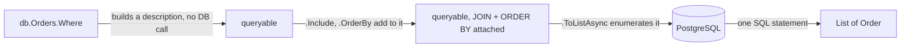

## Before you start

- [[backend.l1.migrations]] — you know the schema a migration builds is what a query actually runs against.
- [[foundation.l1.sql-join]] — you know a JOIN pairs rows of two tables on a condition, usually a foreign key equalling the primary key it points to.

## The situation

A teammate is reading `EfOrderRepository.ListByCustomerAsync`, one line: `db.Orders.Where(o => o.CustomerId == customerId).Include(o => o.Customer).OrderBy(o => o.Id).ToListAsync()`. They set a breakpoint right after `.Where(...)`, expecting to already see one customer's orders sitting there — and find nothing has touched the database yet. Does `.Where(...)` filter in PostgreSQL, or does it load every order into C# first? And if nothing ran at `.Where(...)`, when does it?

## Core concepts

- a LINQ query against a `DbSet` builds up a description of a query, not a result; `db.Orders.Where(...)` returns another queryable object, the same kind `db.Orders` itself is, with the condition attached to it.
- deferred execution — that description only reaches PostgreSQL once something enumerates it: `.ToListAsync()`, `.FirstOrDefaultAsync()`, a `foreach`. Writing `db.Orders.Where(...)` alone runs nothing.
- `.Include(...)` — a LINQ call naming a navigation property to pull in in the same query; EF Core folds it into the one SQL statement as a JOIN, the same JOIN already familiar from writing SQL directly.

## How it works



`Where`, `Include`, and `OrderBy` don't run anything by themselves — each one takes the queryable it's called on and returns a new queryable, one step longer, the way string methods return a new string. Nothing reaches PostgreSQL until the chain is enumerated; only `.ToListAsync()` — or `.FirstOrDefaultAsync()`, or a `foreach` over the query — does that. At that moment, EF Core translates the whole chain built up to then into one SQL statement, sends it once, and PostgreSQL runs the filtering, the ordering, and the JOIN there, not in C# afterward.

This is why a breakpoint right after `.Where(...)` sees no database activity: the method hasn't returned a result yet, only a longer description of one. The `.Include(o => o.Customer)` step works the same way — it doesn't run a second query for the related `Customer` row; it extends the one SQL statement with a JOIN, so the single `.ToListAsync()` at the end still fires only one round trip, returning `Order` rows already carrying their `Customer`.

`ListByCustomerAsync` chains four calls before enumerating: `.Where(...)` for the filter, `.Include(...)` for the JOIN, `.OrderBy(...)` for the order, `.ToListAsync()` to finally run it. `FindAsync` is shorter — `.Include(...)` then `.FirstOrDefaultAsync(...)` — but the same rule applies: one SQL statement, built from the whole chain, run only when the last call is awaited.

## In the Đơn Hàng system

`EfOrderRepository`, in `DonHang.Infrastructure/EfOrderRepository.cs`, has two queries built the way described above:

```csharp file=DonHang.Infrastructure/EfOrderRepository.cs tag=stage-1 lines=1-19
using DonHang.Domain;
using Microsoft.EntityFrameworkCore;

namespace DonHang.Infrastructure;

// lesson: design.l1.the-repository-layer
public sealed class EfOrderRepository(DonHangDbContext db) : IOrderRepository
{
    public Task<Order?> FindAsync(int id) =>
        db.Orders.Include(o => o.Items).FirstOrDefaultAsync(o => o.Id == id);

    // lesson: backend.l1.efcore-n-plus-one
    public Task<List<Order>> ListByCustomerAsync(int customerId) =>
        db.Orders.Where(o => o.CustomerId == customerId).Include(o => o.Customer).OrderBy(o => o.Id).ToListAsync();

    public async Task AddAsync(Order order) => await db.Orders.AddAsync(order);

    public Task SaveChangesAsync() => db.SaveChangesAsync();
}
```

Neither `FindAsync` nor `ListByCustomerAsync` has an `async`/`await` in its body — each is one expression, `db.Orders` followed by a chain of calls ending in `FirstOrDefaultAsync`/`ToListAsync`, and that call's own `Task` is what the method returns directly. `FindAsync(id)` chains `.Include(o => o.Items)` then `.FirstOrDefaultAsync(o => o.Id == id)`: one order, its `Items` joined in, one SQL statement. `ListByCustomerAsync(customerId)` chains `.Where(...)`, `.Include(o => o.Customer)`, `.OrderBy(o => o.Id)`, then `.ToListAsync()`: every step adds to the same description, and only the last one runs it. `AddAsync` and `SaveChangesAsync` are different — they don't build a queryable at all, and are not this lesson's subject.

## Beginners often think…

- **"A LINQ query loads every row into memory first, and `.Where(...)` filters the C# list afterward."** → Actually `.Where(...)` never loads anything; it extends the query description, and EF Core turns the whole chain into a `WHERE` clause PostgreSQL evaluates before any row leaves the database. You notice this when a filter that should only match a handful of rows still runs fast on a table with millions of them.
- **"Writing `db.Orders.Where(o => o.CustomerId == customerId)` runs the query immediately, the moment that line executes, rather than when `.ToListAsync()` is awaited."** → Actually that line only builds a queryable object; nothing is sent to PostgreSQL until something enumerates it. You notice this when a breakpoint placed right after `.Where(...)`, before any `.ToListAsync()`, shows no query has run yet.

## Try it (3 minutes)

1. Sign in as `anh.tran@example.com` (`donhang-dev-password`) and call `GET /api/v1/orders`; then sign in as a different seeded customer and call it again.
2. Compare the two responses.

Expected result: each response lists only that signed-in customer's own orders, with none of the other customer's orders in either list — the same `ListByCustomerAsync` code path, filtered differently per request by the `customerId` each `Where(...)` closes over.

<details><summary>Suggested answer</summary>

`ListByCustomerAsync` builds `db.Orders.Where(o => o.CustomerId == customerId)` fresh on every call, with whichever `customerId` came from that request's signed-in customer; the filter is not a fixed list computed once. Because the filtering happens in the one SQL statement `.ToListAsync()` sends, each request's PostgreSQL query only returns that customer's own rows — never a shared, precomputed list that both requests read from.

</details>

## Connections

- [[backend.l1.migrations]] — the schema `Where`/`Include`/`OrderBy` translate against; a column a migration never added cannot appear in the SQL these calls build.
- [[backend.l1.efcore-n-plus-one]] — what goes wrong when a query runs once per loop iteration instead of once, deferred execution's opposite failure.

## Five-line summary

1. A LINQ query against a `DbSet` builds up a description of a query; calling `.Where(...)`, `.Include(...)`, or `.OrderBy(...)` extends that description without running anything.
2. Deferred execution: the description only reaches PostgreSQL once something enumerates it — `.ToListAsync()`, `.FirstOrDefaultAsync()`, a `foreach`.
3. At that moment, EF Core translates the whole chain into one SQL statement; PostgreSQL does the filtering, ordering, and joining, not C# afterward.
4. `.Include(...)` adds a JOIN to that one statement; it does not run a second query for the related data.
5. Neither `FindAsync` nor `ListByCustomerAsync` uses `async`/`await` — each returns the `Task` its own final call already produces.
