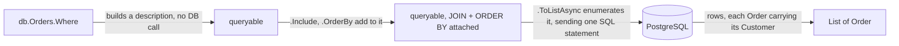

## Bạn cần biết trước

- [[backend.l1.migrations]] — bạn biết schema mà migration dựng lên chính là thứ truy vấn thật sự chạy trên đó.
- [[foundation.l1.sql-join]] — bạn biết JOIN ghép các dòng của hai bảng theo một điều kiện, thường là khóa ngoại bằng khóa chính mà nó trỏ tới.

## Tình huống

Một đồng nghiệp đang đọc `EfOrderRepository.ListByCustomerAsync`, chỉ một dòng: `db.Orders.Where(o => o.CustomerId == customerId).Include(o => o.Customer).OrderBy(o => o.Id).ToListAsync()`. Để xem riêng `.Where(...)` tạo ra gì, họ tách bước đầu tiên ra một dòng riêng: `var query = db.Orders.Where(o => o.CustomerId == customerId);`.

Họ nghĩ `query` lúc này đã chứa các order của một customer. Nhưng kiểu khai báo của nó là `IQueryable<Order>` — không phải `List<Order>`, và chẳng thấy dòng dữ liệu nào. Vậy `.Where(...)` lọc trong PostgreSQL, database mà Đơn Hàng chạy trên đó, hay nạp hết mọi order vào C# trước? Và nếu tại `.Where(...)` chưa có gì chạy, thì khi nào mới chạy?

## Khái niệm cốt lõi

- LINQ — chuỗi lệnh gọi method C#, `.Where(...)`, `.Include(...)`, `.OrderBy(...)`, viết trên một `DbSet` như `db.Orders` (property đại diện cho bảng `orders`, còn một property như `o.CustomerId` lại đại diện cho cột `customer_id` của bảng đó). Truy vấn LINQ dựng dần một bản mô tả truy vấn, không phải kết quả. `db.Orders.Where(...)` trả về một queryable khác (kiểu C# của nó là `IQueryable<Order>` khi các dòng là order), có gắn thêm điều kiện. Bản thân `db.Orders` cũng là một queryable như vậy, nên các lệnh gọi tiếp theo nối vào kết quả y như cách chúng nối vào `db.Orders`.
- deferred execution — bản mô tả đó chỉ tới PostgreSQL khi có thứ gì hỏi xin kết quả của truy vấn thay vì nối dài nó: `.ToListAsync()`, `.FirstOrDefaultAsync()`, một vòng `foreach`, hay bất kỳ lệnh gọi nào cùng loại. Hỏi xin kết quả của truy vấn theo kiểu này gọi là enumerate truy vấn. Chỉ viết `db.Orders.Where(...)` thì không có gì chạy cả.
- `.Include(...)` — lệnh gọi của EF Core nối vào một truy vấn LINQ (EF Core là ORM biến các lệnh gọi này thành SQL rồi gửi đi). Nó chỉ định các dòng liên quan cần nạp trong cùng truy vấn, đi theo khóa ngoại sang bảng khác (`o.Customer` là dòng customer mà `o.CustomerId` trỏ tới). Theo mặc định, EF Core gộp nó vào câu SQL duy nhất dưới dạng một JOIN, đúng loại JOIN bạn đã biết từ SQL. Đơn Hàng giữ nguyên mặc định này, nên ở đây mọi `.Include(...)` đều thành một JOIN.

## Cơ chế hoạt động



`Where`, `Include` và `OrderBy` tự chúng không chạy gì — mỗi lệnh nhận queryable mà nó được gọi trên đó và trả về một queryable mới, dài thêm một bước, giống cách các method của string trả về một string mới. Không có gì tới PostgreSQL cho đến khi chuỗi được enumerate, và chỉ lệnh gọi hỏi xin kết quả mới làm điều đó — `.ToListAsync()`, `.FirstOrDefaultAsync()`, một vòng `foreach` trên truy vấn. Đúng lúc đó, EF Core dịch toàn bộ chuỗi đã dựng tới thời điểm ấy thành một câu SQL, gửi đi một lần, và PostgreSQL làm phần lọc, phần sắp xếp và JOIN ngay tại đó, không phải trong C# sau này.

Vì thế `query`, ngay sau `.Where(...)`, là `IQueryable<Order>` chứ không phải `List<Order>` — kiểu khai báo cho thấy `.Where(...)` trả về một truy vấn, không phải kết quả, và truy vấn EF Core chưa được gửi tới PostgreSQL cho đến khi có thứ gì enumerate nó. Bước `.Include(o => o.Customer)` cũng vậy — nó không chạy truy vấn thứ hai để lấy dòng `Customer` liên quan, mà nối thêm một JOIN vào chính câu SQL đó. Nhờ vậy, lệnh `.ToListAsync()` duy nhất ở cuối vẫn chỉ gửi một truy vấn, trả về các dòng `Order` đã kèm sẵn `Customer`.

`ListByCustomerAsync` nối bốn lệnh gọi: `.Where(...)` để lọc, `.Include(...)` để JOIN, `.OrderBy(...)` để sắp xếp — ba lệnh chỉ nối dài bản mô tả — rồi `.ToListAsync()`, lệnh cuối cùng thật sự chạy nó.

## Trong hệ thống Đơn Hàng

`EfOrderRepository`, trong `DonHang.Infrastructure/EfOrderRepository.cs`, có hai truy vấn dựng đúng theo cách vừa mô tả. Các comment `// lesson:` trong đó là tham chiếu chéo tới các bài khác trong codebase ví dụ này, không thuộc về truy vấn:

```csharp file=DonHang.Infrastructure/EfOrderRepository.cs tag=stage-1 lines=1-19
using DonHang.Domain;
using Microsoft.EntityFrameworkCore;

namespace DonHang.Infrastructure;

// lesson: design.l1.the-repository-layer
public sealed class EfOrderRepository(DonHangDbContext db) : IOrderRepository
{
    public Task<Order?> FindAsync(int id) =>
        db.Orders.Include(o => o.Items).FirstOrDefaultAsync(o => o.Id == id);

    // lesson: backend.l1.efcore-n-plus-one
    public Task<List<Order>> ListByCustomerAsync(int customerId) =>
        db.Orders.Where(o => o.CustomerId == customerId).Include(o => o.Customer).OrderBy(o => o.Id).ToListAsync();

    public async Task AddAsync(Order order) => await db.Orders.AddAsync(order);

    public Task SaveChangesAsync() => db.SaveChangesAsync();
}
```

`db`, dùng trong mọi truy vấn ở đây, là `DonHangDbContext` mà class này nhận khi được tạo — `(DonHangDbContext db)` trên dòng khai báo class — chính là object chứa `db.Orders`: điểm vào database của Đơn Hàng qua EF Core, nơi gửi SQL đi khi một truy vấn được enumerate.

`FindAsync(id)`, ngắn hơn, theo cùng quy tắc: `.Include(o => o.Items)` rồi `.FirstOrDefaultAsync(o => o.Id == id)`, lệnh này thêm điều kiện đó vào SQL và xin order đầu tiên khớp, hoặc `null` nếu không có. `Items` của nó — các dòng mặt hàng của order trong `order_items`, ghép vào nhờ khóa ngoại trỏ ngược về order này — được JOIN vào, vẫn một câu SQL. JOIN đó trả về mỗi mặt hàng một dòng, dòng nào cũng lặp lại các cột của order. EF Core gom các dòng ấy thành một `Order` duy nhất có `Items` chứa tất cả, nên "đầu tiên" ở đây là order đầu tiên, không phải mặt hàng đầu tiên của nó.

`ListByCustomerAsync(customerId)` nối `.Where(...)`, `.Include(o => o.Customer)`, `.OrderBy(o => o.Id)`, rồi `.ToListAsync()`: mỗi bước thêm vào cùng một bản mô tả, và chỉ bước cuối cùng chạy nó. `AddAsync` và `SaveChangesAsync` thì khác — chúng hoàn toàn không dựng queryable, và không phải chủ đề của bài này.

## Người mới hay nghĩ rằng…

- **"Truy vấn LINQ nạp mọi dòng vào bộ nhớ trước, rồi `.Where(...)` lọc danh sách trong C# sau đó."** → Thực ra `.Where(...)` không bao giờ nạp gì, vì nó chỉ nối dài bản mô tả truy vấn, và EF Core biến chuỗi đó thành một câu SQL có `WHERE customer_id = ...` mà PostgreSQL xét trước khi bất kỳ dòng nào rời khỏi database, theo sau là `ORDER BY` từ `.OrderBy(...)`. Bạn sẽ nhận ra khi nhìn kiểu khai báo: cho đến `.ToListAsync()`, thứ bạn cầm là một `IQueryable<Order>`, một bản mô tả, chưa bao giờ là danh sách dòng để C# lọc.
- **"Viết `db.Orders.Where(o => o.CustomerId == customerId)` là truy vấn chạy ngay, đúng lúc dòng đó thực thi, chứ không phải khi `.ToListAsync()` được await."** → Thực ra dòng đó chỉ dựng một object queryable, vì không có gì được gửi tới PostgreSQL cho đến khi có thứ gì enumerate nó. Bạn sẽ nhận ra khi một biến giữ kết quả của dòng đó có kiểu `IQueryable<Order>`, không phải `List<Order>` — `List<Order>` chỉ xuất hiện khi `.ToListAsync()` được await.

## Thử ngay (3 phút)

1. Từ thư mục gốc của dự án Đơn Hàng, chạy `scripts/up.sh` trước và đợi tới khi nó báo hệ thống đã sẵn sàng. Sau đó chạy `curl`, lệnh terminal gửi một HTTP request và in ra response (`-X` đặt method, `-H` đặt header, `-d` đặt body): `curl -s -X POST http://localhost:8080/api/v1/auth/login -H "Content-Type: application/json" -d '{"email": "anh.tran@example.com", "password": "donhang-dev-password"}'`. Lấy trường `token` trong response — đó là thứ cho request tiếp theo biết customer nào đang đăng nhập — rồi chạy `curl -s http://localhost:8080/api/v1/orders -H "Authorization: Bearer <token>"`, thay `<token>` bằng giá trị đó — copy chính xác, kể cả chữ `Bearer`. Endpoint này gọi `ListByCustomerAsync` với id của customer đang đăng nhập.
2. Lặp lại bước 1 với `{"email": "chau.nguyen@example.com", "password": "donhang-dev-password"}`, một tài khoản khác đã có sẵn trong dữ liệu ví dụ. Vì sao danh sách của tài khoản thứ hai không chứa order nào của tài khoản thứ nhất, dù cả hai request chạy cùng một `ListByCustomerAsync`, và phần lọc đó thật sự tới PostgreSQL ở lệnh gọi nào bên trong nó?

Kết quả mong đợi: hai danh sách khác nhau từ cùng một đường code, mỗi danh sách là một mảng JSON các order không rỗng, không có `id` order nào xuất hiện ở cả hai. Từ đây bạn không nhìn thấy SQL — điều hai lần chạy cho thấy là bộ lọc được dựng riêng cho từng request. Ý chính của bài là phần lọc này diễn ra trong PostgreSQL, tại `.ToListAsync()`.

<details><summary>Gợi ý đáp án</summary>

`ListByCustomerAsync` dựng `db.Orders.Where(o => o.CustomerId == customerId)` mới ở mỗi lần gọi, với `customerId` lấy từ customer đang đăng nhập của request đó. Bộ lọc không phải một danh sách cố định tính sẵn một lần. Phần lọc chỉ tới PostgreSQL tại `.ToListAsync()`, lệnh enumerate chuỗi và gửi câu SQL duy nhất, nên truy vấn PostgreSQL của mỗi request chỉ trả về các dòng của chính customer đó — không bao giờ là một danh sách dùng chung, tính sẵn, mà cả hai request cùng đọc.

</details>

## Liên hệ

- [[backend.l1.migrations]] — schema mà câu SQL do các lệnh gọi này dựng lên chạy trên đó.
- [[backend.l1.efcore-n-plus-one]] — chuyện gì hỏng khi một truy vấn chạy một lần cho mỗi vòng lặp thay vì một lần duy nhất, trường hợp một chỗ gọi gửi nhiều câu SQL thay vì một câu như bài này mô tả.

## Tóm tắt 5 dòng

1. Truy vấn LINQ trên một `DbSet` dựng dần một bản mô tả truy vấn. Gọi `.Where(...)`, `.Include(...)` hay `.OrderBy(...)` chỉ nối dài bản mô tả đó, không chạy gì.
2. Deferred execution: bản mô tả chỉ tới PostgreSQL khi có thứ gì enumerate nó — `.ToListAsync()`, `.FirstOrDefaultAsync()`, một vòng `foreach`.
3. Lúc đó, EF Core dịch cả chuỗi thành một câu SQL, và PostgreSQL làm phần lọc, sắp xếp và JOIN, không phải C# sau đó.
4. Theo mặc định, `.Include(...)` thêm một JOIN vào chính câu SQL đó, không chạy truy vấn thứ hai để lấy dữ liệu liên quan.
5. Ngay sau `.Where(...)`, kiểu khai báo của biến vẫn là `IQueryable<Order>`, không phải `List<Order>` — chưa dòng nào được lấy về cho đến khi có thứ gì enumerate nó.
