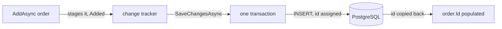

## Before you start

- [[backend.l1.querying-with-linq]] — you know EF Core sends one SQL statement for a whole chain of LINQ calls, only when something asks the query for results.
- [[backend.l1.creating-a-resource]] — you know the server assigns a new resource's id; the client never sends one.

## The situation

A teammate is reading `OrderService.PlaceOrderAsync` and finds two calls in a row: `AddAsync(order)`, then `SaveChangesAsync()`. `order.Id` is `0` right after the object is built — nothing set it — yet the method returns `order` with a real id a moment later, and that id ends up in the response's `Location` header. Doesn't `AddAsync` already write the order? And if it doesn't, where does the id come from?

## Core concepts

- change tracker — an in-memory list `DonHangDbContext` keeps of every entity it's watching, and what's changed about each one since it was loaded or added. Calling `AddAsync` marks an entity as new in this list; nothing is written anywhere yet.
- `SaveChangesAsync` — the call that turns every staged change in the change tracker into actual SQL and sends it, wrapping all of it in one transaction, by default: every staged change succeeds together, or none of them do.
- database-generated id — a primary key value like `orders.id` that PostgreSQL itself assigns during `INSERT`, not something EF Core invents in C#; the entity's `Id` property stays at its default until `SaveChangesAsync` runs and copies back what the database generated.

## How it works



With a database-generated identity key like `orders.id`, `AddAsync` doesn't send anything to PostgreSQL — it hands `order` to the change tracker and marks it `Added`, the same way `.Where(...)` builds a query description without running it. The object sitting in C# memory is unchanged by this call: `order.Id` is still `0`, because nothing has asked the database for one yet.

`SaveChangesAsync` is the call that actually does something. It looks at every entity the change tracker has marked as changed — here, the `Added` order plus each `OrderItem` in `order.Items`, which `AddAsync` staged along with it — and, for each one, builds the SQL that change needs: an `INSERT` for something added, an `UPDATE` for something modified. By default, all staged changes in one call go inside one transaction: every `INSERT`/`UPDATE`/`DELETE` succeeds together, or the whole batch is rolled back and none of it reaches the database.

`orders.id` is a column PostgreSQL assigns a value to on `INSERT`, the same way `customers.id`, `products.id`, `payments.id`, and `notifications.id` do — every single-column `id` primary key in this schema (`order_items` is the one exception, keyed by the pair `order_id`/`product_id` instead). Before `SaveChangesAsync` runs, `order.Id` is just the default value for an `int`, `0` — the object has never been near the database. Once the `INSERT` completes, EF Core reads the id PostgreSQL generated and copies it onto the same `order` object still sitting in C# memory, so the line right after `SaveChangesAsync()` — `notifier.Send(order.Id, ...)` — reads a real id, not `0`.

## In the Đơn Hàng system

`OrderService.PlaceOrderAsync`, in `DonHang.Domain/OrderService.cs`, is the two-step shape described above:

```csharp file=DonHang.Domain/OrderService.cs tag=stage-1 lines=8-23
    public async Task<Order> PlaceOrderAsync(int customerId, List<OrderItem> items)
    {
        if (items.Count == 0) throw new ArgumentException("an order needs at least one item");

        var order = new Order
        {
            CustomerId = customerId,
            PlacedAt = DateTimeOffset.UtcNow,
            Status = "new",
            Items = items,
        };
        await repository.AddAsync(order);
        await repository.SaveChangesAsync();
        notifier.Send(order.Id, "order placed");
        return order;
    }
```

`order` is built first, entirely in C# — `CustomerId`, `PlacedAt`, `Status`, `Items` all come from arguments or fixed values, nothing here touches PostgreSQL. `await AddAsync(order);` stages it; `await SaveChangesAsync();` is the line that actually writes it, and is also the line that gives `order.Id` its real value. Only after that second call does `notifier.Send(order.Id, ...)` have an id worth sending, and only after it does `return order;` hand back an object the `Location` header can build a URL from.

`EfOrderRepository`, in `DonHang.Infrastructure/EfOrderRepository.cs`, shows what these two calls actually do underneath:

```csharp file=DonHang.Infrastructure/EfOrderRepository.cs tag=stage-1 lines=16-18
    public async Task AddAsync(Order order) => await db.Orders.AddAsync(order);

    public Task SaveChangesAsync() => db.SaveChangesAsync();
```

Each is a one-line wrapper around the `DonHangDbContext` call of the same name: `AddAsync` here calls `db.Orders.AddAsync`, and `SaveChangesAsync` calls `db.SaveChangesAsync` directly, the same method described above.

## Beginners often think…

- **"`db.Orders.AddAsync(order)` writes the order to the database immediately."** → Actually `AddAsync` only stages the entity in the change tracker, marking it `Added`; nothing reaches PostgreSQL until `SaveChangesAsync` runs. You notice this when `order.Id` is still `0` right after `AddAsync`, and only becomes a real id after `SaveChangesAsync` completes.
- **"If one of several staged changes fails when saving, the others that already succeeded stay saved."** → Actually `SaveChangesAsync` wraps every staged change in one transaction by default; if any one of them fails, the whole batch is rolled back, including changes that would otherwise have succeeded on their own. You notice this when a single failing `INSERT` among several leaves the database exactly as it was before `SaveChangesAsync` was called, not partially updated.

## Try it (3 minutes)

1. From the Đơn Hàng project's root folder, run `scripts/up.sh` first and wait until it reports the system is ready. Sign in as `anh.tran@example.com` (`donhang-dev-password`) the same way `creating-a-resource` did, and send `POST /api/v1/orders` with one item.
2. Read the `id` field in the response, and the number at the end of the `Location` header.

Expected result: both name the same, real id — never `0` — even though nothing in the request body supplied one; PostgreSQL assigned it during the `INSERT` that `SaveChangesAsync` ran.

<details><summary>Suggested answer</summary>

The response's `id` and the `Location` header's trailing number match because both come from the same `order.Id`, read after `PlaceOrderAsync`'s `SaveChangesAsync()` call has already run. Before that call, `order.Id` was `0`; the client's request body never mentions an id at all, because the id is not the client's to assign — it's the database's, generated on `INSERT` and copied back onto `order` by EF Core.

</details>

## Connections

- [[backend.l1.creating-a-resource]] — the same `order.Id`, now traced back to the exact line, `SaveChangesAsync()`, that gives it a value.
- [[backend.l1.querying-with-linq]] — the read side of `EfOrderRepository`; `SaveChangesAsync` is the write side's equivalent of `.ToListAsync()`, the call that finally does something.

## Five-line summary

1. `AddAsync` only stages an entity in the change tracker, marking it `Added`; nothing reaches the database yet.
2. `SaveChangesAsync` is the call that turns every staged change into SQL and sends it.
3. By default, `SaveChangesAsync` wraps every staged change in one transaction: all succeed together, or none do.
4. A database-generated id like `orders.id` is assigned by PostgreSQL during `INSERT`, not invented by EF Core in C#.
5. `order.Id` stays `0` until `SaveChangesAsync` runs and copies back the id PostgreSQL generated.
