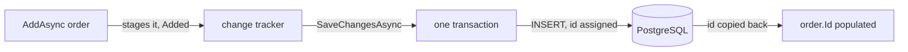

## Bạn cần biết trước

- [[backend.l1.querying-with-linq]] — bạn đã biết EF Core gửi một câu SQL cho cả một chuỗi lệnh gọi LINQ, chỉ khi có gì đó hỏi truy vấn xin kết quả.
- [[backend.l1.creating-a-resource]] — bạn đã biết server gán id cho một resource mới; client không bao giờ tự gửi một id.

## Tình huống

Một đồng nghiệp đang đọc `OrderService.PlaceOrderAsync` và thấy hai lệnh gọi liên tiếp: `AddAsync(order)`, rồi `SaveChangesAsync()`. `order.Id` là `0` ngay sau khi object được dựng lên — không gì gán nó — nhưng method trả về `order` với một id thật ngay sau đó, và id đó xuất hiện trong header `Location` của response. Chẳng phải `AddAsync` đã ghi order rồi sao? Và nếu không, id đến từ đâu?

## Khái niệm cốt lõi

- `DonHangDbContext` là class giữ các `DbSet` mà các truy vấn LINQ ở bài trước chạy lên. Một entity là một object C# như `order`, đại diện cho một dòng.
- change tracker — một danh sách trong bộ nhớ mà `DonHangDbContext` giữ, gồm mọi entity nó đang theo dõi, và những gì đã thay đổi ở mỗi entity kể từ khi nó được tải hoặc được thêm vào. Gọi `AddAsync` đánh dấu một entity là mới trong danh sách này, đưa nó vào trạng thái `Added`; đưa một thay đổi vào danh sách này là điều phần còn lại của bài gọi là staging nó, và không gì được ghi ở đâu cả cho tới khi thay đổi được lưu.
- `SaveChangesAsync` — lệnh gọi biến mọi thay đổi đã staged trong change tracker thành SQL thật và gửi đi, gói tất cả trong một transaction, theo mặc định: mọi thay đổi đã staged thành công cùng nhau, hoặc không cái nào cả.
- id do database sinh ra — một giá trị khóa chính như `orders.id` mà chính PostgreSQL gán trong lúc `INSERT`, không phải thứ EF Core tự bịa ra trong C#; property `Id` của entity giữ nguyên giá trị mặc định cho tới khi `SaveChangesAsync` chạy và chép lại giá trị database đã sinh ra.

## Cơ chế hoạt động



Với một id do database sinh ra như `orders.id` — một giá trị PostgreSQL tự điền vào khi `INSERT` bỏ trống cột đó — `AddAsync` không gửi gì tới PostgreSQL cả: nó trao `order` cho change tracker và đánh dấu nó `Added`, giống hệt cách `.Where(...)` dựng một mô tả truy vấn mà không chạy nó. `order.Id` vẫn là `0`, vì chưa gì hỏi database xin một giá trị cả.

`SaveChangesAsync` là lệnh gọi thực sự làm điều gì đó. Nó nhìn qua mọi entity change tracker đã đánh dấu là thay đổi và, với mỗi cái, dựng SQL mà thay đổi đó cần: một `INSERT` cho thứ được thêm, một `UPDATE` cho thứ bị sửa (bài này chỉ theo trường hợp thêm).

`AddAsync` staging không chỉ object được trao cho nó mà mọi entity nó chạm tới qua object đó, nên `AddAsync(order)` cũng staging mọi `OrderItem` trong `order.Items` — nhiều hơn một thay đổi staged từ một lệnh gọi.

Theo mặc định, một lệnh gọi `SaveChangesAsync()` lưu các thay đổi đã staged của nó theo kiểu tất-cả-hoặc-không-gì, độc lập với bất kỳ lệnh gọi nào khác: mọi `INSERT`/`UPDATE`/`DELETE` trong lệnh gọi đó thành công cùng nhau hoặc cả lô bị rollback — hoàn tác — và một lệnh gọi sau không thể hoàn tác thứ một lệnh gọi trước đã lưu. Đổi mặc định đó không phải điều bài này làm.

`orders.id` là một cột PostgreSQL gán giá trị vào lúc `INSERT`, giống mọi khóa chính `id` một cột trong schema này.

Trước khi `SaveChangesAsync` chạy, `order.Id` chỉ là giá trị mặc định của một `int`, `0` — object đó chưa từng đến gần database. Một khi `INSERT` hoàn tất, EF Core đọc id PostgreSQL đã sinh ra và chép nó vào cùng object `order` đang nằm trong bộ nhớ C#, nên dòng ngay sau `SaveChangesAsync()` — `notifier.Send(order.Id, ...)` — đọc được một id thật, không phải `0`.

## Trong hệ thống Đơn Hàng

`OrderService.PlaceOrderAsync`, trong `DonHang.Domain/OrderService.cs`, chính là hình dạng hai bước được mô tả ở trên. `repository` và `notifier` được trao cho `OrderService` khi nó được tạo ra; hai dòng cần chú ý nằm ở giữa:

```csharp file=DonHang.Domain/OrderService.cs tag=stage-1 lines=8-23
    public async Task<Order> PlaceOrderAsync(int customerId, List<OrderItem> items)
    {
        if (items.Count == 0) throw new ArgumentException("an order needs at least one item");

        var order = new Order
        {
            CustomerId = customerId,
            PlacedAt = DateTimeOffset.UtcNow,
            Status = "new",
            Items = items,
        };
        await repository.AddAsync(order);
        await repository.SaveChangesAsync();
        notifier.Send(order.Id, "order placed");
        return order;
    }
```

`order` được dựng trước, hoàn toàn trong C# — `CustomerId`, `PlacedAt`, `Status`, `Items` đều đến từ tham số hoặc giá trị cố định, không gì ở đây chạm tới PostgreSQL. `await AddAsync(order);` staging nó; `await SaveChangesAsync();` mới là dòng thực sự ghi nó, và cũng là dòng cho `order.Id` giá trị thật của nó. Chỉ sau lệnh gọi thứ hai đó `notifier.Send(order.Id, ...)` mới có một id đáng để gửi, và chỉ sau đó `return order;` mới trả về một object mà header `Location` có thể dựng URL từ đó.

`EfOrderRepository`, trong `DonHang.Infrastructure/EfOrderRepository.cs`, cho thấy hai lệnh gọi này thực sự làm gì bên dưới — `db` ở đây chính là `DonHangDbContext`:

```csharp file=DonHang.Infrastructure/EfOrderRepository.cs tag=stage-1 lines=16-18
    public async Task AddAsync(Order order) => await db.Orders.AddAsync(order);

    public Task SaveChangesAsync() => db.SaveChangesAsync();
```

Mỗi cái là một wrapper một dòng quanh lệnh gọi cùng tên của `DonHangDbContext`: `AddAsync` ở đây gọi `db.Orders.AddAsync`, và `SaveChangesAsync` gọi `db.SaveChangesAsync` trực tiếp, đúng method được mô tả ở trên.

## Người mới hay nghĩ rằng…

- **"`db.Orders.AddAsync(order)` ghi order vào database ngay lập tức."** → Thực ra `AddAsync` chỉ staging entity đó trong change tracker, đánh dấu `Added`; không gì chạm tới PostgreSQL cho tới khi `SaveChangesAsync` chạy. Bạn sẽ nhận ra điều này khi `order.Id` vẫn là `0` ngay sau `AddAsync`, và chỉ trở thành một id thật sau khi `SaveChangesAsync` hoàn tất.
- **"Nếu một trong nhiều thay đổi đã staged thất bại lúc lưu, những cái đã thành công trước đó vẫn được lưu."** → Thực ra `SaveChangesAsync` gói mọi thay đổi đã staged trong một transaction theo mặc định; nếu một trong số đó thất bại, cả lô bị rollback, kể cả những thay đổi lẽ ra đã tự thành công. Bạn sẽ nhận ra điều này khi một `INSERT` thất bại giữa nhiều cái khác để lại database y hệt như trước khi `SaveChangesAsync` được gọi, không phải cập nhật một phần.

## Thử ngay (3 phút)

1. Từ thư mục gốc của dự án Đơn Hàng, chạy `scripts/up.sh` trước và chờ nó báo hệ thống đã sẵn sàng. Chạy bước 1 và 2 của phần Thử ngay ở bài `creating-a-resource`: đăng nhập cho `anh.tran@example.com` (`donhang-dev-password`), rồi cùng request `POST /api/v1/orders` đó, gửi kèm token từ lúc đăng nhập.
2. Đọc trường `id` trong response, và con số ở cuối header `Location`.
3. Mở `DonHang.Domain/OrderService.cs` và tìm dòng đã cho id đó giá trị của nó — `await repository.SaveChangesAsync();`, không phải dòng `AddAsync` phía trên nó.

Kết quả mong đợi: cả hai đều nêu cùng một id thật — không bao giờ là `0` — dù không gì trong request body cung cấp một id; PostgreSQL đã gán nó trong lúc `INSERT` mà `SaveChangesAsync` chạy.

<details><summary>Gợi ý đáp án</summary>

`id` của response và con số ở cuối header `Location` khớp nhau vì cả hai đến từ cùng `order.Id`, đọc sau khi lệnh gọi `SaveChangesAsync()` của `PlaceOrderAsync` đã chạy xong. Trước lệnh gọi đó, `order.Id` là `0`; request body của client không hề nhắc tới một id nào cả, vì id không phải thứ client được tự gán — nó là của database, sinh ra lúc `INSERT` và được EF Core chép lại vào `order`.

</details>

## Liên hệ

- [[backend.l1.creating-a-resource]] — cùng `order.Id`, giờ đã truy ngược về đúng dòng, `SaveChangesAsync()`, cho nó giá trị.
- [[backend.l1.querying-with-linq]] — phía đọc của `EfOrderRepository`; `SaveChangesAsync` là tương đương phía ghi của `.ToListAsync()`, lệnh gọi cuối cùng thực sự làm gì đó.

## Tóm tắt 5 dòng

1. `AddAsync` chỉ staging một entity trong change tracker, đánh dấu `Added`; không gì chạm tới database cả.
2. `SaveChangesAsync` là lệnh gọi biến mọi thay đổi đã staged thành SQL và gửi đi.
3. Theo mặc định, `SaveChangesAsync` gói mọi thay đổi đã staged trong một transaction: tất cả thành công cùng nhau, hoặc không cái nào cả.
4. Một id do database sinh ra như `orders.id` được PostgreSQL gán lúc `INSERT`, không phải EF Core tự bịa ra trong C#.
5. `order.Id` giữ nguyên `0` cho tới khi `SaveChangesAsync` chạy và chép lại id PostgreSQL đã sinh ra.
