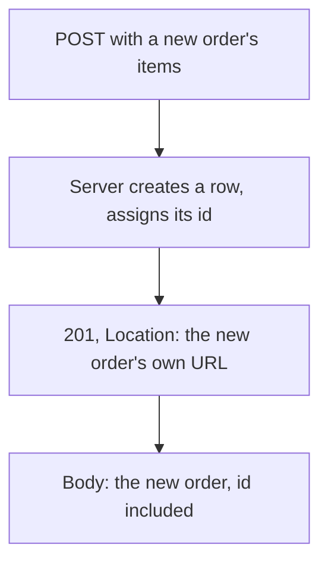

## Before you start

- [[backend.l1.get-and-status-codes]] — you know a `GET` answers `200` or `404` depending on whether something the URL names already exists. This lesson is about the status code for a request that makes something exist.

## The situation

A teammate reviewing a pull request for `POST /api/v1/orders` asks why a successful response comes back `201`, not `200` — the request worked, so why not the same code `Get(int id)` from the last lesson uses when it works? `Get(int id)` only ever hands back an order that already existed before the request arrived. `Create` is different: before the request, no such order existed anywhere; the request itself is what brings one into being. Does that difference change which status code counts as "succeeded", or what else, besides a status code, the client needs back?

## Core concepts

- `201` vs `200` — `200` means the request succeeded and the answer already existed; `201` means the request succeeded and, because of it, something new exists now that didn't a moment before.
- `Location` header — a `201` response carries a `Location` header naming the new resource's own URL, so the client can read it back without guessing the id the server just assigned.
- the server assigns the id — a client sending `POST /api/v1/orders` never puts an id in the request; the server decides the new order's id and hands it back, in both the `Location` header and the response body.
- `POST` is not idempotent — sending the same `POST` twice does not repeat one result; it creates two separate orders, unlike a `GET`, which just re-reads the same thing every time.

## How it works



A `POST` that creates something answers a different question than a `GET` does. `Get(int id)` from the last lesson asks "does this one thing exist?" and only has two answers, `200` or `404`, because the id in the URL was already fixed before the request arrived. `Create` never asks that question — every valid request makes a new row, so there is no not-found branch to take at all, and no id in the URL to check against anything yet, because the id doesn't exist yet either.

Since the client can't know the new id in advance, it can't put it in the URL or the body — the server has to choose it and report it back. It reports it two ways at once: the `Location` header, letting the client read the new order back with a plain `GET` against its own URL, and the response body, letting the client use the created order immediately without a second request. Both carry the id the server just assigned; the client contributed nothing but the order's contents.

Repeating the exact same `POST` doesn't repeat the exact same result the way repeating a `GET` does. Each successful `Create` call makes one more row, with its own new id, whether or not an earlier call already created an order with identical items. Nothing here is about the response looking wrong — two `201` responses side by side, for two different orders, are both correct answers, because two different requests happened.

## In the Đơn Hàng system

`OrdersController.Create` builds a new order and answers with its id and its URL:

```csharp file=DonHang.Api/Controllers/OrdersController.cs tag=stage-1 lines=9-28
// lesson: backend.l1.creating-a-resource
[ApiController]
[Route("api/v1/orders")]
public sealed class OrdersController(OrderService orderService, IOrderRepository repository) : ControllerBase
{
    // lesson: backend.l1.rest-for-writes
    // Requires a signed-in customer; customer_id comes from the token's `sub`
    // claim, never from the request body (frontend.l1.creating-an-order).
    [Authorize]
    [HttpPost]
    public async Task<ActionResult<OrderDto>> Create(CreateOrderRequest request)
    {
        var customerId = int.Parse(User.FindFirstValue(JwtRegisteredClaimNames.Sub)!);
        var items = request.Items
            .Select(i => new OrderItem { ProductId = i.ProductId, Quantity = i.Quantity, UnitPriceVnd = i.UnitPriceVnd })
            .ToList();

        var order = await orderService.PlaceOrderAsync(customerId, items);
        return CreatedAtAction(nameof(Get), new { id = order.Id }, ToDto(order));
    }
```

`Create` has one `return`, unconditional, the same shape as `List()`'s one `return` from two lessons ago — no found-or-not-found branch, because there is nothing to look up yet. `[Authorize]` above `[HttpPost]` means this endpoint only runs for a signed-in caller; `customerId` comes from who is signed in, never from `request`, which is why `CreateOrderRequest` (from the last lesson's `Dtos.cs`) has no field for it. `orderService.PlaceOrderAsync(customerId, items)` does the actual work of building and saving the order — a later module opens that up; here it only matters that it hands back the `order` it just created, complete with the id the database assigned.

`CreatedAtAction(nameof(Get), new { id = order.Id }, ToDto(order))` does three things in one call: it answers `201`; it builds a `Location` header from `Get`'s own route, `GET /api/v1/orders/{id}`, filled in with this new order's id; and it puts `ToDto(order)` — the same mapping to `OrderDto` the last lesson's `Get` uses — in the response body. Nothing about `id`, here, comes from `request`: `CreateOrderRequest` only carries `Items`, so there was never anywhere for the client to put one.

## Beginners often think…

- **"A successful `POST` should return `200`, the same as a successful `GET`."** → Actually `201` says something `200` doesn't: that the request didn't just succeed, it made a new resource exist. `Create` answers `201` precisely because, unlike `Get(int id)`, it has no existing row to simply confirm — it just made the row that `id` now points at.
- **"The client can send its own id for the new order, and the server should just use it."** → Actually `CreateOrderRequest` has no id field at all — only `Items` — so there is nowhere in the request to put one. `order.Id` in the code above comes from the database, after `PlaceOrderAsync` saves the row, not from anything the client sent.

## Try it (3 minutes)

1. From the Đơn Hàng project's root folder, with the example system running (`scripts/up.sh`), sign in as a seeded customer to get a token: `curl -sS -X POST http://localhost:8080/api/v1/auth/login -H 'Content-Type: application/json' -d '{"email":"anh.tran@example.com","password":"donhang-dev-password"}'` — copy the `token` field's value from the response.
2. Use that token to create an order: `curl -i -X POST http://localhost:8080/api/v1/orders -H 'Content-Type: application/json' -H "Authorization: Bearer <token>" -d '{"items":[{"productId":2,"quantity":1,"unitPriceVnd":450000}]}'` (replace `<token>` with the value copied in step 1).

Expected result: `201 Created`, a `Location` header reading `.../api/v1/orders/<the new order's id>`, and a body with that same id, `"status":"new"`, and the one item you sent. Running step 2 again with the same body creates a second order with a different id — the request is identical, but the result isn't, because `Create` isn't asking "does this exist?" the way `Get(int id)` does.

<details><summary>Suggested answer</summary>

Step 1's response is `{"token":"..."}`; that token proves who is signed in. Step 2's `[Authorize]` endpoint reads that identity — not anything in the JSON body — to decide whose order this is. `Create` then runs unconditionally: build the items, call `PlaceOrderAsync`, and answer `201` with `Location` and a body built from whatever id the database just assigned. Running step 2 twice makes two rows, two ids, two `201`s — `POST` was never promising the second call would leave things as they were.

</details>

## Connections

- [[backend.l1.get-and-status-codes]] — the `200`/`404` pair this lesson's `201` sits alongside, and the `Get(int id)` route `Location` points at.
- [[backend.l1.dtos-and-serialization]] — `CreateOrderRequest` and `OrderDto`, the shapes this endpoint reads and answers in.
- [[backend.l1.rest-for-writes]] — the remaining write methods, `PUT`, `PATCH`, `DELETE`, none of which create a new resource the way `POST` does here.

## Five-line summary

1. `201` means the request succeeded and created a new resource; `200` means the request succeeded and the answer already existed.
2. A `201` response carries a `Location` header naming the new resource's own URL.
3. The server assigns the new resource's id; the client never sends one, because there's nowhere in the request to put it.
4. `Create` has one unconditional `return` — no found-or-not-found branch, because nothing exists yet to look up.
5. `POST` is not idempotent: the same request sent twice creates two resources, not one.
