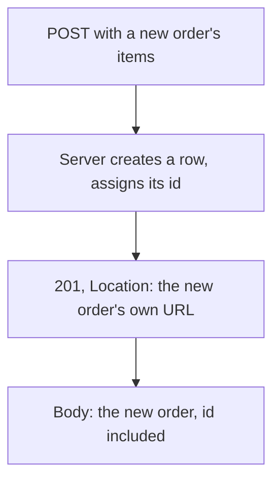

## Before you start

- [[backend.l1.get-and-status-codes]] — you know a `GET` answers `200` or `404` depending on whether something the URL names already exists. This lesson is about the status code for a request that makes something exist.

## The situation

A teammate reviewing a pull request for `POST /api/v1/orders` asks why a successful response comes back `201`, not `200`. Isn't `200` what "succeeded" means already — the code `ProductsController.Get(int id)` answers with when it finds a product? `ProductsController.Get(int id)` only ever hands back something that already existed before the request arrived. `OrdersController.Create`, the method behind that `POST`, is different: before the request, no such order existed anywhere; the request itself is what brings one into being. Does that difference change which status code counts as "succeeded", or what else, besides a status code, the client needs back?

## Core concepts

- `201` vs `200` — `200` says only that the request succeeded; `201` says that and adds that the request created a new resource that didn't exist a moment before.
- `Location` header — a `201` for a newly created resource should carry a `Location` header naming that resource's own URL (this API always sends one), so the client can read it back without guessing the id the server just assigned.
- the server assigns the id — a client sending `POST /api/v1/orders` never puts an id in the request; the server decides the new order's id and hands it back, in both the `Location` header and the response body.
- `POST` is not idempotent — sending the same `POST` twice does not give you back the first call's result; it creates two separate orders, unlike a `GET`, which is not supposed to change the server at all.

## How it works



A `POST` that creates something answers a different question than a `GET` does. `ProductsController.Get(int id)` from the last lesson asks "does this one thing exist?" and only has two answers, `200` or `404`, because the id in the URL was already fixed before the request arrived. `Create` never asks that question — every valid request makes a new row (the new order, the resource the `Location` header will point at), so there is no not-found branch to take at all, and no id in the URL to check against anything yet, because the id doesn't exist yet either.

Since the client can't know the new id in advance, it can't put it in the URL or the body — the server has to choose it and report it back. It reports it two ways at once: the `Location` header, letting the client read the new order back with a plain `GET` against its own URL, and the response body, letting the client use the created order immediately without a second request. Both carry the id the server just assigned; the client contributed nothing but the order's contents.

Repeating the exact same `POST` changes the server again each time; a `GET` is not supposed to change it at all. Each successful `Create` call makes one more row, with its own new id, whether or not an earlier call already created an order with identical items. The two `201` answers aren't supposed to be the same answer: each one reports a different new order, so both are correct.

## In the Đơn Hàng system

`OrdersController.Create` builds a new order and answers with its id and its URL:

```csharp file=DonHang.Api/Controllers/OrdersController.cs tag=stage-1 lines=9-28
// lesson: backend.l1.creating-a-resource
[ApiController]
[Route("api/v1/orders")]
public sealed class OrdersController(OrderService orderService, IOrderRepository repository) : ControllerBase
{
    // lesson: backend.l1.rest-for-writes
    // Requires a signed-in customer; customer_id comes from the token's `sub`
    // claim, never from the request body (frontend.l1.creating-an-order).
    [Authorize]
    [HttpPost]
    public async Task<ActionResult<OrderDto>> Create(CreateOrderRequest request)
    {
        var customerId = int.Parse(User.FindFirstValue(JwtRegisteredClaimNames.Sub)!);
        var items = request.Items
            .Select(i => new OrderItem { ProductId = i.ProductId, Quantity = i.Quantity, UnitPriceVnd = i.UnitPriceVnd })
            .ToList();

        var order = await orderService.PlaceOrderAsync(customerId, items);
        return CreatedAtAction(nameof(Get), new { id = order.Id }, ToDto(order));
    }
```

The comments inside the block are bookmarks in the Đơn Hàng codebase — which lesson uses each part, and where the signed-in customer's id comes from — and can all be ignored while reading this one, as can `[ApiController]`, `ControllerBase`, and the `ActionResult<...>` wrapper on the return type — the same class plumbing every class like this one in this API carries.

`Create` has one `return`, unconditional, the same shape as `List()`'s one `return` from the last lesson — no found-or-not-found branch, because there is nothing to look up yet. The class header hands `OrdersController` two things to work with, `orderService` and `repository`; `Create` only uses `orderService` (`repository` is for the `Get` method further down, not shown here).

`[HttpPost]` is what makes this method the one that answers a `POST` on the path `[Route("api/v1/orders")]` gives the class; `[Authorize]` above it means this endpoint only runs for a signed-in caller. `customerId` comes from who is signed in, never from `request`, which is why `CreateOrderRequest` (from `Dtos.cs`, two lessons ago) has no field for it. That first line inside `Create` is where the signed-in caller's id is read; how that identity reaches the endpoint is not this lesson's subject.

The line right after it turns each entry of `request.Items` into an `OrderItem`, which is what gets passed to `orderService.PlaceOrderAsync(customerId, items)` — the call that does the actual work of building and saving the order. A later module opens that up; here it only matters that it hands back the `order` it just created, complete with the id assigned when the row was saved.

`CreatedAtAction(nameof(Get), new { id = order.Id }, ToDto(order))` does three things in one call. `nameof(Get)` names `OrdersController`'s own `Get(int id)`, further down the same file (not shown here), which answers `GET /api/v1/orders/{id}`; `CreatedAtAction` fills that route — the path `Get` answers on — in with the new order's id to build the `Location` header. It also answers `201`, and it puts `ToDto(order)` — mapping the saved `order` into the `OrderDto` shape from `Dtos.cs` (two lessons ago), by a small private helper further down the same file — in the response body. Nothing about `id`, here, comes from `request`: `CreateOrderRequest` only carries `Items`, so there was never anywhere for the client to put one.

## Beginners often think…

- **"A successful `POST` should return `200`, the same as a successful `GET`."** → Actually `201` says something `200` doesn't: that the request didn't just succeed, it made a new resource exist. `Create` answers `201` precisely because, unlike `ProductsController.Get(int id)`, it has no existing row to simply confirm — it just made the row that `id` now points at.
- **"The client can send its own id for the new order, and the server should just use it."** → Actually `CreateOrderRequest` has no id field at all — only `Items` — so there is nowhere in the request to put one. `order.Id` in the code above is assigned when `PlaceOrderAsync` saves the row, not from anything the client sent.

## Try it (3 minutes)

1. From the Đơn Hàng project's root folder, with the example system running (`scripts/up.sh`), sign in as a customer the example data already contains, to get a token: `curl -sS -X POST http://localhost:8080/api/v1/auth/login -H 'Content-Type: application/json' -d '{"email":"anh.tran@example.com","password":"donhang-dev-password"}'` — copy the `token` field's value from the response. That value is the string that tells the server which customer is calling; step 2 sends it back in the `Authorization` header, which is how the server knows who is calling before `[Authorize]` lets the request through.
2. Use that token to create an order: `curl -i -X POST http://localhost:8080/api/v1/orders -H 'Content-Type: application/json' -H "Authorization: Bearer <token>" -d '{"items":[{"productId":2,"quantity":1,"unitPriceVnd":450000}]}'` (replace `<token>` with the value copied in step 1; `-i` makes the response's status line and headers print above the body — that is where `Location` shows up).
3. Run the exact same command from step 2 again, unchanged, and compare the two `Location` headers.

Expected result: step 2 returns `201 Created`, a `Location` header reading `.../api/v1/orders/<the new order's id>`, and a body with that same id, `"status":"new"` (set inside `PlaceOrderAsync`, not by `Create` — not something to look for in the code above), and the one item you sent. Step 3 returns another `201`, with a different id in both `Location` and the body — the request was identical, but the result isn't, because `Create` isn't asking "does this exist?" the way `ProductsController.Get(int id)` does.

<details><summary>Suggested answer</summary>

Step 1's response is `{"token":"..."}`; that token proves who is signed in. Step 2's `[Authorize]` endpoint reads that identity — not anything in the JSON body — to decide whose order this is. `Create` then runs unconditionally: build the items, call `PlaceOrderAsync`, and answer `201` with `Location` and a body built from whatever id was just assigned. Steps 2 and 3 make two rows, two ids, two `201`s — `POST` was never promising the second call would leave things as they were.

</details>

## Connections

- [[backend.l1.get-and-status-codes]] — the `200`/`404` pair this lesson's `201` sits alongside; `Location` here points at the orders equivalent of that lesson's item-URL `GET`.
- [[backend.l1.dtos-and-serialization]] — `CreateOrderRequest` and `OrderDto`, the shapes this endpoint reads and answers in.
- [[backend.l1.rest-for-writes]] — the remaining write methods, `PUT`, `PATCH`, `DELETE`, none of which have the server choose a brand-new URL the way `POST` does here.

## Five-line summary

1. `200` says only that the request succeeded; `201` says that and adds that the request created a new resource.
2. A `201` for a new resource should carry a `Location` header naming that resource's own URL — this API always sends one.
3. The server assigns the new resource's id; the client never sends one, because there's nowhere in the request to put it.
4. `Create` has one unconditional `return` — no found-or-not-found branch, because nothing exists yet to look up.
5. `POST` is not idempotent: the same request sent twice creates two resources, not one.
