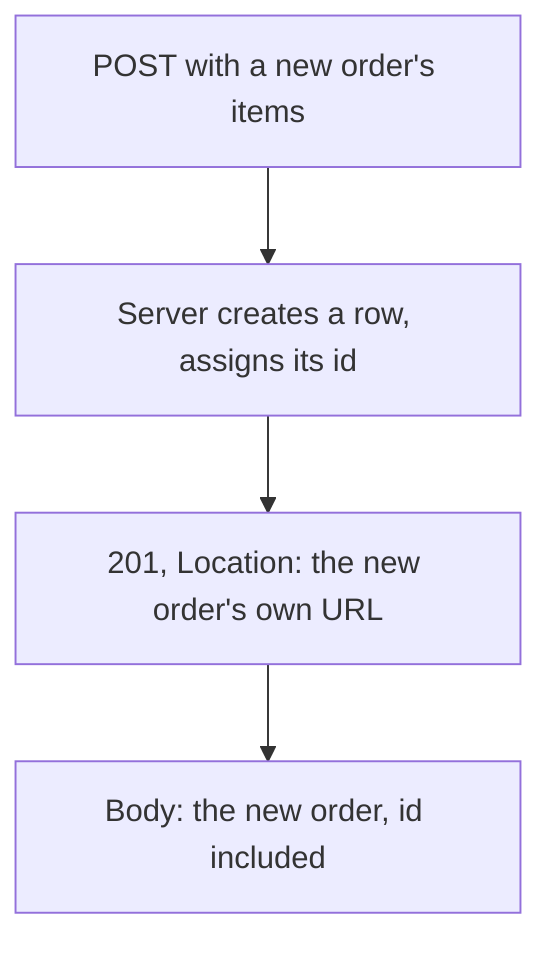

## Bạn cần biết trước

- [[backend.l1.get-and-status-codes]] — bạn đã biết một `GET` trả về `200` hay `404` tùy vào việc thứ mà URL đặt tên đã tồn tại hay chưa. Bài này nói về status code cho một request làm cho thứ gì đó tồn tại.

## Tình huống

Một đồng nghiệp đang review pull request cho `POST /api/v1/orders` hỏi tại sao response thành công trả về `201`, không phải `200`. Chẳng phải `200` đã có nghĩa là "thành công" rồi sao — chính là mã mà `ProductsController.Get(int id)` trả về khi nó tìm thấy một sản phẩm? `ProductsController.Get(int id)` chỉ từng trả về thứ đã tồn tại sẵn trước khi request tới. `OrdersController.Create`, method đứng sau `POST` đó, thì khác: trước request, không hề có order nào như vậy tồn tại ở đâu cả; chính request đó là thứ làm cho nó ra đời. Sự khác biệt đó có làm thay đổi cái gì tính là "thành công", hay có gì khác, ngoài status code, mà client cần nhận lại?

## Khái niệm cốt lõi

- `201` so với `200` — `200` chỉ nói rằng request đã thành công; `201` nói điều đó và thêm rằng request đã tạo ra một resource mới, thứ chưa tồn tại trước đó một khắc.
- header `Location` — một `201` cho resource vừa tạo nên mang theo header `Location` đặt tên URL riêng của resource đó (API này luôn gửi kèm), để client đọc lại được nó mà không cần đoán id server vừa gán.
- server gán id — một client gửi `POST /api/v1/orders` không bao giờ đưa id vào request; server quyết định id của order mới và trả nó lại, cả trong header `Location` lẫn trong response body.
- `POST` không idempotent — gửi cùng một `POST` hai lần không trả lại kết quả của lần gọi đầu; nó tạo ra hai order riêng biệt, khác với một `GET`, thứ không được phép thay đổi server chút nào.

## Cơ chế hoạt động



Một `POST` tạo ra thứ gì đó trả lời một câu hỏi khác với một `GET`. `ProductsController.Get(int id)` từ bài trước hỏi "thứ này có tồn tại không?" và chỉ có hai câu trả lời, `200` hoặc `404`, vì id trong URL đã cố định từ trước khi request tới. `Create` không bao giờ hỏi câu đó — mọi request hợp lệ đều tạo ra một dòng mới (chính order mới, resource mà header `Location` sẽ trỏ tới), nên hoàn toàn không có nhánh không-tìm-thấy nào để đi, và cũng không có id nào trong URL để đối chiếu, vì id đó còn chưa tồn tại.

Vì client không thể biết trước id mới, nó không thể đưa id vào URL hay vào body — server phải là bên chọn id và báo lại. Server báo theo hai cách cùng lúc: header `Location`, cho client đọc lại order mới bằng một `GET` thuần vào đúng URL riêng của nó, và response body, cho client dùng ngay order vừa tạo mà không cần thêm một request nữa. Cả hai đều mang id server vừa gán; client không đóng góp gì ngoài nội dung của order.

Lặp lại đúng một `POST` làm thay đổi server thêm một lần nữa mỗi lần gọi; một `GET` thì không được phép thay đổi server chút nào. Mỗi lần gọi `Create` thành công tạo thêm một dòng, với id mới riêng của nó, bất kể trước đó đã có một lần gọi tạo ra order với đúng những item giống hệt hay chưa. Hai câu trả lời `201` không có nghĩa là phải giống nhau: mỗi câu trả lời báo về một order mới khác nhau, nên cả hai đều đúng.

## Trong hệ thống Đơn Hàng

`OrdersController.Create` dựng một order mới và trả lời kèm id và URL của nó:

```csharp file=DonHang.Api/Controllers/OrdersController.cs tag=stage-1 lines=9-28
// lesson: backend.l1.creating-a-resource
[ApiController]
[Route("api/v1/orders")]
public sealed class OrdersController(OrderService orderService, IOrderRepository repository) : ControllerBase
{
    // lesson: backend.l1.rest-for-writes
    // Requires a signed-in customer; customer_id comes from the token's `sub`
    // claim, never from the request body (frontend.l1.creating-an-order).
    [Authorize]
    [HttpPost]
    public async Task<ActionResult<OrderDto>> Create(CreateOrderRequest request)
    {
        var customerId = int.Parse(User.FindFirstValue(JwtRegisteredClaimNames.Sub)!);
        var items = request.Items
            .Select(i => new OrderItem { ProductId = i.ProductId, Quantity = i.Quantity, UnitPriceVnd = i.UnitPriceVnd })
            .ToList();

        var order = await orderService.PlaceOrderAsync(customerId, items);
        return CreatedAtAction(nameof(Get), new { id = order.Id }, ToDto(order));
    }
```

Các comment trong khối này là dấu đánh dấu trong codebase Đơn Hàng — bài nào dùng phần nào, và id của customer đã đăng nhập tới từ đâu — và đều có thể bỏ qua khi đọc bài này, cũng như `[ApiController]`, `ControllerBase`, và lớp bọc `ActionResult<...>` trên kiểu trả về — cùng một khung sườn class mà mọi class giống thế này trong API này đều mang.

`Create` chỉ có đúng một `return`, không điều kiện, cùng hình dạng với `return` duy nhất của `List()` ở bài trước — không có nhánh tìm-thấy-hay-không, vì chưa có gì để tra cứu. Phần đầu class trao cho `OrdersController` hai thứ để làm việc, `orderService` và `repository`; `Create` chỉ dùng `orderService` (`repository` dành cho method `Get`, ở dưới, không hiện ở đây).

`[HttpPost]` là thứ khiến method này là method trả lời một `POST` trên đường dẫn mà `[Route("api/v1/orders")]` trao cho class; `[Authorize]` phía trên nó nghĩa là endpoint này chỉ chạy cho người gọi đã đăng nhập. `customerId` tới từ việc ai đang đăng nhập, không bao giờ từ `request`, đó là lý do `CreateOrderRequest` (từ `Dtos.cs`, hai bài trước) không có trường nào cho nó. Dòng đầu tiên đó bên trong `Create` là nơi id của người gọi đã đăng nhập được đọc; danh tính đó tới endpoint bằng cách nào không phải chủ đề của bài này.

Dòng ngay sau đó biến mỗi phần tử của `request.Items` thành một `OrderItem`, thứ được đưa vào `orderService.PlaceOrderAsync(customerId, items)` — lệnh gọi thực sự làm việc dựng và lưu order. Một module sau sẽ mở cái đó ra; ở đây chỉ cần biết nó trả lại `order` vừa tạo, kèm đầy đủ id được gán khi dòng dữ liệu được lưu.

`CreatedAtAction(nameof(Get), new { id = order.Id }, ToDto(order))` làm ba việc trong một lệnh gọi. `nameof(Get)` đặt tên `Get(int id)` của riêng `OrdersController`, ở dưới cùng file (không hiện ở đây), method trả lời `GET /api/v1/orders/{id}`; `CreatedAtAction` điền route đó — chính đường dẫn mà `Get` trả lời trên đó — bằng id của order mới để dựng header `Location`. Nó cũng trả về `201`, và đặt `ToDto(order)` — ánh xạ `order` vừa lưu vào hình dạng `OrderDto` từ `Dtos.cs` (hai bài trước), bằng một hàm phụ private ở dưới cùng file — vào response body. Không có gì về `id`, ở đây, tới từ `request`: `CreateOrderRequest` chỉ mang `Items`, nên chưa từng có chỗ nào để client đưa id vào.

## Người mới hay nghĩ rằng…

- **"Một `POST` thành công nên trả về `200`, giống như một `GET` thành công."** → Thực ra `201` nói một điều mà `200` không nói: rằng request không chỉ thành công, nó còn làm cho một resource mới tồn tại. `Create` trả về `201` chính xác vì, khác với `ProductsController.Get(int id)`, nó không có dòng dữ liệu sẵn có nào để chỉ xác nhận lại — nó vừa tạo ra chính dòng mà `id` giờ trỏ tới.
- **"Client có thể gửi id riêng cho order mới, và server nên dùng nó."** → Thực ra `CreateOrderRequest` không hề có trường id nào — chỉ có `Items` — nên không có chỗ nào trong request để đưa id vào. `order.Id` trong đoạn code trên được gán khi `PlaceOrderAsync` lưu dòng dữ liệu, không phải từ bất cứ gì client gửi.

## Thử ngay (3 phút)

1. Từ thư mục gốc của dự án Đơn Hàng, với hệ thống ví dụ đang chạy (`scripts/up.sh`), đăng nhập bằng một customer mà dữ liệu mẫu đã có sẵn, để lấy token: `curl -sS -X POST http://localhost:8080/api/v1/auth/login -H 'Content-Type: application/json' -d '{"email":"anh.tran@example.com","password":"donhang-dev-password"}'` — sao chép giá trị trường `token` từ response. Giá trị đó là chuỗi báo cho server biết customer nào đang gọi; bước 2 gửi nó lại trong header `Authorization`, đó là cách server biết ai đang gọi trước khi `[Authorize]` cho request đi qua.
2. Dùng token đó để tạo một order: `curl -i -X POST http://localhost:8080/api/v1/orders -H 'Content-Type: application/json' -H "Authorization: Bearer <token>" -d '{"items":[{"productId":2,"quantity":1,"unitPriceVnd":450000}]}'` (thay `<token>` bằng giá trị đã sao chép ở bước 1; `-i` khiến dòng status và header của response in ra phía trên body — đó là nơi `Location` xuất hiện).
3. Chạy lại đúng lệnh ở bước 2 lần nữa, không đổi gì, và so sánh hai header `Location`.

Kết quả mong đợi: bước 2 trả về `201 Created`, một header `Location` đọc như `.../api/v1/orders/<id của order mới>`, và một body mang đúng id đó, `"status":"new"` (được đặt bên trong `PlaceOrderAsync`, không phải bởi `Create` — không phải thứ cần tìm trong đoạn code trên), và đúng item bạn đã gửi. Bước 3 trả về một `201` khác, với id khác trong cả `Location` lẫn body — request giống hệt, nhưng kết quả thì không, vì `Create` không hỏi "thứ này có tồn tại không?" theo cách `ProductsController.Get(int id)` hỏi.

<details><summary>Gợi ý đáp án</summary>

Response của bước 1 là `{"token":"..."}`; token đó chứng minh ai đang đăng nhập. Endpoint `[Authorize]` ở bước 2 đọc danh tính đó — không phải gì trong JSON body — để quyết định order này là của ai. `Create` sau đó chạy không điều kiện: dựng item, gọi `PlaceOrderAsync`, và trả về `201` kèm `Location` và một body dựng từ id vừa được gán. Bước 2 và 3 tạo ra hai dòng, hai id, hai `201` — `POST` chưa bao giờ hứa rằng lần gọi thứ hai sẽ giữ mọi thứ như cũ.

</details>

## Liên hệ

- [[backend.l1.get-and-status-codes]] — cặp `200`/`404` mà `201` của bài này đứng cạnh; `Location` ở đây trỏ tới phiên bản orders của cái `GET` trên item URL ở bài đó.
- [[backend.l1.dtos-and-serialization]] — `CreateOrderRequest` và `OrderDto`, các hình dạng mà endpoint này đọc vào và trả lời bằng.
- [[backend.l1.rest-for-writes]] — các method ghi còn lại, `PUT`, `PATCH`, `DELETE`, không method nào để server chọn một URL hoàn toàn mới theo cách `POST` làm ở đây.

## Tóm tắt 5 dòng

1. `200` chỉ nói rằng request đã thành công; `201` nói điều đó và thêm rằng request đã tạo ra một resource mới.
2. Một `201` cho resource mới nên mang theo header `Location` đặt tên URL riêng của resource đó — API này luôn gửi kèm.
3. Server gán id cho resource mới; client không bao giờ tự gửi một id, vì không có chỗ nào trong request để đưa nó vào.
4. `Create` chỉ có một `return` không điều kiện — không có nhánh tìm-thấy-hay-không, vì chưa có gì tồn tại để tra cứu.
5. `POST` không idempotent: cùng một request gửi hai lần tạo ra hai resource, không phải một.
