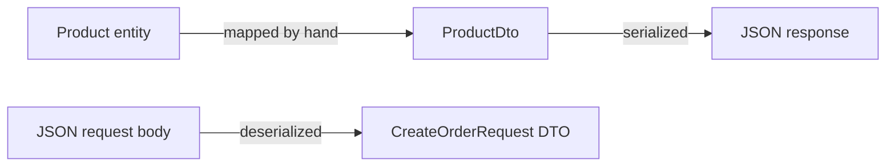

## Before you start

- [[backend.l1.rest-resources]] — you know `GET /api/v1/products` answers with a JSON array; this lesson is about what shapes each item in that array.

## The situation

A teammate suggests skipping a separate type for what `GET /api/v1/products/{id}` returns — just return the `Product` class the server already has internally, and save writing another type. It would work today: `Product` only has `Id`, `Name`, and `PriceVnd`, exactly the fields a client would want back. Nothing in the response would look wrong, and no test would catch a difference, because right now there isn't one. What could go wrong later, once `Product` needs to hold something a client should never see, that this response gives no hint of right now?

## Core concepts

- **DTO** (data transfer object) — a plain type shaped for the wire, holding only the fields a client needs, kept separate from whatever internal type the server uses for the same thing.
- serialization — turning a DTO into JSON automatically when an endpoint returns it; each property becomes a JSON field.
- deserialization — the reverse: turning a request body's JSON into a DTO, the same kind of mapping run the other way.
- naming — ASP.NET Core's default JSON options write each property name in camelCase: the first word lowercase, later words keeping their capital — a C# `PriceVnd` becomes a JSON `priceVnd`, not because you asked, but because that is the default.

## How it works



A DTO is not the entity; something in the endpoint's own code has to build one from the other, field by field. `ProductsController.List()`, from the last lesson, does exactly this: `new ProductDto(p.Id, p.Name, p.PriceVnd)`, one argument per property, read off a `Product` row. Once that `ProductDto` is what the endpoint returns, serialization takes over — it walks the DTO's properties and writes one JSON field per property, with no further code from you.

The same mapping runs in reverse for a request body: `POST /api/v1/orders`'s body is JSON, and deserialization turns it into a `CreateOrderRequest` before any of your code sees it — one JSON field filling one property, the same field-by-field mapping, run the other way.

Property names do not survive that trip unchanged going out. ASP.NET Core's default JSON options write each property name in camelCase for a response: the first word lowercase, later words keeping their capital, so a C# property `PriceVnd` is written as JSON `priceVnd`. Nothing in `ProductDto` asks for this — it is what the serializer does to every property, every time, unless told otherwise.

## In the Đơn Hàng system

`DonHang.Api/Dtos.cs` holds the shapes these endpoints answer in and read from, kept in one file separate from `DonHang.Domain`'s entities — the first records in the file, below, are the ones this lesson uses:

```csharp file=DonHang.Api/Dtos.cs tag=stage-1 lines=1-13
namespace DonHang.Api;

// lesson: backend.l1.dtos-and-serialization
// The API answers in these shapes, never in the entity shapes from DonHang.Domain.
public sealed record ProductDto(int Id, string Name, int PriceVnd);

public sealed record OrderItemDto(int ProductId, int Quantity, int UnitPriceVnd);

public sealed record OrderDto(int Id, int CustomerId, string Status, DateTimeOffset PlacedAt, List<OrderItemDto> Items);

public sealed record CreateOrderItemRequest(int ProductId, int Quantity, int UnitPriceVnd);

public sealed record CreateOrderRequest(List<CreateOrderItemRequest> Items);
```

Each `record` here is a type whose only job is to hold these named values — a shape, not behavior. `ProductDto` happens to list the same three fields as the `Product` entity it is built from, but that is a coincidence of today's code, not a rule; they are still two separate types, and the comment above them says why: the API answers in these shapes, not the entity's.

`OrderItemDto` shows the "only the fields a client needs" half of the definition on its own: the entity behind it, `OrderItem`, also carries an `OrderId`, tying each item back to its order row. `OrderItemDto` drops that field — a client reading an order already knows which order it asked for, so repeating that id on every item inside it would say nothing new.

## Beginners often think…

- **"Returning the same class the server uses internally is simpler and just as safe as writing a DTO."** → Actually it works only until the internal type needs a field the client should never see, or drops a field a client already depends on. `Customer`, in `DonHang.Domain`, carries a `PasswordHash` alongside a customer's name and email — returning `Customer` directly from any future endpoint would serialize that field too, unless every future change to `Customer` is checked against what every client already receives.
- **"A JSON field's name always matches a C# property name exactly, with nothing to configure."** → Actually the default JSON options write every property name in camelCase for you: `ProductDto`'s `PriceVnd` reaches the client as `priceVnd`. You notice this in Try it below, where the response never has a capital `P` in `priceVnd`.

## Try it (3 minutes)

1. With the lab running, run `curl -s http://localhost:8080/api/v1/products/1`.
2. Look at the field names in the response.

Expected result: `{"id":1,"name":"Bàn phím cơ","priceVnd":1250000}` — three fields, matching `ProductDto`'s three properties, but each name starts with a lowercase letter: `id`, not `Id`; `priceVnd`, not `PriceVnd`.

<details><summary>Suggested answer</summary>

`ProductDto(int Id, string Name, int PriceVnd)` has three properties, `Id`, `Name`, and `PriceVnd`. Serialization writes one JSON field per property, but writes each name in camelCase on the way — `Id` becomes `id`, `PriceVnd` becomes `priceVnd` — which is why the response's field names never match the DTO's property names letter for letter, even though they match field for field.

</details>

## Connections

- [[backend.l1.rest-resources]] — the endpoints this lesson's DTOs answer for and read into.
- [[backend.l1.get-and-status-codes]] — what a GET endpoint returns alongside its DTO: the right status code for whether one was found.
- [[backend.l1.efcore-mapping]] — the entities this lesson keeps separate from every DTO, mapped to database tables instead of to JSON.

## Five-line summary

1. A DTO is a plain type shaped for the wire — only the fields a client needs — not whatever internal type the server uses.
2. Serialization turns a returned DTO into JSON automatically, one JSON field per property, with no extra code from you.
3. Deserialization is the same mapping in reverse: a request body's JSON becomes a DTO before your endpoint's code runs.
4. The default JSON options write each property name in camelCase — `PriceVnd` becomes `priceVnd` — without being asked to.
5. A DTO can match its entity's fields today and still be worth keeping separate, since only the DTO is a promise to every client.
