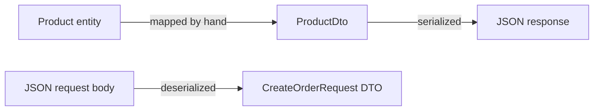

## Bạn cần biết trước

- [[backend.l1.rest-resources]] — bạn đã biết `GET /api/v1/products` trả về một mảng JSON; bài này nói về thứ quyết định hình dạng của từng phần tử trong mảng đó.

## Tình huống

Một đồng nghiệp đề nghị bỏ qua kiểu riêng cho thứ mà `GET /api/v1/products/{id}` trả về: cứ trả thẳng class `Product` mà server vốn đã dùng nội bộ, đỡ phải viết thêm một kiểu nữa. Hôm nay cách đó chạy được. `Product` chỉ có `Id`, `Name` và `PriceVnd`, đúng những field client muốn nhận. Response sẽ không có gì trông sai, và không test nào bắt được khác biệt, vì lúc này chưa có khác biệt nào. Vậy chuyện gì hỏng về sau, khi `Product` phải chứa thêm thứ mà client không bao giờ được thấy?

## Khái niệm cốt lõi

- **DTO** (kiểu dữ liệu dành riêng cho việc gửi/nhận qua API, tách khỏi kiểu nội bộ server dùng) — viết tắt của data transfer object, một kiểu đơn giản có hình dạng theo dữ liệu trên dây, tức JSON đi trong request hoặc response. Nó chỉ giữ những field client cần và tách khỏi kiểu nội bộ mà server dùng cho cùng thứ đó. Bài này gọi kiểu nội bộ ấy là entity.
- serialization — tự động biến một DTO thành JSON khi endpoint trả nó về; mỗi property trở thành một field JSON.
- deserialization — chiều ngược lại: biến JSON trong body của request thành một DTO, cùng kiểu ánh xạ nhưng chạy theo hướng kia.
- cách đặt tên camelCase — mặc định, khi trả lời một request, server viết tên mỗi property theo camelCase: từ đầu viết thường, các từ sau giữ chữ hoa đầu. `PriceVnd` trong C# thành `priceVnd` trong JSON, không phải vì bạn yêu cầu, mà vì đó là mặc định.

## Cơ chế hoạt động



DTO không phải entity. Phải có đoạn code nào đó trong chính endpoint dựng DTO từ entity, từng field một. `ProductsController`, class chứa các endpoint sản phẩm, trả lời `GET /api/v1/products` trong method `List()`. Nó dựng từng phần tử bằng `new ProductDto(p.Id, p.Name, p.PriceVnd)`, mỗi argument ứng với một property, trong đó `p` là một `Product` đọc từ bảng sản phẩm.

`Get(int id)` trả lời item URL mà phần Thử ngay gọi tới. Nó dựng một `ProductDto` theo cùng cách từ đúng một dòng tìm thấy. Khi endpoint đã trả về `ProductDto` đó, serialization tiếp quản: nó đi qua các property của DTO và viết một field JSON cho mỗi property, bạn không cần viết thêm code nào.

Với body của request, phép ánh xạ ấy chạy ngược lại. Body của `POST /api/v1/orders` là JSON, và deserialization biến nó thành một `CreateOrderRequest` trước khi code của endpoint chạy. Mỗi field JSON điền vào một property, vẫn là ánh xạ từng field một, chỉ đổi chiều.

Trên đường đi ra, tên property không giữ nguyên. Mặc định, tên mỗi property được viết theo camelCase trong response: từ đầu viết thường, các từ sau giữ chữ hoa đầu. Vì vậy property `PriceVnd` trong C# được viết thành `priceVnd` trong JSON. Không có gì trong `ProductDto` yêu cầu điều này, và bài này chỉ xét tên trong response.

## Trong hệ thống Đơn Hàng

`DonHang.Api/Dtos.cs` chứa các hình dạng mà những endpoint này dùng để trả lời và để đọc vào. Chúng nằm chung một file, tách khỏi `DonHang.Domain`, project chứa các kiểu nội bộ của server. Những record đầu tiên trong file, ngay dưới đây, là những record bài này dùng:

```csharp file=DonHang.Api/Dtos.cs tag=stage-1 lines=1-13
namespace DonHang.Api;

// lesson: backend.l1.dtos-and-serialization
// The API answers in these shapes, never in the entity shapes from DonHang.Domain.
public sealed record ProductDto(int Id, string Name, int PriceVnd);

public sealed record OrderItemDto(int ProductId, int Quantity, int UnitPriceVnd);

public sealed record OrderDto(int Id, int CustomerId, string Status, DateTimeOffset PlacedAt, List<OrderItemDto> Items);

public sealed record CreateOrderItemRequest(int ProductId, int Quantity, int UnitPriceVnd);

public sealed record CreateOrderRequest(List<CreateOrderItemRequest> Items);
```

Mỗi `record` ở đây là một kiểu chỉ có nhiệm vụ giữ những giá trị có tên này: một hình dạng, không phải hành vi. Mỗi tên trong cặp ngoặc là một property của kiểu đó, và đó chính là danh sách serialization đi qua. `Items` của `CreateOrderRequest` giữ một `CreateOrderItemRequest` cho mỗi món được đặt, bản đối ứng phía request body của `OrderItemDto`. `ProductDto` tình cờ liệt kê đúng ba field như entity `Product` mà nó được dựng từ đó. Nhưng đó chỉ là sự trùng hợp của code hôm nay, không phải quy tắc. Chúng vẫn là hai kiểu riêng, và comment phía trên đã nói lý do: API trả lời bằng những hình dạng này, không bằng hình dạng của entity.

`OrderItemDto` tự nó cho thấy nửa "chỉ những field client cần" của định nghĩa. Entity đứng sau nó, `OrderItem`, còn mang thêm `OrderId` để nối mỗi món về dòng đơn hàng của nó. `OrderItemDto` bỏ field đó đi. Client đọc một đơn hàng đã biết mình hỏi đơn nào, nên lặp lại id ấy trên từng món bên trong chẳng nói thêm điều gì mới. Một `OrderItemDto` chỉ xuất hiện bên trong một `OrderDto`, trong danh sách `Items` ở trên, và đó chính là lý do id đơn hàng mà nó sẽ lặp lại luôn đã được biết sẵn.

## Người mới hay nghĩ rằng…

- **"Trả về đúng class mà server dùng nội bộ thì đơn giản hơn và an toàn không kém viết DTO."** → Thực ra cách đó chỉ ổn cho tới khi kiểu nội bộ cần một field mà client không bao giờ được thấy. `Customer`, trong `DonHang.Domain`, mang một `PasswordHash` (dạng đã bị xáo trộn của mật khẩu khách hàng, không bao giờ được rời khỏi server, và là `null` cho tới khi khách hàng đặt mật khẩu) bên cạnh tên và email. Nếu một endpoint nào đó sau này trả thẳng `Customer`, field đó cũng sẽ bị serialize: nó xuất hiện trong response dưới tên `passwordHash`, dù là `null` hay không. `Product` cũng sẽ gặp đúng chuyện này vào ngày nó có thêm một field như vậy.
- **"Tên field JSON luôn khớp chính xác với tên property C#, không có gì phải cấu hình."** → Thực ra, mặc định, tên mỗi property được viết theo camelCase trong response: `PriceVnd` của `ProductDto` tới client dưới dạng `priceVnd`. Bạn sẽ nhận ra điều này ở phần Thử ngay bên dưới, khi response không bao giờ có chữ `P` hoa trong `priceVnd`.

## Thử ngay (3 phút)

1. Từ thư mục gốc của dự án Đơn Hàng, khởi động hệ thống ví dụ bằng `scripts/up.sh`, rồi chạy `curl -s http://localhost:8080/api/v1/products/1` (`curl` gửi một GET request tới URL đó và in ra response body; `-s` ẩn phần báo tiến độ). `localhost:8080` là port 8080 trên chính máy bạn, nơi lab mà `scripts/up.sh` khởi động đang trả lời; các request dưới `/api/v1/` được chuyển tiếp tới API.
2. Xem tên các field trong response.

Kết quả mong đợi: `{"id":1,"name":"Bàn phím cơ","priceVnd":1250000}` — ba field, khớp với ba property của `ProductDto`, nhưng tên nào cũng bắt đầu bằng chữ thường: `id` chứ không phải `Id`, `priceVnd` chứ không phải `PriceVnd`.

<details><summary>Gợi ý đáp án</summary>

`ProductDto(int Id, string Name, int PriceVnd)` có ba property là `Id`, `Name` và `PriceVnd`, khớp từng field với `id`, `name` và `priceVnd` trong response. Chúng khớp từng field, nhưng không bao giờ khớp từng chữ cái, vì serialization viết mỗi tên theo camelCase trên đường đi ra.

</details>

## Liên hệ

- [[backend.l1.rest-resources]] — các endpoint mà DTO trong bài này dùng để trả lời và để đọc vào.
- [[backend.l1.get-and-status-codes]] — thứ một GET endpoint trả về kèm DTO của nó: status code đúng tùy theo có tìm thấy hay không.
- [[backend.l1.efcore-mapping]] — các entity mà bài này giữ tách khỏi mọi DTO, được ánh xạ tới bảng database thay vì tới JSON.

## Tóm tắt 5 dòng

1. DTO là một kiểu đơn giản có hình dạng theo dữ liệu trên dây, chỉ gồm những field client cần, không phải kiểu nội bộ nào mà server đang dùng.
2. Serialization tự động biến DTO được trả về thành JSON, mỗi property thành một field JSON, bạn không cần viết thêm code.
3. Deserialization là cùng phép ánh xạ đó theo chiều ngược: JSON trong request body thành một DTO trước khi code của endpoint chạy.
4. Mặc định, tên mỗi property được viết theo camelCase trong response, `PriceVnd` thành `priceVnd`, dù không ai yêu cầu.
5. DTO có thể trùng field với entity hôm nay mà vẫn nên tách riêng, vì entity về sau có thể có thêm field mà không client nào được thấy.
