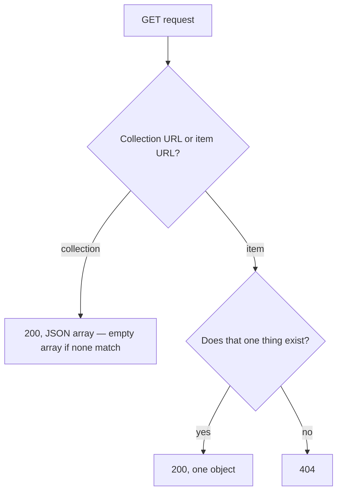

## Before you start

- [[backend.l1.dtos-and-serialization]] — you know `List()` and `Get(int id)` each build a `ProductDto` and return it with `Ok(...)`; this lesson is about what each one returns when there's nothing to build one from.

## The situation

A teammate is adding a price filter to `GET /api/v1/products` and asks: when no product matches the filter, should the endpoint answer `404`, since there's nothing to show, or `200`? `ProductsController.List()` has no filter yet, so this isn't about the filter itself — it's about what a GET on a collection already promises, filter or not. Does an empty result mean the same thing for `GET /api/v1/products` as it does for `GET /api/v1/products/{id}`?

## Core concepts

- `200` vs `404` — `200` means the URL's request succeeded and here is the answer; `404` means the one specific thing the URL named does not exist.
- collection GET always `200` — a collection URL names the whole set, and the set still exists even with zero members in it right now; there is no "wrong id" for a GET on a collection to reject.
- item GET can `404` — an item URL names one specific thing; if that thing isn't there, `404` is the honest answer, since `200` would claim to have found something it didn't.
- reading must not change anything — a GET endpoint only reads; even the very first call must leave the resource exactly as it found it, a stronger promise than being idempotent (which is only about repeating the same call).

## How it works



A collection URL and an item URL answer the "nothing found" case differently because they're answering different questions. `GET /api/v1/products` asks "what's in the collection?" — the honest answer to "nothing matches" is an empty array, still a successful answer, still `200`. `GET /api/v1/products/{id}` asks "does this one product exist?" — the honest answer to "no" is `404`, because there is no product to put in the response body at all, empty or otherwise.

Nothing about this depends on how full the collection happens to be. `List()` doesn't count the rows it found before deciding a status code; it always answers `200`, whether the query returns eight products or zero. Only an item URL's GET has a found-or-not-found branch to take at all, because only an item URL names one specific thing that can fail to exist.

The "reading must not change anything" rule isn't about what a GET returns — it's about what else happens while it runs. A GET method that logged a view count, marked something as read, or changed a row would still be answering the right status codes and still be violating this rule, silently, in a way no status code reveals.

## In the Đơn Hàng system

`ProductsController` shows both branches, side by side:

```csharp file=DonHang.Api/Controllers/ProductsController.cs tag=stage-1 lines=8-28
[ApiController]
[Route("api/v1/products")]
public sealed class ProductsController(DonHangDbContext db) : ControllerBase
{
    // lesson: backend.l1.get-and-status-codes
    [HttpGet]
    public async Task<ActionResult<List<ProductDto>>> List()
    {
        var products = await db.Products
            .Select(p => new ProductDto(p.Id, p.Name, p.PriceVnd))
            .ToListAsync();
        return Ok(products);
    }

    [HttpGet("{id:int}")]
    public async Task<ActionResult<ProductDto>> Get(int id)
    {
        var product = await db.Products.FindAsync(id);
        if (product is null) return NotFound();
        return Ok(new ProductDto(product.Id, product.Name, product.PriceVnd));
    }
```

`List()` has exactly one `return`, `Ok(products)`, with no branch on how many rows `products` holds — an empty list still reaches that same line and gets the same `200`. `Get(int id)` has two returns: `NotFound()` when `db.Products.FindAsync(id)` comes back `null`, and `Ok(...)` only once a real row exists to build a `ProductDto` from. Neither method writes to `db` anywhere — both only read, matching the rule that a GET must not change anything.

## Beginners often think…

- **"An empty list from a GET should be a 404, since there's 'nothing there'."** → Actually the collection is still there even when it's empty — `List()` has no code path that turns an empty result into `404`, and adding one would mean two different requests to `/api/v1/products` (an empty catalog today, three products tomorrow) answer with two different status codes for the exact same URL. You notice this in Try it below, where an id that doesn't exist gets `404`, but a filter that matches nothing never would.
- **"A GET endpoint can also update something as a side effect, as long as it still returns data."** → Actually a GET that changes anything breaks a promise every client, cache, and library relies on without checking — that repeating or skipping a GET is always safe. Neither `List()` nor `Get(int id)` above writes to `db` anywhere; both only read.

## Try it (3 minutes)

1. From the Đơn Hàng project's root folder, start the example system with `scripts/up.sh`, then run `curl -i http://localhost:8080/api/v1/products/1` (a product id that exists).
2. Then run `curl -i http://localhost:8080/api/v1/products/999999` (a product id that doesn't).

Expected result: the first returns `200` with one product's JSON; the second returns `404`, with no product in the body. Both requests reach the same method, `Get(int id)` — the status code depends only on whether `FindAsync` found a row, not on anything about the request itself.

<details><summary>Suggested answer</summary>

`Get(int id)` runs the same code for both ids: look up the row, then branch. For id `1`, `db.Products.FindAsync(id)` returns a row, so the method reaches `Ok(new ProductDto(...))` and answers `200`. For id `999999`, `FindAsync` returns `null`, so the method takes the other branch, `NotFound()`, and answers `404` before ever building a `ProductDto`. `List()`, by contrast, has no such branch — it would answer `200` for either an empty products table or a full one, because a collection GET is never asked "does this one thing exist?" in the first place.

</details>

## Connections

- [[backend.l1.dtos-and-serialization]] — the `ProductDto` both `List()` and `Get(int id)` build before choosing a status code.
- [[backend.l1.rest-resources]] — the collection-URL/item-URL split this lesson's `200`/`404` rule follows.
- [[backend.l1.creating-a-resource]] — the next status code, `201`, for a method that isn't just reading.

## Five-line summary

1. `200` means the URL's request succeeded; `404` means the one specific thing the URL named does not exist.
2. A collection URL's GET always answers `200`, even with zero results, because the collection itself still exists.
3. An item URL's GET can answer `404`, because it names one specific thing that can fail to exist.
4. `List()` has one unconditional `return Ok(...)`; `Get(int id)` branches between `NotFound()` and `Ok(...)` based on one lookup.
5. A GET must not change anything, even on its very first call — a stronger promise than just being idempotent.
