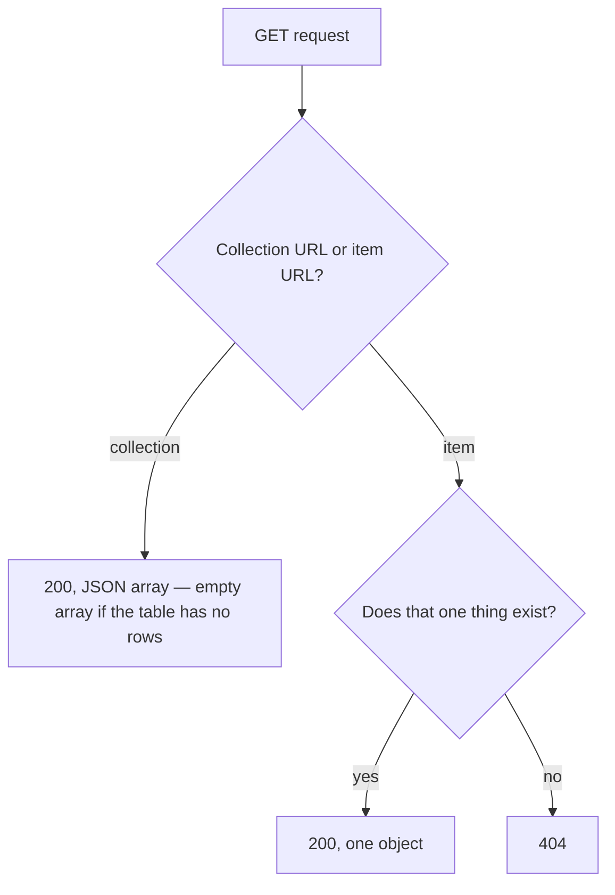

## Before you start

- [[backend.l1.dtos-and-serialization]] — you know `List()` and `Get(int id)` each build a `ProductDto` and return it with `Ok(...)`; this lesson is about what each one returns when there's nothing to build one from.

## The situation

A teammate is adding a price filter to `GET /api/v1/products` and asks: when no product matches the filter, should the endpoint answer `404`, since there's nothing to show, or `200`? `ProductsController.List()` has no filter yet, so this isn't about the filter itself. The question is what a GET on the whole-set URL `/api/v1/products` already promises, filter or not. Does an empty result mean the same thing for `GET /api/v1/products` as it does for `GET /api/v1/products/{id}`?

## Core concepts

- `200` vs `404` — `200` means the request for that URL succeeded and here is the answer; `404` means the server has nothing to return for the one specific thing the URL named.
- collection GET stays `200` — a collection URL names the whole set, and an empty set is still a complete answer about that set; the row count never turns the answer into a `404` (a URL the server has no collection behind at all, like `/api/v1/gadgets`, is a different case: there is nothing there at all, so this rule says nothing about it).
- item GET can `404` — an item URL names one specific thing; if the server has nothing for it, `404` is the honest answer, since `200` would claim to have found something it didn't.
- GET must not write — a GET must not change the resource it serves; the client asked to read, not to write, and that promise holds even on the very first call, not just on repeats (which is all being idempotent covers).

## How it works



A collection URL and an item URL answer the "nothing found" case differently because they're answering different questions. `GET /api/v1/products` asks "what's in the collection?" — the honest answer to "nothing matches" is an empty array, still a successful answer, still `200`. `GET /api/v1/products/{id}` asks "does this one product exist?" — the honest answer to "yes" is `200` with that one product in the body, and the honest answer to "no" is `404`, because there is no product to put in the response body at all, empty or otherwise.

Nothing about this depends on how full the collection happens to be. `List()` doesn't count the rows it found before deciding a status code; it always answers `200`, whether the query returns eight products or zero. Only an item URL's GET has a found-or-not-found branch to take at all, because only an item URL names one specific thing that can fail to exist.

The "GET must not write" rule isn't about what a GET returns — it's about what else happens to the resource the client asked to read. A GET method that marked something as read or changed a row would still be answering the right status codes and still be violating this rule, silently, in a way no status code reveals.

## In the Đơn Hàng system

`ProductsController` shows both branches, side by side:

```csharp file=DonHang.Api/Controllers/ProductsController.cs tag=stage-1 lines=8-29
[ApiController]
[Route("api/v1/products")]
public sealed class ProductsController(DonHangDbContext db) : ControllerBase
{
    // lesson: backend.l1.get-and-status-codes
    [HttpGet]
    public async Task<ActionResult<List<ProductDto>>> List()
    {
        var products = await db.Products
            .Select(p => new ProductDto(p.Id, p.Name, p.PriceVnd))
            .ToListAsync();
        return Ok(products);
    }

    [HttpGet("{id:int}")]
    public async Task<ActionResult<ProductDto>> Get(int id)
    {
        var product = await db.Products.FindAsync(id);
        if (product is null) return NotFound();
        return Ok(new ProductDto(product.Id, product.Name, product.PriceVnd));
    }
}
```

The lines that matter here are the two `[HttpGet]` attributes and the `return` lines; the class header is the same shape for every class like this one and doesn't affect the status code. `[Route("api/v1/products")]` on the class gives both methods the same URL start, and the attribute above each method adds the rest: `[HttpGet]` above `List()` answers `GET /api/v1/products`; `[HttpGet("{id:int}")]` above `Get(int id)` answers that same URL followed by an integer (a negative one matches too), which arrives as the `id` parameter — a segment that isn't an integer, like `/api/v1/products/abc`, matches no route at all. That's how `GET /api/v1/products/999999` in Try it below ends up running `Get`, not `List`. `db` is how this class reaches the Đơn Hàng database, and both methods only ever read from it: `List()` runs a query and hands back one `ProductDto` per product row, and `FindAsync(id)` hands back the one row with that id, or `null` if there is none.

`List()` has exactly one `return`, `Ok(products)`, with no branch on how many rows `products` holds — an empty list still reaches that same line and gets the same `200`. `Get(int id)` has two returns: `NotFound()`, the call that sends the `404`, when `db.Products.FindAsync(id)` comes back `null`, and `Ok(...)`, the call that sends the `200`, only once a real row exists to build a `ProductDto` from. Neither method writes to `db` anywhere — both only read, matching the rule that a GET must not change anything.

## Beginners often think…

- **"An empty list from a GET should be a 404, since there's 'nothing there'."** → Actually the collection is still there even when it's empty — `List()` has no code path that turns an empty result into `404`, and adding one would mean two different requests to `/api/v1/products` (an empty catalog today, three products tomorrow) answer with two different status codes for the exact same URL. You see this in Try it below: an id that doesn't exist gets `404`, while `/api/v1/products` answers `200` no matter what the query finds.
- **"A GET endpoint can also update something as a side effect, as long as it still returns data."** → Actually a GET must not change the resource the client asked to read — the client didn't request that change, and correct status codes don't excuse making it anyway. Neither `List()` nor `Get(int id)` above writes to `db` anywhere; both only read.

## Try it (3 minutes)

1. From the Đơn Hàng project's root folder, start the example system with `scripts/up.sh` — it starts the Đơn Hàng system on port 8080; wait until it stops printing before running the next command. Then run `curl -i http://localhost:8080/api/v1/products/1` (a product id that exists) — `curl` sends one request from the terminal and prints the answer; `-i` makes the status code and headers print above the body, which is where you read the `200` or `404`.
2. Then run `curl -i http://localhost:8080/api/v1/products/999999` (a product id that doesn't).
3. Then run `curl -i http://localhost:8080/api/v1/products` (no id).

Expected result: the first returns `200` with one product's JSON; the second returns `404`, its body a short JSON error description with no product data in it; the third returns `200` with a JSON array of products — the same `200` it would give if that array were empty. The first two requests both run `Get(int id)` — the status code depends only on whether `FindAsync` found a row, not on anything about the request itself.

<details><summary>Suggested answer</summary>

`Get(int id)` runs the same code for both ids: look up the row, then branch. For id `1`, `db.Products.FindAsync(id)` returns a row, so the method reaches `Ok(new ProductDto(...))` and answers `200`. For id `999999`, `FindAsync` returns `null`, so the method takes the other branch, `NotFound()`, and answers `404` before ever building a `ProductDto`. `List()`, by contrast, has no such branch — it would answer `200` for either an empty products table or a full one, because a collection GET is never asked "does this one thing exist?" in the first place.

</details>

## Connections

- [[backend.l1.dtos-and-serialization]] — the `ProductDto` both `List()` and `Get(int id)` build before choosing a status code.
- [[backend.l1.rest-resources]] — the collection-URL/item-URL split this lesson's `200`/`404` rule follows.
- [[backend.l1.creating-a-resource]] — the next status code, `201`, for a method that isn't just reading.

## Five-line summary

1. `200` means the URL's request succeeded; `404` means the server has nothing to return for the one thing the URL named.
2. A collection URL's GET stays `200` whatever the row count — an empty set is a complete, successful answer about the collection, not a `404`.
3. An item URL's GET can answer `404`, because it names one specific thing the server may have nothing for.
4. `List()` has one unconditional `return Ok(...)`; `Get(int id)` branches between `NotFound()` and `Ok(...)` based on one lookup.
5. A GET must not write to the resource it serves, even on its first call — stronger than just being idempotent.
