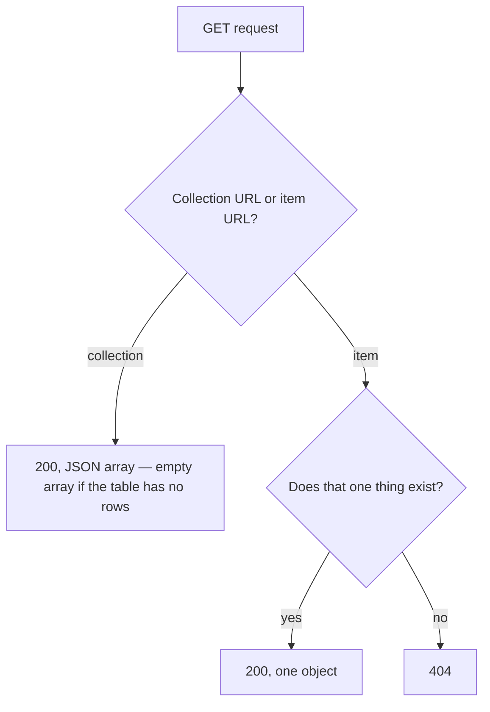

## Bạn cần biết trước

- [[backend.l1.dtos-and-serialization]] — bạn đã biết `List()` và `Get(int id)` mỗi hàm đều dựng một `ProductDto` rồi trả về bằng `Ok(...)`; bài này nói về việc mỗi hàm trả gì khi không có gì để dựng.

## Tình huống

Một đồng nghiệp đang thêm bộ lọc theo giá cho `GET /api/v1/products` và hỏi: khi không sản phẩm nào khớp bộ lọc, endpoint nên trả `404`, vì không có gì để hiện, hay `200`? `ProductsController.List()` chưa có bộ lọc nào, nên câu hỏi không nằm ở bộ lọc. Vấn đề là một GET trên URL của cả tập hợp, `/api/v1/products`, vốn đã hứa điều gì, có lọc hay không. Một kết quả rỗng có mang cùng ý nghĩa cho `GET /api/v1/products` như cho `GET /api/v1/products/{id}` không?

## Khái niệm cốt lõi

- `200` so với `404` — `200` nghĩa là request cho URL đó thành công và đây là câu trả lời; `404` nghĩa là server không có gì để trả về cho đúng một thứ cụ thể mà URL đặt tên.
- GET trên collection giữ nguyên `200` — theo quy ước mà API này tuân theo, một collection URL đặt tên cho cả tập hợp, và một tập rỗng vẫn là câu trả lời đầy đủ về tập hợp đó; số dòng không bao giờ biến câu trả lời thành `404` (một URL mà server không có collection nào phía sau, như `/api/v1/gadgets`, là trường hợp khác: ở đó không có gì cả, nên quy tắc này không nói gì về nó).
- GET trên item có thể `404` — một item URL đặt tên cho một thứ cụ thể; nếu server không có gì cho nó, `404` là câu trả lời trung thực, vì `200` sẽ tự nhận là đã tìm thấy thứ mà thực ra không có.
- GET không được ghi — một GET không được thay đổi resource nó phục vụ; client yêu cầu đọc, không phải ghi, và lời hứa đó giữ nguyên ngay từ lần gọi đầu tiên, không chỉ ở những lần lặp lại (đó là tất cả những gì idempotent bao quát).

## Cơ chế hoạt động



Một collection URL và một item URL trả lời trường hợp "không tìm thấy gì" khác nhau vì chúng đang trả lời hai câu hỏi khác nhau. `GET /api/v1/products` hỏi "collection có gì?" — câu trả lời trung thực cho "không gì khớp" là một mảng rỗng, vẫn là câu trả lời thành công, vẫn `200`. `GET /api/v1/products/{id}` hỏi "một sản phẩm này có tồn tại không?" — câu trả lời trung thực cho "có" là `200` kèm đúng sản phẩm đó trong body, và câu trả lời trung thực cho "không" là `404`, vì hoàn toàn không có sản phẩm nào để đặt vào response body, rỗng hay không.

Điều này không phụ thuộc vào việc collection đang đầy hay vơi. `List()` không đếm số dòng tìm được trước khi quyết định status code; nó luôn trả về `200`, dù truy vấn trả về tám sản phẩm hay không sản phẩm nào. Chỉ GET trên item URL mới có nhánh tìm-thấy-hay-không để đi, vì chỉ item URL mới đặt tên cho một thứ cụ thể có thể không tồn tại.

Quy tắc "GET không được ghi" không nói về việc một GET trả về gì — nó nói về việc gì khác xảy ra với resource client yêu cầu đọc. Một GET đánh dấu thứ gì đó là đã đọc, hoặc thay đổi một dòng dữ liệu, vẫn có thể trả đúng status code trong khi vẫn đang vi phạm quy tắc này, âm thầm, theo cách không status code nào tiết lộ ra.

## Trong hệ thống Đơn Hàng

`ProductsController` cho thấy cả hai nhánh, đặt cạnh nhau:

```csharp file=DonHang.Api/Controllers/ProductsController.cs tag=stage-1 lines=8-29
[ApiController]
[Route("api/v1/products")]
public sealed class ProductsController(DonHangDbContext db) : ControllerBase
{
    // lesson: backend.l1.get-and-status-codes
    [HttpGet]
    public async Task<ActionResult<List<ProductDto>>> List()
    {
        var products = await db.Products
            .Select(p => new ProductDto(p.Id, p.Name, p.PriceVnd))
            .ToListAsync();
        return Ok(products);
    }

    [HttpGet("{id:int}")]
    public async Task<ActionResult<ProductDto>> Get(int id)
    {
        var product = await db.Products.FindAsync(id);
        if (product is null) return NotFound();
        return Ok(new ProductDto(product.Id, product.Name, product.PriceVnd));
    }
}
```

Những dòng quan trọng ở đây là hai attribute `[HttpGet]` và các dòng `return` — kiểu trả về phía trên chúng và phần đầu class, kể cả `[ApiController]`, đều có hình dạng giống nhau ở mọi class kiểu này và không chọn status code; dòng `return` mới là thứ chọn. `[Route("api/v1/products")]` trên class cho cả hai method cùng một đoạn URL mở đầu, và attribute phía trên mỗi method thêm phần còn lại: `[HttpGet]` phía trên `List()` trả lời `GET /api/v1/products`; `[HttpGet("{id:int}")]` phía trên `Get(int id)` trả lời cùng URL đó theo sau bởi một số nguyên, số này đi vào tham số `id`. Đó là lý do `GET /api/v1/products/999999` trong phần Thử ngay bên dưới kết thúc bằng việc chạy `Get`, không phải `List`. `db` là cách class này chạm tới database của Đơn Hàng, và cả hai method chỉ từng đọc từ nó; `FindAsync(id)` trả về đúng một dòng có id đó, hoặc `null` nếu không có.

`List()` chỉ có đúng một `return`, `Ok(products)`, không có nhánh nào theo số dòng `products` giữ — một danh sách rỗng vẫn đi tới đúng dòng đó và nhận cùng `200`. `Get(int id)` có hai `return`: `NotFound()`, lệnh gửi `404`, khi `db.Products.FindAsync(id)` trả về `null`, và `Ok(...)`, lệnh gửi `200`, chỉ khi có một dòng thật để dựng `ProductDto`. Không method nào ghi vào `db` ở đâu cả — cả hai chỉ đọc, khớp với quy tắc GET không được thay đổi bất cứ gì.

## Người mới hay nghĩ rằng…

- **"Một danh sách rỗng từ GET nên là 404, vì 'chẳng có gì ở đó'."** → Thực ra collection vẫn ở đó ngay cả khi rỗng — `List()` không có nhánh code nào biến kết quả rỗng thành `404`, và thêm một nhánh như vậy nghĩa là hai request khác nhau tới `/api/v1/products` (catalog rỗng hôm nay, ba sản phẩm ngày mai) sẽ trả về hai status code khác nhau cho cùng một URL. Bạn thấy điều này ở phần Thử ngay bên dưới: một id không tồn tại nhận `404`, còn `/api/v1/products` trả về `200` bất kể truy vấn tìm thấy gì.
- **"Một endpoint GET cũng có thể cập nhật gì đó như tác dụng phụ, miễn là nó vẫn trả về dữ liệu."** → Thực ra một GET không được thay đổi resource client yêu cầu đọc — client không yêu cầu thay đổi đó, và status code đúng không bào chữa được cho việc thực hiện nó. Không `List()` lẫn `Get(int id)` ở trên ghi vào `db` ở đâu cả; cả hai chỉ đọc.

## Thử ngay (3 phút)

1. Từ thư mục gốc của dự án Đơn Hàng, khởi động hệ thống ví dụ bằng `scripts/up.sh` — nó khởi động hệ thống Đơn Hàng trên port 8080; chờ tới khi nó ngừng in ra và dấu nhắc lệnh trở lại trước khi chạy lệnh kế tiếp. Rồi chạy `curl -i http://localhost:8080/api/v1/products/1` (một id sản phẩm tồn tại) — `curl` gửi một request từ terminal và in ra câu trả lời; `-i` khiến status code và header in ra phía trên body, đó là nơi bạn đọc `200` hay `404`.
2. Rồi chạy `curl -i http://localhost:8080/api/v1/products/999999` (một id sản phẩm không tồn tại).
3. Rồi chạy `curl -i http://localhost:8080/api/v1/products` (không có id).

Kết quả mong đợi: lệnh đầu trả về `200` kèm JSON của một sản phẩm; lệnh hai trả về `404`, body của nó là một mô tả lỗi JSON ngắn, không có dữ liệu sản phẩm nào; lệnh ba trả về `200` kèm một mảng JSON các sản phẩm — cùng `200` mà nó sẽ trả nếu mảng đó rỗng. Hai request đầu đều chạy `Get(int id)` — status code chỉ phụ thuộc vào việc `FindAsync` có tìm thấy dòng nào không, không phụ thuộc bất cứ điều gì khác về request.

<details><summary>Gợi ý đáp án</summary>

`Get(int id)` chạy cùng một đoạn code cho cả hai id: tra cứu dòng, rồi rẽ nhánh. Với id `1`, `db.Products.FindAsync(id)` trả về một dòng, nên method đi tới `Ok(new ProductDto(...))` và trả `200`. Với id `999999`, `FindAsync` trả về `null`, nên method đi vào nhánh còn lại, `NotFound()`, và trả `404` trước khi kịp dựng bất kỳ `ProductDto` nào. `List()`, ngược lại, không có nhánh như vậy — nó sẽ trả `200` cho cả bảng sản phẩm rỗng lẫn đầy, vì một GET trên collection ngay từ đầu không hề bị hỏi "một thứ này có tồn tại không?".

</details>

## Liên hệ

- [[backend.l1.dtos-and-serialization]] — `ProductDto` mà cả `List()` lẫn `Get(int id)` dựng trước khi chọn status code.
- [[backend.l1.rest-resources]] — sự phân tách collection-URL/item-URL mà quy tắc `200`/`404` của bài này đi theo.
- [[backend.l1.creating-a-resource]] — status code tiếp theo, `201`, cho một method không chỉ đọc.

## Tóm tắt 5 dòng

1. `200` nghĩa là request của URL thành công; `404` nghĩa là server không có gì để trả về cho đúng một thứ mà URL đặt tên.
2. Theo quy ước mà API này tuân theo, GET trên một collection URL giữ nguyên `200` bất kể số dòng — không bao giờ `404`.
3. GET trên một item URL có thể trả `404`, vì nó đặt tên cho một thứ cụ thể mà server có thể không có gì cho nó.
4. `List()` có một `return Ok(...)` duy nhất, không điều kiện; `Get(int id)` rẽ nhánh giữa `NotFound()` và `Ok(...)` dựa trên một lần tra cứu.
5. Một GET không được ghi vào resource nó phục vụ, kể cả ở lần gọi đầu tiên — mạnh hơn việc chỉ đơn thuần là idempotent.
