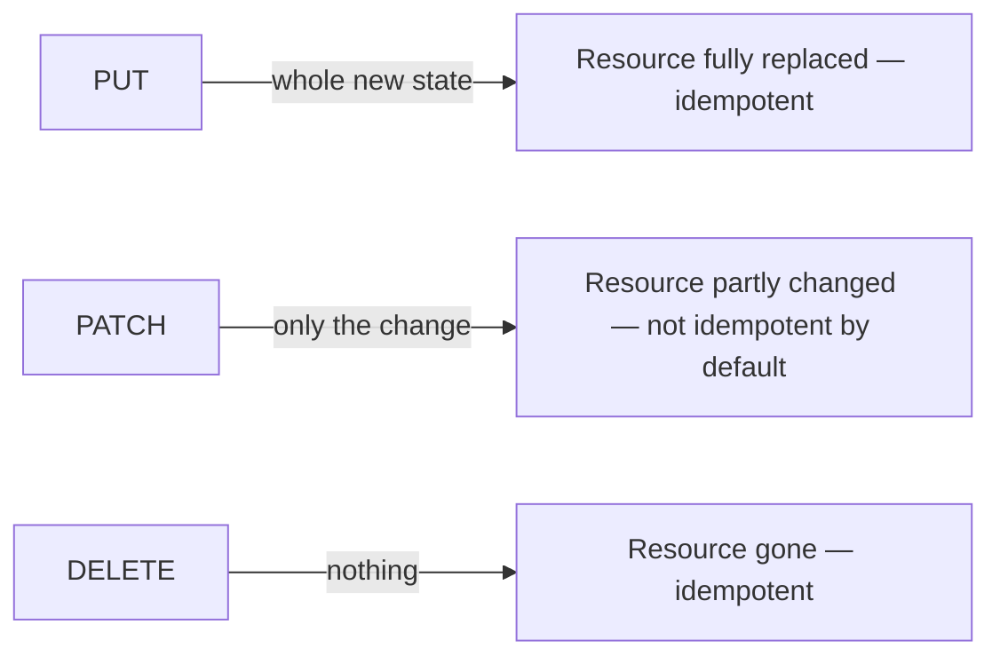

## Before you start

- [[backend.l1.creating-a-resource]] — you know `POST /api/v1/orders` creates a new order and answers `201`. This lesson is about the three write methods for a resource that already exists: replace it, change part of it, or remove it.

## The situation

A teammate wants to add a way for a customer to cancel an order and asks which method fits: `PUT`, `PATCH`, or `DELETE`? Cancelling doesn't remove the order — it stays in the system, just with a different status — and it doesn't need the client to resend everything about the order, only the fact that it's now cancelled. Which of the three matches that, and what would the other two actually mean if used here instead?

## Core concepts

- `PUT` replaces a resource entirely — the request carries the resource's whole new state, and the server makes the resource match it. Sending the exact same `PUT` twice leaves the resource in that same state either time, so `PUT` is idempotent.
- `PATCH` changes part of a resource — the request carries only what should change, not the resource's whole state. Because of that, `PATCH` is neither safe nor idempotent by default: two different `PATCH` requests can describe two different changes, so nothing guarantees repeating one has the same effect as sending it once (one specific `PATCH` request can still happen to be idempotent, depending on what it changes).
- `DELETE` removes a resource — a successful call typically answers `204` with no body, since there's nothing left to describe. `DELETE` is idempotent: the resource ends up gone whether it's called once or several times, even though a repeat call's response can differ (the first call finds something to remove; a later one may answer `404` because there's nothing left).

## How it works



`POST`, from the last lesson, and these three write methods all change something, but they answer different questions about what the client already knows. `POST /api/v1/orders` doesn't name the new order in the URL at all, because the client doesn't know its id yet. `PUT` and `PATCH` both name an existing resource in the URL and say what should happen to the one thing already there; `DELETE` names it too, to remove it. Only `PUT` asks the client to describe the resource's entire state — every field, not just the ones that changed — because a `PUT` request's body is defined as the resource's new state, in full. `PATCH` never asks for that: its body describes a change, so fields the client isn't touching simply aren't mentioned.

That difference is exactly why `PUT` is idempotent and `PATCH` isn't, by default. Sending the same full state twice leaves the resource in that one state both times — there's no way for the second `PUT` to do anything different from the first. A `PATCH` request's body describes a change relative to whatever the resource currently is, so two people applying the same "change" to two different starting states can land somewhere different — nothing about `PATCH`'s shape prevents that, even when one particular `PATCH` request happens not to run into it.

`DELETE` is idempotent for a different reason than `PUT`: not because the request carries a full state, but because "gone" is a state a resource can only be in once. Calling `DELETE` on the same resource five times in a row produces the same end effect as calling it once — the resource is gone either way — even if the first call gets a different answer than the rest.

## In the Đơn Hàng system

This API has no real `PUT` or `DELETE` endpoint at this stage — the paragraphs above describe what each would mean in general, not a specific one from this codebase. `PATCH` does have a real example: cancelling an order changes only its `status`, so it's a partial change, not a replacement.

```csharp file=DonHang.Api/Controllers/OrdersController.cs tag=stage-1 lines=40-46
    [Authorize]
    [HttpPatch("{id:int}/cancel")]
    public async Task<ActionResult<OrderDto>> Cancel(int id)
    {
        var order = await orderService.CancelOrderAsync(id);
        return Ok(ToDto(order));
    }
```

`[HttpPatch("{id:int}/cancel")]` answers `PATCH /api/v1/orders/{id}/cancel` — the same `{id:int}` constraint `Get(int id)` uses, with `cancel` naming the specific change this endpoint makes. `[Authorize]` means this also only runs for a signed-in caller, the same rule `Create` follows. `Cancel(int id)` takes no request body at all: unlike `Create`, which reads a `CreateOrderRequest`, this method's only input is the `id` in the URL. That's `PATCH` in its simplest form — the "set of changes" here is fixed by the endpoint itself (become cancelled), so there's nothing left for the client to describe in a body.

`orderService.CancelOrderAsync(id)` does the actual status change; a later module opens that up. `Ok(ToDto(order))` answers `200` with the updated order — same `ToDto` mapping `Create` uses, this time reflecting `status: "cancelled"` instead of `"new"`, while `CustomerId`, `PlacedAt`, and `Items` all stay exactly as they were.

## Beginners often think…

- **"`PATCH` and `PUT` are interchangeable as long as the URL is the same."** → Actually they ask for different request bodies: a `PUT` body is supposed to be the resource's entire new state, while a `PATCH` body is only the change. Sending `Cancel`'s tiny body-less request to a `PUT` endpoint that expected a full order would leave every other field with nothing to fill it — `PUT`'s idempotence depends on the client always sending the whole state, not just what changed.
- **"`DELETE` isn't idempotent, because the second call can't do anything — the resource is already gone."** → Actually idempotent describes the end state, not what each response says: the resource is gone after the first `DELETE` and still gone after the second, so the effect matches even though the second call might answer `404` instead of `204`.

## Try it (3 minutes)

1. From the Đơn Hàng project's root folder, with the example system running (`scripts/up.sh`), sign in and create an order the same way the last lesson did, to get a token and a new order's id (`POST /api/v1/auth/login`, then `POST /api/v1/orders`).
2. Cancel it: `curl -i -X PATCH http://localhost:8080/api/v1/orders/<id>/cancel -H "Authorization: Bearer <token>"` (replace `<id>` and `<token>` with the values from step 1).
3. Run the exact same command from step 2 again, unchanged.

Expected result: both calls answer `200` with a body showing `"status":"cancelled"` — the second call changes nothing further, since the order was already cancelled by the first one. That's `PATCH` behaving idempotently on this particular endpoint, not because `PATCH` guarantees it, but because "become cancelled" lands on the same result whether it's applied once or twice.

<details><summary>Suggested answer</summary>

Both `curl` calls run the same code: `CancelOrderAsync` sets `Status` to `"cancelled"` and saves. The first call changes the order from `"new"` to `"cancelled"`; the second call sets `"cancelled"` to `"cancelled"` again — a change with nothing left to do, but still a successful `200` with the same body both times. Nothing in `Cancel` checks whether the order was already cancelled before running, so this endpoint's particular change happens to be idempotent, even though `PATCH` in general makes no such promise.

</details>

## Connections

- [[backend.l1.creating-a-resource]] — `POST`'s `201`, contrasted with the `200` these three write methods answer with here.
- [[backend.l1.get-and-status-codes]] — the `200`/`404` pair that still applies to `PUT`, `PATCH`, and `DELETE`, on top of the `204` and idempotence rules this lesson adds.
- [[backend.l1.rest-resources]] — the collection-URL/item-URL split every method in this module, `GET` through `DELETE`, has followed.

## Five-line summary

1. `PUT` replaces a resource entirely: the request carries its whole new state, which is why sending the same `PUT` twice leaves the same result.
2. `PATCH` changes part of a resource: the request carries only the change, so it's neither safe nor idempotent by default.
3. `DELETE` removes a resource and typically answers `204` with no body once it's gone.
4. `DELETE` is idempotent because the end state, gone, is the same after one call or several — even if a repeat call's response differs.
5. `Cancel`'s `PATCH /api/v1/orders/{id}/cancel` changes only `status`, with no request body at all — a fixed, endpoint-specific change.
