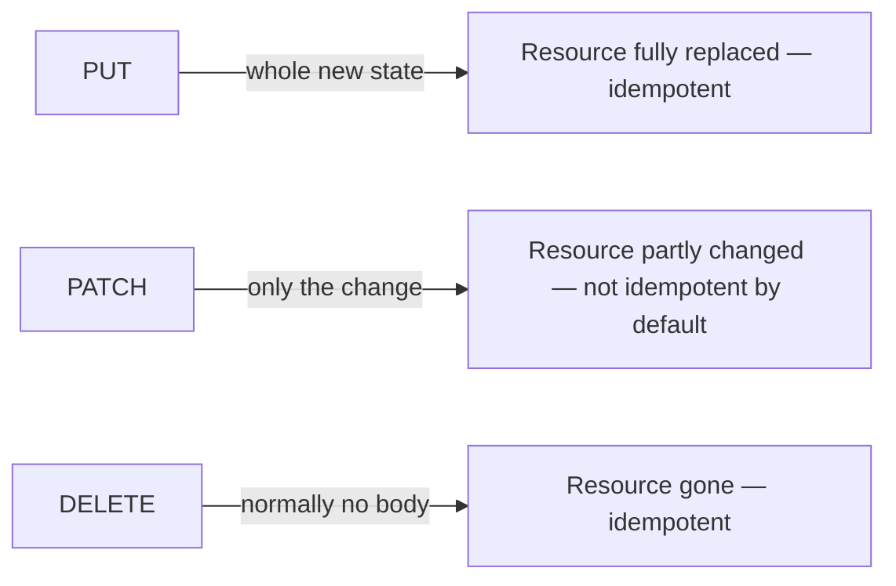

## Bạn cần biết trước

- [[backend.l1.creating-a-resource]] — bạn đã biết `POST /api/v1/orders` tạo một order mới và trả về `201`. Bài này nói về ba method ghi cho một resource đã tồn tại sẵn: thay hẳn nó, sửa một phần nó, hoặc xóa nó.

## Tình huống

Một đồng nghiệp muốn thêm cách để customer hủy một order và hỏi method nào phù hợp: `PUT`, `PATCH`, hay `DELETE`? Hủy không xóa order — nó vẫn ở trong hệ thống, chỉ khác status — và không cần client gửi lại mọi thứ về order, chỉ cần sự thật là nó giờ đã bị hủy. Trong ba method, cái nào khớp với điều đó, và hai cái còn lại thực ra sẽ mang nghĩa gì nếu dùng ở đây thay vào?

## Khái niệm cốt lõi

- `PUT` thay hẳn một resource — request mang toàn bộ trạng thái mới của resource, và server làm cho resource khớp với nó. Một `PUT` thành công thường trả về `200` kèm resource hoặc `204` không có body. Gửi cùng một `PUT` hai lần để resource ở cùng trạng thái đó cả hai lần, nên `PUT` là idempotent.
- `PATCH` sửa một phần resource — request chỉ mang phần cần thay đổi, không phải toàn bộ trạng thái của resource. Vì vậy, `PATCH` mặc định không idempotent: body của nó có thể mô tả một thay đổi tương đối so với trạng thái hiện tại ("thêm một item nữa"), nên áp dụng cùng request hai lần có thể cho kết quả khác với áp dụng một lần.
- `DELETE` xóa một resource — một lần gọi thành công thường trả về `204` không có body, vì không còn gì để mô tả. `DELETE` là idempotent: resource biến mất dù gọi một lần hay nhiều lần, dù response của lần lặp lại có thể khác (lần đầu tìm thấy thứ để xóa; lần sau có thể trả `404` vì không còn gì).

## Cơ chế hoạt động



`POST`, từ bài trước, và ba method ghi này đều thay đổi thứ gì đó, nhưng mỗi cái trả lời một câu hỏi khác nhau về việc client đã biết gì. `POST /api/v1/orders` không bao giờ đặt tên order mới trong URL, vì client chưa biết id của nó. `PUT` và `PATCH` đều đặt tên một resource trong URL — thường là một resource đã tồn tại sẵn. Một `PUT` cũng có thể tạo resource tại URL đó, trả về `201` thay vào — nhưng chỉ khi chính client chọn id, khác với `POST`. Đơn Hàng không bao giờ hoạt động theo cách đó: ở đây server luôn chọn id, như bài trước đã cho thấy. Chỉ `PUT` yêu cầu client mô tả toàn bộ trạng thái của resource, mọi trường, vì body của nó *chính là* trạng thái mới, đầy đủ; `PATCH` không bao giờ yêu cầu vậy, vì body của nó mô tả một thay đổi, nên các trường không đụng tới đơn giản là không được nhắc tới.

Đó chính xác là lý do `PUT` idempotent còn `PATCH` thì mặc định không. Gửi cùng một trạng thái đầy đủ hai lần để resource ở cùng trạng thái đó cả hai lần. Một body của `PATCH` thay vào đó có thể mô tả một thay đổi tương đối so với trạng thái hiện tại (ví dụ, "tăng quantity thêm 1"), nên áp dụng nó hai lần khiến resource đi xa hơn mỗi lần — không gì trong hình dạng của `PATCH` ngăn điều đó, kể cả khi một request cụ thể tình cờ không khiến resource đi xa hơn.

`DELETE` cũng đặt tên một resource đã tồn tại sẵn, để xóa nó; request của nó thường không mang body, vì chỉ URL đã đủ nói resource nào cần xóa. `DELETE` idempotent vì một lý do khác với `PUT`: không phải vì request mang một trạng thái đầy đủ, mà vì "đã biến mất" là một trạng thái resource chỉ có thể ở đúng một lần. Gọi `DELETE` trên cùng một resource năm lần cho cùng hiệu ứng cuối cùng như gọi một lần — biến mất theo cả hai cách — dù lần gọi đầu có thể trả lời khác với những lần sau.

## Trong hệ thống Đơn Hàng

API này chưa có endpoint `PUT` hay `DELETE` thật ở giai đoạn này — các đoạn trên mô tả ý nghĩa chung của mỗi method, không phải một endpoint cụ thể từ codebase này. Riêng với việc hủy: một `DELETE` sẽ có nghĩa là order không còn tồn tại nữa, điều đó không phải là việc hủy làm; một `PUT` sẽ bắt client gửi lại toàn bộ trạng thái của order chỉ để đổi một trường. `PATCH` thì có một ví dụ thật: hủy một order chỉ đổi `status` của nó, nên đó là một thay đổi một phần, không phải thay hẳn.

```csharp file=DonHang.Api/Controllers/OrdersController.cs tag=stage-1 lines=40-46
    [Authorize]
    [HttpPatch("{id:int}/cancel")]
    public async Task<ActionResult<OrderDto>> Cancel(int id)
    {
        var order = await orderService.CancelOrderAsync(id);
        return Ok(ToDto(order));
    }
```

`[HttpPatch("{id:int}/cancel")]` trả lời `PATCH /api/v1/orders/{id}/cancel` — cùng đoạn route `{id:int}` mà `Get(int id)` dùng, chỉ khớp một số nguyên trong phạm vi 32-bit (phạm vi mà `int` của C# bao phủ), với `cancel` đặt tên cho thay đổi cụ thể endpoint này thực hiện. `[Authorize]` nghĩa là cái này cũng chỉ chạy cho người gọi đã đăng nhập, cùng quy tắc `Create` tuân theo. `Cancel(int id)` không nhận request body nào cả: khác với `Create`, thứ đọc một `CreateOrderRequest`, đầu vào duy nhất của method này là `id` trong URL. Đó là `PATCH` ở dạng đơn giản nhất — "tập hợp thay đổi" ở đây đã được cố định bởi chính endpoint (trở thành hủy), nên không còn gì để client mô tả trong một body.

`orderService.CancelOrderAsync(id)` thực hiện việc đổi status thật sự; một module sau sẽ mở cái đó ra. `Ok(ToDto(order))` trả về `200` kèm order đã cập nhật — cùng ánh xạ `ToDto` mà `Create` dùng, lần này phản ánh `status: "cancelled"` thay vì `"new"`, trong khi `CustomerId`, `PlacedAt`, và `Items` đều giữ nguyên như cũ.

## Người mới hay nghĩ rằng…

- **"`PATCH` và `PUT` có thể thay thế cho nhau miễn là cùng URL."** → Thực ra chúng yêu cầu body khác nhau: body của `PUT` được cho là toàn bộ trạng thái mới của resource, còn body của `PATCH` chỉ là phần thay đổi. `PUT` idempotent vì body của nó *chính là* trạng thái mới đầy đủ — một body không đầy đủ gửi tới một endpoint `PUT` không phải là một `PUT` nhẹ hơn, đó là một `PUT` sai, vì các trường body bỏ sót không còn gì để điền vào chúng.
- **"`DELETE` không idempotent, vì lần gọi thứ hai không làm được gì — resource đã biến mất rồi."** → Thực ra idempotent mô tả trạng thái cuối cùng, không phải mỗi response nói gì: resource đã biến mất sau `DELETE` lần đầu và vẫn biến mất sau lần hai, nên hiệu ứng khớp nhau dù lần gọi thứ hai có thể trả `404` thay vì `204`.

## Thử ngay (3 phút)

1. Từ thư mục gốc của dự án Đơn Hàng, với hệ thống ví dụ đang chạy (`scripts/up.sh`), đăng nhập: `curl -sS -X POST http://localhost:8080/api/v1/auth/login -H 'Content-Type: application/json' -d '{"email":"anh.tran@example.com","password":"donhang-dev-password"}'` — sao chép giá trị trường `token`. Rồi tạo một order: `curl -sS -X POST http://localhost:8080/api/v1/orders -H 'Content-Type: application/json' -H "Authorization: Bearer <token>" -d '{"items":[{"productId":2,"quantity":1,"unitPriceVnd":450000}]}'` (thay `<token>`) — sao chép giá trị trường `id`.
2. Hủy nó: `curl -i -X PATCH http://localhost:8080/api/v1/orders/<id>/cancel -H "Authorization: Bearer <token>"` (thay `<id>` và `<token>` bằng giá trị ở bước 1; header `Authorization` là cách server nhận ra người gọi đã đăng nhập ở bước 1 — `Bearer` chỉ là từ cố định mà header đó yêu cầu đứng trước giá trị).
3. Chạy lại đúng lệnh ở bước 2 lần nữa, không đổi gì.

Kết quả mong đợi: cả hai lần gọi đều trả về `200` kèm body cho thấy `"status":"cancelled"` — lần gọi thứ hai để order ở đúng trạng thái mà lần đầu đã đặt nó vào. Đó là `PATCH` hành xử idempotent trên đúng endpoint này, không phải vì `PATCH` đảm bảo điều đó, mà vì "trở thành hủy" cho cùng kết quả dù áp dụng một lần hay hai lần.

<details><summary>Gợi ý đáp án</summary>

Cả hai lệnh `curl` chạy cùng đoạn code: `CancelOrderAsync` đặt `Status` thành `"cancelled"` và lưu lại. Lần gọi đầu đổi order từ `"new"` thành `"cancelled"`; lần gọi hai đặt `"cancelled"` thành `"cancelled"` lần nữa — một thay đổi không còn gì để làm, nhưng vẫn là một `200` thành công với cùng body cả hai lần. Không có gì trong `Cancel` kiểm tra xem order đã bị hủy trước đó chưa, nên thay đổi cụ thể của endpoint này tình cờ là idempotent, dù `PATCH` nói chung không hứa hẹn điều đó. (Bạn không thể thấy nó trong đoạn code trên, nhưng `CancelOrderAsync` cũng gửi một thông báo ở mỗi lần gọi — thứ xảy ra ngoài dữ liệu riêng của order, nên nó không thay đổi việc bản thân order có giống nhau hay không.)

</details>

## Liên hệ

- [[backend.l1.creating-a-resource]] — `201` của `POST`, đối lập với `200` mà `PATCH` của `Cancel` trả lời bằng.
- [[backend.l1.get-and-status-codes]] — cặp `200`/`404` vẫn áp dụng cho `PUT`, `PATCH`, và `DELETE`, cộng thêm `204` và quy tắc idempotence bài này thêm vào.
- [[backend.l1.rest-resources]] — sự phân tách collection-URL/item-URL mà các method ghi này xây trên đó — kể cả `cancel`, thứ được nối thêm sau item URL thay vì thay thế nó.

## Tóm tắt 5 dòng

1. `PUT` thay hẳn một resource: request mang toàn bộ trạng thái mới của nó, đó là lý do gửi cùng một `PUT` hai lần cho cùng kết quả.
2. `PATCH` sửa một phần resource: request chỉ mang phần thay đổi, nên nó mặc định không idempotent.
3. `DELETE` xóa một resource và thường trả về `204` không có body một khi nó đã biến mất.
4. `DELETE` là idempotent vì trạng thái cuối cùng, đã biến mất, giống nhau sau một lần gọi hay nhiều lần — dù response của lần lặp lại có khác.
5. `PATCH /api/v1/orders/{id}/cancel` của `Cancel` chỉ đổi `status`, không có request body nào cả — một thay đổi cố định, riêng cho endpoint này.
