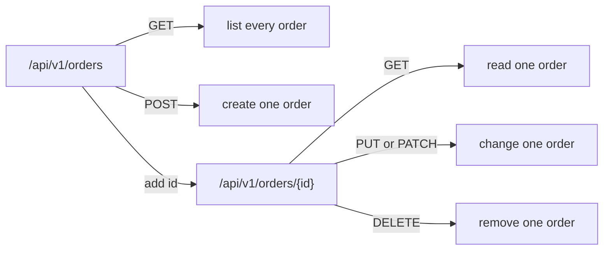

## Before you start

- [[backend.l1.hosting-and-program-cs]] — you know an endpoint is a method-and-path pair, and that `app.MapControllers()` finds these pairs on classes like `ProductsController`.
- [[foundation.l1.http-methods]] — you know GET reads, POST creates, PUT replaces, PATCH partly changes, and DELETE removes.

## The situation

A teammate asks you to add a way to cancel an order and proposes the path `/api/v1/cancelOrder`. It works — you could write a method that answers it — but something about it doesn't sit right next to `/api/v1/orders`, the path Đơn Hàng already uses to create and read orders. What should decide a new endpoint's path, if not just "whatever makes the action clear"?

## Core concepts

- **resource** — a thing named by a noun in the URL, like an order or a product; the URL says which thing, the HTTP method says what to do to it.
- collection URL — a URL naming every resource of one kind (`/api/v1/orders`); GET on it lists them all.
- item URL — a URL naming one specific resource (`/api/v1/orders/1`); GET on it reads just that one.
- method, not URL, carries the verb — the same item URL means something different depending on the method: GET reads it, PUT or PATCH changes it, DELETE removes it.

## How it works



`/api/v1/orders` and `/api/v1/orders/{id}` are two different resources, not two spellings of one path — the plural, bare path names the whole collection, and adding an id narrows it to one item. Both accept several methods, and each method keeps its usual meaning from `foundation.l1.http-methods` no matter which of the two URLs it's applied to: GET always reads, POST always creates, and so on. Nothing about *what to do* lives in the URL itself; a path like `/api/v1/cancelOrder` tries to put a verb where a noun belongs, which is exactly what makes it a resource smell rather than a resource.

A collection and an item URL also tend not to answer the same methods. POST usually creates by adding to a collection — there's no id yet to create one for. PUT, PATCH, and DELETE usually act on one item already named by its own URL, since each needs exactly one existing thing to replace, change, or remove.

## In the Đơn Hàng system

`ProductsController` maps one collection URL and the item URL under it, both with GET:

```csharp file=DonHang.Api/Controllers/ProductsController.cs tag=stage-1 lines=8-15
[ApiController]
[Route("api/v1/products")]
public sealed class ProductsController(DonHangDbContext db) : ControllerBase
{
    // lesson: backend.l1.get-and-status-codes
    [HttpGet]
    public async Task<ActionResult<List<ProductDto>>> List()
    {
```

`[Route("api/v1/products")]` on the class fixes the shared prefix once; `[HttpGet]` with no id, on `List()`, answers the bare collection URL, `GET /api/v1/products`. `OrdersController` shows the same pattern with an item URL added, plus a method besides GET:

```csharp file=DonHang.Api/Controllers/OrdersController.cs tag=stage-1 lines=9-13
// lesson: backend.l1.creating-a-resource
[ApiController]
[Route("api/v1/orders")]
public sealed class OrdersController(OrderService orderService, IOrderRepository repository) : ControllerBase
{
```

`[HttpPost]` (on `Create`, further down) answers `POST /api/v1/orders` — the collection URL, since creating an order adds to the whole set. `[HttpGet("{id:int}")]` (on `Get`) adds `{id}` to the shared prefix, answering the item URL, `GET /api/v1/orders/{id}`, for one order at a time.

`OrdersController` also answers the teammate's question from the situation above. It has a real `Cancel(int id)` method, marked `[HttpPatch("{id:int}/cancel")]`, answering `PATCH /api/v1/orders/{id}/cancel` — not `/api/v1/cancelOrder`. The order's own path, `/api/v1/orders/{id}`, never disappears; `cancel` is added after it, naming an action that doesn't fit a plain replace-the-whole-thing or change-a-field request, instead of a verb replacing the resource's own noun-path.

Not every `/api/v1/...` path is a resource this way. A third class, `AuthController`, answers `/api/v1/auth`, for signing in — a job with no plural noun of its own, so it keeps the same URL prefix without being a collection or item URL for anything.

## Beginners often think…

- **"A REST URL like `/api/v1/cancelOrder` is fine as long as it's clear what it does."** → Actually clarity isn't the test, and the fix isn't a brand-new top-level path either. Đơn Hàng's real fix for exactly this action is `PATCH /api/v1/orders/{id}/cancel`: the order's own path survives, with `cancel` added after it. You notice this in `OrdersController` above, where the resource's URL stays intact even for an action that isn't a plain PUT or a plain field change.
- **"Creating an order and listing orders need two different URLs, since they're different actions."** → Actually they'd be the same URL, `/api/v1/orders`, answered by whichever methods that resource needs — POST creates, as `OrdersController.Create` does; GET would list, as `ProductsController.List` does for products. `OrdersController` and `ProductsController` are different classes, same pattern: Đơn Hàng just hasn't needed a GET that lists every order yet.
- **"The `v1` in `/api/v1/orders` refers to the version of each individual order, not the API."** → Actually `v1` names the version of the whole API's shape, written once per path; it has nothing to do with how many times a single order has changed. You notice this because every endpoint in this lesson — products, orders, and their items — shares the same `v1`, regardless of which resource or which specific order it answers about.

## Try it (3 minutes)

1. With the lab running (`scripts/up.sh`), run `curl -i http://localhost:8080/api/v1/products` (the collection URL, no id).
2. Then run `curl -i http://localhost:8080/api/v1/products/1` (the item URL, id `1`).

Expected result: the first returns `200` with a JSON array of every product; the second returns `200` with one product object, not wrapped in an array. Same `ProductsController`, same GET method's meaning both times — only the URL changed which resource it reads.

<details><summary>Suggested answer</summary>

`ProductsController` maps both URLs to two different methods: `List()` answers the bare collection URL and always returns an array, even if it later held zero or one product; `Get(int id)` answers the item URL, taking `{id}` from the URL as its own parameter and using it to ask the database for exactly one product — if none matches, it returns `404` instead of a product. That per-request lookup, not something decided before GET runs, is what makes the response a single object instead of an array.

</details>

## Connections

- [[backend.l1.hosting-and-program-cs]] — the endpoint concept this lesson turns into a naming convention.
- [[foundation.l1.http-methods]] — the method meanings this lesson keeps fixed across every resource.
- [[backend.l1.dtos-and-serialization]] — the shape of what these endpoints actually return.
- [[backend.l1.get-and-status-codes]] — the status codes `List()` and `Get()` should return, beyond the `200`s seen here.

## Five-line summary

1. A resource is a thing named by a noun in the URL; the HTTP method, not the URL, says what to do to it.
2. A collection URL (`/api/v1/orders`) and an item URL (`/api/v1/orders/1`) are two different resources, not two spellings of one.
3. GET on a collection lists everything; GET on an item reads just that one — the method's meaning never changes between them.
4. POST usually fits a collection URL; PUT, PATCH, and DELETE usually fit an item URL, since each needs exactly one resource to act on.
5. `/api/v1/cancelOrder` puts a verb where a noun belongs — Đơn Hàng's fix keeps the order's own path, adding the action after it: `PATCH /api/v1/orders/{id}/cancel`.
