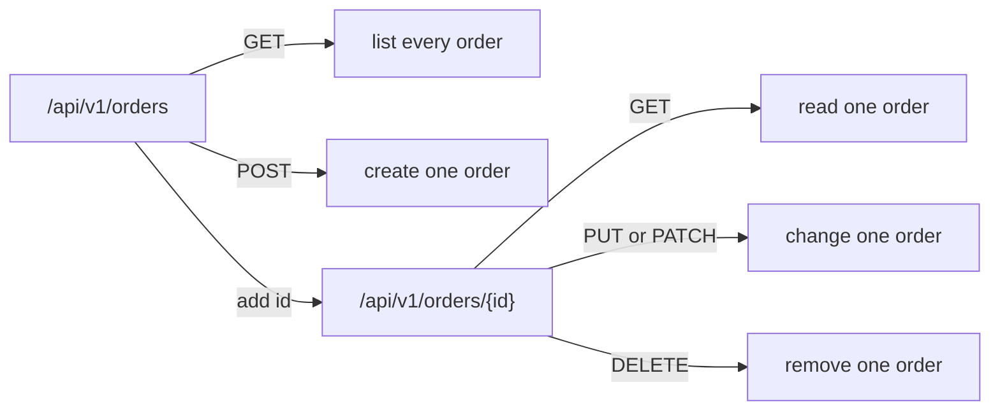

## Before you start

- [[backend.l1.hosting-and-program-cs]] — you know an endpoint is a method-and-path pair, and that `app.MapControllers()` finds these pairs on classes like `ProductsController`.
- [[foundation.l1.http-methods]] — you know GET reads, POST creates, PUT replaces, PATCH partly changes, and DELETE removes.

## The situation

A teammate asks you to add a way to cancel an order and proposes the path `/api/v1/cancelOrder`. It works — you could write a method that answers it — but something about it doesn't sit right next to the order paths Đơn Hàng already has: `/api/v1/orders`, which creates an order, and `/api/v1/orders/1`, which reads one back by id. What should decide a new endpoint's path, if not just "whatever makes the action clear"?

## Core concepts

- **resource** — by this lesson's convention, a thing named by a noun in the URL (the path half of the method-and-path pair from the last lesson), like an order or a product; the URL says which thing, the HTTP method says what to do to it.
- collection URL — a URL naming every resource of one kind (`/api/v1/orders`); when a GET is offered on it, that GET lists them.
- item URL — a URL naming one specific resource (`/api/v1/orders/1`); GET on it reads just that one.
- method, not URL, carries the verb — the same item URL means something different depending on the method: GET reads it, PUT or PATCH changes it, DELETE removes it — a named server action may follow the item URL as its own segment, but never replaces the noun.

## How it works



This diagram is the general pattern every resource can follow, not a promise that Đơn Hàng answers every branch of it — for orders, GET on the collection lists only the signed-in customer's own orders, not every order.

`/api/v1/orders` and `/api/v1/orders/{id}` are two different resources, not two spellings of one path — the plural, bare path names the whole collection, and adding an id narrows it to one item. Each method keeps its usual meaning from [[foundation.l1.http-methods]] on both: GET reads, POST hands the collection something to process — creating a new order, in Đơn Hàng's case.

A verb never takes the place of the resource's noun in the path; when an action needs its own name, that name is added after the item URL. Under this convention, such an action segment fits when the server carries out a named action with its own rules — steps beyond storing what the client sent, like the notification Đơn Hàng sends when an order is cancelled. When the client only sets a value, such as overwriting one field of an order, a plain PATCH on `/api/v1/orders/{id}` carrying the new value is enough. `/api/v1/cancelOrder` puts a verb where a noun belongs, so it is not a resource name under this convention.

By convention, POST goes on the collection URL and PUT, PATCH, and DELETE go on an item URL, because each acts on one specific resource. HTTP itself does not enforce this split; it is a convention Đơn Hàng follows.

That fixes an order of decisions: name the resource first, then decide whether you mean the whole collection or one item, and only then write the path.

## In the Đơn Hàng system

Every resource in Đơn Hàng follows the same shape: one `/api/v1/<plural-noun>` prefix per class, then one method per thing that prefix needs to do. Only the `[Route(...)]` and `[Http...]` lines matter for this lesson; the rest — `[ApiController]`, `[Authorize]`, parameter and return types, what each method's body does, the `//` comments pointing at other lessons — belongs to later lessons. `ProductsController` maps its collection URL and the item URL under it, both with GET:

```csharp file=DonHang.Api/Controllers/ProductsController.cs tag=stage-1 lines=8-28
[ApiController]
[Route("api/v1/products")]
public sealed class ProductsController(DonHangDbContext db) : ControllerBase
{
    // lesson: backend.l1.get-and-status-codes
    [HttpGet]
    public async Task<ActionResult<List<ProductDto>>> List()
    {
        var products = await db.Products
            .Select(p => new ProductDto(p.Id, p.Name, p.PriceVnd))
            .ToListAsync();
        return Ok(products);
    }

    [HttpGet("{id:int}")]
    public async Task<ActionResult<ProductDto>> Get(int id)
    {
        var product = await db.Products.FindAsync(id);
        if (product is null) return NotFound();
        return Ok(new ProductDto(product.Id, product.Name, product.PriceVnd));
    }
```

`[Route("api/v1/products")]` on the class fixes the shared prefix once; `[HttpGet]` with no id, on `List()`, answers the bare collection URL, `GET /api/v1/products`. `[HttpGet("{id:int}")]`, on `Get(int id)`, adds `{id}` to that prefix — a placeholder the actual id in the request fills in, with `:int` saying only a whole number within the 32-bit range matches — answering the item URL, `GET /api/v1/products/{id}`, the one Try it calls below.

`OrdersController` carries the same class-level attribute, `[Route("api/v1/orders")]`. It also has a `[HttpPost]` method, `Create`, and a `[HttpGet]` method, `List` (neither shown below — their attributes alone matter here), both answering the collection URL: `POST /api/v1/orders` creates an order; `GET /api/v1/orders` lists the signed-in customer's own orders. Further down the same class, two more methods answer the item URL and the teammate's question from the situation above:

```csharp file=DonHang.Api/Controllers/OrdersController.cs tag=stage-1 lines=30-46
    [HttpGet("{id:int}")]
    public async Task<ActionResult<OrderDto>> Get(int id)
    {
        var order = await repository.FindAsync(id);
        if (order is null) return NotFound();
        return Ok(ToDto(order));
    }

    // lesson: management.l1.reviewing-for-tests
    // Deliberately missing a check: see OrderService.CancelOrderAsync.
    [Authorize]
    [HttpPatch("{id:int}/cancel")]
    public async Task<ActionResult<OrderDto>> Cancel(int id)
    {
        var order = await orderService.CancelOrderAsync(id);
        return Ok(ToDto(order));
    }
```

`[HttpGet("{id:int}")]` answers the item URL, `GET /api/v1/orders/{id}`, for one order at a time — the same shape as `ProductsController.Get` above. `[HttpPatch("{id:int}/cancel")]`, on `Cancel`, is the teammate's real answer: `PATCH /api/v1/orders/{id}/cancel`, not `/api/v1/cancelOrder`. The order's own path, `/api/v1/orders/{id}`, never disappears; `cancel` is a named action of its own — the server sets the status to `cancelled`, saves it, and sends a notification, instead of a client writing the status value directly — so it gets a segment after the item URL rather than replacing it.

Not every `/api/v1/...` path names a resource this way. A third class, `AuthController`, groups its one endpoint under the prefix `/api/v1/auth`: `POST /api/v1/auth/login`. `login` is a verb, same as `cancel` — and that's fine for the same reason: no order, product, or other thing is being named here, so no noun is being pushed aside for it. `/api/v1/cancelOrder` is different because an order already exists and already has its own path to keep.

## Beginners often think…

- **"A URL like `/api/v1/cancelOrder` is fine as long as it's clear what it does."** → Actually clarity isn't the test, and the fix isn't a brand-new top-level path either. Đơn Hàng's real fix for exactly this action is `PATCH /api/v1/orders/{id}/cancel`: the order's own path survives, with `cancel` added after it. You notice this in `OrdersController` above, where the resource's URL stays intact even though cancelling is exposed as its own named action rather than a client directly writing the order's status value.
- **"Creating an order and listing orders need two different URLs, since they're different actions."** → Actually they'd be the same URL, `/api/v1/orders`, answered by whichever methods that resource needs — POST creates, as `OrdersController.Create` does; GET lists, as `OrdersController.List` does — both on `/api/v1/orders`, in the same class. (Đơn Hàng's `List` returns only the signed-in customer's orders; who may see what belongs to later lessons.)
- **"The `v1` in `/api/v1/orders` refers to the version of each individual order, not this whole set of endpoints."** → Actually `v1` labels the version of the whole set of endpoints, fixed once for every endpoint this server answers, not per order: `/api/v1/orders/1` and `/api/v1/orders/2` carry the same `v1` even after one order has changed status several times and the other never has.

## Try it (3 minutes)

1. From the Đơn Hàng project's root folder, start the example system with `scripts/up.sh` and wait until it prints `The lab is up.`, then run `curl -i http://localhost:8080/api/v1/products` (`curl` sends one request from the terminal and prints the response; `-i` makes it print the status line and headers, not just the body; `localhost` is the name for your own machine, and `8080` the port the example system listens on) — the collection URL, no id.
2. Then run `curl -i http://localhost:8080/api/v1/products/1` (the item URL, id `1`).

Expected result: the first returns `200` with a JSON array of every product; the second returns `200` with one product object, not wrapped in an array. Same `ProductsController`, same GET method's meaning both times — only the URL changed which resource it reads. Why does the second call return one object instead of an array?

<details><summary>Suggested answer</summary>

`ProductsController` maps both URLs to two different methods: `List()` answers the bare collection URL and always returns an array, even if it later held zero or one product; `Get(int id)` answers the item URL, taking `{id}` from the URL as its own parameter and using it to ask the database for exactly one product. That per-request lookup is what makes the response a single object instead of an array.

</details>

## Connections

- [[backend.l1.hosting-and-program-cs]] — the endpoint concept this lesson turns into a naming convention.
- [[foundation.l1.http-methods]] — the method meanings this lesson keeps fixed across every resource.
- [[backend.l1.dtos-and-serialization]] — the shape of what these endpoints actually return.
- [[backend.l1.get-and-status-codes]] — the status codes `List()` and `Get()` should return, beyond the `200`s seen here.

## Five-line summary

1. A resource is a noun in the URL; the method says what to do; a named action follows the item URL, never replacing it.
2. A collection URL (`/api/v1/orders`) and an item URL (`/api/v1/orders/1`) are two different resources, not two spellings of one.
3. GET on a collection lists the resources it holds; GET on an item reads just that one — the method's meaning never changes between them.
4. POST usually fits a collection URL; PUT, PATCH, and DELETE usually fit an item URL, since each acts on one resource, not the whole set.
5. `/api/v1/cancelOrder` puts a verb where a noun belongs — Đơn Hàng's fix keeps the order's own path, adding the action after it: `PATCH /api/v1/orders/{id}/cancel`.
